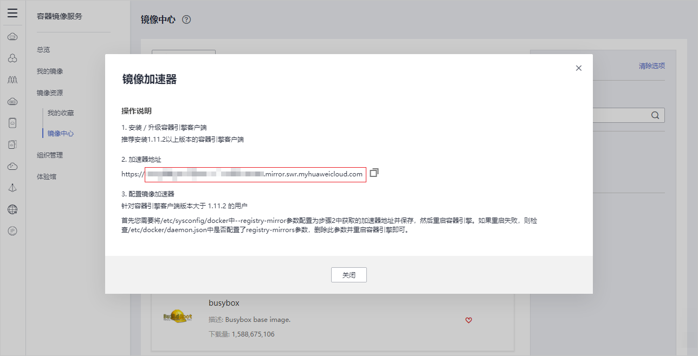
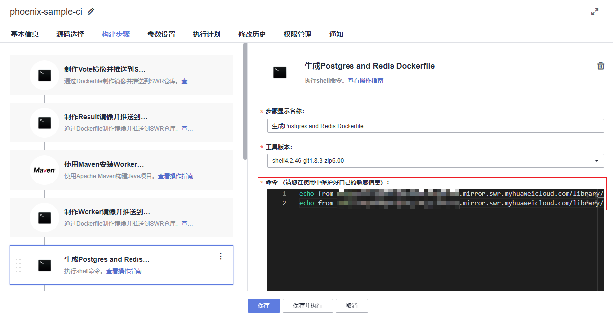

# 构建加速<a name="ZH-CN_TOPIC_0000001200202831"></a>

如果已经多次拉取镜像受限，可采用如下方式尝试拉取对应镜像：

1.  登录[容器镜像服务控制台](https://console.huaweicloud.com/swr/?region=#/app/dashboard)。
2.  单击页面左侧导“镜像资源  \>  镜像中心“，进入“镜像中心“页面。
3.  单击“镜像加速器“，在弹框中找到加速器地址，复制“https://“之后的内容，如[图1](#fig1727241673120)所示。

    **图 1**  镜像加速器<a name="fig1727241673120"></a>  
    

4.  进入代码托管服务，修改代码中引用的镜像地址。
    -   将文件“result/Dockerfile“中第一行代码修改为以下内容，如所示。

        ```
        FROM 加速器地址/library/node:8.16-slim
        ```

    -   将文件“/vote/Dockerfile“中第二行代码修改为以下内容。

        ```
        FROM 加速器地址/library/python:2.7-alpine
        ```

    -   将文件“/worker/Dockerfile.j2“中第一行代码修改为以下内容。

        ```
        FROM 加速器地址/library/java:openjdk-8-jdk-alpine
        ```

5.  进入编译构建服务，编辑任务“phoenix-prebuild“。

    将步骤“执行Shell命令“中的命令行修改为以下内容。

    ```
    echo from 加速器地址/library/postgres:9.4 > Dockerfile-postgres
    echo from 加速器地址/library/redis:alpine > Dockerfile-redis
    echo from 加速器地址/library/node:8.16-slim > Dockerfile-node
    echo from 加速器地址/library/python:2.7-alpine > Dockerfile-python
    echo from 加速器地址/library/java:openjdk-8-jdk-alpine > Dockerfile-java
    ```

    **图 2**  增加postgres与redis容器镜像加速器地址<a name="fig172641615513"></a>  
    

6.  保存并执行构建任务。

