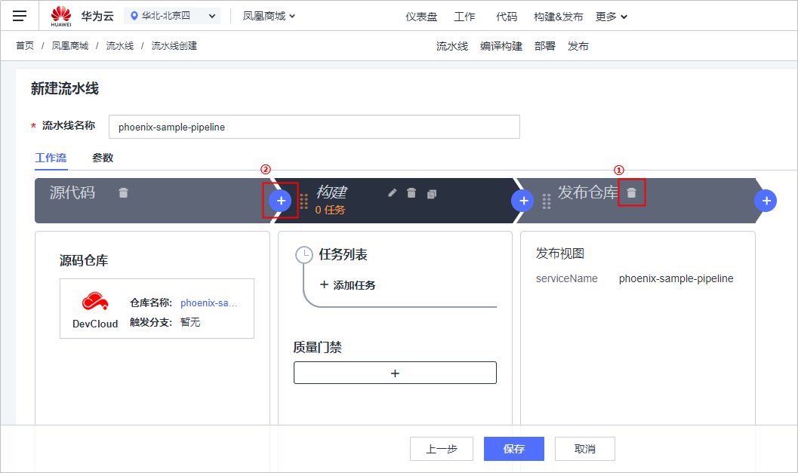
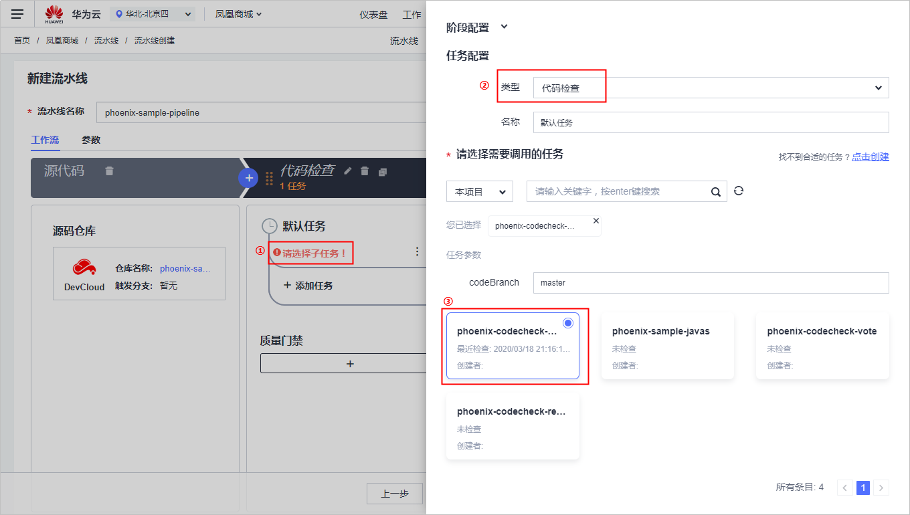
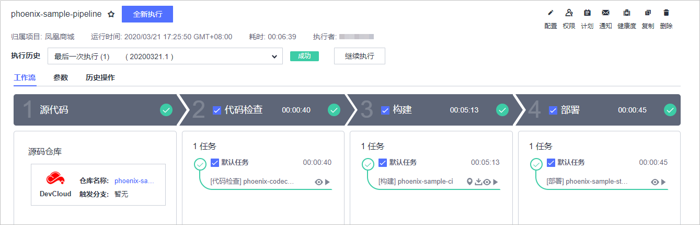
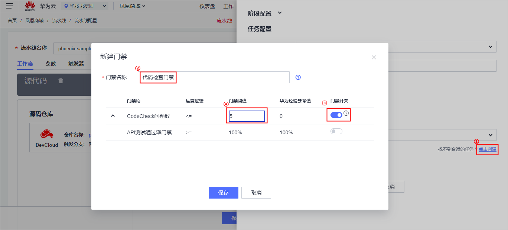
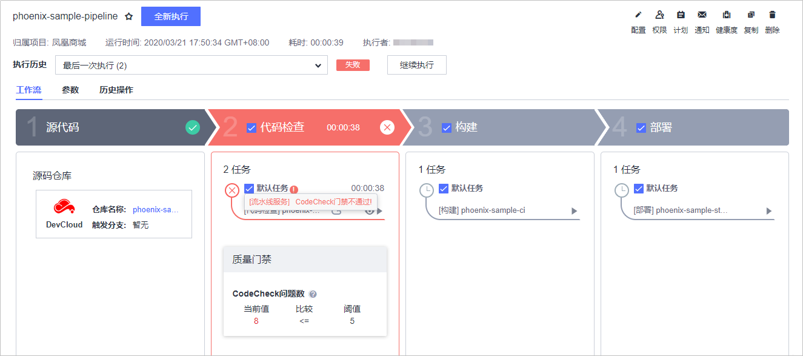
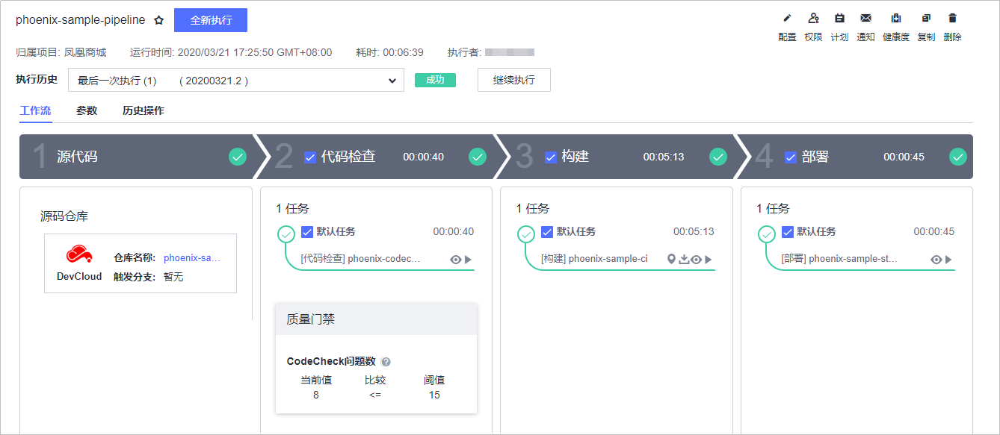
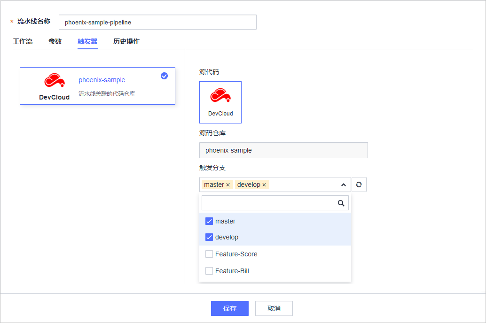
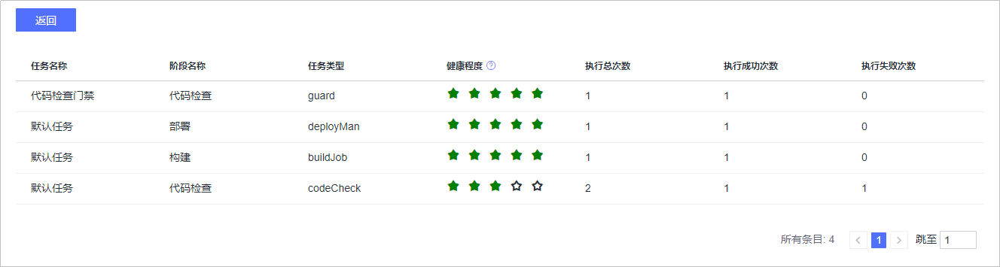
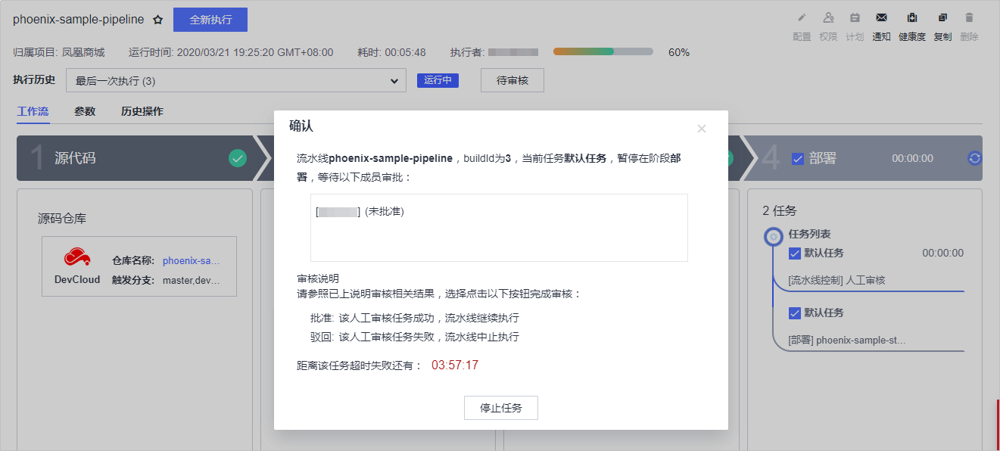

# **构建持续交付流水线，串接代码托管、代码检查、编译构建和自动化发布**<a name="devcloud_practice_2008"></a>

## **背景**<a name="section6261685"></a>

```
克里斯（应用程序开发副总裁）：凤凰商城的每个环节已经越来越标准化了，但是每一部分都相对独立，都是半成品，不能交付业务价值。
如果我们能将每一个环节（构建、发布、测试、部署）有效的串联起来形成一套完成的持续交付流水线，才能真能提高软件的发布效率与质量，持续不断的创造业务价值。
```

样例项目中预置了以下5个流水线任务，可根据兴趣查看并使用。

<a name="table11691548568"></a>
<table><thead align="left"><tr id="row51691481065"><th class="cellrowborder" valign="top" width="25%" id="mcps1.1.3.1.1"><p id="p31694485618"><a name="p31694485618"></a><a name="p31694485618"></a><strong id="b734511581767"><a name="b734511581767"></a><a name="b734511581767"></a>预置流水线任务</strong></p>
</th>
<th class="cellrowborder" valign="top" width="75%" id="mcps1.1.3.1.2"><p id="p7169194811614"><a name="p7169194811614"></a><a name="p7169194811614"></a><strong id="b15129419718"><a name="b15129419718"></a><a name="b15129419718"></a>任务说明</strong></p>
</th>
</tr>
</thead>
<tbody><tr id="row27811623104211"><td class="cellrowborder" valign="top" width="25%" headers="mcps1.1.3.1.1 "><p id="p89521428144220"><a name="p89521428144220"></a><a name="p89521428144220"></a>phoenix-workflow</p>
</td>
<td class="cellrowborder" valign="top" width="75%" headers="mcps1.1.3.1.2 "><p id="p1195292814216"><a name="p1195292814216"></a><a name="p1195292814216"></a>基本的流水线任务。</p>
</td>
</tr>
<tr id="row1563171711427"><td class="cellrowborder" valign="top" width="25%" headers="mcps1.1.3.1.1 "><p id="p51706487612"><a name="p51706487612"></a><a name="p51706487612"></a>phoenix-workflow-test</p>
</td>
<td class="cellrowborder" valign="top" width="75%" headers="mcps1.1.3.1.2 "><p id="p7170114816618"><a name="p7170114816618"></a><a name="p7170114816618"></a>测试环境对应的流水线任务。</p>
</td>
</tr>
<tr id="row10169164815619"><td class="cellrowborder" valign="top" width="25%" headers="mcps1.1.3.1.1 "><p id="p19452114274112"><a name="p19452114274112"></a><a name="p19452114274112"></a>phoenix-workflow-work</p>
</td>
<td class="cellrowborder" valign="top" width="75%" headers="mcps1.1.3.1.2 "><p id="p717017481762"><a name="p717017481762"></a><a name="p717017481762"></a>worker功能对应的流水线任务。</p>
</td>
</tr>
<tr id="row1217014480615"><td class="cellrowborder" valign="top" width="25%" headers="mcps1.1.3.1.1 "><p id="p517015481762"><a name="p517015481762"></a><a name="p517015481762"></a>phoenix-workflow-result</p>
</td>
<td class="cellrowborder" valign="top" width="75%" headers="mcps1.1.3.1.2 "><p id="p111708481361"><a name="p111708481361"></a><a name="p111708481361"></a>result功能对应的流水线任务。</p>
</td>
</tr>
<tr id="row31709481564"><td class="cellrowborder" valign="top" width="25%" headers="mcps1.1.3.1.1 "><p id="p7168063716"><a name="p7168063716"></a><a name="p7168063716"></a>phoenix-workflow-vote</p>
</td>
<td class="cellrowborder" valign="top" width="75%" headers="mcps1.1.3.1.2 "><p id="p111704485610"><a name="p111704485610"></a><a name="p111704485610"></a>vote功能对应的流水线任务。</p>
</td>
</tr>
</tbody>
</table>

> **说明：**   
>关于vote、result、worker的说明，请参见[HE2E DevOps实践流程](HE2E-DevOps实践流程.md)。  

为了更好的介绍流水线服务的操作流程，本章节将创建全新的流水线。

## **01.配置流水线串接代码检查，编译构建和自动化部署步骤**<a name="section56355167"></a>

通过本节，您将学习如何创建**流水线**任务，完成应用程序持续交付流水线的搭建。

-   **创建并触发持续交付流水线**

1.  进入项目，单击页面上方导航“构建&发布  \>  流水线“，进入流水线服务。

    单击“新建流水线“，根据下表配置流水线。

    <a name="table166321745113912"></a>
    <table><thead align="left"><tr id="row1363254515391"><th class="cellrowborder" valign="top" width="25%" id="mcps1.1.3.1.1"><p id="p11632174514398"><a name="p11632174514398"></a><a name="p11632174514398"></a><strong id="b912511273411"><a name="b912511273411"></a><a name="b912511273411"></a>步骤</strong></p>
    </th>
    <th class="cellrowborder" valign="top" width="75%" id="mcps1.1.3.1.2"><p id="p10632104583911"><a name="p10632104583911"></a><a name="p10632104583911"></a><strong id="b136507194211"><a name="b136507194211"></a><a name="b136507194211"></a>填写/选择建议</strong></p>
    </th>
    </tr>
    </thead>
    <tbody><tr id="row3632144515395"><td class="cellrowborder" valign="top" width="25%" headers="mcps1.1.3.1.1 "><p id="p9632545163916"><a name="p9632545163916"></a><a name="p9632545163916"></a>基本信息</p>
    </td>
    <td class="cellrowborder" valign="top" width="75%" headers="mcps1.1.3.1.2 "><p id="p363212455399"><a name="p363212455399"></a><a name="p363212455399"></a><span>流水线名称：phoenix-sample-pipeline</span></p>
    </td>
    </tr>
    <tr id="row7632194514393"><td class="cellrowborder" valign="top" width="25%" headers="mcps1.1.3.1.1 "><p id="p663284511392"><a name="p663284511392"></a><a name="p663284511392"></a>选择模板</p>
    </td>
    <td class="cellrowborder" valign="top" width="75%" headers="mcps1.1.3.1.2 "><p id="p11632134517397"><a name="p11632134517397"></a><a name="p11632134517397"></a>不使用模板，直接创建</p>
    </td>
    </tr>
    <tr id="row106321645163916"><td class="cellrowborder" valign="top" width="25%" headers="mcps1.1.3.1.1 "><p id="p13632144563913"><a name="p13632144563913"></a><a name="p13632144563913"></a>选择代码源</p>
    </td>
    <td class="cellrowborder" valign="top" width="75%" headers="mcps1.1.3.1.2 "><p id="p363217454397"><a name="p363217454397"></a><a name="p363217454397"></a>DevCloud</p>
    <p id="p9205126144414"><a name="p9205126144414"></a><a name="p9205126144414"></a>源码仓库：phoenix-sample</p>
    </td>
    </tr>
    </tbody>
    </table>

2.  单击图标删除阶段“发布仓库“，单击图标添加“自定义阶段“。

    

      

3.  单击图标，在右侧滑出框中输入名称“代码检查“，单击“保存“。

    

      

4.  单击阶段“代码检查“中“请选择子任务“。
5.  在右侧滑出框中，类型选择“代码检查“，任务勾选“phoenix-codecheck-worker“，单击“保存“。

    

      

6.  按照同样方式，添加构建任务“phoenix-sample-ci“。
7.  在阶段“编译构建“后添加阶段“部署“，并在该阶段中添加部署任务“phoenix-sample-standalone“，单击“保存“。

    系统自动跳转至“流水线详情“页面，单击“全新执行“，启动流水线。

    当出现以下页面时，表示任务执行成功。若任务执行失败，请于执行失败处检查失败原因（如：部署阶段执行失败，则进入部署任务查看部署日志，结合[6](使用持续发布-在代码更新后自动完成应用部署（ECS篇）.md#li145881144518)排查失败原因），或参照[流水线-帮助文档](https://support.huaweicloud.com/cloudpipeline/index.html)中的常见问题排查。

    

      


-   **添加质量门禁**

    为了控制代码的质量，我们要求代码必须经过扫描，并且错误数量控制在合理范围内，才允许发布。通过添加质量门禁可以有效的自动化控制流程。

    1.  进入流水线任务“phoenix-sample-pipeline“的“流水线配置“页面。
    2.  在阶段“代码检查“下的“质量门禁处“，单击。

        在页面右侧滑框中，单击“点击创建“。

        在弹框中输入名称“代码检查门禁“， 打开“CodeCheck问题数“开关并输入门禁阈值“5“，单击“保存“。

        

          

    3.  在“门禁“下拉列表中选择刚刚创建的“代码检查门禁“，单击“保存“。
    4.  保存流水线，返回“流水线详情“页面。

        启动流水线任务，待任务执行结束可看到：由于代码检查问题数大于5，因此流水线任务执行失败。

        

          

    5.  单击“配置“，修改“代码检查门禁“的阈值为15，保存流水线并执行。

        待任务执行结束可看到：由于代码检查问题数小于15，因此流水线任务执行成功。

        

          


## **02.更新流水线配置，实现代码变更触发的持续交付流水线**<a name="section37434462"></a>

通过本节，您将学习如何创建实现代码变更自动触发持续交付流水线任务，完成应用的自动化构建部署。

1.  进入项目，单击页面上方导航“构建&发布  \>  流水线“，进入流水线服务。

    找到流水线任务“phoenix-sample-pipeline“，单击此任务对应操作列中的图标，进入“流水线配置“页面。

2.  选择“触发器“页签，在“触发分支“下拉列表中勾选所需分支，单击“保存“。

    

      

3.  设置完成后，当所选分支有代码变更提交时，将自动触发该任务。

## **03.流水线配置高级功能**<a name="section1365842"></a>

-   **查看健康度**

    通过健康度可以统计流水线调度的不同任务的执行健康程度以及执行的结果统计。

    1.  进入流水线服务，单击任务“phoenix-sample-pipeline“进入“流水线详情“页面。
    2.  单击页面右上角健康度，进入“流水线健康度“页面，即可查看各任务的健康度。

        

          


-   **添加人工审核**

    DevCloud支持在流水线任务中加入人工审核设置，在某个阶段任务执行完成时，需要人工审核通过才能继续执行。

    1.  进入流水线任务“phoenix-sample-pipeline“的“流水线配置“页面。
    2.  在阶段“部署“下，单击“添加任务“。

        在右侧滑框中，选择类型“流水线控制“，勾选“人工审核“，并在“审核人“下拉列表中勾选所需的审核人。

        

          

        页面中的说明如下：

        <a name="table856215586215"></a>
        <table><thead align="left"><tr id="row15624581029"><th class="cellrowborder" valign="top" width="16.150000000000002%" id="mcps1.1.3.1.1"><p id="p259157837"><a name="p259157837"></a><a name="p259157837"></a><strong id="b1861292210222"><a name="b1861292210222"></a><a name="b1861292210222"></a>参数</strong></p>
        </th>
        <th class="cellrowborder" valign="top" width="83.85000000000001%" id="mcps1.1.3.1.2"><p id="p10591147937"><a name="p10591147937"></a><a name="p10591147937"></a><strong id="b3618822112212"><a name="b3618822112212"></a><a name="b3618822112212"></a>说明</strong></p>
        </th>
        </tr>
        </thead>
        <tbody><tr id="row256310581924"><td class="cellrowborder" valign="top" width="16.150000000000002%" headers="mcps1.1.3.1.1 "><p id="p11591147238"><a name="p11591147238"></a><a name="p11591147238"></a>审核人</p>
        </td>
        <td class="cellrowborder" valign="top" width="83.85000000000001%" headers="mcps1.1.3.1.2 "><p id="p2591471031"><a name="p2591471031"></a><a name="p2591471031"></a>可以设置一个或多个审核人。</p>
        </td>
        </tr>
        <tr id="row356313581924"><td class="cellrowborder" valign="top" width="16.150000000000002%" headers="mcps1.1.3.1.1 "><p id="p859157830"><a name="p859157830"></a><a name="p859157830"></a>审核模式</p>
        </td>
        <td class="cellrowborder" valign="top" width="83.85000000000001%" headers="mcps1.1.3.1.2 "><p id="p1859118719317"><a name="p1859118719317"></a><a name="p1859118719317"></a>全部人审核表示所有人都必须通过任何才能继续，任一人审核表示审核人列表中的任何一个人审核任务就可以继续。</p>
        </td>
        </tr>
        <tr id="row10563195816216"><td class="cellrowborder" valign="top" width="16.150000000000002%" headers="mcps1.1.3.1.1 "><p id="p5591873316"><a name="p5591873316"></a><a name="p5591873316"></a>审核时长</p>
        </td>
        <td class="cellrowborder" valign="top" width="83.85000000000001%" headers="mcps1.1.3.1.2 "><p id="p159118711312"><a name="p159118711312"></a><a name="p159118711312"></a>设置审核的有效期，超期后审核无效，不能在进行审核。</p>
        </td>
        </tr>
        <tr id="row4563125816219"><td class="cellrowborder" valign="top" width="16.150000000000002%" headers="mcps1.1.3.1.1 "><p id="p145918714318"><a name="p145918714318"></a><a name="p145918714318"></a>备注</p>
        </td>
        <td class="cellrowborder" valign="top" width="83.85000000000001%" headers="mcps1.1.3.1.2 "><p id="p45911571634"><a name="p45911571634"></a><a name="p45911571634"></a>审核说明。</p>
        </td>
        </tr>
        </tbody>
        </table>

    3.  返回“流水线配置“页面，将任务“流水线控制“拖动到任务“部署“上方，单击“保存“。
    4.  启动流水线，当执行到“人工审核“时，页面中将弹框提示任务需审核。

        

          

    5.  审核人进入流水线任务“phoenix-sample-pipeline“的详情页
        -   单击“批准“，流水线将自动继续执行。
        -   单击“驳回“，流水线将中止执行。


## **资源释放**<a name="section771917575116"></a>

本实践项目中使用到的弹性云服务器、云容器引擎CCE等均为按需购买，尺寸运行过程中会产生费用。

为了避免不必要的费用，如果你在完成全部操作后，无需再使用这些资源，建议您参考以下操作释放资源；如果您想继续体验其它功能可继续保留。

-   [删除弹性云服务器](https://support.huaweicloud.com/ecs_faq/zh-cn_topic_0018073218.html)
-   [删除集群](https://support.huaweicloud.com/usermanual-cce/cce_01_0212.html)

  

