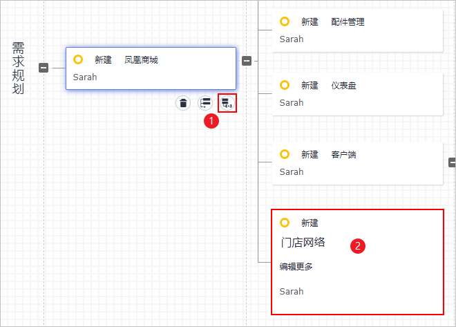
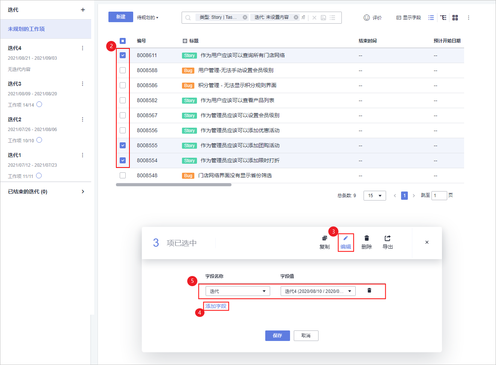
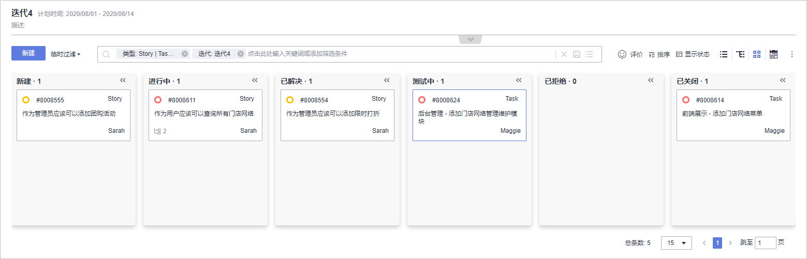
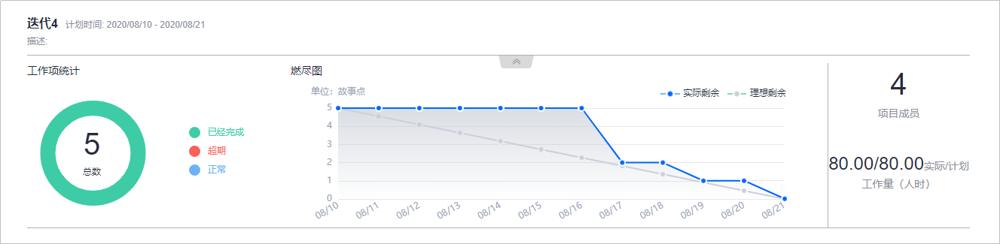

# 步骤一：管理项目规划

[项目管理](https://www.huaweicloud.com/product/projectman.html)提供简单高效的团队协作服务，包含多项目管理、敏捷迭代、需求管理等功能。

“凤凰商城”样例项目采用Scrum模式进行迭代开发，每个迭代周期为两周，前3个迭代已经完成凤凰商城版本的开发，当前正在进行迭代4的规划。

按照项目规划，迭代4要完成的功能为：限时打折管理、团购活动管理。

由于业务与市场的变化，临时新增一个紧急需求：门店网络查询功能，因此迭代4的规划中增加此功能的开发。

通过本章节，您将了解产品负责人Sarah与项目经理Maggie如何使用项目管理服务进行项目规划的管理，包括管理需求规划与迭代规划、跟踪项目进度。

## 管理需求规划

软件开发平台中使用思维导图的形式管理项目需求规划，将工作项的层级结构“Epic\>Feature\>Story\>Task“展示出来，各层级工作项类型代表的含义如[表1](#table15834144710475)所示。

**表 1**  工作项类型说明

<table><thead align="left"><tr id="row1883514724715"><th class="cellrowborder" valign="top" width="20%" id="mcps1.2.3.1.1">
工作项类型

</th>
<th class="cellrowborder" valign="top" width="80%" id="mcps1.2.3.1.2">
说明

</th>
</tr>
</thead>
<tbody><tr id="row88353471470"><td class="cellrowborder" valign="top" width="20%" headers="mcps1.2.3.1.1 ">
Epic

</td>
<td class="cellrowborder" valign="top" width="80%" headers="mcps1.2.3.1.2 ">
通常是公司重要战略举措，比如本样例项目中的“凤凰商城”，对于公司是一个与企业生存攸关的关键战略措施。

</td>
</tr>
<tr id="row1383515479472"><td class="cellrowborder" valign="top" width="20%" headers="mcps1.2.3.1.1 ">
Feature

</td>
<td class="cellrowborder" valign="top" width="80%" headers="mcps1.2.3.1.2 ">
通常是对客户有价值的功能，可以通过使用特性满足客户的需求。比如凤凰商城中的“门店网络查询功能”，特性通常会通过多个迭代持续交付。

</td>
</tr>
<tr id="row188351047154715"><td class="cellrowborder" valign="top" width="20%" headers="mcps1.2.3.1.1 ">
Story

</td>
<td class="cellrowborder" valign="top" width="80%" headers="mcps1.2.3.1.2 ">
通常是对一个功能进行用户场景细分，并且能在一个迭代内完成。

</td>
</tr>
<tr id="row17835114716475"><td class="cellrowborder" valign="top" width="20%" headers="mcps1.2.3.1.1 ">
Task

</td>
<td class="cellrowborder" valign="top" width="80%" headers="mcps1.2.3.1.2 ">
通常是用户故事的细分，准备环境、准备测试用例等都可以是完成Story的细分任务。

</td>
</tr>
</tbody>
</table>

由于“门店网络查询”功能是新增需求，因此产品负责人需要将此功能添加到思维导图中。

1.  为新需求创建工作项。

    由于门店网络查询功能是新增的需求，因此产品负责人Sarah要将它加入需求规划视图中。

    1.  进入“凤凰商城“项目，单击页面上方导航“工作  \>  规划“，在页面中选择“思维导图“，如[图1](#fig4427180112310)所示，页面将显示样例项目自动创建的需求规划视图。

        **图 1**  选择“思维导图“  
        

    1.  新建Feature“门店网络“，如[图2](#fig13841444132417)所示。

        1.  在Epic“凤凰商城“下方单击图标。
        2.  输入标题“门店网络“，回车保存。

        **图 2**  新建Feature  
        

    2.  按照同样的方式，为Feature“门店网络“添加Story“作为用户应该可以查询所有门店网络“。

2.  编辑Story。
    1.  单击页面上方导航“工作  \>  工作项“。
    2.  在页面左上角单击“Backlog“。
    3.  在列表中单击Story名称“作为用户应该可以查询所有门店网络“，参照[表2](#table1837945732)配置Story信息。

        **表 2**  Story配置

        
        <table><thead align="left"><tr id="row18380115132"><th class="cellrowborder" valign="top" width="20%" id="mcps1.2.3.1.1">
配置项

        </th>
        <th class="cellrowborder" valign="top" width="80%" id="mcps1.2.3.1.2">
配置建议

        </th>
        </tr>
        </thead>
        <tbody><tr id="row738005033"><td class="cellrowborder" valign="top" width="20%" headers="mcps1.2.3.1.1 ">
描述信息

        </td>
        <td class="cellrowborder" valign="top" width="80%" headers="mcps1.2.3.1.2 ">
输入“作为用户，我想要查询所有门店，以便于挑选合适的门店获取服务”。

        </td>
        </tr>
        <tr id="row15380952318"><td class="cellrowborder" valign="top" width="20%" headers="mcps1.2.3.1.1 ">
优先级

        </td>
        <td class="cellrowborder" valign="top" width="80%" headers="mcps1.2.3.1.2 ">
选择“高”。

        </td>
        </tr>
        <tr id="row17380258315"><td class="cellrowborder" valign="top" width="20%" headers="mcps1.2.3.1.1 ">
重要程度

        </td>
        <td class="cellrowborder" valign="top" width="80%" headers="mcps1.2.3.1.2 ">
选择“关键”。

        </td>
        </tr>
        </tbody>
        </table>

    4.  为了便于开发人员理解，在本地准备一个“门店网络列表“文件（本文档中为excel表，表格内容参照[表3](#table583571011816)）。

        **表 3**  门店网络列表

        
        <table><thead align="left"><tr id="row1483517101181"><th class="cellrowborder" valign="top" width="20%" id="mcps1.2.3.1.1">
分店名称

        </th>
        <th class="cellrowborder" valign="top" width="80%" id="mcps1.2.3.1.2">
分店地址

        </th>
        </tr>
        </thead>
        <tbody><tr id="row2835131015812"><td class="cellrowborder" valign="top" width="20%" headers="mcps1.2.3.1.1 ">
北京分店

        </td>
        <td class="cellrowborder" valign="top" width="80%" headers="mcps1.2.3.1.2 ">
首都机场1号航站楼出发层靠右直行888米右侧。

        </td>
        </tr>
        <tr id="row6835610382"><td class="cellrowborder" valign="top" width="20%" headers="mcps1.2.3.1.1 ">
天津分店

        </td>
        <td class="cellrowborder" valign="top" width="80%" headers="mcps1.2.3.1.2 ">
经济技术开发区黄海路888号。

        </td>
        </tr>
        <tr id="row2835201017820"><td class="cellrowborder" valign="top" width="20%" headers="mcps1.2.3.1.1 ">
上海分店

        </td>
        <td class="cellrowborder" valign="top" width="80%" headers="mcps1.2.3.1.2 ">
静安区大统路888号。

        </td>
        </tr>
        <tr id="row3835141018816"><td class="cellrowborder" valign="top" width="20%" headers="mcps1.2.3.1.1 ">
重庆分店

        </td>
        <td class="cellrowborder" valign="top" width="80%" headers="mcps1.2.3.1.2 ">
涪陵区桥南大道电信局西侧。

        </td>
        </tr>
        </tbody>
        </table>

        > **说明：** 
        >表中的分店名称与分店地址均为示例，并非真实信息。

    5.  返回Story编辑页面，单击“点击添加附件或拖拽文件到此处上传“，将列表文件上传至工作项中作为附件。
    6.  单击“保存“，完成Story详情的编辑。

## 管理迭代规划

在迭代开始前，项目经理Maggie组织召开计划会议，根据规划将本次迭代中待实现的Story添加在迭代中，并将Story分解为Task，分配给开发人员进行开发。

通过本节，您将了解如何完成迭代4的规划。

1.  创建迭代。
    1.  进入“凤凰商城“项目，单击页面上方导航“工作  \>  迭代“。
    2.  单击页面左上角“迭代“，参照[表4](#table066148181714)在弹框中配置迭代信息，单击“确定“。

        **表 4**  迭代信息配置

        
        <table><thead align="left"><tr id="row20661980173"><th class="cellrowborder" valign="top" width="20%" id="mcps1.2.3.1.1">
配置项

        </th>
        <th class="cellrowborder" valign="top" width="80%" id="mcps1.2.3.1.2">
配置建议

        </th>
        </tr>
        </thead>
        <tbody><tr id="row1366115818173"><td class="cellrowborder" valign="top" width="20%" headers="mcps1.2.3.1.1 ">
迭代名称

        </td>
        <td class="cellrowborder" valign="top" width="80%" headers="mcps1.2.3.1.2 ">
输入“迭代4”。

        </td>
        </tr>
        <tr id="row146622811173"><td class="cellrowborder" valign="top" width="20%" headers="mcps1.2.3.1.1 ">
计划时间

        </td>
        <td class="cellrowborder" valign="top" width="80%" headers="mcps1.2.3.1.2 ">
设置时长为2周，本文档中是从当前日期起之后的2周。

        </td>
        </tr>
        </tbody>
        </table>

2.  规划迭代，如[图3](#fig1114722816234)所示。

    1.  单击页面左侧导航“未计划工作项“。
    2.  根据规划，在列表中勾选以下三个Story。
        -   作为用户应该可以查询所有门店网络。
        -   作为管理员应该可以添加团购活动。
        -   作为管理员应该可以添加限时打折。

    3.  在页面底部单击“编辑“。
    4.  单击“添加字段“。
    5.  在字段名称下拉列表中选择“迭代“，并在字段值下拉列表中选择“迭代4“，单击“保存“。

    **图 3**  规划迭代  
    

3.  分解Story。
    1.  单击页面左侧导航“迭代4“。
    2.  在列表中找到Story“作为用户应该可以查询所有门店网络“，单击Story名称。
    3.  在页面右侧滑出窗口中选择“子工作项“页签。
    4.  单击“快速新建子工作项“，输入标题“前端展示 - 添加门店网络菜单“，并选择处理人“Chris“，单击“确定“完成，如[图4](#fig15861536172516)所示。

        **图 4**  快速新建子工作项  
        

    5.  按照同样的方式，添加Task“后台管理 - 添加门店网络管理维护模块“。

## 监控和跟踪项目状态

-   卡片模式跟踪工作项状态。

    在每日站立会议中，可以通过电子白板报告和更新任务进度。

    在迭代页面，单击图标，切换到卡片模式，。

    如[图5](#fig192015814279)所示，在卡片模式下，可以直观的查看迭代中各工作项的当前状态，也可以通过拖拽修改工作项状态。

    **图 5**  卡片模式  
    

-   迭代视图查看迭代进展。

    通过迭代图表，团队可以方便的统计当前迭代的进度情况，包括需求完成情况、迭代燃尽图、工作量等。

    在迭代页面，单击工作项列表上方的图标，即可展开迭代进度视图，如[图6](#fig182485274287)所示。

    如果是新创建的项目，在项目创建第二天可看到报表效果。

    **图 6**  迭代进度视图  
    

-   仪表盘跟踪项目进展。

    仪表盘提供了强大的项目进度跟进能力，包括需求进度统计、燃尽图、工作完成度、工时统计等，可随时查看项目的当前进展。

    您可以使用DevCloud中内置仪表盘报表卡片（详细使用方法请参考[使用仪表盘](https://support.huaweicloud.com/usermanual-projectman/projetcman_ug_2006.html)），也可以根据需要[自定义报表](https://support.huaweicloud.com/usermanual-projectman/projetcman_ug_1005.html#section2)。

