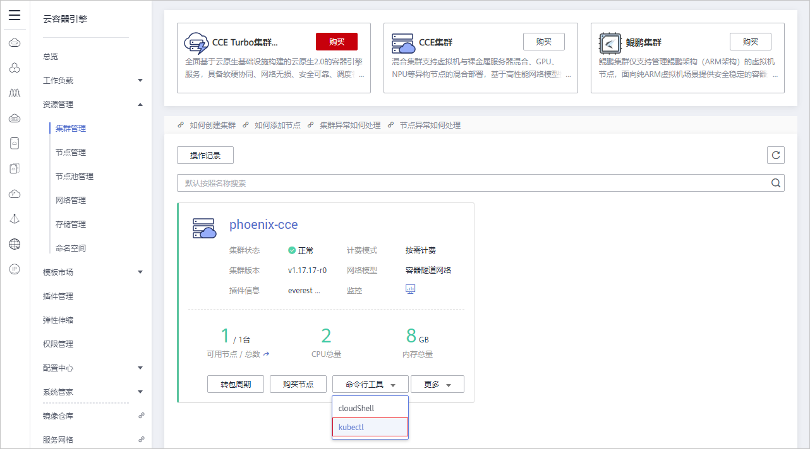
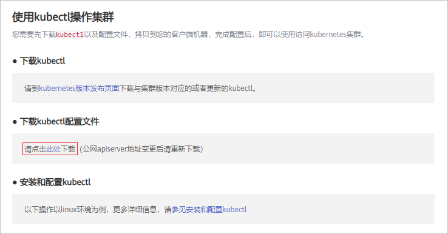
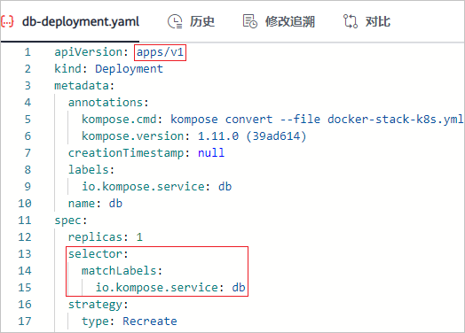
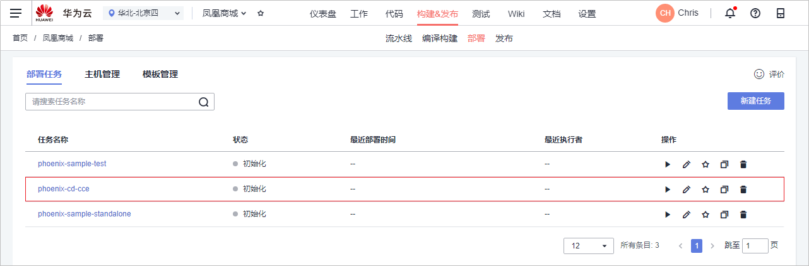
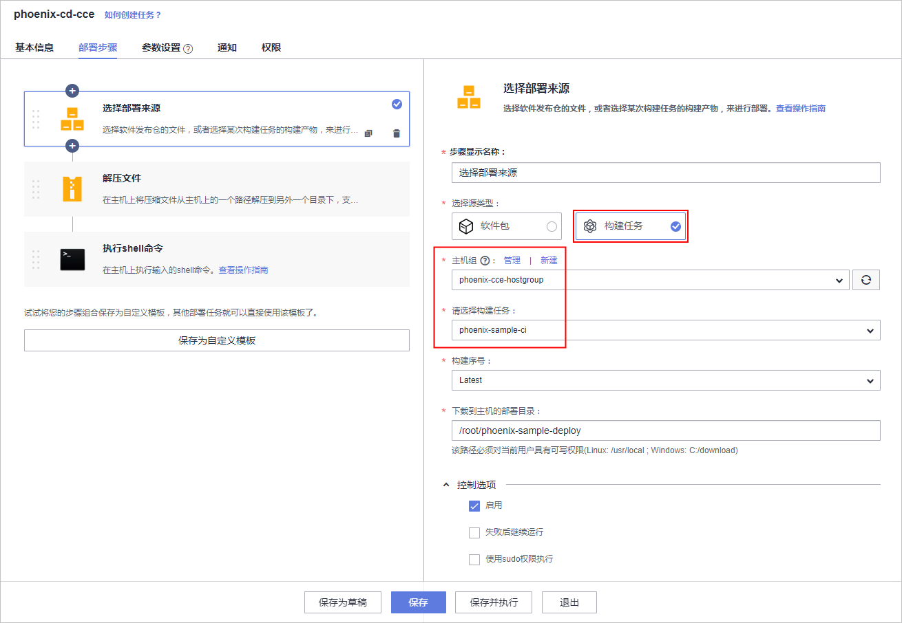
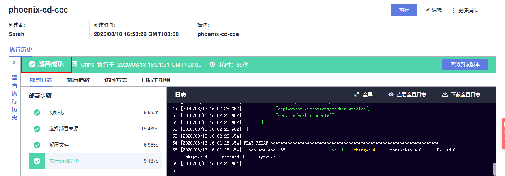
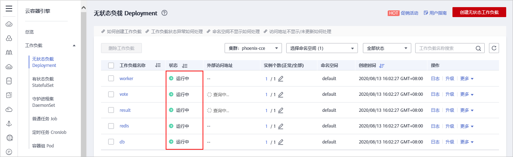
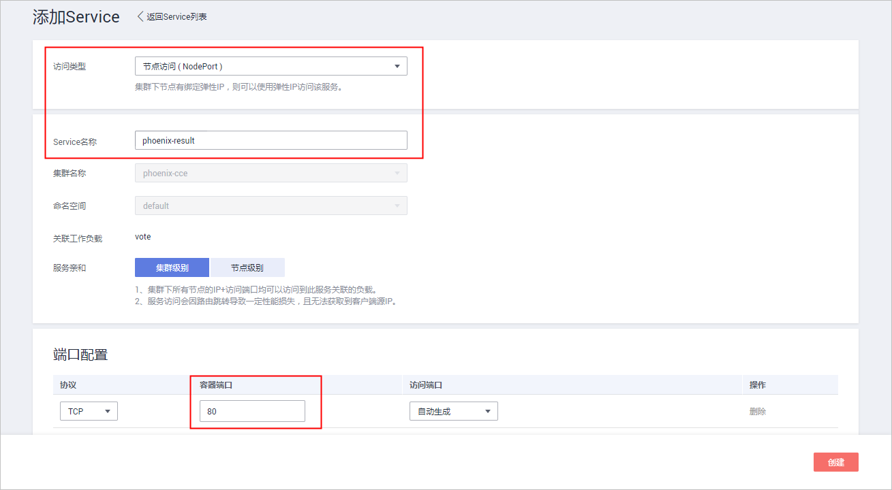
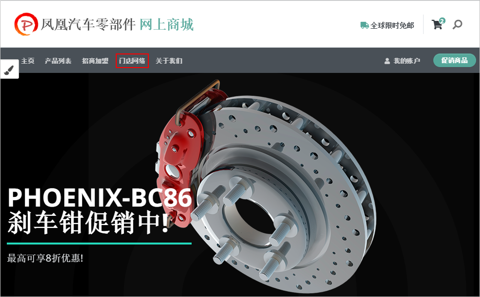
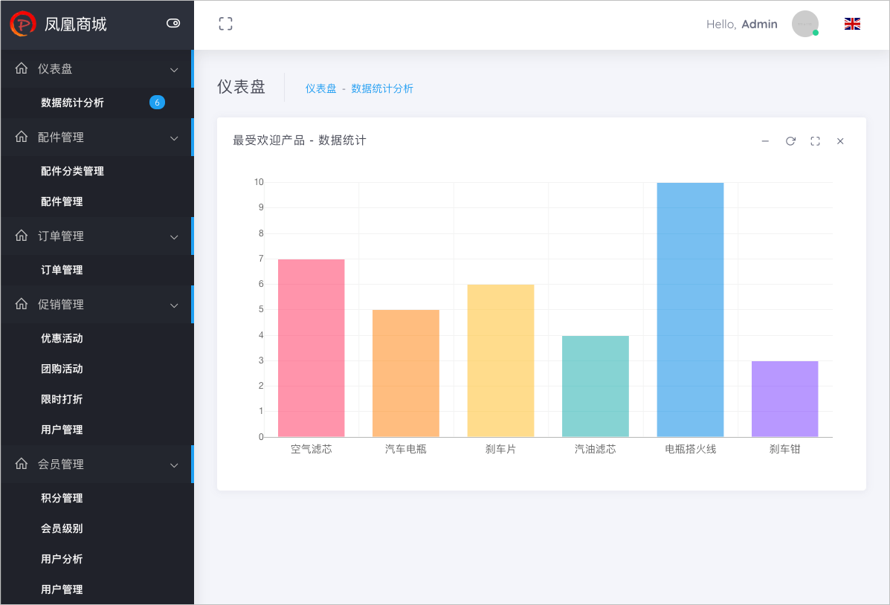

# 步骤七：部署应用（云容器引擎篇）<a name="ZH-CN_TOPIC_0227332137"></a>

本章节以样例项目内置的部署任务“phoenix-cd-cce“为例进行讲解如何部署应用到云容器引擎。

## 购买并配置CCE环境<a name="section369110705717"></a>

本文档中使用的是[云容器引擎CCE](https://www.huaweicloud.com/product/cce.html)。

1.  <a name="li444417613168"></a>[购买Kubernetes集群](https://support.huaweicloud.com/qs-cce/cce_qs_0008.html#section2)。

    本文档中建议参照[表1](#table18330165812237)配置购Kubernetes集群配置如下（表中未涉及的可保留默认值）。

    **表 1**  Kubernetes集群购买配置

    <a name="table18330165812237"></a>
    <table><thead align="left"><tr id="row15330058112317"><th class="cellrowborder" valign="top" width="15%" id="mcps1.2.4.1.1"><p id="p17330258162311"><a name="p17330258162311"></a><a name="p17330258162311"></a>配置分类</p>
    </th>
    <th class="cellrowborder" valign="top" width="15%" id="mcps1.2.4.1.2"><p id="p7330135832312"><a name="p7330135832312"></a><a name="p7330135832312"></a>配置项</p>
    </th>
    <th class="cellrowborder" valign="top" width="70%" id="mcps1.2.4.1.3"><p id="p1330115802315"><a name="p1330115802315"></a><a name="p1330115802315"></a>配置建议</p>
    </th>
    </tr>
    </thead>
    <tbody><tr id="row533095811235"><td class="cellrowborder" rowspan="7" valign="top" width="15%" headers="mcps1.2.4.1.1 "><p id="p1433065862314"><a name="p1433065862314"></a><a name="p1433065862314"></a>服务选型</p>
    </td>
    <td class="cellrowborder" valign="top" width="15%" headers="mcps1.2.4.1.2 "><p id="p18330858182316"><a name="p18330858182316"></a><a name="p18330858182316"></a>计费模式</p>
    </td>
    <td class="cellrowborder" valign="top" width="70%" headers="mcps1.2.4.1.3 "><p id="p183311258142315"><a name="p183311258142315"></a><a name="p183311258142315"></a>选择<span class="parmvalue" id="parmvalue1591074441318"><a name="parmvalue1591074441318"></a><a name="parmvalue1591074441318"></a>“按需计费”</span>。</p>
    </td>
    </tr>
    <tr id="row203319581237"><td class="cellrowborder" valign="top" headers="mcps1.2.4.1.1 "><p id="p1133105815239"><a name="p1133105815239"></a><a name="p1133105815239"></a>区域</p>
    </td>
    <td class="cellrowborder" valign="top" headers="mcps1.2.4.1.2 "><p id="p18331175810239"><a name="p18331175810239"></a><a name="p18331175810239"></a>最好选择部署任务所在的区域（若项目所在区域资源已售罄，可选其他区域）。</p>
    </td>
    </tr>
    <tr id="row6331145814239"><td class="cellrowborder" valign="top" headers="mcps1.2.4.1.1 "><p id="p163311158132310"><a name="p163311158132310"></a><a name="p163311158132310"></a>企业项目</p>
    </td>
    <td class="cellrowborder" valign="top" headers="mcps1.2.4.1.2 "><p id="p1133120589234"><a name="p1133120589234"></a><a name="p1133120589234"></a>选择<span class="parmvalue" id="parmvalue107171551191314"><a name="parmvalue107171551191314"></a><a name="parmvalue107171551191314"></a>“default”</span>。</p>
    </td>
    </tr>
    <tr id="row1633110581232"><td class="cellrowborder" valign="top" headers="mcps1.2.4.1.1 "><p id="p9331155819237"><a name="p9331155819237"></a><a name="p9331155819237"></a>集群名称</p>
    </td>
    <td class="cellrowborder" valign="top" headers="mcps1.2.4.1.2 "><p id="p533116584231"><a name="p533116584231"></a><a name="p533116584231"></a>自定义（为避免帐号下购买过多个集群时不易查找的情况，建议修改系统默认集群名称，使用易于辨认的名称）。</p>
    </td>
    </tr>
    <tr id="row933195817236"><td class="cellrowborder" valign="top" headers="mcps1.2.4.1.1 "><p id="p15331758182310"><a name="p15331758182310"></a><a name="p15331758182310"></a>版本</p>
    </td>
    <td class="cellrowborder" valign="top" headers="mcps1.2.4.1.2 "><p id="p20331155816232"><a name="p20331155816232"></a><a name="p20331155816232"></a>选择<span class="parmvalue" id="parmvalue8856195171417"><a name="parmvalue8856195171417"></a><a name="parmvalue8856195171417"></a>“v1.17.17”</span>。</p>
    </td>
    </tr>
    <tr id="row733185892312"><td class="cellrowborder" valign="top" headers="mcps1.2.4.1.1 "><p id="p133155810233"><a name="p133155810233"></a><a name="p133155810233"></a>网络类型</p>
    </td>
    <td class="cellrowborder" valign="top" headers="mcps1.2.4.1.2 "><p id="p103315588239"><a name="p103315588239"></a><a name="p103315588239"></a>选择<span class="parmvalue" id="parmvalue16211131191515"><a name="parmvalue16211131191515"></a><a name="parmvalue16211131191515"></a>“容器隧道网络”</span>。</p>
    </td>
    </tr>
    <tr id="row3331195892313"><td class="cellrowborder" valign="top" headers="mcps1.2.4.1.1 "><p id="p16331115810236"><a name="p16331115810236"></a><a name="p16331115810236"></a>容器网段</p>
    </td>
    <td class="cellrowborder" valign="top" headers="mcps1.2.4.1.2 "><p id="p7331135811232"><a name="p7331135811232"></a><a name="p7331135811232"></a>勾选<span class="parmvalue" id="parmvalue1476385331810"><a name="parmvalue1476385331810"></a><a name="parmvalue1476385331810"></a>“自动选择”</span>。</p>
    </td>
    </tr>
    <tr id="row16331105814238"><td class="cellrowborder" rowspan="8" valign="top" width="15%" headers="mcps1.2.4.1.1 "><p id="p333119581231"><a name="p333119581231"></a><a name="p333119581231"></a>创建节点</p>
    </td>
    <td class="cellrowborder" valign="top" width="15%" headers="mcps1.2.4.1.2 "><p id="p03311058162317"><a name="p03311058162317"></a><a name="p03311058162317"></a>创建节点</p>
    </td>
    <td class="cellrowborder" valign="top" width="70%" headers="mcps1.2.4.1.3 "><p id="p7331145882311"><a name="p7331145882311"></a><a name="p7331145882311"></a>选择<span class="parmvalue" id="parmvalue12483904206"><a name="parmvalue12483904206"></a><a name="parmvalue12483904206"></a>“现在添加”</span>。</p>
    </td>
    </tr>
    <tr id="row133318588235"><td class="cellrowborder" valign="top" headers="mcps1.2.4.1.1 "><p id="p1233112588237"><a name="p1233112588237"></a><a name="p1233112588237"></a>节点名称</p>
    </td>
    <td class="cellrowborder" valign="top" headers="mcps1.2.4.1.2 "><p id="p15331165842317"><a name="p15331165842317"></a><a name="p15331165842317"></a>自定义（为避帐号下购买过多个主机时不易查找的情况，建议修改系统默认主机名称，使用易于辨认的主机名）。</p>
    </td>
    </tr>
    <tr id="row3331658102315"><td class="cellrowborder" valign="top" headers="mcps1.2.4.1.1 "><p id="p83317584234"><a name="p83317584234"></a><a name="p83317584234"></a>节点规格</p>
    </td>
    <td class="cellrowborder" valign="top" headers="mcps1.2.4.1.2 "><p id="p83311058152319"><a name="p83311058152319"></a><a name="p83311058152319"></a>选择<span class="parmvalue" id="parmvalue1475219510260"><a name="parmvalue1475219510260"></a><a name="parmvalue1475219510260"></a>“通用型”</span>、2核8G或以上规格。</p>
    </td>
    </tr>
    <tr id="row5331145814237"><td class="cellrowborder" valign="top" headers="mcps1.2.4.1.1 "><p id="p6331558142319"><a name="p6331558142319"></a><a name="p6331558142319"></a>操作系统</p>
    </td>
    <td class="cellrowborder" valign="top" headers="mcps1.2.4.1.2 "><p id="p13331758162310"><a name="p13331758162310"></a><a name="p13331758162310"></a>选择<span class="parmvalue" id="parmvalue9855393205"><a name="parmvalue9855393205"></a><a name="parmvalue9855393205"></a>“EulerOS2.5”</span>。<span class="menucascade" id="menucascade554442512599"><a name="menucascade554442512599"></a><a name="menucascade554442512599"></a>“<span class="uicontrol" id="uicontrol1354492525912"><a name="uicontrol1354492525912"></a><a name="uicontrol1354492525912"></a>公共镜像</span>”</span></p>
    </td>
    </tr>
    <tr id="row1033195810232"><td class="cellrowborder" valign="top" headers="mcps1.2.4.1.1 "><p id="p1933115802313"><a name="p1933115802313"></a><a name="p1933115802313"></a>弹性IP</p>
    </td>
    <td class="cellrowborder" valign="top" headers="mcps1.2.4.1.2 "><p id="p19331358172311"><a name="p19331358172311"></a><a name="p19331358172311"></a>选择<span class="parmvalue" id="parmvalue19276194618201"><a name="parmvalue19276194618201"></a><a name="parmvalue19276194618201"></a>“自动创建”</span>。</p>
    </td>
    </tr>
    <tr id="row206893016311"><td class="cellrowborder" valign="top" headers="mcps1.2.4.1.1 "><p id="p878711573407"><a name="p878711573407"></a><a name="p878711573407"></a>规格</p>
    </td>
    <td class="cellrowborder" valign="top" headers="mcps1.2.4.1.2 "><p id="p278735720401"><a name="p278735720401"></a><a name="p278735720401"></a>选择<span class="parmvalue" id="parmvalue1997018173017"><a name="parmvalue1997018173017"></a><a name="parmvalue1997018173017"></a>“静态BGP”</span>。</p>
    </td>
    </tr>
    <tr id="row18331125815234"><td class="cellrowborder" valign="top" headers="mcps1.2.4.1.1 "><p id="p1033111585236"><a name="p1033111585236"></a><a name="p1033111585236"></a>登录方式</p>
    </td>
    <td class="cellrowborder" valign="top" headers="mcps1.2.4.1.2 "><p id="p9331195892315"><a name="p9331195892315"></a><a name="p9331195892315"></a>选择<span class="parmvalue" id="parmvalue20527195252010"><a name="parmvalue20527195252010"></a><a name="parmvalue20527195252010"></a>“密码”</span>。</p>
    </td>
    </tr>
    <tr id="row15331658192312"><td class="cellrowborder" valign="top" headers="mcps1.2.4.1.1 "><p id="p123311358172316"><a name="p123311358172316"></a><a name="p123311358172316"></a>密码</p>
    </td>
    <td class="cellrowborder" valign="top" headers="mcps1.2.4.1.2 "><p id="p633195816231"><a name="p633195816231"></a><a name="p633195816231"></a>自定义。</p>
    </td>
    </tr>
    </tbody>
    </table>

2.  配置Kubectl。
    1.  登录[云容器引擎控制台](https://console.huaweicloud.com/cce2.0/?region=&locale=zh-cn#/app/dashboard)，在页面左侧导航中选择“集群管理“，找到在[上一步](#li444417613168)中购买的Kubernetes集群。
    2.  单击“命令行工具“，在下拉列表中选择“Kubectl“，如[图1](#fig116831698211)所示。

        **图 1**  命令行工具<a name="fig116831698211"></a>  
        

    3.  向下浏览页面，在如[图2](#fig1133403183618)所示位置下载kubectl配置文件至本地。

        **图 2**  下载kubectl配置文件<a name="fig1133403183618"></a>  
        

    4.  单击页面左上角图标，选择“弹性云服务器“。

        找到购买Kubernetes集群时创建的节点主机，单击“远程登录“，打开并登录云主机。

    5.  输入以下命令，创建配置文件。

        ```
        mkdir .kube 
        cd .kube
        sudo vim config
        ```

    6.  复制kubectl配置文件的全部内容，粘贴至主机中。
    7.  敲击Esc后，输入以下命令退出并保存kubectl配置文件。

        ```
        :wq!
        ```


## 调整yaml文件配置<a name="section821625611292"></a>

调整代码仓库中的yaml文件，使其适配华为云CCE提供的版本。

1.  进入“凤凰商城“项目，单击页面上方导航“代码  \>  代码托管“，选择代码仓库“phoenix-sample“。
2.  更新文件“kompose/db-deployment.yaml“，如[图3](#fig925217202418)所示。

    -   将第1行中“extensions/v1beta1“修改为“apps/v1“。
    -   找到“spec“代码段中，添加以下代码行。

        ```
        selector:
          matchLabels:
            io.kompose.service: db
        ```

    **图 3**  更新文件“kompose/db-deployment.yaml“<a name="fig925217202418"></a>  
    

3.  更新文件“kompose/redis-deployment.yaml“。
    -   将第1行中“extensions/v1beta1“修改为“apps/v1“。
    -   找到“spec“代码段中，添加以下代码行。

        ```
        selector:
          matchLabels:
            io.kompose.service: redis
        ```

4.  更新文件“kompose/result-deployment.yaml“。
    -   将第1行中“extensions/v1beta1“修改为“apps/v1“。
    -   找到“spec“代码段中，添加以下代码行。

        ```
        selector:
          matchLabels:
            io.kompose.service: result
        ```

5.  更新文件“kompose/vote-deployment.yaml“。
    -   将第1行中“extensions/v1beta1“修改为“apps/v1“。
    -   找到“spec“代码段中，添加以下代码行。

        ```
        selector:
          matchLabels:
            io.kompose.service: vote
        ```

6.  更新文件“kompose/worker-deployment.yaml“。
    -   将第1行中“extensions/v1beta1“修改为“apps/v1“。
    -   找到“spec“代码段中，添加以下代码行。

        ```
        selector:
          matchLabels:
            io.kompose.service: worker
        ```

7.  单击页面上方导航“构建&发布  \>  编译构建“，执行任务“phoenix-sample-ci“。

## 配置并执行部署任务<a name="section28755816516"></a>

部署应用需要用到购买集群时创建的节点主机，需要先对其授信，保证部署服务能够访问该主机。

然后在部署任务中选择此主机作为目标主机，并将在[步骤六：构建应用](步骤六-构建应用.md)配置的构建任务设置为部署来源

1.  添加授信主机。
    1.  [创建主机组](https://support.huaweicloud.com/usermanual-deployman/deployman_hlp_1024.html)。

        本文档中使用的主机组名“phoenix-cce-hostgroup“，操作系统为“Linux“。

    2.  [向主机组中添加主机](https://support.huaweicloud.com/usermanual-deployman/deployman_hlp_1016.html)。

        将购买集群时创建的节点主机至新创建的主机组中。其中，该主机的主机名、IP、用户名可参考[查看弹性云服务器详细信息](https://support.huaweicloud.com/usermanual-ecs/ecs_03_0122.html)获取，SSH端口为“22“。

2.  配置部署任务。
    1.  进入“凤凰商城“项目，单击页面上方导航“构建&发布  \>  部署“，进入部署服务。

        找到部署任务“phoenix-cd-cce“，单击此任务对应操作列中的图标，进入“编辑任务“页面。

    2.  单击页面上方导航“构建&发布  \>  部署“，页面将显示样例项目自动创建的部署任务“phoenix-sample-cce“，如[图4](#fig9353102132115)所示。

        **图 4**  部署<a name="fig9353102132115"></a>  
        

    3.  单击图标进入编辑页面。
    4.  在“部署步骤“页签，编辑部署任务的步骤。
        1.  参照[表2](#table535994471416)配置步骤“选择部署来源“，如[图5](#fig8770121422218)所示。

            **表 2**  部署来源配置

            <a name="table535994471416"></a>
            <table><thead align="left"><tr id="row036044461413"><th class="cellrowborder" valign="top" width="20%" id="mcps1.2.3.1.1"><p id="p193601744121418"><a name="p193601744121418"></a><a name="p193601744121418"></a>配置项</p>
            </th>
            <th class="cellrowborder" valign="top" width="80%" id="mcps1.2.3.1.2"><p id="p936018444142"><a name="p936018444142"></a><a name="p936018444142"></a>配置建议</p>
            </th>
            </tr>
            </thead>
            <tbody><tr id="row183601644161416"><td class="cellrowborder" valign="top" width="20%" headers="mcps1.2.3.1.1 "><p id="p1136014491416"><a name="p1136014491416"></a><a name="p1136014491416"></a>选择源类型</p>
            </td>
            <td class="cellrowborder" valign="top" width="80%" headers="mcps1.2.3.1.2 "><p id="p1236074418141"><a name="p1236074418141"></a><a name="p1236074418141"></a>选择<span class="parmvalue" id="parmvalue91881622885"><a name="parmvalue91881622885"></a><a name="parmvalue91881622885"></a>“构建任务”</span>。</p>
            </td>
            </tr>
            <tr id="row10360164414147"><td class="cellrowborder" valign="top" width="20%" headers="mcps1.2.3.1.1 "><p id="p123603443145"><a name="p123603443145"></a><a name="p123603443145"></a>主机组</p>
            </td>
            <td class="cellrowborder" valign="top" width="80%" headers="mcps1.2.3.1.2 "><p id="p1436064411146"><a name="p1436064411146"></a><a name="p1436064411146"></a>选择<span class="parmvalue" id="parmvalue1080892119295"><a name="parmvalue1080892119295"></a><a name="parmvalue1080892119295"></a>“phoenix-cce-hostgroup”</span>。页面会显示弹框<span class="parmvalue" id="parmvalue114304464179"><a name="parmvalue114304464179"></a><a name="parmvalue114304464179"></a>“是否将后续步骤的主机组也修改为phoenix-cce-hostgroup？”</span>，单击<span class="uicontrol" id="uicontrol15627151410173"><a name="uicontrol15627151410173"></a><a name="uicontrol15627151410173"></a>“确定”</span>即可。</p>
            </td>
            </tr>
            <tr id="row33601144171418"><td class="cellrowborder" valign="top" width="20%" headers="mcps1.2.3.1.1 "><p id="p1836018445148"><a name="p1836018445148"></a><a name="p1836018445148"></a>请选择构建任务</p>
            </td>
            <td class="cellrowborder" valign="top" width="80%" headers="mcps1.2.3.1.2 "><p id="p123601544111412"><a name="p123601544111412"></a><a name="p123601544111412"></a>选择<span class="parmvalue" id="parmvalue11496115561513"><a name="parmvalue11496115561513"></a><a name="parmvalue11496115561513"></a>“phoenix-sample-ci”</span>。</p>
            </td>
            </tr>
            <tr id="row187848151305"><td class="cellrowborder" valign="top" width="20%" headers="mcps1.2.3.1.1 "><p id="p07841153010"><a name="p07841153010"></a><a name="p07841153010"></a>下载到主机的部署目录</p>
            </td>
            <td class="cellrowborder" valign="top" width="80%" headers="mcps1.2.3.1.2 "><p id="p167842151208"><a name="p167842151208"></a><a name="p167842151208"></a>输入<span class="parmvalue" id="parmvalue1333412361182"><a name="parmvalue1333412361182"></a><a name="parmvalue1333412361182"></a>“/root/phoenix-sample-deploy”</span>。</p>
            </td>
            </tr>
            </tbody>
            </table>

            **图 5**  选择部署来源<a name="fig8770121422218"></a>  
            

        2.  删除步骤“执行shell命令“中的命令行，修改为以下命令。

            ```
            echo '${docker-server}'
            echo '${docker-username}'
            echo '${docker-password}'
            
            
            kubectl delete secret regcred
            kubectl create secret docker-registry regcred --docker-server='${docker-server}' --docker-username='${docker-username}' --docker-password='${docker-password}' --docker-email=jackyzhou@lean-soft.cn 
            kubectl delete -f /root/phoenix-sample-deploy/kompose/
            kubectl apply -f /root/phoenix-sample-deploy/kompose/
            ```

        3.  步骤“解压文件“保持默认配置即可。

    5.  选择“参数设置“页签，根据容器镜像服务登录指令填写参数。

        登录指令通过控制台获取，操作方式请参考[配置SWR服务](步骤六-构建应用.md#section88081731191012)。

    6.  单击“保存“，完成部署任务的编辑。页面自动跳转至任务详情页。

3.  执行部署任务。

    单击“执行“，启动部署任务。

    任务执行耗时约1分钟，当出现如[图6](#fig1789294092219)所示的页面时，表示任务执行成功。

    若任务执行失败，请参照[部署-常见问题-任务步骤问题](https://support.huaweicloud.com/deployman_faq/deployman_faq_1017.html)排查。

    **图 6**  部署成功<a name="fig1789294092219"></a>  
    

4.  验证部署结果。
    1.  登录[云容器引擎控制台](https://console.huaweicloud.com/cce2.0/?region=&locale=zh-cn#/app/dashboard)
    2.  单击页面左侧导航“工作负载  \>  无状态负载（Deployment）“，页面中显示5条记录，状态均为“运行中“，如[图7](#fig20346104462213)所示。

        **图 7**  无状态负载（Deployment）<a name="fig20346104462213"></a>  
        

    3.  <a name="li15106105013546"></a>在列表中单击“vote“，选择“访问方式“页签，单击“添加Service“。
    4.  访问类型选择“节点访问（NodePort）“，输入Service名称“phoenix-vote“、容器端口“80“、，其余配置保持默认，单击“创建“保存，如[图8](#fig741864752213)所示。

        **图 8**  添加Service<a name="fig741864752213"></a>  
        

    5.  <a name="li103731454205720"></a>返回“工作负载 \> 无状态负载（Deployment）”页面，复制“vote“所对应的弹性公网访问地址到新的浏览器页面。

        页面显示如[图9](#fig17674115214229)所示的页面，在导航栏中可看到菜单项“门店网络“。

        **图 9**  用户端UI<a name="fig17674115214229"></a>  
        

    6.  返回“无状态负载（Deployment）“页面，在列表中单击“result“，参照流程[3](#li15106105013546)\~[5](#li103731454205720)配置“result“（其中），最终显示如[图10](#fig1934191491310)所示页面。

        **图 10**  管理端UI<a name="fig1934191491310"></a>  
        


