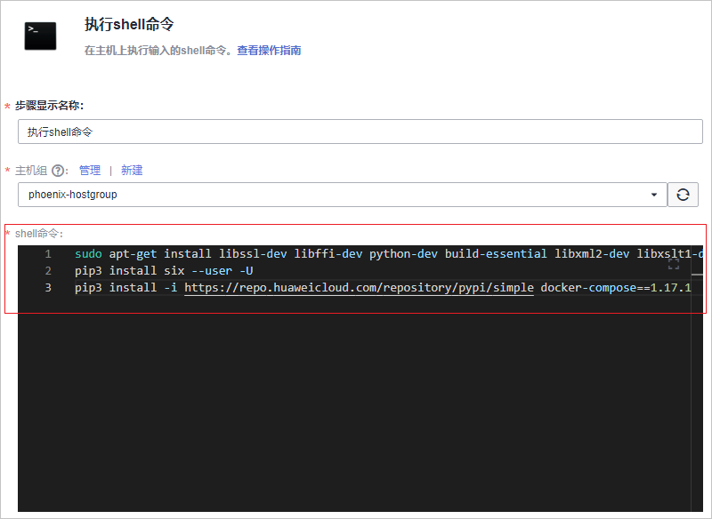
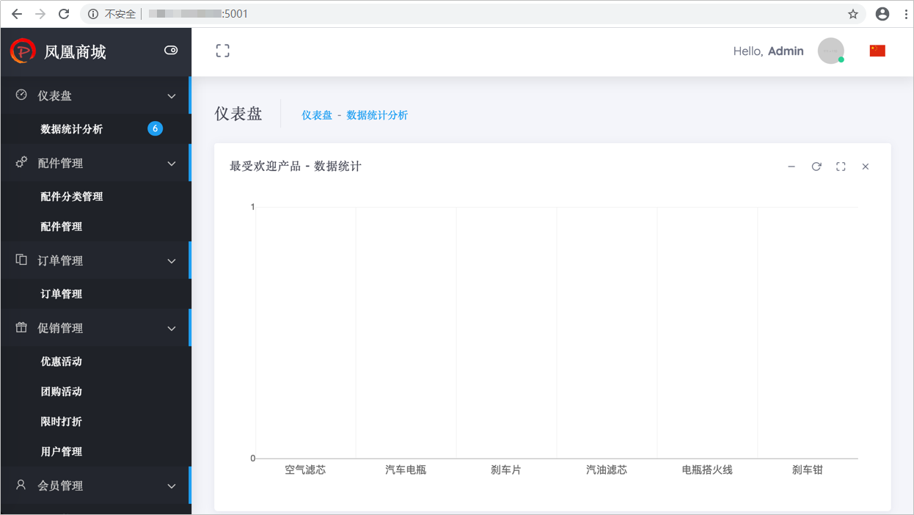

# 步骤七：部署应用（弹性云服务器篇）<a name="ZH-CN_TOPIC_0162964260"></a>

[部署](https://www.huaweicloud.com/product/clouddeploy.html)提供可视化、一键式部署服务，支持并行部署和流水线无缝集成，实现部署环境标准化和部署过程自动化。

为了可以更快的、更稳定的持续地交付软件，开发团队需要一部分自助化部署服务的能力，以减轻部分后续维护工作。

本章节介绍开发人员Chris如何将发布件部署至弹性云服务器。若您需要了解如何署至云容器引擎，请参照[步骤七：部署应用（云容器引擎篇）](步骤七-部署应用（云容器引擎篇）.md)操作。

## 预置部署任务简介<a name="section188891718810"></a>

样例项目中预置了如[表1](#table11691548568)所示的3个部署任务，本章节以任务“phoenix-sample-standalone“为例进行讲解。

**表 1**  预置部署任务

<a name="table11691548568"></a>
<table><thead align="left"><tr id="row51691481065"><th class="cellrowborder" valign="top" width="25%" id="mcps1.2.3.1.1"><p id="p31694485618"><a name="p31694485618"></a><a name="p31694485618"></a>预置部署任务</p>
</th>
<th class="cellrowborder" valign="top" width="75%" id="mcps1.2.3.1.2"><p id="p7169194811614"><a name="p7169194811614"></a><a name="p7169194811614"></a>任务说明</p>
</th>
</tr>
</thead>
<tbody><tr id="row10169164815619"><td class="cellrowborder" valign="top" width="25%" headers="mcps1.2.3.1.1 "><p id="p131708481462"><a name="p131708481462"></a><a name="p131708481462"></a>phoenix-sample-standalone</p>
</td>
<td class="cellrowborder" valign="top" width="75%" headers="mcps1.2.3.1.2 "><p id="p717017481762"><a name="p717017481762"></a><a name="p717017481762"></a>部署至弹性云服务器流程对应的部署任务。</p>
</td>
</tr>
<tr id="row1217014480615"><td class="cellrowborder" valign="top" width="25%" headers="mcps1.2.3.1.1 "><p id="p517015481762"><a name="p517015481762"></a><a name="p517015481762"></a>phoenix-cd-cce</p>
</td>
<td class="cellrowborder" valign="top" width="75%" headers="mcps1.2.3.1.2 "><p id="p111708481361"><a name="p111708481361"></a><a name="p111708481361"></a>部署至云容器引擎流程对应的部署任务。</p>
</td>
</tr>
<tr id="row31709481564"><td class="cellrowborder" valign="top" width="25%" headers="mcps1.2.3.1.1 "><p id="p117064813612"><a name="p117064813612"></a><a name="p117064813612"></a>phoenix-sample-test</p>
</td>
<td class="cellrowborder" valign="top" width="75%" headers="mcps1.2.3.1.2 "><p id="p111704485610"><a name="p111704485610"></a><a name="p111704485610"></a>测试环境对应的部署任务。</p>
</td>
</tr>
</tbody>
</table>

## 购买并配置弹性云服务器<a name="section369110705717"></a>

本文档使用的是[弹性云服务器ECS](https://support.huaweicloud.com/ecs/index.html)，您也可以使用自己的Linux主机（Ubuntu 16.04操作系统）。

1.  <a name="li1497416395259"></a>[购买弹性云服务器](https://support.huaweicloud.com/qs-ecs/ecs_02_0009.html)。

    本文档中建议参照[表2](#table2078775764015)配置购买弹性云服务器（表中未涉及的可保留默认值）。

    **表 2**  弹性云服务器购买配置

    <a name="table2078775764015"></a>
    <table><thead align="left"><tr id="row137871157184017"><th class="cellrowborder" valign="top" width="15%" id="mcps1.2.4.1.1"><p id="p207876575406"><a name="p207876575406"></a><a name="p207876575406"></a>配置分类</p>
    </th>
    <th class="cellrowborder" valign="top" width="15%" id="mcps1.2.4.1.2"><p id="p157871257174019"><a name="p157871257174019"></a><a name="p157871257174019"></a>配置项</p>
    </th>
    <th class="cellrowborder" valign="top" width="70%" id="mcps1.2.4.1.3"><p id="p177871578405"><a name="p177871578405"></a><a name="p177871578405"></a>配置建议</p>
    </th>
    </tr>
    </thead>
    <tbody><tr id="row87871557174017"><td class="cellrowborder" rowspan="4" valign="top" width="15%" headers="mcps1.2.4.1.1 "><p id="p1078755724013"><a name="p1078755724013"></a><a name="p1078755724013"></a>基础配置</p>
    </td>
    <td class="cellrowborder" valign="top" width="15%" headers="mcps1.2.4.1.2 "><p id="p1578719574407"><a name="p1578719574407"></a><a name="p1578719574407"></a>计费模式</p>
    </td>
    <td class="cellrowborder" valign="top" width="70%" headers="mcps1.2.4.1.3 "><p id="p87875579403"><a name="p87875579403"></a><a name="p87875579403"></a>选择<span class="parmvalue" id="parmvalue1662117725817"><a name="parmvalue1662117725817"></a><a name="parmvalue1662117725817"></a>“按需付费”</span>。</p>
    </td>
    </tr>
    <tr id="row17787195711401"><td class="cellrowborder" valign="top" headers="mcps1.2.4.1.1 "><p id="p778715710407"><a name="p778715710407"></a><a name="p778715710407"></a>区域</p>
    </td>
    <td class="cellrowborder" valign="top" headers="mcps1.2.4.1.2 "><p id="p177877577408"><a name="p177877577408"></a><a name="p177877577408"></a>最好选择部署任务所在的区域（若项目所在区域主机已售罄，可选其他区域）。</p>
    </td>
    </tr>
    <tr id="row7787145744016"><td class="cellrowborder" valign="top" headers="mcps1.2.4.1.1 "><p id="p87871571402"><a name="p87871571402"></a><a name="p87871571402"></a>规格</p>
    </td>
    <td class="cellrowborder" valign="top" headers="mcps1.2.4.1.2 "><p id="p197871457114013"><a name="p197871457114013"></a><a name="p197871457114013"></a>选择<span class="parmvalue" id="parmvalue1475219510260"><a name="parmvalue1475219510260"></a><a name="parmvalue1475219510260"></a>“通用计算型”</span>、2核8G或以上规格。</p>
    </td>
    </tr>
    <tr id="row15787057184015"><td class="cellrowborder" valign="top" headers="mcps1.2.4.1.1 "><p id="p878716574402"><a name="p878716574402"></a><a name="p878716574402"></a>镜像</p>
    </td>
    <td class="cellrowborder" valign="top" headers="mcps1.2.4.1.2 "><p id="p18787125716408"><a name="p18787125716408"></a><a name="p18787125716408"></a>选择<span class="menucascade" id="menucascade554442512599"><a name="menucascade554442512599"></a><a name="menucascade554442512599"></a>“<span class="uicontrol" id="uicontrol1354492525912"><a name="uicontrol1354492525912"></a><a name="uicontrol1354492525912"></a>公共镜像</span> &gt; <span class="uicontrol" id="uicontrol142613270598"><a name="uicontrol142613270598"></a><a name="uicontrol142613270598"></a>Ubuntu</span> &gt; <span class="uicontrol" id="uicontrol650074275915"><a name="uicontrol650074275915"></a><a name="uicontrol650074275915"></a>Ubuntu </span> &gt; <span class="uicontrol" id="uicontrol19813457155912"><a name="uicontrol19813457155912"></a><a name="uicontrol19813457155912"></a>16.04 Server 64bit</span>”</span> 。</p>
    </td>
    </tr>
    <tr id="row16787757114017"><td class="cellrowborder" rowspan="4" valign="top" width="15%" headers="mcps1.2.4.1.1 "><p id="p147871457144014"><a name="p147871457144014"></a><a name="p147871457144014"></a>网络配置</p>
    </td>
    <td class="cellrowborder" valign="top" width="15%" headers="mcps1.2.4.1.2 "><p id="p678795744014"><a name="p678795744014"></a><a name="p678795744014"></a>网络</p>
    </td>
    <td class="cellrowborder" valign="top" width="70%" headers="mcps1.2.4.1.3 "><p id="p678725784014"><a name="p678725784014"></a><a name="p678725784014"></a>在列表中任选一个即可。</p>
    </td>
    </tr>
    <tr id="row37871957184012"><td class="cellrowborder" valign="top" headers="mcps1.2.4.1.1 "><p id="p17871157204014"><a name="p17871157204014"></a><a name="p17871157204014"></a>弹性公网IP</p>
    </td>
    <td class="cellrowborder" valign="top" headers="mcps1.2.4.1.2 "><p id="p10787185711407"><a name="p10787185711407"></a><a name="p10787185711407"></a>选择<span class="parmvalue" id="parmvalue64614102019"><a name="parmvalue64614102019"></a><a name="parmvalue64614102019"></a>“现在购买”</span>。</p>
    </td>
    </tr>
    <tr id="row19787357114019"><td class="cellrowborder" valign="top" headers="mcps1.2.4.1.1 "><p id="p878711573407"><a name="p878711573407"></a><a name="p878711573407"></a>规格</p>
    </td>
    <td class="cellrowborder" valign="top" headers="mcps1.2.4.1.2 "><p id="p278735720401"><a name="p278735720401"></a><a name="p278735720401"></a>选择<span class="parmvalue" id="parmvalue1997018173017"><a name="parmvalue1997018173017"></a><a name="parmvalue1997018173017"></a>“静态BGP”</span>。</p>
    </td>
    </tr>
    <tr id="row1278775754012"><td class="cellrowborder" valign="top" headers="mcps1.2.4.1.1 "><p id="p37871457104010"><a name="p37871457104010"></a><a name="p37871457104010"></a>计费方式</p>
    </td>
    <td class="cellrowborder" valign="top" headers="mcps1.2.4.1.2 "><p id="p478716578409"><a name="p478716578409"></a><a name="p478716578409"></a>选择<span class="parmvalue" id="parmvalue92243278016"><a name="parmvalue92243278016"></a><a name="parmvalue92243278016"></a>“按宽带计费”</span>。</p>
    </td>
    </tr>
    <tr id="row8787115716409"><td class="cellrowborder" rowspan="4" valign="top" width="15%" headers="mcps1.2.4.1.1 "><p id="p378835764011"><a name="p378835764011"></a><a name="p378835764011"></a>高级配置</p>
    </td>
    <td class="cellrowborder" valign="top" width="15%" headers="mcps1.2.4.1.2 "><p id="p14788105734016"><a name="p14788105734016"></a><a name="p14788105734016"></a>云服务器名称</p>
    </td>
    <td class="cellrowborder" valign="top" width="70%" headers="mcps1.2.4.1.3 "><p id="p9788557134014"><a name="p9788557134014"></a><a name="p9788557134014"></a>自定义（为避免帐号下购买过多个主机时不易查找的情况，建议修改系统默认主机名称，使用易于辨认的主机名）。</p>
    </td>
    </tr>
    <tr id="row97881757194010"><td class="cellrowborder" valign="top" headers="mcps1.2.4.1.1 "><p id="p17881257104016"><a name="p17881257104016"></a><a name="p17881257104016"></a>登录凭证</p>
    </td>
    <td class="cellrowborder" valign="top" headers="mcps1.2.4.1.2 "><p id="p12788195774014"><a name="p12788195774014"></a><a name="p12788195774014"></a>选择<span class="parmvalue" id="parmvalue82282345015"><a name="parmvalue82282345015"></a><a name="parmvalue82282345015"></a>“密码”</span>。</p>
    </td>
    </tr>
    <tr id="row77881757174019"><td class="cellrowborder" valign="top" headers="mcps1.2.4.1.1 "><p id="p11788457134013"><a name="p11788457134013"></a><a name="p11788457134013"></a>密码</p>
    </td>
    <td class="cellrowborder" valign="top" headers="mcps1.2.4.1.2 "><p id="p177881857134012"><a name="p177881857134012"></a><a name="p177881857134012"></a>自定义。</p>
    </td>
    </tr>
    <tr id="row978811571406"><td class="cellrowborder" valign="top" headers="mcps1.2.4.1.1 "><p id="p14788657184010"><a name="p14788657184010"></a><a name="p14788657184010"></a>云备份</p>
    </td>
    <td class="cellrowborder" valign="top" headers="mcps1.2.4.1.2 "><p id="p187888572407"><a name="p187888572407"></a><a name="p187888572407"></a>选择<span class="parmvalue" id="parmvalue1943718421006"><a name="parmvalue1943718421006"></a><a name="parmvalue1943718421006"></a>“暂不购买”</span>。</p>
    </td>
    </tr>
    </tbody>
    </table>

2.  配置安全组规则。

    样例项目的验证需要用到端口5000与5001，因此添加一条允许访问5000以及5001端口的入方向规则。

    操作步骤如下：

    1.  登录[弹性云服务器控制台](https://console.huaweicloud.com/ecm/?region=&locale=zh-cn#/ecs/manager/vmList)，在列表中找到步骤[1](#li1497416395259)中购买的弹性云服务器，单击服务器名称。
    2.  选择“安全组“页签，单击“配置规则“。
    3.  选择“入方向规则“页签，单击“添加规则“，参照[图1](#fig1328319501206)添加规则。

        **图 1**  配置安全组规则<a name="fig1328319501206"></a>  
        


## 添加授信主机至项目<a name="section3487139164112"></a>

部署应用到弹性云服务器之前，需要先对其授信，保证部署服务能够访问弹性云服务器。

1.  [创建主机组](https://support.huaweicloud.com/usermanual-deployman/deployman_hlp_1024.html)。

    本文档中使用的主机组名“phoenix-hostgroup“，操作系统为“Linux“。

2.  [向主机组中添加主机](https://support.huaweicloud.com/usermanual-deployman/deployman_hlp_1016.html)。

    将已购买的弹性云服务器添加至新创建的主机组中。其中，该弹性云服务器的主机名、IP、用户名可参考[查看弹性云服务器详细信息](https://support.huaweicloud.com/usermanual-ecs/ecs_03_0122.html)获取，SSH端口为“22“。

3.  当出现如[图2](#fig127761941355)所示的提示时，表示主机添加成功。

    若主机添加失败，请参考[部署-常见问题-主机问题](https://support.huaweicloud.com/deployman_faq/deployman_faq_0000.html)排查。

    **图 2**  添加主机成功<a name="fig127761941355"></a>  
    


## 向授信主机中安装依赖工具<a name="section103761533713"></a>

样例程序的运行需要Docker及Docker-Compose环境，需要将依赖环境安装到授信主机中。

1.  进入“凤凰商城“项目，单击页面上方导航“构建&发布  \>  部署“。
2.  单击“新建任务“，参照[表3](#table15936325816)配置构建任务，单击“下一步“。

    **表 3**  部署任务配置

    <a name="table15936325816"></a>
    <table><thead align="left"><tr id="row1893772288"><th class="cellrowborder" valign="top" width="20%" id="mcps1.2.3.1.1"><p id="p1733916394248"><a name="p1733916394248"></a><a name="p1733916394248"></a>步骤</p>
    </th>
    <th class="cellrowborder" valign="top" width="80%" id="mcps1.2.3.1.2"><p id="p123391739192413"><a name="p123391739192413"></a><a name="p123391739192413"></a>填写/选择建议</p>
    </th>
    </tr>
    </thead>
    <tbody><tr id="row193722188"><td class="cellrowborder" valign="top" width="20%" headers="mcps1.2.3.1.1 "><p id="p12339133918248"><a name="p12339133918248"></a><a name="p12339133918248"></a>基本信息</p>
    </td>
    <td class="cellrowborder" valign="top" width="80%" headers="mcps1.2.3.1.2 "><p id="p1017914175318"><a name="p1017914175318"></a><a name="p1017914175318"></a>输入任务名称<span class="parmvalue" id="parmvalue57341625153"><a name="parmvalue57341625153"></a><a name="parmvalue57341625153"></a>“phoenix-predeploy”</span>。</p>
    </td>
    </tr>
    <tr id="row99379218817"><td class="cellrowborder" valign="top" width="20%" headers="mcps1.2.3.1.1 "><p id="p113397396244"><a name="p113397396244"></a><a name="p113397396244"></a>选择构建模板</p>
    </td>
    <td class="cellrowborder" valign="top" width="80%" headers="mcps1.2.3.1.2 "><p id="p16339639132410"><a name="p16339639132410"></a><a name="p16339639132410"></a>选择<span class="parmvalue" id="parmvalue97321826277"><a name="parmvalue97321826277"></a><a name="parmvalue97321826277"></a>“空白模板”</span>。</p>
    </td>
    </tr>
    </tbody>
    </table>

3.  添加步骤“安装/卸载Docker“，在主机组下拉列表中选择“phoenix-hostgroup“。

    若页面显示弹框“是否将后续步骤的主机组也修改为phoenix-hostgroup？“，单击“确定“即可。

4.  添加步骤“执行Shell命令“，在命令框中输入以下命令，如[图3](#fig20911225101015)所示。

    ```
    sudo apt-get install libssl-dev libffi-dev python-dev build-essential libxml2-dev libxslt1-dev -y
    pip3 install six --user -U
    pip3 install -i https://repo.huaweicloud.com/repository/pypi/simple docker-compose==1.17.1
    ```

    **图 3**  执行shell命令<a name="fig20911225101015"></a>  
    

5.  单击“保存并执行“，启动部署任务。

    任务执行耗时约1\~2分钟，当出现页面提示“部署成功“时，表示任务执行成功。

6.  登录弹性云服务器，执行以下命令，检测依赖工具是否安装成功。

    -   查看Docker镜像版本。

        ```
        docker -v
        ```

    -   查看Docker-Compose版本。

        ```
        docker-compose -v
        ```

    当出现如[图4](#fig185741656131112)所示提示时，表示安装成功。

    **图 4**  查看Docker及Docker-Compose版本<a name="fig185741656131112"></a>  
    


## 配置并执行部署任务<a name="section173051906308"></a>

部署应用到弹性云服务器之前，需要先对其授信，保证部署服务能够访问弹性云服务器。

1.  配置部署任务。
    1.  进入“凤凰商城“项目，单击页面上方导航“构建&发布  \>  部署“，在列表中找到任务“phoenix-sample-standalone“，如[图5](#fig13474111212120)所示。

        **图 5**  部署<a name="fig13474111212120"></a>  
        

    2.  单击图标进入编辑页面。
    3.  在“部署步骤“页签，编辑部署任务的步骤。
        1.  步骤“选择部署来源“，参照[表4](#table535994471416)设置部署来源，如[图6](#fig7467422928)所示。

            **表 4**  部署来源配置

            <a name="table535994471416"></a>
            <table><thead align="left"><tr id="row036044461413"><th class="cellrowborder" valign="top" width="20%" id="mcps1.2.3.1.1"><p id="p193601744121418"><a name="p193601744121418"></a><a name="p193601744121418"></a>配置项</p>
            </th>
            <th class="cellrowborder" valign="top" width="80%" id="mcps1.2.3.1.2"><p id="p936018444142"><a name="p936018444142"></a><a name="p936018444142"></a>配置建议</p>
            </th>
            </tr>
            </thead>
            <tbody><tr id="row183601644161416"><td class="cellrowborder" valign="top" width="20%" headers="mcps1.2.3.1.1 "><p id="p1136014491416"><a name="p1136014491416"></a><a name="p1136014491416"></a>选择源类型</p>
            </td>
            <td class="cellrowborder" valign="top" width="80%" headers="mcps1.2.3.1.2 "><p id="p1236074418141"><a name="p1236074418141"></a><a name="p1236074418141"></a>选择<span class="parmvalue" id="parmvalue1270718419215"><a name="parmvalue1270718419215"></a><a name="parmvalue1270718419215"></a>“构建任务”</span>。</p>
            </td>
            </tr>
            <tr id="row10360164414147"><td class="cellrowborder" valign="top" width="20%" headers="mcps1.2.3.1.1 "><p id="p123603443145"><a name="p123603443145"></a><a name="p123603443145"></a>主机组</p>
            </td>
            <td class="cellrowborder" valign="top" width="80%" headers="mcps1.2.3.1.2 "><p id="p1436064411146"><a name="p1436064411146"></a><a name="p1436064411146"></a>选择<span class="parmvalue" id="parmvalue188281242712"><a name="parmvalue188281242712"></a><a name="parmvalue188281242712"></a>“phoenix-hostgroup”</span>。页面会显示弹框<span class="parmvalue" id="parmvalue114304464179"><a name="parmvalue114304464179"></a><a name="parmvalue114304464179"></a>“是否将后续步骤的主机组也修改为phoenix-hostgroup？”</span>，单击<span class="uicontrol" id="uicontrol15627151410173"><a name="uicontrol15627151410173"></a><a name="uicontrol15627151410173"></a>“确定”</span>即可。</p>
            </td>
            </tr>
            <tr id="row33601144171418"><td class="cellrowborder" valign="top" width="20%" headers="mcps1.2.3.1.1 "><p id="p1836018445148"><a name="p1836018445148"></a><a name="p1836018445148"></a>请选择构建任务</p>
            </td>
            <td class="cellrowborder" valign="top" width="80%" headers="mcps1.2.3.1.2 "><p id="p123601544111412"><a name="p123601544111412"></a><a name="p123601544111412"></a>选择<span class="parmvalue" id="parmvalue11496115561513"><a name="parmvalue11496115561513"></a><a name="parmvalue11496115561513"></a>“phoenix-sample-ci”</span>。</p>
            </td>
            </tr>
            </tbody>
            </table>

            **图 6**  选择部署来源<a name="fig7467422928"></a>  
            

        2.  步骤“解压文件“与“执行shell命令“保持默认配置即可。

    4.  选择“参数设置“页签，根据容器镜像服务登录指令填写参数。

        登录指令通过控制台获取，操作方式请参考[配置SWR服务](步骤六-构建应用.md#section88081731191012)。

    5.  单击“保存“，完成部署任务的编辑。页面自动跳转至任务详情页。

2.  执行部署任务。

    单击“执行“，启动部署任务。

    任务执行耗时约1\~2分钟，当出现如[图7](#fig327313441538)所示页面时，表示任务执行成功。

    若任务执行失败，请根据报错信息，参考[部署失败解决方法](部署失败解决方法.md)排查。

    **图 7**  部署成功<a name="fig327313441538"></a>  
    

3.  验证部署结果。

    打开浏览器，输入“http://ip:5000“，其中ip为弹性云服务器的IP地址。

    进入如[图8](#fig14261561312)所示页面，在导航栏中可看到菜单项“门店网络“。

    **图 8**  用户端UI<a name="fig14261561312"></a>  
    

    输入“http://ip:5001“，其中ip为弹性云服务器的IP地址，可以进入如[图9](#fig91205440149)所示页面。

    **图 9**  管理端UI<a name="fig91205440149"></a>  
    


