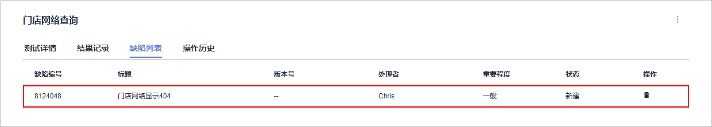
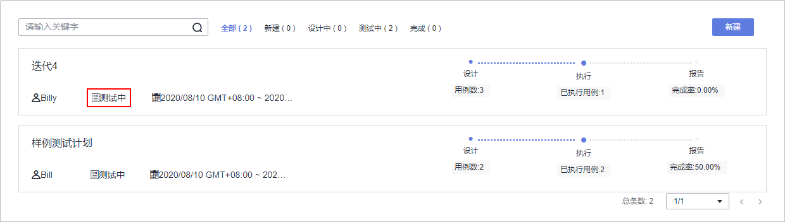

# 步骤三：管理项目测试

[云测](https://www.huaweicloud.com/product/cloudtest.html)提供一站式云端测试平台，融入DevOps敏捷测试理念，有助于高效管理测试活动，保障产品高质量交付。

通过本章节，您将了解测试人员Billy如何使用云测服务管理项目的测试周期，包括创建与执行测试用例、跟踪测试进度等。

## 创建迭代测试计划

在确定迭代4中计划实现的需求（Story）后（即完成[步骤一：管理项目规划](步骤一-管理项目规划.md)），测试人员即可在开发人员进行代码开发的同时编写测试用例。

1.  创建测试计划。
    1.  进入“凤凰商城“项目，单击页面上方导航“测试  \>  测试计划“，如[图1](#fig9959137133118)所示。

        **图 1**  测试计划  
        

    2.  单击页面右上角“新建“，参照[表1](#table1533220331696)编辑测试计划信息。

        **表 1**  测试计划信息配置

        
        <table><thead align="left"><tr id="row17333133317919"><th class="cellrowborder" valign="top" width="20%" id="mcps1.2.4.1.1">
配置项

        </th>
        <th class="cellrowborder" valign="top" width="20%" id="mcps1.2.4.1.2">
子配置项

        </th>
        <th class="cellrowborder" valign="top" width="60%" id="mcps1.2.4.1.3">
配置建议

        </th>
        </tr>
        </thead>
        <tbody><tr id="row23332331918"><td class="cellrowborder" rowspan="4" valign="top" width="20%" headers="mcps1.2.4.1.1 ">
基本信息

        </td>
        <td class="cellrowborder" valign="top" width="20%" headers="mcps1.2.4.1.2 ">
名称

        </td>
        <td class="cellrowborder" valign="top" width="60%" headers="mcps1.2.4.1.3 ">
输入“迭代4”。

        </td>
        </tr>
        <tr id="row648218529186"><td class="cellrowborder" valign="top" headers="mcps1.2.4.1.1 ">
处理者

        </td>
        <td class="cellrowborder" valign="top" headers="mcps1.2.4.1.2 ">
选择“Billy”。

        </td>
        </tr>
        <tr id="row279918566116"><td class="cellrowborder" valign="top" headers="mcps1.2.4.1.1 ">
计划周期

        </td>
        <td class="cellrowborder" valign="top" headers="mcps1.2.4.1.2 ">
与迭代4的周期一致（迭代的配置请参考<a href="步骤一-管理项目规划.md#li78986129407">创建迭代</a>）。

        </td>
        </tr>
        <tr id="row145701757201112"><td class="cellrowborder" valign="top" headers="mcps1.2.4.1.1 ">
关联迭代

        </td>
        <td class="cellrowborder" valign="top" headers="mcps1.2.4.1.2 ">
选择“迭代4”。

        </td>
        </tr>
        <tr id="row1033312338910"><td class="cellrowborder" rowspan="2" valign="top" width="20%" headers="mcps1.2.4.1.1 ">
高级配置

        </td>
        <td class="cellrowborder" valign="top" width="20%" headers="mcps1.2.4.1.2 ">
测试类型

        </td>
        <td class="cellrowborder" valign="top" width="60%" headers="mcps1.2.4.1.3 ">
勾选“功能测试”。

        </td>
        </tr>
        <tr id="row135781125122"><td class="cellrowborder" valign="top" headers="mcps1.2.4.1.1 ">
添加需求

        </td>
        <td class="cellrowborder" valign="top" headers="mcps1.2.4.1.2 ">
选择迭代4中计划完成的三个Story（迭代的配置请参考<a href="步骤一-管理项目规划.md#li154701112134510">规划迭代</a>）。

        </td>
        </tr>
        </tbody>
        </table>

    3.  单击“确定“完成测试计划的创建，页面跳转回测试计划列表，如[图2](#fig6158617193213)所示。

        在列表中可找到新创建的测试计划“迭代4“，状态为“新建“。

        **图 2**  测试计划列表  
        

2.  设计测试用例。
    1.  在测试计划“迭代4“中，单击“设计“。
    2.  展开页面左侧“需求目录“，找到Story“作为用户应该可以查询所有门店网络“。

        单击图标，选择“新建测试用例“，如[图3](#fig94291857133211)所示。

        **图 3**  新建测试用例  
        

    3.  输入名称“门店网络查询“，参照[表2](#table1281672112012)编辑测试步骤与预期结果，单击“保存“。

        **表 2**  测试步骤

        
        <table><thead align="left"><tr id="row1181612215206"><th class="cellrowborder" valign="top" width="25%" id="mcps1.2.3.1.1">
测试步骤

        </th>
        <th class="cellrowborder" valign="top" width="75%" id="mcps1.2.3.1.2">
预期结果

        </th>
        </tr>
        </thead>
        <tbody><tr id="row8816429202"><td class="cellrowborder" valign="top" width="25%" headers="mcps1.2.3.1.1 ">
打开凤凰商城首页。

        </td>
        <td class="cellrowborder" valign="top" width="75%" headers="mcps1.2.3.1.2 ">
页面正常显示。

        </td>
        </tr>
        <tr id="row1281611212013"><td class="cellrowborder" valign="top" width="25%" headers="mcps1.2.3.1.1 ">
单击菜单“门店网络”。

        </td>
        <td class="cellrowborder" valign="top" width="75%" headers="mcps1.2.3.1.2 ">
进入“门店网络”界面，页面中存在省份筛选，页面最下面显示推荐门店信息。

        </td>
        </tr>
        <tr id="row881652182014"><td class="cellrowborder" valign="top" width="25%" headers="mcps1.2.3.1.1 ">
省份选择“上海市”。

        </td>
        <td class="cellrowborder" valign="top" width="75%" headers="mcps1.2.3.1.2 ">
列出上海市的门店信息列表，门店信息包括（地址、电话）。

        </td>
        </tr>
        </tbody>
        </table>

    4.  按照样的方式，为其它两个Story创建测试用例。
    5.  单击页面上方导航“测试  \>  测试计划“，返回测试计划列表，如[图4](#fig1504125523319)所示。

        在列表中可看到测试计划“迭代4“的状态为“设计中“。

        **图 4**  测试计划列表  
        

## 执行测试计划

当开发人员完成Story的代码开发、并将应用部署到测试环境后（即完成[步骤七：部署应用（弹性云服务器篇）](步骤七-部署应用（弹性云服务器篇）.md)或[步骤七：部署应用（云容器引擎篇）](步骤七-部署应用（云容器引擎篇）.md)），可将Story的状态设置为“已解决“，并将Story的处理人设置为测试人员，如[图5](#fig19807172403419)所示。

**图 5**  工作项详情  

此时测试人员即可开始执行Story对应的测试用例。

本节以门店网络查询功能为例，介绍如何执行测试用例、以及测试用例执行失败如何反馈Bug信息。

1.  在“凤凰商城“项目中，单击页面上方导航“工作  \>  迭代“。

    在迭代4中找到Story“作为用户应该可以查询所有门店网络“，将Story的状态修改为“测试中“。

2.  进入“测试  \>  测试计划“页面，在测试计划“迭代4“中，单击“执行“。
3.  展开页面左侧“需求目录“，单击Story“作为用户应该可以查询所有门店网络“，页面中将显示Story对应的测试用例。、
4.  在列表中单击测试用例的状态“新建“，在下拉列表中选择“测试中“，如[图6](#fig4706124174111)所示。

    **图 6**  修改测试用例状态  
    

5.  在操作列中单击图标，页面右侧滑出“执行“窗口。
6.  在测试环境中，按照测试步骤进行逐步操作（进入凤凰商城首页方法请参考[验证部署结果](步骤七-部署应用（弹性云服务器篇）.md#li22551657134110)）。
    -   执行成功，跳转至步骤[7](#li34741018152312)继续操作。
    -   执行失败，例如：执行第二步时页面跳转失败，页面显示404，如[图7](#fig1068435219207)所示，跳转至步骤[8](#li11811823173013)继续操作。

        **图 7**  页面显示失败  
        

7.  返回测试用例执行页面，记录执行结果，如[图8](#fig9946133123716)所示。

    1.  在表格中，设置所有步骤的实际结果为“成功“。
    2.  在表格上方，设置测试用例的结果为“成功“。
    3.  勾选“同时将用例状态设为已完成“。
    4.  单击页面右上角“保存“。

    **图 8**  测试用例执行成功  
    

    此时测试用例的状态将自动变更为“完成“，如[图9](#fig181201236009)所示。跳转至步骤[14](#li182701959134813)继续操作。

    **图 9**  测试用例状态自动变更  
    

8.  返回测试用例执行页面，记录执行结果，如[图10](#fig116959743615)所示。

    1.  在表格中，设置步骤1的实际结果为“成功“。
    2.  在表格中，设置步骤2的实际结果为“失败“，并输入实际显示内容“跳转失败，页面显示404“。
    3.  在表格上方，设置测试用例的结果为“失败“。
    4.  单击页面右上角“保存“。

    **图 10**  测试用例执行失败  
    

9.  单击页面右上角，选择“新建缺陷“，页面将跳转至新建缺陷（新建工作项）页面，如[图11](#fig1153544173620)所示。

    **图 11**  新建缺陷  
    

10. 在页面左下方的文本框的最后，可以看到自动填充缺陷的重现步骤。

    参照[表3](#table9691125114310)编辑缺陷详情，如[图12](#fig772651123810)所示，单击“保存“，页面将跳转到工作项列表页面。

    **表 3**  缺陷详情配置

    
    <table><thead align="left"><tr id="row1169155183116"><th class="cellrowborder" valign="top" width="20%" id="mcps1.2.3.1.1">
配置项

    </th>
    <th class="cellrowborder" valign="top" width="80%" id="mcps1.2.3.1.2">
配置建议

    </th>
    </tr>
    </thead>
    <tbody><tr id="row1269155123119"><td class="cellrowborder" valign="top" width="20%" headers="mcps1.2.3.1.1 ">
标题

    </td>
    <td class="cellrowborder" valign="top" width="80%" headers="mcps1.2.3.1.2 ">
输入“门店网络页面显示404”。

    </td>
    </tr>
    <tr id="row1769112512317"><td class="cellrowborder" valign="top" width="20%" headers="mcps1.2.3.1.1 ">
处理人

    </td>
    <td class="cellrowborder" valign="top" width="80%" headers="mcps1.2.3.1.2 ">
选择“Chris”。

    </td>
    </tr>
    <tr id="row146911651133112"><td class="cellrowborder" valign="top" width="20%" headers="mcps1.2.3.1.1 ">
迭代

    </td>
    <td class="cellrowborder" valign="top" width="80%" headers="mcps1.2.3.1.2 ">
选择“迭代4”。

    </td>
    </tr>
    </tbody>
    </table>

    **图 12**  编辑缺陷详情  
    

11. 在列表中找到在[上一步](#li82323349441)中创建的缺陷，单击缺陷名称，选择“关联“页签，在“关联用例“下可看到测试用例“门店网络查询“，如[图13](#fig1722450183816)所示。

    **图 13**  关联测试用例  
    

12. 单击用例编号，可跳转到用例详情页。

    选择“缺陷列表“页签，可看到一条缺陷记录，即在步骤[10](#li82323349441)中创建的缺陷，如[图14](#fig1152516819398)所示。

    **图 14**  测试用例缺陷列表  
    

13. 当开发人员修复缺陷后并验证成功后，参考步骤[7](#li34741018152312)设置用例结果，并将对应的缺陷状态设置为“已关闭“。
14. 执行其它测试用例。
15. 单击页面上方导航“测试  \>  测试计划“，返回测试计划列表。
    -   若全部测试用例的状态全部为“完成“，在列表中可看到测试计划“迭代4“的状态为“完成“，如[图15](#fig14574131211011)所示。

        **图 15**  测试计划完成  
        

    -   若只有部分测试用例的状态为“完成“，则测试计划“迭代4“的状态为“测试中“，如[图16](#fig911613110398)所示。

        **图 16**  测试计划测试中  
        

## 跟踪测试计划进展

-   查看质量报告。

    通过质量报告，团队可以直观的查看测试计划的当前进展，包括用例完成率、通过率、缺陷数量等。

    在“测试  \>  测试计划“页面，在测试计划“迭代4“中，单击“报告“，即可查看此迭代质量报告，如[图17](#fig1245115173914)所示。

    **图 17**  迭代质量报告  
    

-   自定义报表。

    除了内置的质量报告，团队可以根据需要自定义统计报表。

    下面以统计测试用例执行结果为例，介绍如何自定义统计报表。

    1.  在“质量报告“页面，单击“点击添加报表“，在弹框中选择“自定义报表“。
    2.  参照[表4](#table718204613338)编辑报表信息，单击“保存“。

        **表 4**  报表配置

        
        <table><thead align="left"><tr id="row16183134653319"><th class="cellrowborder" valign="top" width="20%" id="mcps1.2.3.1.1">
配置项

        </th>
        <th class="cellrowborder" valign="top" width="80%" id="mcps1.2.3.1.2">
配置建议

        </th>
        </tr>
        </thead>
        <tbody><tr id="row3183144683311"><td class="cellrowborder" valign="top" width="20%" headers="mcps1.2.3.1.1 ">
报表标题

        </td>
        <td class="cellrowborder" valign="top" width="80%" headers="mcps1.2.3.1.2 ">
输入“测试用例执行结果统计”。

        </td>
        </tr>
        <tr id="row01831246203311"><td class="cellrowborder" valign="top" width="20%" headers="mcps1.2.3.1.1 ">
工件类型

        </td>
        <td class="cellrowborder" valign="top" width="80%" headers="mcps1.2.3.1.2 ">
选择“测试用例”。

        </td>
        </tr>
        <tr id="row1618334613336"><td class="cellrowborder" valign="top" width="20%" headers="mcps1.2.3.1.1 ">
分析维度

        </td>
        <td class="cellrowborder" valign="top" width="80%" headers="mcps1.2.3.1.2 ">
选择“结果”。

        </td>
        </tr>
        </tbody>
        </table>

    3.  页面跳转回“质量报表“，在页面最下方显示新建的报表，如[图18](#fig1012111983914)所示。

        **图 18**  自定义报表  
        

