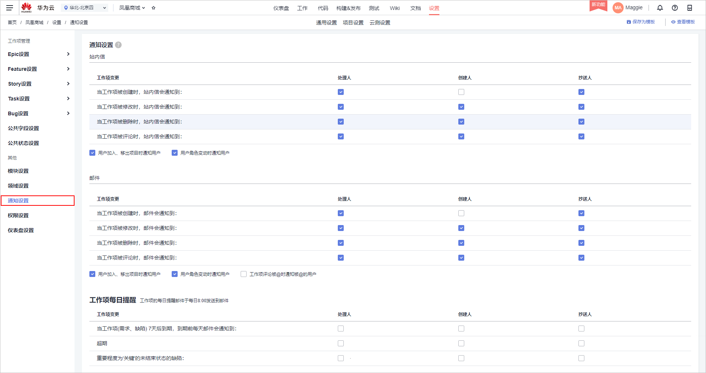
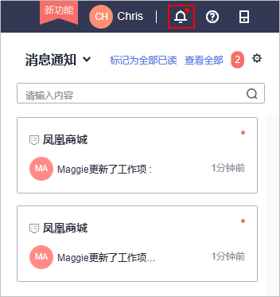
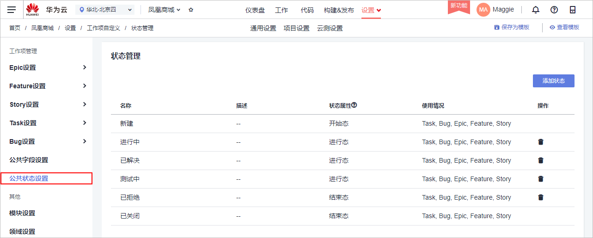
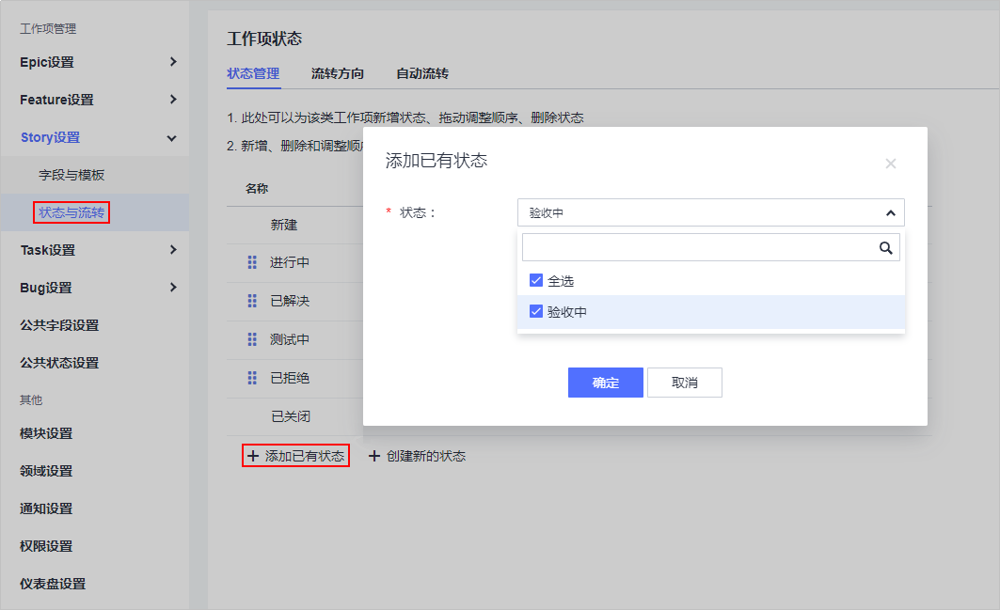
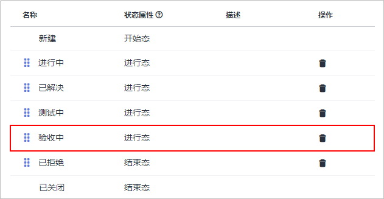
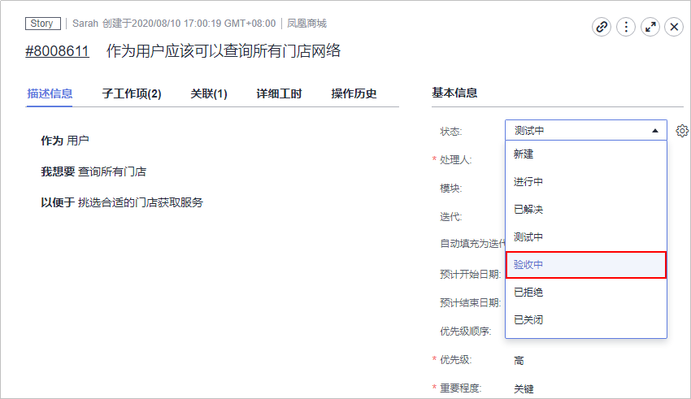

# 步骤二：管理项目配置

## 管理项目通知

项目经理Maggie希望当任务（工作项）分配给团队成员时，该成员能够收到通知，以便及时处理。

1.  进入“凤凰商城“项目，单击页面上方导航“设置  \>  项目设置“。
2.  在左侧页面中选择“通知设置“，页面将显示样例项目中的默认配置，如[图1](#fig1863656183020)所示。

    由于默认配置可以满足需求，因此本文档中暂不做配置的修改。若您有需要，直接勾选所需选项即可，软件开发平台将自动保存您的选择。

    **图 1**  通知设置  
    

3.  验证配置结果。

    当项目经理完成[分解Story](步骤一-管理项目规划.md#li14933182641713)操作后，开发人员Chris将收到以下两类通知。

    -   站内信：Chris登录DevCloud后，在页面右上角单击图标，即可看到通知，如[图2](#fig1562912963110)所示。

        **图 2**  站内信  
        

    -   邮件：若为项目成员创建IAM用户时配置了邮箱，且项目成员在个人设置中开启了邮件通知，则将会收到如[图3](#fig295184612324)所示的邮件。

        **图 3**  邮件通知  
        

        > **说明：** 
        >每个成员均可以设置是否接收DevCloud发出的邮件通知。开启邮箱通知的方法为：
        >1.  单击页面右上角的用户名，在下拉列表中选择“个人设置“，默认跳转至“消息设置“页面。
        >2.  在页面中找到“邮件通知“，勾选“开启“。

## 定制项目工作流程

在迭代Review会议中，团队将向产品负责人做产品演示，并出示测试报告，由产品负责人确认Story是否完成。而当前的Story状态中没有能够显示测试已完成的状态，因此测试人员建议增加一个状态“验收中“。

项目经理Maggie通过以下操作为Story添加状态。

1.  进入“凤凰商城“项目，单击页面上方导航“设置  \>  项目设置“。
2.  在页面左侧导航中选择“公共状态设置“，页面将显示样例项目默认的工作项状态列表，如[图4](#fig1788816571422)所示。

    **图 4**  公共状态设置  
    

3.  单击“添加状态“，参照[表1](#table066148181714)在弹框中编辑状态信息，单击“添加“保存。

    **表 1**  状态信息配置

    
    <table><thead align="left"><tr id="row20661980173"><th class="cellrowborder" valign="top" width="20%" id="mcps1.2.3.1.1">
配置项

    </th>
    <th class="cellrowborder" valign="top" width="80%" id="mcps1.2.3.1.2">
配置建议

    </th>
    </tr>
    </thead>
    <tbody><tr id="row1366115818173"><td class="cellrowborder" valign="top" width="20%" headers="mcps1.2.3.1.1 ">
状态

    </td>
    <td class="cellrowborder" valign="top" width="80%" headers="mcps1.2.3.1.2 ">
输入“验收中”。

    </td>
    </tr>
    <tr id="row146622811173"><td class="cellrowborder" valign="top" width="20%" headers="mcps1.2.3.1.1 ">
状态属性

    </td>
    <td class="cellrowborder" valign="top" width="80%" headers="mcps1.2.3.1.2 ">
选择“进行态”。

    </td>
    </tr>
    </tbody>
    </table>

4.  在页面左侧导航中选择“Story设置  \>  状态与流转“，页面将显示样例项目默认的Story状态列表。
5.  单击“添加已有状态“，在弹框中勾选“验收中“，单击“确定“保存，如[图5](#fig58821544184319)所示。

    **图 5**  添加工Story状态  
    

6.  通过拖拽将状态“验收中“的顺序至于“测试中“之后，如[图6](#fig56481316192217)所示。

    **图 6**  调整状态顺序  
    

7.  验证配置结果。
    1.  单击“工作  \>  工作项“，在列表中单击任意Story名称，查看Story详情。
    2.  单击“状态“项的值，在下拉列表中可以看到选项“验收中“，如[图7](#fig14303173182316)所示。

        **图 7**  修改Story状态  
        

