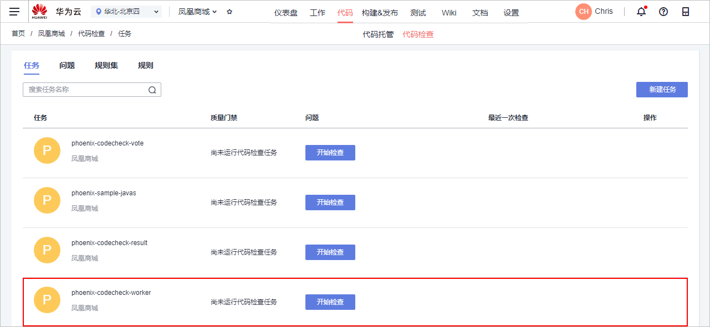
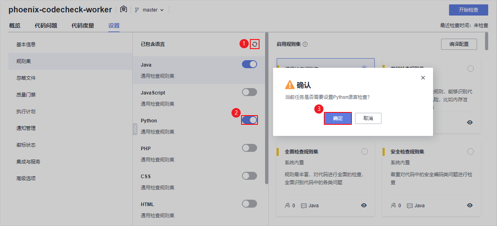
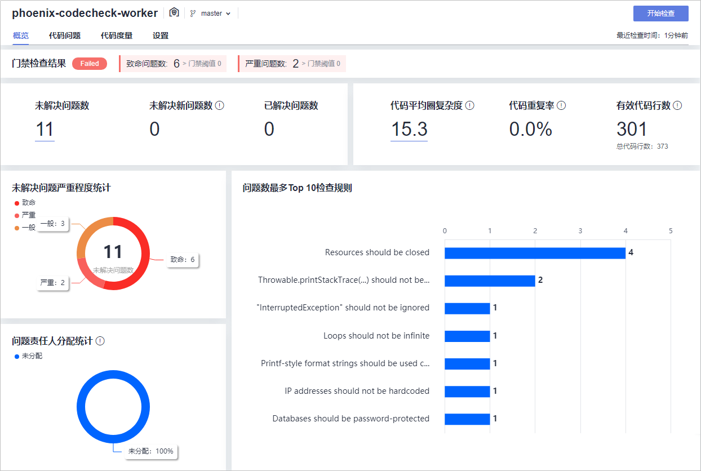
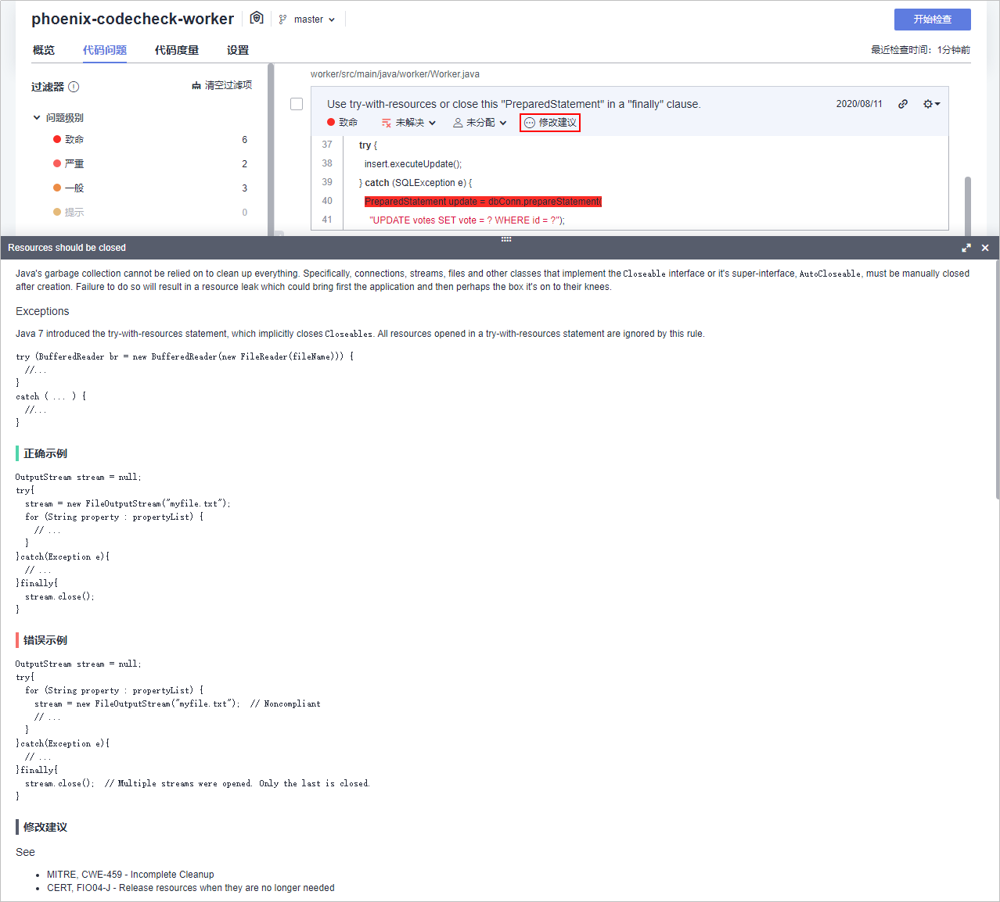

# 步骤五：检查项目代码

[代码检查](https://www.huaweicloud.com/product/codecheck.html)提供基于云端实现代码质量管理服务，支持代码静态检查（包括代码质量、代码风格等）和安全检查，并提供缺陷的改进建议和趋势分析。

随着凤凰商城越来越庞大，线上出现的缺陷以及安全问题也越来越多，修复成本太大；且开发人员写代码也比较随性，没有统一标准。因此项目经理建议制定一些基本的标准，并对代码进行持续的静态代码扫描，一旦发现问题立即在迭代内修复。

通过本章节，您将了解开发人员Chris如何使用代码检查服务完成针对不同技术栈的代码静态扫描、问题收集与修复。

## 预置代码检查任务简介

样例项目中预置了如[表1](#table11691548568)所示的4个代码检查任务。

**表 1**  预置代码检查任务

<table><thead align="left"><tr id="row51691481065"><th class="cellrowborder" valign="top" width="25%" id="mcps1.2.3.1.1">
预置代码检查任务

</th>
<th class="cellrowborder" valign="top" width="75%" id="mcps1.2.3.1.2">
任务说明

</th>
</tr>
</thead>
<tbody><tr id="row10169164815619"><td class="cellrowborder" valign="top" width="25%" headers="mcps1.2.3.1.1 ">
phoenix-codecheck-worker

</td>
<td class="cellrowborder" valign="top" width="75%" headers="mcps1.2.3.1.2 ">
Worker功能对应的代码检查任务。

</td>
</tr>
<tr id="row1217014480615"><td class="cellrowborder" valign="top" width="25%" headers="mcps1.2.3.1.1 ">
phoenix-codecheck-result

</td>
<td class="cellrowborder" valign="top" width="75%" headers="mcps1.2.3.1.2 ">
Result功能对应的代码检查任务。

</td>
</tr>
<tr id="row31709481564"><td class="cellrowborder" valign="top" width="25%" headers="mcps1.2.3.1.1 ">
phoenix-codecheck-vote

</td>
<td class="cellrowborder" valign="top" width="75%" headers="mcps1.2.3.1.2 ">
Vote功能对应的代码检查任务。

</td>
</tr>
<tr id="row1217016481369"><td class="cellrowborder" valign="top" width="25%" headers="mcps1.2.3.1.1 ">
phoenix-codecheck-javas

</td>
<td class="cellrowborder" valign="top" width="75%" headers="mcps1.2.3.1.2 ">
整个代码仓库对应的JavaScript代码检查任务。

</td>
</tr>
</tbody>
</table>

> **说明：** 
>关于Vote、Result、Worker的说明，请参见[HE2E DevOps实践介绍](HE2E-DevOps实践介绍.md)。

本章节以任务“phoenix-codecheck-worker“为例进行讲解。

## 配置并执行代码检查任务

开发人员可以对样例项目中预置的代码检查任务做一些简单的配置，增加Python语言检查规则集，使检查更全面。

1.  编辑代码检查任务。
    1.  进入“凤凰商城“项目，单击页面上方导航“代码  \>  代码检查“，页面将显示样例项目自动创建的4个代码检查任务。在列表中找到任务“phoenix-codecheck-worker“，如[图1](#fig181951216142119)所示。

        **图 1**  代码检查  
        

    2.  单击任务名称进入详情页，选择“设置“页签。
    3.  单击页面左侧导航“规则集“，规则集中默认包含的语言是“Java“。
    4.  增加Python语言检查规则集，如[图2](#fig49786200210)所示。

        1.  单击图标重新获取代码仓库语言，刷新后的列表新增了多种语言。
        2.  将Python语言对应的开关打开。
        3.  在弹框中单击“确定“。

        **图 2**  增加检查规则集  
        

2.  执行代码检查任务
    1.  单击“开始检查“，启动代码检查任务。
    2.  等待约1分钟左右，当页面提示“分支"master"最近一次检查成功！“，表示任务执行成功。

        若任务执行失败，则页面右上角将弹出报错提示，请参考[代码检查常见问题](https://support.huaweicloud.com/codecheck_faq/codecheck_02_0002.html)排查。

## 查看代码检查结果

代码检查服务提供检查结果统计，并对检查出的问题提供修改建议，可以根据修改建议优化项目代码。

1.  在代码检查任务中，选择“概览“页签，即可查看任务执行结果统计，如[图3](#fig18171024192117)所示。

    **图 3**  代码检查任务概览  
    

    > **说明：** 
    >页面中，门禁检查结果显示为“Failed“的原因是：任务检查结果不符合门禁要求。
    >代码检查任务的质量门禁默认配置为：致命问题数<=0且严重问题数<=0（可在“设置  \>  质量门禁“中查看配置）。
    >而代码检查任务的执行结果为：6个致命问题、2个严重问题、3个一般问题。

2.  单击“代码问题“页签，即可看到问题列表。

    可根据需要对代码进行修改。例如：

    [图4](#fig944222812115)中所示的问题，是在代码里Connection没有关闭可能会引起的资源泄漏问题，属于非常严重的问题，需要尽快修复。

    单击“修改建议“，即可查看系统对此问题的修改建议。代码修改方式请参考[步骤四：开发项目代码](步骤四-开发项目代码.md)，本节不再赘述。

    **图 4**  代码问题  
    

