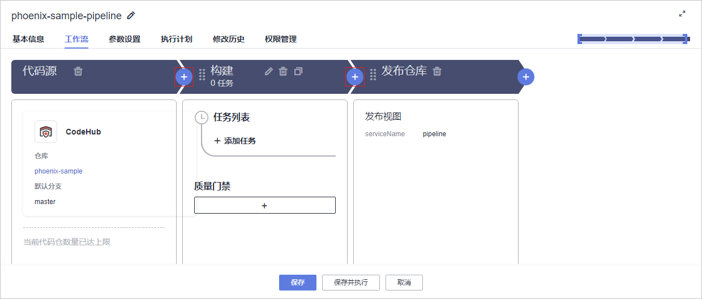
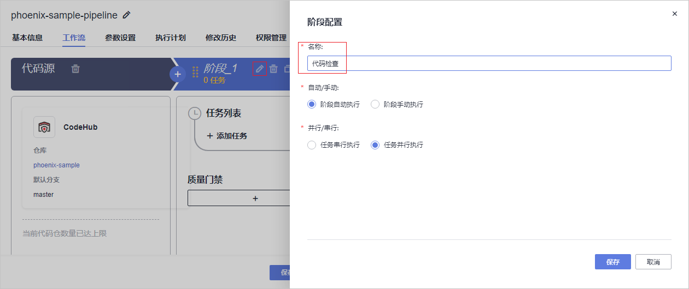
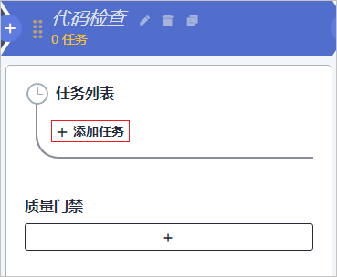
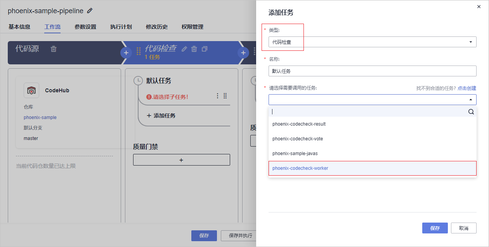
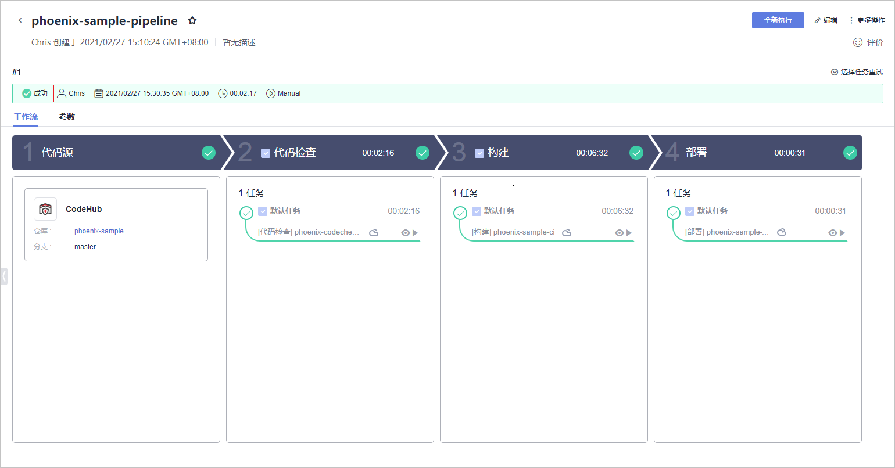
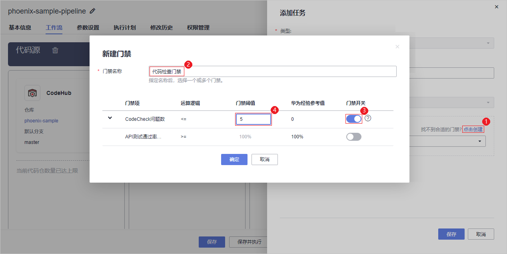
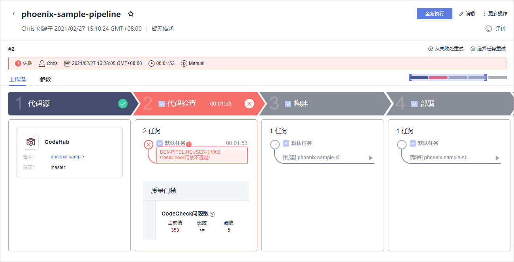
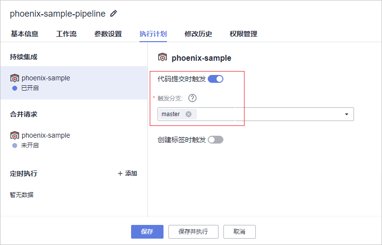

# 步骤八：配置流水线，实现持续交付

[流水线](https://www.huaweicloud.com/product/cloudpipeline.html)提供可视化、可定制的自动交付流水线，支持代码检查、编译构建、部署等多种任务类型。

随着项目的进行，各个环节（构建、发布、部署）越来越标准化。但是每个环节都相对独立，是半成品，不能交付业务价值。将每一个环节有效的串联起来形成一套完整的持续交付流水线，才能够真正提高软件的发布效率与质量，持续不断的创造业务价值。

通过本章节，您将了解开发人员Chris如何使用流水线服务将代码检查、编译构建、部署任务串联起来，实现持续交付。

## 预置流水线简介

样例项目中预置了如[表1](#table11691548568)所示的5个流水线任务，可根据需要查看并使用。

**表 1**  预置流水线任务

<table><thead align="left"><tr id="row51691481065"><th class="cellrowborder" valign="top" width="25%" id="mcps1.2.3.1.1">
预置流水线任务

</th>
<th class="cellrowborder" valign="top" width="75%" id="mcps1.2.3.1.2">
任务说明

</th>
</tr>
</thead>
<tbody><tr id="row27811623104211"><td class="cellrowborder" valign="top" width="25%" headers="mcps1.2.3.1.1 ">
phoenix-workflow

</td>
<td class="cellrowborder" valign="top" width="75%" headers="mcps1.2.3.1.2 ">
基本的流水线任务。

</td>
</tr>
<tr id="row1563171711427"><td class="cellrowborder" valign="top" width="25%" headers="mcps1.2.3.1.1 ">
phoenix-workflow-test

</td>
<td class="cellrowborder" valign="top" width="75%" headers="mcps1.2.3.1.2 ">
测试环境对应的流水线任务。

</td>
</tr>
<tr id="row10169164815619"><td class="cellrowborder" valign="top" width="25%" headers="mcps1.2.3.1.1 ">
phoenix-workflow-work

</td>
<td class="cellrowborder" valign="top" width="75%" headers="mcps1.2.3.1.2 ">
Worker功能对应的流水线任务。

</td>
</tr>
<tr id="row1217014480615"><td class="cellrowborder" valign="top" width="25%" headers="mcps1.2.3.1.1 ">
phoenix-workflow-result

</td>
<td class="cellrowborder" valign="top" width="75%" headers="mcps1.2.3.1.2 ">
Result功能对应的流水线任务。

</td>
</tr>
<tr id="row31709481564"><td class="cellrowborder" valign="top" width="25%" headers="mcps1.2.3.1.1 ">
phoenix-workflow-vote

</td>
<td class="cellrowborder" valign="top" width="75%" headers="mcps1.2.3.1.2 ">
Vote功能对应的流水线任务。

</td>
</tr>
</tbody>
</table>

> **说明：** 
>关于Vote、Result、Worker的说明，请参见[HE2E DevOps实践介绍](HE2E-DevOps实践介绍.md)。

## 配置并执行流水线

为了更好地介绍流水线服务的操作流程，本章节将创建全新的流水线。

流水线通常由多个阶段构成，例如代码检查阶段、构建阶段等。每个阶段中可以添加多个子任务，并可以配置阶段下子任务是串行还是并行执行。

1.  创建流水线。
    1.  进入“凤凰商城“项目，单击页面上方导航“构建&发布  \>  流水线“。
    2.  单击“新建流水线“，参照[表2](#table14338143917249)配置流水线。

        **表 2**  流水线配置

        
        <table><thead align="left"><tr id="row1233973942414"><th class="cellrowborder" valign="top" width="20%" id="mcps1.2.3.1.1">
配置项

        </th>
        <th class="cellrowborder" valign="top" width="80%" id="mcps1.2.3.1.2">
配置建议

        </th>
        </tr>
        </thead>
        <tbody><tr id="row1967611349169"><td class="cellrowborder" valign="top" width="20%" headers="mcps1.2.3.1.1 ">
选择代码源

        </td>
        <td class="cellrowborder" valign="top" width="80%" headers="mcps1.2.3.1.2 ">
依次选择代码源“CodeHub”、仓库“phoenix-sample”、默认分支“master”。

        </td>
        </tr>
        <tr id="row8339143910244"><td class="cellrowborder" valign="top" width="20%" headers="mcps1.2.3.1.1 ">
选择模板

        </td>
        <td class="cellrowborder" valign="top" width="80%" headers="mcps1.2.3.1.2 ">
选择“不使用模板，直接创建”。

        </td>
        </tr>
        </tbody>
        </table>

    3.  单击页面左上角，输入流水线名称“phoenix-sample-pipeline“。
    4.  分别单击构建阶段前后的，添加两个流水线阶段，如[图1](#fig5105182311468)所示。

        **图 1**  添加流水线阶段  
        

    5.  单击“阶段\_1“中的图标，在右侧滑出框中输入名称“代码检查“，单击“保存“，如[图2](#fig13792114719313)所示。

        **图 2**  编辑流水线阶段名称  
        

    6.  按照同样的方式，将“阶段\_2“命名为“部署“。
    7.  在代码检查阶段中添加代码检查任务。
        1.  单击阶段“代码检查“中“添加任务“，如[图3](#fig4693325181819)所示。

            **图 3**  添加任务  
            

        2.  在右侧滑出框中，类型选择“代码检查“，并选择代码检查任务“phoenix-codecheck-worker“，单击“保存“，如[图4](#fig146065181717)所示。

            **图 4**  选择代码检查任务  
            

    8.  按照同样的方式，添加在构建阶段添加子任务“phoenix-sample-ci“，在部署阶段添加子任务“phoenix-sample-standalone“。
    9.  单击“保存“，完成流水线的创建，页面自动跳转至任务详情页。

2.  执行流水线。

    单击“全新执行“，启动流水线（若有弹框，请根据实际情况填写配置项，并直接单击“执行“）。

    流水线执行耗时约5\~8分钟，当出现如[图5](#fig21831584439)所示的页面时，表示任务执行成功。

    若任务执行失败，请于执行失败处检查失败原因（如：部署阶段执行失败，则进入部署任务查看部署日志，结合[附录](附录.md)排查失败原因），或参照[流水线服务常见问题](https://support.huaweicloud.com/pipeline_faq/pipeline_faq_0001.html)排查。

    **图 5**  流水线执行成功  
    

## 配置质量门禁

为了控制代码的质量，代码必须经过扫描，并且错误数量控制在合理范围内，才允许发布。通过添加质量门禁可以有效的自动化控制流程。

通过[步骤五：检查项目代码](步骤五-检查项目代码.md)可知，代码检查问题数有11个。若在流水线中添加代码检查门禁，并将门禁阈值设置为小于11，则流水线将会执行失败。

1.  在流水线任务“phoenix-sample-pipeline“详情页，单击页面右上角“编辑“。
2.  在阶段“代码检查“，单击“质量门禁“处的图标。
3.  添加质量门禁，如[图6](#fig8523120173816)所示。

    1.  在页面右侧滑框中，单击“点击创建“。
    2.  在弹框中输入名称“代码检查门禁“。
    3.  打开“CodeCheck问题数“开关。
    4.  输入门禁阈值“5“，单击“保存“。

    **图 6**  新建门禁  
    

4.  在“门禁“下拉列表中选择在[上一步](#li132741342917)中创建的“代码检查门禁“，单击“保存“。
5.  保存流水线，并启动流水线任务。

    由于代码检查问题数为11，大于门禁阈值，因此待任务执行结束可观察到，流水线任务执行失败，如[图7](#fig1098046153711)所示。

    **图 7**  流水线执行失败  
    

## 配置代码变更自动触发流水线

通过以下配置，可实现代码变更自动触发流水线执行，从而实现项目的持续交付。

1.  在流水线任务“phoenix-sample-pipeline“详情页，单击页面右上角“编辑“。
2.  选择“执行计划“页签，页面默认显示“持续集成“页面。打开“代码提交时触发“开关，并选择触发分支“master“，单击“保存“，如[图8](#fig8826136151815)所示。

    **图 8**  配置持续集成  
    

3.  验证配置结果：修改项目代码并推送至master（代码开发方式请参考[步骤四：开发项目代码](步骤四-开发项目代码.md)，本节不再赘述），即可查看流水线是否自动执行。

