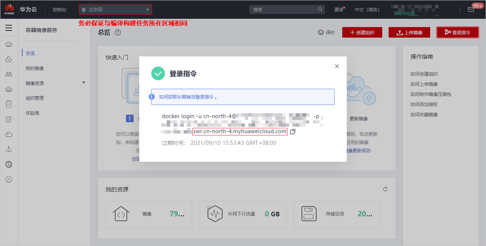
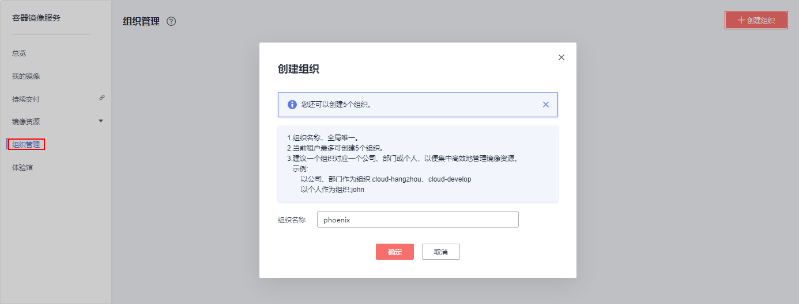
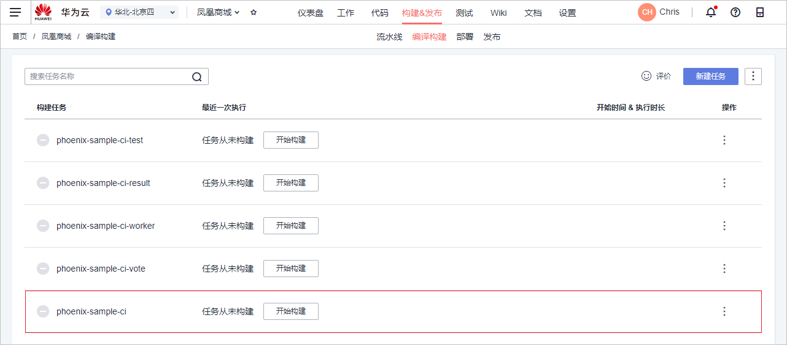
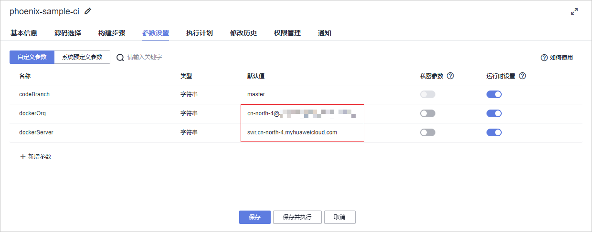
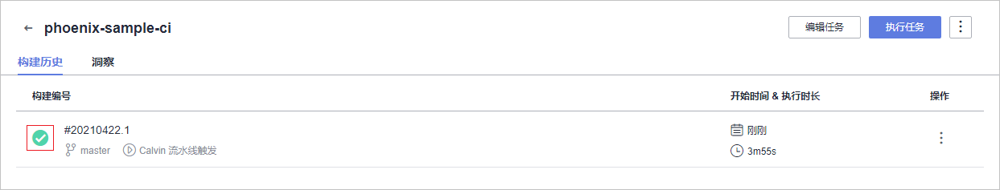
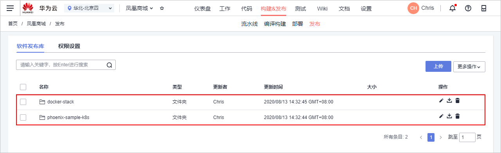
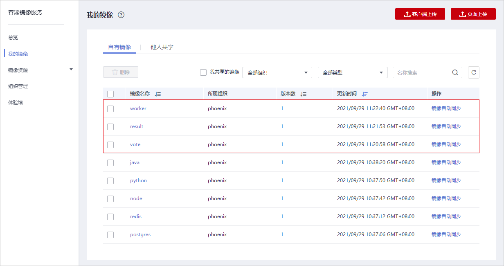
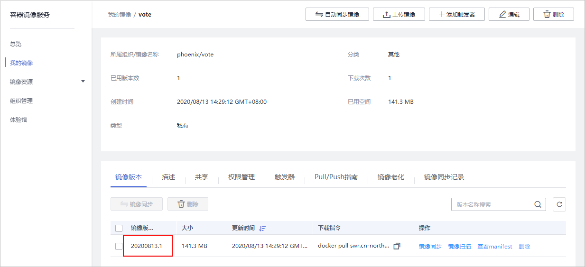
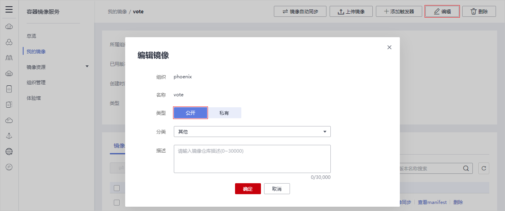
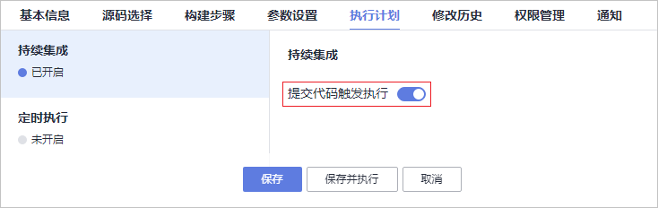

# 步骤六：构建应用

[编译构建](https://www.huaweicloud.com/product/cloudbuild.html)提供配置简单的混合语言构建平台，支持任务一键创建、配置和执行，实现获取代码、构建、打包等活动自动化。

通过本章节，您将了解开发人员Chris如何使用编译构建服务构建环境镜像、将代码编译打包成软件包，以及通过代码变更触发自动构建来实现持续集成。

## 预置编译构建任务简介

样例项目中预置了如[表1](#table11691548568)所示的5个编译构建任务。

**表 1**  预置编译构建任务

<table><thead align="left"><tr id="row51691481065"><th class="cellrowborder" valign="top" width="25%" id="mcps1.2.3.1.1">
预置编译构建任务

</th>
<th class="cellrowborder" valign="top" width="75%" id="mcps1.2.3.1.2">
任务说明

</th>
</tr>
</thead>
<tbody><tr id="row27811623104211"><td class="cellrowborder" valign="top" width="25%" headers="mcps1.2.3.1.1 ">
phoenix-sample-ci

</td>
<td class="cellrowborder" valign="top" width="75%" headers="mcps1.2.3.1.2 ">
基本的编译构建任务。

</td>
</tr>
<tr id="row1563171711427"><td class="cellrowborder" valign="top" width="25%" headers="mcps1.2.3.1.1 ">
phoenix-sample-ci-test

</td>
<td class="cellrowborder" valign="top" width="75%" headers="mcps1.2.3.1.2 ">
测试环境对应的编译构建任务。

</td>
</tr>
<tr id="row10169164815619"><td class="cellrowborder" valign="top" width="25%" headers="mcps1.2.3.1.1 ">
phoenix-sample-ci-worker

</td>
<td class="cellrowborder" valign="top" width="75%" headers="mcps1.2.3.1.2 ">
Worker功能对应的编译构建任务。

</td>
</tr>
<tr id="row1217014480615"><td class="cellrowborder" valign="top" width="25%" headers="mcps1.2.3.1.1 ">
phoenix-sample-ci-result

</td>
<td class="cellrowborder" valign="top" width="75%" headers="mcps1.2.3.1.2 ">
Result功能对应的编译构建任务。

</td>
</tr>
<tr id="row31709481564"><td class="cellrowborder" valign="top" width="25%" headers="mcps1.2.3.1.1 ">
phoenix-sample-ci-vote

</td>
<td class="cellrowborder" valign="top" width="75%" headers="mcps1.2.3.1.2 ">
Vote功能对应的编译构建任务。

</td>
</tr>
</tbody>
</table>

> **说明：** 
>关于Vote、Result、Worker的说明，请参见[HE2E DevOps实践介绍](HE2E-DevOps实践介绍.md)。

本章节以任务“phoenix-sample-ci“为例进行讲解，此任务包含的步骤如[表2](#table17741181817204)所示。

**表 2**  构建步骤

<table><thead align="left"><tr id="row1774141842016"><th class="cellrowborder" valign="top" width="25%" id="mcps1.2.3.1.1">
<strong id="b1874116182208">构建步骤</strong>

</th>
<th class="cellrowborder" valign="top" width="75%" id="mcps1.2.3.1.2">
<strong id="b12741111872015">说明</strong>

</th>
</tr>
</thead>
<tbody><tr id="row3741818172018"><td class="cellrowborder" valign="top" width="25%" headers="mcps1.2.3.1.1 ">
制作Vote镜像并推送到SWR仓库

</td>
<td class="cellrowborder" valign="top" width="75%" headers="mcps1.2.3.1.2 ">
通过路径工作目录“./vote”及Dockerfile路径“./Dockerfile”找到“Dockerfile”文件，依据“Dockerfile”文件制作并推送Vote功能镜像。

</td>
</tr>
<tr id="row15741101822019"><td class="cellrowborder" valign="top" width="25%" headers="mcps1.2.3.1.1 ">
制作Result镜像并推送到SWR仓库

</td>
<td class="cellrowborder" valign="top" width="75%" headers="mcps1.2.3.1.2 ">
通过路径工作目录“./result”及Dockerfile路径“./Dockerfile”找到“Dockerfile”文件，依据“Dockerfile”文件制作并推送Result功能镜像。

</td>
</tr>
<tr id="row6741121815206"><td class="cellrowborder" valign="top" width="25%" headers="mcps1.2.3.1.1 ">
使用Maven安装Worker依赖包

</td>
<td class="cellrowborder" valign="top" width="75%" headers="mcps1.2.3.1.2 ">
使用Maven安装Worker功能所需的依赖。

</td>
</tr>
<tr id="row12741141892014"><td class="cellrowborder" valign="top" width="25%" headers="mcps1.2.3.1.1 ">
制作Worker镜像并推送到SWR仓库

</td>
<td class="cellrowborder" valign="top" width="75%" headers="mcps1.2.3.1.2 ">
通过路径工作目录“./worker”及Dockerfile路径“Dockerfile.j2”找到“Dockerfile”文件，依据“Dockerfile”文件制作并推送Worker功能镜像。

</td>
</tr>
<tr id="row274113183204"><td class="cellrowborder" valign="top" width="25%" headers="mcps1.2.3.1.1 ">
生成Postgres and Redis Dockerfile

</td>
<td class="cellrowborder" valign="top" width="75%" headers="mcps1.2.3.1.2 ">
通过Shell命令生成Postgres和Redis的Dockerfile文件。Redis和Postgres分别是缓存和数据库。

</td>
</tr>
<tr id="row15741171852019"><td class="cellrowborder" valign="top" width="25%" headers="mcps1.2.3.1.1 ">
制作Postgres镜像并推送到SWR仓库

</td>
<td class="cellrowborder" valign="top" width="75%" headers="mcps1.2.3.1.2 ">
通过工作目录“.”及Dockerfile路径“./Dockerfile-postgres”找到“Dockerfile”文件，依据“Dockerfile”文件制作并推送Postgres镜像。

</td>
</tr>
<tr id="row18741418162019"><td class="cellrowborder" valign="top" width="25%" headers="mcps1.2.3.1.1 ">
制作Redis镜像并推送到SWR仓库

</td>
<td class="cellrowborder" valign="top" width="75%" headers="mcps1.2.3.1.2 ">
通过工作目录“.”及Dockerfile路径“./Dockerfile-redis”找到“Dockerfile”文件，依据“Dockerfile”文件制作并推送Redis功能镜像。

</td>
</tr>
<tr id="row157411518142015"><td class="cellrowborder" valign="top" width="25%" headers="mcps1.2.3.1.1 ">
替换Docker-Compose部署文件镜像版本

</td>
<td class="cellrowborder" valign="top" width="75%" headers="mcps1.2.3.1.2 ">
首先，将文件“docker-compose-standalone.yml”中的以下参数“docker-server”、“docker-org”、“image-version”依次用构建任务当中的参数“dockerServer”、“dockerOrg”、“BuildNumbe”“r”进行替换，以便后续进行ECS部署时可以拉取到正确的镜像。

然后，使用tar命令将文件“docker-compose-standalone.yml”压缩为“docker-stack.tar.gz”，将部署所需文件进行打包，以便于后续步骤将该文件上传归档。

</td>
</tr>
<tr id="row174241842014"><td class="cellrowborder" valign="top" width="25%" headers="mcps1.2.3.1.1 ">
替换Kubernetes部署文件镜像版本

</td>
<td class="cellrowborder" valign="top" width="75%" headers="mcps1.2.3.1.2 ">
首先，将在目录“kompose”下，所有以“deployment”结尾的文件中，参数“docker-server”、“docker-org”、“image-version”依次用构建任务当中的参数“dockerServer”、“dockerOrg”、“BuildNumber”进行替换，以便后续进行CCE部署时可以拉取到正确的镜像。

然后，使用tar命令将整个“kompose”目录压缩为“phoenix-sample-k8s.tar.gz”，将部署所需文件进行打包，以便于后续步骤将该文件上传归档。

</td>
</tr>
<tr id="row47421718112012"><td class="cellrowborder" valign="top" width="25%" headers="mcps1.2.3.1.1 ">
上传Kubernetes部署文件到软件发布库

</td>
<td class="cellrowborder" valign="top" width="75%" headers="mcps1.2.3.1.2 ">
将之前压缩好的“phoenix-sample-k8s.tar.gz”（构建包路径）上传到软件发布库中归档，包名命名为“phoenix-sample-k8s”，实现软件包的版本管理。

</td>
</tr>
<tr id="row974211862012"><td class="cellrowborder" valign="top" width="25%" headers="mcps1.2.3.1.1 ">
上传docker-compose部署文件到软件发布库

</td>
<td class="cellrowborder" valign="top" width="75%" headers="mcps1.2.3.1.2 ">
将之前压缩好的“docker-stack.tar.gz”（构建包路径）上传到软件发布库中归档，包名命名为“docker-stack”，实现软件包的版本管理。

</td>
</tr>
</tbody>
</table>

> **说明：** 
>在项目部署过程中，经常遇到由于环境不一致而导致的失败，例如研发调试环境的JDK升级后，未在环境清单中标记清楚，导致生产环境未做相应升级而引发失败。为了避免因为环境不一致导致的各种问题，本样例项目中统一使用Docker的方式将各微服务应用与环境统一打包到镜像，保持每个环境（开发调测环境、测试环境、QA环境、生产环境）一致。

## 配置并执行编译构建任务

本文档使用[容器镜像服务SWR](https://www.huaweicloud.com/product/swr.html)来保存环境镜像，因此需要首先配置SWR服务，然后配置编译构建任务。

1.  配置SWR服务。
    1.  登录[容器镜像服务控制台](https://console.huaweicloud.com/swr/?region=#/app/dashboard)。

        请检查页面左上方的“区域“列表，请确保与编译构建任务所在区相同的区域。若区域不同，请选择相同区域。

    2.  单击“登录指令“，页面弹框显示登录指令，如[图1](#fig1875621154711)所示。

        其中，

        -   **-u**之后的字符串为用户名。
        -   **-p**之后的字符串为密码。
        -   最后的字符串为SWR服务器地址，此地址即为后续[配置编译构建任务](#li950515309458)中的参数“dockerServer“。

        **图 1**  docker login指令  
        

        > **说明：** 
        >此处生成的登录指令为临时登录指令，有效期为24小时。若需要长期有效的登录指令，请参见[获取长期有效登录指令](https://support.huaweicloud.com/usermanual-swr/swr_01_1000.html)。

    3.  单击“创建组织“，在弹框中输入组织名称“phoenix“（或自定义，此名称全局唯一），单击“确定“保存，如[图2](#fig13711920154811)所示。

        这里的组织名称，即为后续[配置编译构建任务](#li950515309458)中的参数“dockerOrg“。

        **图 2**  创建组织  
        

2.  配置编译构建任务。
    1.  进入“凤凰商城“项目，单击页面上方导航“构建&发布  \>  编译构建“，页面将显示样例项目自动创建的5个编译构建任务。在列表中找到任务“phoenix-sample-ci“，如[图3](#fig4130418134813)所示。

        **图 3**  编译构建  
        

    2.  单击图标，在下拉列表中单击“编辑“进入编辑页面，选择“参数设置“页签。
    3.  参照[表3](#table0554103510449)编辑参数值，如[图4](#fig4380131514486)所示。

        **表 3**  参数设置

        
        <table><thead align="left"><tr id="row1555203519444"><th class="cellrowborder" valign="top" width="20%" id="mcps1.2.3.1.1">
参数名称

        </th>
        <th class="cellrowborder" valign="top" width="80%" id="mcps1.2.3.1.2">
参数值

        </th>
        </tr>
        </thead>
        <tbody><tr id="row1492415612477"><td class="cellrowborder" valign="top" width="20%" headers="mcps1.2.3.1.1 ">
codeBranch

        </td>
        <td class="cellrowborder" valign="top" width="80%" headers="mcps1.2.3.1.2 ">
保持默认值。

        </td>
        </tr>
        <tr id="row165559356445"><td class="cellrowborder" valign="top" width="20%" headers="mcps1.2.3.1.1 ">
dockerOrg

        </td>
        <td class="cellrowborder" valign="top" width="80%" headers="mcps1.2.3.1.2 ">
输入在<a href="#li181937383409">配置SWR服务</a>中创建的组织。

        </td>
        </tr>
        <tr id="row95552035154411"><td class="cellrowborder" valign="top" width="20%" headers="mcps1.2.3.1.1 ">
dockerServer

        </td>
        <td class="cellrowborder" valign="top" width="80%" headers="mcps1.2.3.1.2 ">
输入在<a href="#li181937383409">配置SWR服务</a>中记录的SWR服务器地址。

        </td>
        </tr>
        </tbody>
        </table>

        **图 4**  参数设置  
        

        > **说明：** 
        >请务必确保参数“dockerOrg“、“dockerServer“的输入值是正确的，否则将导致任务失败。

    4.  单击“保存“，完成编译构建任务的编辑。页面自动跳转至任务详情页。

3.  执行编译构建任务。

    单击“开始构建“，启动编译构建任务。

    任务执行耗时约4\~5分钟，当页面中显示时，表示任务执行成功完，如[图5](#fig325475117110)所示。

    请记录“构建编号“对应的数字串，在后续[检查发布件](#li840154826)查看镜像详情中，镜像版本即此数字串。

    若构建失败，请仔细检查参数“dockerOrg“、“dockerServer“的设置是否正确。

    **图 5**  构建成功  
    

4.  检查发布件。
    1.  单击页面上方导航“构建&发布  \>  发布“，进入发布服务。

        列表中可找到下图所示的两个文件夹，如[图6](#fig785112911487)所示。

        **图 6**  软件发布库  
        

    2.  进入SWR控制台，在页面左侧导航选择“我的镜像“。

        列表中可看到5个镜像（redis、postgres、worker、result、vote），镜像的所属组织为[配置SWR服务](#li181937383409)中创建的组织，版本数如[图7](#fig1862037194811)所示。

        **图 7**  我的镜像  
        

    3.  在列表中单击“vote“查看镜像详情。

        在页面下方“镜像版本“页签中找到最新版本镜像，如[图8](#fig4750414817)所示，镜像版本与最新一次构建任务的构建编号一致，构建编号r的查看方法请参考[执行编译构建任务](#li9600193411818)。

        **图 8**  vote镜像  
        

    4.  单击页面右上角“编辑“，在弹框中选择“公开“，单击“确定“，如[图9](#fig5182173319616)所示。

        按照同样方式将其它四个镜像设置为公开镜像。

        **图 9**  编辑镜像类型  
        

## 设置提交代码触发自动编译

通过以下配置，可实现代码变更后自动触发应用编译构建任务的执行，从而实现项目的持续集成。

1.  在编译构建任务“phoenix-sample-ci“的详情页，单击页面右上角“编辑任务“。
2.  选择“执行计划“页签，页面默认显示“持续集成“页面。
3.  打开“提交代码触发执行“开关，如[图10](#fig11150759104714)所示。

    由于在参数设置页面为参数codeBranch配置的默认值为“master“，因此本次设置的结果是当master有代码变更时自动触发构建。

    **图 10**  持续集成  
    

4.  验证配置结果：修改项目代码并提交至master（代码开发方式请参考[步骤四：开发项目代码](步骤四-开发项目代码.md)，本节不再赘述），即可查看编译构建任务是否自动执行。

## 设置定时执行编译构建任务

为了防止问题代码进入生产环境，确保应用总是处于可部署的状态，团队建议对应用进行持续不断的验证。

通过以下设置，可实现编译构建任务的定时执行。

1.  在编译构建任务“phoenix-sample-ci“的详情页，单击页面右上角“编辑任务“。
2.  选择“执行计划“页签，在左侧导航中单击“定时执行“。
3.  打开“启用定时执行“开关，根据需要选择执行日与执行时间，单击“保存“。

    本文档中勾选“全选“，执行时间为“12:00“，如[图11](#fig787218185476)所示。

    **图 11**  设置定时执行  
    

4.  验证配置结果：根据配置时间查看编译构建任务是否自动执行，本节不再赘述。

