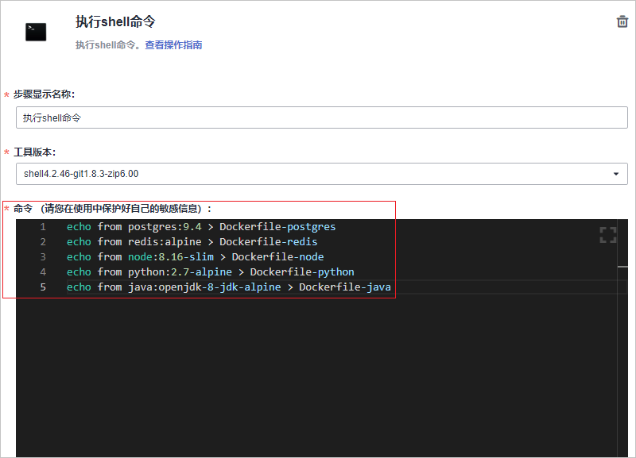
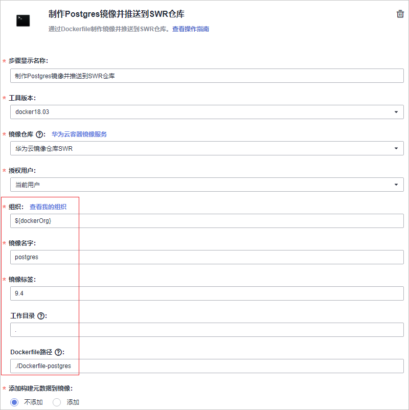
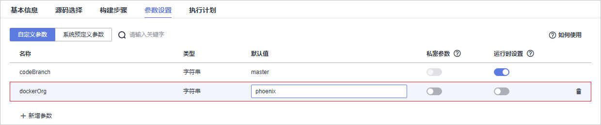
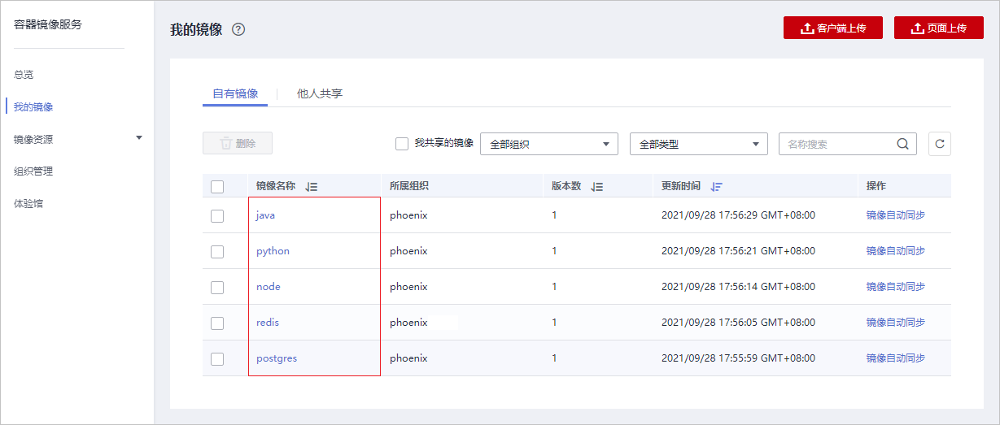
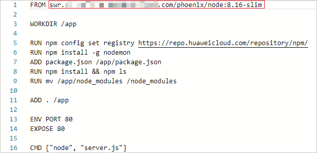
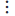
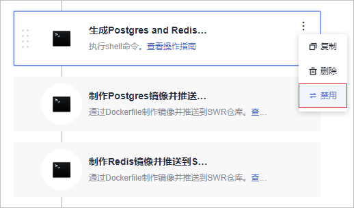
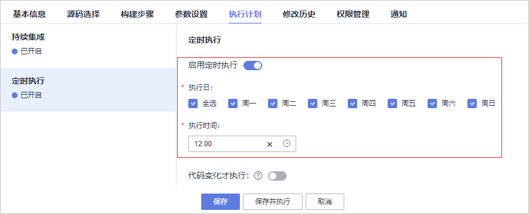

# 步骤六：构建应用<a name="ZH-CN_TOPIC_0162964259"></a>

[编译构建](https://www.huaweicloud.com/product/cloudbuild.html)提供配置简单的混合语言构建平台，支持任务一键创建、配置和执行，实现获取代码、构建、打包等活动自动化。

通过本章节，您将了解开发人员Chris如何使用编译构建服务构建环境镜像、将代码编译打包成软件包，以及通过代码变更触发自动构建来实现持续集成。

## 预置编译构建任务简介<a name="section51797270"></a>

样例项目中预置了如[表1](#table11691548568)所示的5个编译构建任务。

**表 1**  预置编译构建任务

<a name="table11691548568"></a>
<table><thead align="left"><tr id="row51691481065"><th class="cellrowborder" valign="top" width="25%" id="mcps1.2.3.1.1"><p id="p31694485618"><a name="p31694485618"></a><a name="p31694485618"></a>预置编译构建任务</p>
</th>
<th class="cellrowborder" valign="top" width="75%" id="mcps1.2.3.1.2"><p id="p7169194811614"><a name="p7169194811614"></a><a name="p7169194811614"></a>任务说明</p>
</th>
</tr>
</thead>
<tbody><tr id="row27811623104211"><td class="cellrowborder" valign="top" width="25%" headers="mcps1.2.3.1.1 "><p id="p89521428144220"><a name="p89521428144220"></a><a name="p89521428144220"></a>phoenix-sample-ci</p>
</td>
<td class="cellrowborder" valign="top" width="75%" headers="mcps1.2.3.1.2 "><p id="p1195292814216"><a name="p1195292814216"></a><a name="p1195292814216"></a>基本的编译构建任务。</p>
</td>
</tr>
<tr id="row1563171711427"><td class="cellrowborder" valign="top" width="25%" headers="mcps1.2.3.1.1 "><p id="p51706487612"><a name="p51706487612"></a><a name="p51706487612"></a>phoenix-sample-ci-test</p>
</td>
<td class="cellrowborder" valign="top" width="75%" headers="mcps1.2.3.1.2 "><p id="p7170114816618"><a name="p7170114816618"></a><a name="p7170114816618"></a>测试环境对应的编译构建任务。</p>
</td>
</tr>
<tr id="row10169164815619"><td class="cellrowborder" valign="top" width="25%" headers="mcps1.2.3.1.1 "><p id="p19452114274112"><a name="p19452114274112"></a><a name="p19452114274112"></a>phoenix-sample-ci-worker</p>
</td>
<td class="cellrowborder" valign="top" width="75%" headers="mcps1.2.3.1.2 "><p id="p717017481762"><a name="p717017481762"></a><a name="p717017481762"></a>Worker功能对应的编译构建任务。</p>
</td>
</tr>
<tr id="row1217014480615"><td class="cellrowborder" valign="top" width="25%" headers="mcps1.2.3.1.1 "><p id="p517015481762"><a name="p517015481762"></a><a name="p517015481762"></a>phoenix-sample-ci-result</p>
</td>
<td class="cellrowborder" valign="top" width="75%" headers="mcps1.2.3.1.2 "><p id="p111708481361"><a name="p111708481361"></a><a name="p111708481361"></a>Result功能对应的编译构建任务。</p>
</td>
</tr>
<tr id="row31709481564"><td class="cellrowborder" valign="top" width="25%" headers="mcps1.2.3.1.1 "><p id="p117064813612"><a name="p117064813612"></a><a name="p117064813612"></a>phoenix-sample-ci-vote</p>
</td>
<td class="cellrowborder" valign="top" width="75%" headers="mcps1.2.3.1.2 "><p id="p111704485610"><a name="p111704485610"></a><a name="p111704485610"></a>Vote功能对应的编译构建任务。</p>
</td>
</tr>
</tbody>
</table>

> **说明：** 
>关于Vote、Result、Worker的说明，请参见[HE2E DevOps实践介绍](zh-cn_topic_0162964253.md)。

本章节以任务“phoenix-sample-ci“为例进行讲解，此任务包含的步骤如[表2](#table17741181817204)所示。

**表 2**  构建步骤

<a name="table17741181817204"></a>
<table><thead align="left"><tr id="row1774141842016"><th class="cellrowborder" valign="top" width="25%" id="mcps1.2.3.1.1"><p id="p15741818152011"><a name="p15741818152011"></a><a name="p15741818152011"></a><strong id="b1874116182208"><a name="b1874116182208"></a><a name="b1874116182208"></a>构建步骤</strong></p>
</th>
<th class="cellrowborder" valign="top" width="75%" id="mcps1.2.3.1.2"><p id="p874121832010"><a name="p874121832010"></a><a name="p874121832010"></a><strong id="b12741111872015"><a name="b12741111872015"></a><a name="b12741111872015"></a>说明</strong></p>
</th>
</tr>
</thead>
<tbody><tr id="row3741818172018"><td class="cellrowborder" valign="top" width="25%" headers="mcps1.2.3.1.1 "><p id="p12741101818201"><a name="p12741101818201"></a><a name="p12741101818201"></a>制作Vote镜像并推送到SWR仓库</p>
</td>
<td class="cellrowborder" valign="top" width="75%" headers="mcps1.2.3.1.2 "><p id="p1174117184204"><a name="p1174117184204"></a><a name="p1174117184204"></a>通过路径工作目录<span class="parmvalue" id="parmvalue973554618331"><a name="parmvalue973554618331"></a><a name="parmvalue973554618331"></a>“./vote”</span>及Dockerfile路径<span class="parmvalue" id="parmvalue73343574330"><a name="parmvalue73343574330"></a><a name="parmvalue73343574330"></a>“./Dockerfile”</span>找到<span class="parmvalue" id="parmvalue748465292615"><a name="parmvalue748465292615"></a><a name="parmvalue748465292615"></a>“Dockerfile”</span>文件，依据<span class="parmvalue" id="parmvalue12884565266"><a name="parmvalue12884565266"></a><a name="parmvalue12884565266"></a>“Dockerfile”</span>文件制作并推送Vote功能镜像。</p>
</td>
</tr>
<tr id="row15741101822019"><td class="cellrowborder" valign="top" width="25%" headers="mcps1.2.3.1.1 "><p id="p137411718122013"><a name="p137411718122013"></a><a name="p137411718122013"></a>制作Result镜像并推送到SWR仓库</p>
</td>
<td class="cellrowborder" valign="top" width="75%" headers="mcps1.2.3.1.2 "><p id="p774191811204"><a name="p774191811204"></a><a name="p774191811204"></a>通过路径工作目录<span class="parmvalue" id="parmvalue9293481346"><a name="parmvalue9293481346"></a><a name="parmvalue9293481346"></a>“./result”</span>及Dockerfile路径<span class="parmvalue" id="parmvalue870264417342"><a name="parmvalue870264417342"></a><a name="parmvalue870264417342"></a>“./Dockerfile”</span>找到<span class="parmvalue" id="parmvalue139104196299"><a name="parmvalue139104196299"></a><a name="parmvalue139104196299"></a>“Dockerfile”</span>文件，依据<span class="parmvalue" id="parmvalue203571227162917"><a name="parmvalue203571227162917"></a><a name="parmvalue203571227162917"></a>“Dockerfile”</span>文件制作并推送Result功能镜像。</p>
</td>
</tr>
<tr id="row6741121815206"><td class="cellrowborder" valign="top" width="25%" headers="mcps1.2.3.1.1 "><p id="p574191814209"><a name="p574191814209"></a><a name="p574191814209"></a>使用Maven安装Worker依赖包</p>
</td>
<td class="cellrowborder" valign="top" width="75%" headers="mcps1.2.3.1.2 "><p id="p11741111812207"><a name="p11741111812207"></a><a name="p11741111812207"></a>使用Maven安装Worker功能所需的依赖。</p>
</td>
</tr>
<tr id="row12741141892014"><td class="cellrowborder" valign="top" width="25%" headers="mcps1.2.3.1.1 "><p id="p13741151811202"><a name="p13741151811202"></a><a name="p13741151811202"></a>制作Worker镜像并推送到SWR仓库</p>
</td>
<td class="cellrowborder" valign="top" width="75%" headers="mcps1.2.3.1.2 "><p id="p177414189206"><a name="p177414189206"></a><a name="p177414189206"></a>通过路径工作目录<span class="parmvalue" id="parmvalue14214105273411"><a name="parmvalue14214105273411"></a><a name="parmvalue14214105273411"></a>“./worker”</span>及Dockerfile路径<span class="parmvalue" id="parmvalue379759153520"><a name="parmvalue379759153520"></a><a name="parmvalue379759153520"></a>“Dockerfile.j2”</span>找到<span class="parmvalue" id="parmvalue25041988306"><a name="parmvalue25041988306"></a><a name="parmvalue25041988306"></a>“Dockerfile”</span>文件，依据<span class="parmvalue" id="parmvalue1926211119306"><a name="parmvalue1926211119306"></a><a name="parmvalue1926211119306"></a>“Dockerfile”</span>文件制作并推送Worker功能镜像。</p>
</td>
</tr>
<tr id="row274113183204"><td class="cellrowborder" valign="top" width="25%" headers="mcps1.2.3.1.1 "><p id="p4741618142019"><a name="p4741618142019"></a><a name="p4741618142019"></a>生成Postgres and Redis Dockerfile</p>
</td>
<td class="cellrowborder" valign="top" width="75%" headers="mcps1.2.3.1.2 "><p id="p1674131810204"><a name="p1674131810204"></a><a name="p1674131810204"></a>通过Shell命令生成Postgres和Redis的Dockerfile文件。Redis和Postgres分别是缓存和数据库。</p>
</td>
</tr>
<tr id="row15741171852019"><td class="cellrowborder" valign="top" width="25%" headers="mcps1.2.3.1.1 "><p id="p17741818142015"><a name="p17741818142015"></a><a name="p17741818142015"></a>制作Postgres镜像并推送到SWR仓库</p>
</td>
<td class="cellrowborder" valign="top" width="75%" headers="mcps1.2.3.1.2 "><p id="p1874171814207"><a name="p1874171814207"></a><a name="p1874171814207"></a>通过工作目录<span class="parmvalue" id="parmvalue598169153716"><a name="parmvalue598169153716"></a><a name="parmvalue598169153716"></a>“.”</span>及Dockerfile路径<span class="parmvalue" id="parmvalue16598171873713"><a name="parmvalue16598171873713"></a><a name="parmvalue16598171873713"></a>“./Dockerfile-postgres”</span>找到<span class="parmvalue" id="parmvalue137856546301"><a name="parmvalue137856546301"></a><a name="parmvalue137856546301"></a>“Dockerfile”</span>文件，依据<span class="parmvalue" id="parmvalue852824153115"><a name="parmvalue852824153115"></a><a name="parmvalue852824153115"></a>“Dockerfile”</span>文件制作并推送Postgres镜像。</p>
</td>
</tr>
<tr id="row18741418162019"><td class="cellrowborder" valign="top" width="25%" headers="mcps1.2.3.1.1 "><p id="p15741618152019"><a name="p15741618152019"></a><a name="p15741618152019"></a>制作Redis镜像并推送到SWR仓库</p>
</td>
<td class="cellrowborder" valign="top" width="75%" headers="mcps1.2.3.1.2 "><p id="p874191862013"><a name="p874191862013"></a><a name="p874191862013"></a>通过工作目录<span class="parmvalue" id="parmvalue2054631173712"><a name="parmvalue2054631173712"></a><a name="parmvalue2054631173712"></a>“.”</span>及Dockerfile路径<span class="parmvalue" id="parmvalue1093353983712"><a name="parmvalue1093353983712"></a><a name="parmvalue1093353983712"></a>“./Dockerfile-redis”</span>找到<span class="parmvalue" id="parmvalue1334205893013"><a name="parmvalue1334205893013"></a><a name="parmvalue1334205893013"></a>“Dockerfile”</span>文件，依据<span class="parmvalue" id="parmvalue15142582318"><a name="parmvalue15142582318"></a><a name="parmvalue15142582318"></a>“Dockerfile”</span>文件制作并推送Redis功能镜像。</p>
</td>
</tr>
<tr id="row157411518142015"><td class="cellrowborder" valign="top" width="25%" headers="mcps1.2.3.1.1 "><p id="p07411918182011"><a name="p07411918182011"></a><a name="p07411918182011"></a>替换Docker-Compose部署文件镜像版本</p>
</td>
<td class="cellrowborder" valign="top" width="75%" headers="mcps1.2.3.1.2 "><p id="p37411418112019"><a name="p37411418112019"></a><a name="p37411418112019"></a>首先，将文件<span class="parmvalue" id="parmvalue945476143817"><a name="parmvalue945476143817"></a><a name="parmvalue945476143817"></a>“docker-compose-standalone.yml”</span>中的以下参数<span class="parmname" id="parmname19462334194415"><a name="parmname19462334194415"></a><a name="parmname19462334194415"></a>“docker-server”</span>、<span class="parmname" id="parmname1530113818446"><a name="parmname1530113818446"></a><a name="parmname1530113818446"></a>“docker-org”</span>、<span class="parmname" id="parmname975264144411"><a name="parmname975264144411"></a><a name="parmname975264144411"></a>“image-version”</span>依次用构建任务当中的参数<span class="parmname" id="parmname137981745164410"><a name="parmname137981745164410"></a><a name="parmname137981745164410"></a>“dockerServer”</span>、<span class="parmname" id="parmname13871134844418"><a name="parmname13871134844418"></a><a name="parmname13871134844418"></a>“dockerOrg”</span>、<span class="parmname" id="parmname1795055214416"><a name="parmname1795055214416"></a><a name="parmname1795055214416"></a>“BuildNumbe”</span><span class="parmvalue" id="parmvalue324795217448"><a name="parmvalue324795217448"></a><a name="parmvalue324795217448"></a>“r”</span>进行替换，以便后续进行ECS部署时可以拉取到正确的镜像。</p>
<p id="p1774251819207"><a name="p1774251819207"></a><a name="p1774251819207"></a>然后，使用tar命令将文件<span class="filepath" id="filepath83495313440"><a name="filepath83495313440"></a><a name="filepath83495313440"></a>“docker-compose-standalone.yml”</span>压缩为<span class="parmvalue" id="parmvalue188514634418"><a name="parmvalue188514634418"></a><a name="parmvalue188514634418"></a>“docker-stack.tar.gz”</span>，将部署所需文件进行打包，以便于后续步骤将该文件上传归档。</p>
</td>
</tr>
<tr id="row174241842014"><td class="cellrowborder" valign="top" width="25%" headers="mcps1.2.3.1.1 "><p id="p107429181209"><a name="p107429181209"></a><a name="p107429181209"></a>替换Kubernetes部署文件镜像版本</p>
</td>
<td class="cellrowborder" valign="top" width="75%" headers="mcps1.2.3.1.2 "><p id="p574291819206"><a name="p574291819206"></a><a name="p574291819206"></a>首先，将在目录<span class="filepath" id="filepath1097913479393"><a name="filepath1097913479393"></a><a name="filepath1097913479393"></a>“kompose”</span>下，所有以<span class="parmvalue" id="parmvalue12583938104112"><a name="parmvalue12583938104112"></a><a name="parmvalue12583938104112"></a>“deployment”</span>结尾的文件中，参数<span class="parmname" id="parmname13333155813446"><a name="parmname13333155813446"></a><a name="parmname13333155813446"></a>“docker-server”</span>、<span class="parmname" id="parmname1680510334513"><a name="parmname1680510334513"></a><a name="parmname1680510334513"></a>“docker-org”</span>、<span class="parmname" id="parmname68518914454"><a name="parmname68518914454"></a><a name="parmname68518914454"></a>“image-version”</span>依次用构建任务当中的参数<span class="parmname" id="parmname1357142264517"><a name="parmname1357142264517"></a><a name="parmname1357142264517"></a>“dockerServer”</span>、<span class="parmname" id="parmname106915297454"><a name="parmname106915297454"></a><a name="parmname106915297454"></a>“dockerOrg”</span>、<span class="parmname" id="parmname1746943413459"><a name="parmname1746943413459"></a><a name="parmname1746943413459"></a>“BuildNumber”</span>进行替换，以便后续进行CCE部署时可以拉取到正确的镜像。</p>
<p id="p15742141816209"><a name="p15742141816209"></a><a name="p15742141816209"></a>然后，使用tar命令将整个<span class="filepath" id="filepath5374164711450"><a name="filepath5374164711450"></a><a name="filepath5374164711450"></a>“kompose”</span>目录压缩为<span class="parmvalue" id="parmvalue1566213534453"><a name="parmvalue1566213534453"></a><a name="parmvalue1566213534453"></a>“phoenix-sample-k8s.tar.gz”</span>，将部署所需文件进行打包，以便于后续步骤将该文件上传归档。</p>
</td>
</tr>
<tr id="row47421718112012"><td class="cellrowborder" valign="top" width="25%" headers="mcps1.2.3.1.1 "><p id="p107421181208"><a name="p107421181208"></a><a name="p107421181208"></a>上传Kubernetes部署文件到软件发布库</p>
</td>
<td class="cellrowborder" valign="top" width="75%" headers="mcps1.2.3.1.2 "><p id="p147426184207"><a name="p147426184207"></a><a name="p147426184207"></a>将之前压缩好的<span class="filepath" id="filepath12951254184210"><a name="filepath12951254184210"></a><a name="filepath12951254184210"></a>“phoenix-sample-k8s.tar.gz”</span>（构建包路径）上传到软件发布库中归档，包名命名为<span class="parmvalue" id="parmvalue14511478422"><a name="parmvalue14511478422"></a><a name="parmvalue14511478422"></a>“phoenix-sample-k8s”</span>，实现软件包的版本管理。</p>
</td>
</tr>
<tr id="row974211862012"><td class="cellrowborder" valign="top" width="25%" headers="mcps1.2.3.1.1 "><p id="p9742118202019"><a name="p9742118202019"></a><a name="p9742118202019"></a>上传docker-compose部署文件到软件发布库</p>
</td>
<td class="cellrowborder" valign="top" width="75%" headers="mcps1.2.3.1.2 "><p id="p67421118182019"><a name="p67421118182019"></a><a name="p67421118182019"></a>将之前压缩好的<span class="filepath" id="filepath1765105114315"><a name="filepath1765105114315"></a><a name="filepath1765105114315"></a>“docker-stack.tar.gz”</span>（构建包路径）上传到软件发布库中归档，包名命名为<span class="parmvalue" id="parmvalue0861010184312"><a name="parmvalue0861010184312"></a><a name="parmvalue0861010184312"></a>“docker-stack”</span>，实现软件包的版本管理。</p>
</td>
</tr>
</tbody>
</table>

> **说明：** 
>在项目部署过程中，经常遇到由于环境不一致而导致的失败，例如研发调试环境的JDK升级后，未在环境清单中标记清楚，导致生产环境未做相应升级而引发失败。为了避免因为环境不一致导致的各种问题，本样例项目中统一使用Docker的方式将各微服务应用与环境统一打包到镜像，保持每个环境（开发调测环境、测试环境、QA环境、生产环境）一致。

## 配置SWR服务<a name="section88081731191012"></a>

本文档使用[容器镜像服务SWR](https://www.huaweicloud.com/product/swr.html)来保存环境镜像，需要首先配置SWR服务。

1.  登录[容器镜像服务控制台](https://console.huaweicloud.com/swr/?region=#/app/dashboard)。

    请检查页面左上方的“区域“列表，请确保与编译构建任务所在区相同的区域。若区域不同，请选择相同区域。

2.  单击“登录指令“，页面弹框显示登录指令，如[图1](#fig9754154881015)所示。

    其中，

    -   **-u**之后的字符串为用户名。
    -   **-p**之后的字符串为密码。
    -   最后的字符串为SWR服务器地址，此地址即为后续[配置编译构建任务](#li950515309458)中的参数“dockerServer“。

    **图 1**  docker login指令<a name="fig9754154881015"></a>  
    

    > **说明：** 
    >此处生成的登录指令为临时登录指令，有效期为24小时。若需要长期有效的登录指令，请参见[获取长期有效登录指令](https://support.huaweicloud.com/usermanual-swr/swr_01_1000.html)。

3.  单击“创建组织“，在弹框中输入组织名称“phoenix“（或自定义，此名称全局唯一），单击“确定“保存，如[图2](#fig8754948181018)所示。

    这里的组织名称，即为后续[配置编译构建任务](#li950515309458)中的参数“dockerOrg“。

    **图 2**  创建组织<a name="fig8754948181018"></a>  
    


## 配置基础依赖镜像<a name="section3904192012127"></a>

构建任务中使用的基础镜像源为DockerHub。由于DockerHub的限制，短时间内拉取次数较多时将受限无法拉取，因此可能会造成构建失败。

可以采取本节介绍的方式确保基础镜像源拉取成功。

1.  新建构建任务。
    1.  进入“凤凰商城“项目，单击页面上方导航“构建&发布  \>  编译构建“。
    2.  单击“新建任务“，参照[表3](#table15936325816)配置构建任务，单击“确定“。

        **表 3**  构建任务配置

        <a name="table15936325816"></a>
        <table><thead align="left"><tr id="row1893772288"><th class="cellrowborder" valign="top" width="20%" id="mcps1.2.3.1.1"><p id="p1733916394248"><a name="p1733916394248"></a><a name="p1733916394248"></a>步骤</p>
        </th>
        <th class="cellrowborder" valign="top" width="80%" id="mcps1.2.3.1.2"><p id="p123391739192413"><a name="p123391739192413"></a><a name="p123391739192413"></a>填写/选择建议</p>
        </th>
        </tr>
        </thead>
        <tbody><tr id="row193722188"><td class="cellrowborder" valign="top" width="20%" headers="mcps1.2.3.1.1 "><p id="p12339133918248"><a name="p12339133918248"></a><a name="p12339133918248"></a>选择代码源</p>
        </td>
        <td class="cellrowborder" valign="top" width="80%" headers="mcps1.2.3.1.2 "><p id="p1017914175318"><a name="p1017914175318"></a><a name="p1017914175318"></a>依次选择代码源<span class="parmvalue" id="parmvalue767661183213"><a name="parmvalue767661183213"></a><a name="parmvalue767661183213"></a>“CodeHub”</span>、仓库<span class="parmvalue" id="parmvalue217261193220"><a name="parmvalue217261193220"></a><a name="parmvalue217261193220"></a>“phoenix-sample”</span>、默认分支<span class="parmvalue" id="parmvalue65062028193215"><a name="parmvalue65062028193215"></a><a name="parmvalue65062028193215"></a>“master”</span>。</p>
        </td>
        </tr>
        <tr id="row99379218817"><td class="cellrowborder" valign="top" width="20%" headers="mcps1.2.3.1.1 "><p id="p113397396244"><a name="p113397396244"></a><a name="p113397396244"></a>选择构建模板</p>
        </td>
        <td class="cellrowborder" valign="top" width="80%" headers="mcps1.2.3.1.2 "><p id="p16339639132410"><a name="p16339639132410"></a><a name="p16339639132410"></a>选择<span class="parmvalue" id="parmvalue97321826277"><a name="parmvalue97321826277"></a><a name="parmvalue97321826277"></a>“空白构建模板”</span>。</p>
        </td>
        </tr>
        </tbody>
        </table>

    3.  单击页面左上方，修改任务名称为“phoenix-prebuild“。
    4.  添加1个“执行shell命令“步骤、5个“制作镜像并推送到SWR仓库“步骤，并将后5个步骤的名称分别修改为：“制作Postgres镜像并推送到SWR仓库“、“制作Redis镜像并推送到SWR仓库“、“制作Node镜像并推送到SWR仓库“、“制作Python镜像并推送到SWR仓库“、“制作Java镜像并推送到SWR仓库“，如[图3](#fig1625560153216)所示。

        **图 3**  添加构建步骤<a name="fig1625560153216"></a>  
        

2.  配置构建步骤。
    1.  执行shell命令：删除命令框中的命令行，输入以下命令，如[图4](#fig1053916263217)所示。

        ```
        echo from postgres:9.4 > Dockerfile-postgres
        echo from redis:alpine > Dockerfile-redis
        echo from node:8.16-slim > Dockerfile-node
        echo from python:2.7-alpine > Dockerfile-python
        echo from java:openjdk-8-jdk-alpine > Dockerfile-java
        ```

        **图 4**  执行shell命令<a name="fig1053916263217"></a>  
        

    2.  制作Postgres镜像并推送到SWR仓库：参照[表4](#table834220504254)完成配置，如[图5](#fig115141900263)所示。

        **表 4**  Postgres镜像配置

        <a name="table834220504254"></a>
        <table><thead align="left"><tr id="row1334395012516"><th class="cellrowborder" valign="top" width="25%" id="mcps1.2.3.1.1"><p id="p157871257174019"><a name="p157871257174019"></a><a name="p157871257174019"></a>配置项</p>
        </th>
        <th class="cellrowborder" valign="top" width="75%" id="mcps1.2.3.1.2"><p id="p177871578405"><a name="p177871578405"></a><a name="p177871578405"></a>配置建议</p>
        </th>
        </tr>
        </thead>
        <tbody><tr id="row18343175042512"><td class="cellrowborder" valign="top" width="25%" headers="mcps1.2.3.1.1 "><p id="p163432502256"><a name="p163432502256"></a><a name="p163432502256"></a>组织</p>
        </td>
        <td class="cellrowborder" valign="top" width="75%" headers="mcps1.2.3.1.2 "><p id="p434305092519"><a name="p434305092519"></a><a name="p434305092519"></a>${dockerOrg}</p>
        </td>
        </tr>
        <tr id="row1934315509252"><td class="cellrowborder" valign="top" width="25%" headers="mcps1.2.3.1.1 "><p id="p163431550182512"><a name="p163431550182512"></a><a name="p163431550182512"></a>镜像名字</p>
        </td>
        <td class="cellrowborder" valign="top" width="75%" headers="mcps1.2.3.1.2 "><p id="p634325011255"><a name="p634325011255"></a><a name="p634325011255"></a>postgres</p>
        </td>
        </tr>
        <tr id="row834395022511"><td class="cellrowborder" valign="top" width="25%" headers="mcps1.2.3.1.1 "><p id="p20343050162513"><a name="p20343050162513"></a><a name="p20343050162513"></a>镜像标签</p>
        </td>
        <td class="cellrowborder" valign="top" width="75%" headers="mcps1.2.3.1.2 "><p id="p1334365092515"><a name="p1334365092515"></a><a name="p1334365092515"></a>9.4</p>
        </td>
        </tr>
        <tr id="row6343195019259"><td class="cellrowborder" valign="top" width="25%" headers="mcps1.2.3.1.1 "><p id="p534365092517"><a name="p534365092517"></a><a name="p534365092517"></a>Dockerfile路径</p>
        </td>
        <td class="cellrowborder" valign="top" width="75%" headers="mcps1.2.3.1.2 "><p id="p53431509258"><a name="p53431509258"></a><a name="p53431509258"></a>./Dockerfile-postgres</p>
        </td>
        </tr>
        </tbody>
        </table>

        **图 5**  制作Postgres镜像并推送到SWR仓库<a name="fig115141900263"></a>  
        

    3.  制作Redis镜像并推送到SWR仓库：参照[表5](#table37209353014)完成配置。

        **表 5**  Redis镜像配置

        <a name="table37209353014"></a>
        <table><thead align="left"><tr id="row1972011315303"><th class="cellrowborder" valign="top" width="25%" id="mcps1.2.3.1.1"><p id="p77201838305"><a name="p77201838305"></a><a name="p77201838305"></a>配置项</p>
        </th>
        <th class="cellrowborder" valign="top" width="75%" id="mcps1.2.3.1.2"><p id="p137202320302"><a name="p137202320302"></a><a name="p137202320302"></a>配置建议</p>
        </th>
        </tr>
        </thead>
        <tbody><tr id="row1072020319304"><td class="cellrowborder" valign="top" width="25%" headers="mcps1.2.3.1.1 "><p id="p4720143173018"><a name="p4720143173018"></a><a name="p4720143173018"></a>组织</p>
        </td>
        <td class="cellrowborder" valign="top" width="75%" headers="mcps1.2.3.1.2 "><p id="p87209363013"><a name="p87209363013"></a><a name="p87209363013"></a>${dockerOrg}</p>
        </td>
        </tr>
        <tr id="row172083123014"><td class="cellrowborder" valign="top" width="25%" headers="mcps1.2.3.1.1 "><p id="p9720635302"><a name="p9720635302"></a><a name="p9720635302"></a>镜像名字</p>
        </td>
        <td class="cellrowborder" valign="top" width="75%" headers="mcps1.2.3.1.2 "><p id="p1072073103010"><a name="p1072073103010"></a><a name="p1072073103010"></a>redis</p>
        </td>
        </tr>
        <tr id="row197209310302"><td class="cellrowborder" valign="top" width="25%" headers="mcps1.2.3.1.1 "><p id="p672053173014"><a name="p672053173014"></a><a name="p672053173014"></a>镜像标签</p>
        </td>
        <td class="cellrowborder" valign="top" width="75%" headers="mcps1.2.3.1.2 "><p id="p4720143183010"><a name="p4720143183010"></a><a name="p4720143183010"></a>alpine</p>
        </td>
        </tr>
        <tr id="row17206319301"><td class="cellrowborder" valign="top" width="25%" headers="mcps1.2.3.1.1 "><p id="p117202313016"><a name="p117202313016"></a><a name="p117202313016"></a>Dockerfile路径</p>
        </td>
        <td class="cellrowborder" valign="top" width="75%" headers="mcps1.2.3.1.2 "><p id="p472033173015"><a name="p472033173015"></a><a name="p472033173015"></a>./Dockerfile-redis</p>
        </td>
        </tr>
        </tbody>
        </table>

    4.  制作Node镜像并推送到SWR仓库：参照[表6](#table43482943018)完成配置。

        **表 6**  Node镜像配置

        <a name="table43482943018"></a>
        <table><thead align="left"><tr id="row1834818953014"><th class="cellrowborder" valign="top" width="25%" id="mcps1.2.3.1.1"><p id="p1534814911301"><a name="p1534814911301"></a><a name="p1534814911301"></a>配置项</p>
        </th>
        <th class="cellrowborder" valign="top" width="75%" id="mcps1.2.3.1.2"><p id="p103481692306"><a name="p103481692306"></a><a name="p103481692306"></a>配置建议</p>
        </th>
        </tr>
        </thead>
        <tbody><tr id="row1734829103012"><td class="cellrowborder" valign="top" width="25%" headers="mcps1.2.3.1.1 "><p id="p134811915300"><a name="p134811915300"></a><a name="p134811915300"></a>组织</p>
        </td>
        <td class="cellrowborder" valign="top" width="75%" headers="mcps1.2.3.1.2 "><p id="p83481696300"><a name="p83481696300"></a><a name="p83481696300"></a>${dockerOrg}</p>
        </td>
        </tr>
        <tr id="row534879163020"><td class="cellrowborder" valign="top" width="25%" headers="mcps1.2.3.1.1 "><p id="p133485918302"><a name="p133485918302"></a><a name="p133485918302"></a>镜像名字</p>
        </td>
        <td class="cellrowborder" valign="top" width="75%" headers="mcps1.2.3.1.2 "><p id="p7348189173016"><a name="p7348189173016"></a><a name="p7348189173016"></a>node</p>
        </td>
        </tr>
        <tr id="row1234839173019"><td class="cellrowborder" valign="top" width="25%" headers="mcps1.2.3.1.1 "><p id="p15348169183020"><a name="p15348169183020"></a><a name="p15348169183020"></a>镜像标签</p>
        </td>
        <td class="cellrowborder" valign="top" width="75%" headers="mcps1.2.3.1.2 "><p id="p83491295308"><a name="p83491295308"></a><a name="p83491295308"></a>8.16-slim</p>
        </td>
        </tr>
        <tr id="row123491494305"><td class="cellrowborder" valign="top" width="25%" headers="mcps1.2.3.1.1 "><p id="p1634979113012"><a name="p1634979113012"></a><a name="p1634979113012"></a>Dockerfile路径</p>
        </td>
        <td class="cellrowborder" valign="top" width="75%" headers="mcps1.2.3.1.2 "><p id="p19549148163615"><a name="p19549148163615"></a><a name="p19549148163615"></a>./Dockerfile-node</p>
        </td>
        </tr>
        </tbody>
        </table>

    5.  制作Python镜像并推送到SWR仓库：参照[表7](#table15477161193016)完成配置。

        **表 7**  Python镜像配置

        <a name="table15477161193016"></a>
        <table><thead align="left"><tr id="row13477191115304"><th class="cellrowborder" valign="top" width="25%" id="mcps1.2.3.1.1"><p id="p2477111203015"><a name="p2477111203015"></a><a name="p2477111203015"></a>配置项</p>
        </th>
        <th class="cellrowborder" valign="top" width="75%" id="mcps1.2.3.1.2"><p id="p34775111305"><a name="p34775111305"></a><a name="p34775111305"></a>配置建议</p>
        </th>
        </tr>
        </thead>
        <tbody><tr id="row3477131111301"><td class="cellrowborder" valign="top" width="25%" headers="mcps1.2.3.1.1 "><p id="p3477141115302"><a name="p3477141115302"></a><a name="p3477141115302"></a>组织</p>
        </td>
        <td class="cellrowborder" valign="top" width="75%" headers="mcps1.2.3.1.2 "><p id="p5477111111308"><a name="p5477111111308"></a><a name="p5477111111308"></a>${dockerOrg}</p>
        </td>
        </tr>
        <tr id="row647715112305"><td class="cellrowborder" valign="top" width="25%" headers="mcps1.2.3.1.1 "><p id="p8477611153016"><a name="p8477611153016"></a><a name="p8477611153016"></a>镜像名字</p>
        </td>
        <td class="cellrowborder" valign="top" width="75%" headers="mcps1.2.3.1.2 "><p id="p14477151133015"><a name="p14477151133015"></a><a name="p14477151133015"></a>python</p>
        </td>
        </tr>
        <tr id="row1477111123015"><td class="cellrowborder" valign="top" width="25%" headers="mcps1.2.3.1.1 "><p id="p34771811173018"><a name="p34771811173018"></a><a name="p34771811173018"></a>镜像标签</p>
        </td>
        <td class="cellrowborder" valign="top" width="75%" headers="mcps1.2.3.1.2 "><p id="p54771811163016"><a name="p54771811163016"></a><a name="p54771811163016"></a>2.7-alpine</p>
        </td>
        </tr>
        <tr id="row247761183019"><td class="cellrowborder" valign="top" width="25%" headers="mcps1.2.3.1.1 "><p id="p184771119306"><a name="p184771119306"></a><a name="p184771119306"></a>Dockerfile路径</p>
        </td>
        <td class="cellrowborder" valign="top" width="75%" headers="mcps1.2.3.1.2 "><p id="p4477211163012"><a name="p4477211163012"></a><a name="p4477211163012"></a>./Dockerfile-python</p>
        </td>
        </tr>
        </tbody>
        </table>

    6.  制作Java镜像并推送到SWR仓库：参照[表8](#table131031513103016)完成配置。

        **表 8**  Java镜像配置

        <a name="table131031513103016"></a>
        <table><thead align="left"><tr id="row141041213173019"><th class="cellrowborder" valign="top" width="25%" id="mcps1.2.3.1.1"><p id="p71041313143015"><a name="p71041313143015"></a><a name="p71041313143015"></a>配置项</p>
        </th>
        <th class="cellrowborder" valign="top" width="75%" id="mcps1.2.3.1.2"><p id="p13104111318307"><a name="p13104111318307"></a><a name="p13104111318307"></a>配置建议</p>
        </th>
        </tr>
        </thead>
        <tbody><tr id="row1104111363013"><td class="cellrowborder" valign="top" width="25%" headers="mcps1.2.3.1.1 "><p id="p20104201313307"><a name="p20104201313307"></a><a name="p20104201313307"></a>组织</p>
        </td>
        <td class="cellrowborder" valign="top" width="75%" headers="mcps1.2.3.1.2 "><p id="p201041013113014"><a name="p201041013113014"></a><a name="p201041013113014"></a>${dockerOrg}</p>
        </td>
        </tr>
        <tr id="row20104131353013"><td class="cellrowborder" valign="top" width="25%" headers="mcps1.2.3.1.1 "><p id="p2104213203016"><a name="p2104213203016"></a><a name="p2104213203016"></a>镜像名字</p>
        </td>
        <td class="cellrowborder" valign="top" width="75%" headers="mcps1.2.3.1.2 "><p id="p9104111323017"><a name="p9104111323017"></a><a name="p9104111323017"></a>java</p>
        </td>
        </tr>
        <tr id="row1010481313012"><td class="cellrowborder" valign="top" width="25%" headers="mcps1.2.3.1.1 "><p id="p1910441353013"><a name="p1910441353013"></a><a name="p1910441353013"></a>镜像标签</p>
        </td>
        <td class="cellrowborder" valign="top" width="75%" headers="mcps1.2.3.1.2 "><p id="p1110491333010"><a name="p1110491333010"></a><a name="p1110491333010"></a>openjdk-8-jdk-alpine</p>
        </td>
        </tr>
        <tr id="row510431319304"><td class="cellrowborder" valign="top" width="25%" headers="mcps1.2.3.1.1 "><p id="p7104013163017"><a name="p7104013163017"></a><a name="p7104013163017"></a>Dockerfile路径</p>
        </td>
        <td class="cellrowborder" valign="top" width="75%" headers="mcps1.2.3.1.2 "><p id="p191041413193016"><a name="p191041413193016"></a><a name="p191041413193016"></a>./Dockerfile-java</p>
        </td>
        </tr>
        </tbody>
        </table>

3.  配置参数。
    1.  选择“参数设置“页签，单击“新增参数“。
    2.  输入名称“dockerOrg“，将在[配置SWR服务](#section88081731191012)创建的组织名称填入默认值，如[图6](#fig1232202818322)所示。

        **图 6**  新增参数<a name="fig1232202818322"></a>  
        

4.  生成基础镜像。
    1.  单击“新建并执行“，启动编译构建任务。

        任务执行耗时约1分钟，当页面中显示时，表示任务执行成功。

        若由于多次拉取镜像受限而导致任务失败，请参考[构建加速](构建加速.md)设置镜像加速器。

    2.  进入SWR控制台，在页面左侧导航选择“我的镜像“。

        列表中可看到新增的5个镜像（java、python、node、redis、postgres），如[图7](#fig531313981012)所示。

        **图 7**  基础镜像<a name="fig531313981012"></a>  
        

5.  替换基础镜像源地址。
    1.  单击页面上方导航“代码  \>  代码托管“，选择代码仓库“phoenix-sample“。
    2.  参照[表9](#table10268111717144)编辑代码文件中的基础镜像源地址。其中，“$\{dockerSever\}“在[配置SWR服务](#section88081731191012)中记录的SWR服务器地址，“$\{dockerOrg\}“替换为[配置SWR服务](#section88081731191012)中创建的组织，如[图8](#fig668019033218)所示。

        **表 9**  替换基础镜像原地址

        <a name="table10268111717144"></a>
        <table><thead align="left"><tr id="row10268121791411"><th class="cellrowborder" valign="top" width="25%" id="mcps1.2.4.1.1"><p id="p5268517181420"><a name="p5268517181420"></a><a name="p5268517181420"></a>路径与位置</p>
        </th>
        <th class="cellrowborder" valign="top" width="25%" id="mcps1.2.4.1.2"><p id="p526811720147"><a name="p526811720147"></a><a name="p526811720147"></a>修改前内容</p>
        </th>
        <th class="cellrowborder" valign="top" width="50%" id="mcps1.2.4.1.3"><p id="p122689177142"><a name="p122689177142"></a><a name="p122689177142"></a>修改后内容</p>
        </th>
        </tr>
        </thead>
        <tbody><tr id="row826821715147"><td class="cellrowborder" valign="top" width="25%" headers="mcps1.2.4.1.1 "><p id="p1526811172143"><a name="p1526811172143"></a><a name="p1526811172143"></a>文件<span class="filepath" id="filepath4776201612168"><a name="filepath4776201612168"></a><a name="filepath4776201612168"></a>“result/Dockerfile”</span>第1行</p>
        </td>
        <td class="cellrowborder" valign="top" width="25%" headers="mcps1.2.4.1.2 "><p id="p826861731419"><a name="p826861731419"></a><a name="p826861731419"></a>node:5.11.0-slim</p>
        </td>
        <td class="cellrowborder" valign="top" width="50%" headers="mcps1.2.4.1.3 "><p id="p132685174149"><a name="p132685174149"></a><a name="p132685174149"></a>${dockerSever}/${dockerOrg}/node:8.16-slim</p>
        </td>
        </tr>
        <tr id="row72681174149"><td class="cellrowborder" valign="top" width="25%" headers="mcps1.2.4.1.1 "><p id="p526881712148"><a name="p526881712148"></a><a name="p526881712148"></a>文件<span class="filepath" id="filepath13536323151616"><a name="filepath13536323151616"></a><a name="filepath13536323151616"></a>“/vote/Dockerfile”</span>第2行</p>
        </td>
        <td class="cellrowborder" valign="top" width="25%" headers="mcps1.2.4.1.2 "><p id="p82688173143"><a name="p82688173143"></a><a name="p82688173143"></a>python:2.7-alpine</p>
        </td>
        <td class="cellrowborder" valign="top" width="50%" headers="mcps1.2.4.1.3 "><p id="p1626818178144"><a name="p1626818178144"></a><a name="p1626818178144"></a>${dockerSever}/${dockerOrg}/python:2.7-alpine</p>
        </td>
        </tr>
        <tr id="row192681175145"><td class="cellrowborder" valign="top" width="25%" headers="mcps1.2.4.1.1 "><p id="p6268161711148"><a name="p6268161711148"></a><a name="p6268161711148"></a>文件<span class="filepath" id="filepath182931933151616"><a name="filepath182931933151616"></a><a name="filepath182931933151616"></a>“/worker/Dockerfile.j2”</span>第1行</p>
        </td>
        <td class="cellrowborder" valign="top" width="25%" headers="mcps1.2.4.1.2 "><p id="p726871719148"><a name="p726871719148"></a><a name="p726871719148"></a>java:openjdk-8-jdk-alpine</p>
        </td>
        <td class="cellrowborder" valign="top" width="50%" headers="mcps1.2.4.1.3 "><p id="p8268517141416"><a name="p8268517141416"></a><a name="p8268517141416"></a>${dockerSever}/${dockerOrg}/java:openjdk-8-jdk-alpine</p>
        </td>
        </tr>
        </tbody>
        </table>

        **图 8**  替换基础镜像源地址<a name="fig668019033218"></a>  
        


## 配置并执行编译构建任务<a name="section34829302"></a>

1.  <a name="li950515309458"></a>配置编译构建任务。
    1.  进入“凤凰商城“项目，单击页面上方导航“构建&发布  \>  编译构建“。在列表中找到任务“phoenix-sample-ci“，如[图9](#fig4130418134813)所示。

        **图 9**  编译构建<a name="fig4130418134813"></a>  
        

    2.  单击图标，在下拉列表中单击“编辑“进入编辑页面。
    3.  选择“构建步骤“页签，找到步骤“生成Postgres and Redis Dockerfile“，单击图标，在下拉列表中选择“禁用“，如[图10](#fig126041358358)所示。

        使用同样方法将步骤“制作Postgres镜像并推送到SWR仓库“、“制作Redis镜像并推送到SWR仓库“禁用。

        **图 10**  禁用步骤<a name="fig126041358358"></a>  
        

    4.  选择“参数设置“页签，参照[表10](#table0554103510449)编辑参数值，如[图11](#fig4380131514486)所示。

        **表 10**  参数设置

        <a name="table0554103510449"></a>
        <table><thead align="left"><tr id="row1555203519444"><th class="cellrowborder" valign="top" width="20%" id="mcps1.2.3.1.1"><p id="p1755513584410"><a name="p1755513584410"></a><a name="p1755513584410"></a>参数名称</p>
        </th>
        <th class="cellrowborder" valign="top" width="80%" id="mcps1.2.3.1.2"><p id="p1955516352448"><a name="p1955516352448"></a><a name="p1955516352448"></a>参数值</p>
        </th>
        </tr>
        </thead>
        <tbody><tr id="row1492415612477"><td class="cellrowborder" valign="top" width="20%" headers="mcps1.2.3.1.1 "><p id="p109244694719"><a name="p109244694719"></a><a name="p109244694719"></a>codeBranch</p>
        </td>
        <td class="cellrowborder" valign="top" width="80%" headers="mcps1.2.3.1.2 "><p id="p1992466114716"><a name="p1992466114716"></a><a name="p1992466114716"></a>保持默认值。</p>
        </td>
        </tr>
        <tr id="row165559356445"><td class="cellrowborder" valign="top" width="20%" headers="mcps1.2.3.1.1 "><p id="p15551135104419"><a name="p15551135104419"></a><a name="p15551135104419"></a>dockerOrg</p>
        </td>
        <td class="cellrowborder" valign="top" width="80%" headers="mcps1.2.3.1.2 "><p id="p1655553510448"><a name="p1655553510448"></a><a name="p1655553510448"></a>输入在<a href="#section88081731191012">配置SWR服务</a>中创建的组织。</p>
        </td>
        </tr>
        <tr id="row95552035154411"><td class="cellrowborder" valign="top" width="20%" headers="mcps1.2.3.1.1 "><p id="p18555235184417"><a name="p18555235184417"></a><a name="p18555235184417"></a>dockerServer</p>
        </td>
        <td class="cellrowborder" valign="top" width="80%" headers="mcps1.2.3.1.2 "><p id="p655512358445"><a name="p655512358445"></a><a name="p655512358445"></a>输入在<a href="#section88081731191012">配置SWR服务</a>中记录的SWR服务器地址。</p>
        </td>
        </tr>
        </tbody>
        </table>

        **图 11**  参数设置<a name="fig4380131514486"></a>  
        

        > **说明：** 
        >请务必确保参数“dockerOrg“、“dockerServer“的输入值是正确的，否则将导致任务失败。

    5.  单击“保存“，完成编译构建任务的编辑。页面自动跳转至任务详情页。

2.  <a name="li9600193411818"></a>执行编译构建任务。

    单击“开始构建“，启动编译构建任务。

    任务执行耗时约4\~5分钟，当页面中显示时，表示任务执行成功，如[图12](#fig325475117110)所示。

    请记录“构建编号“对应的数字串，在后续[检查发布件](#li840154826)查看镜像详情中，镜像版本即此数字串。

    若构建失败，请仔细检查参数“dockerOrg“、“dockerServer“的设置是否正确。

    **图 12**  构建成功<a name="fig325475117110"></a>  
    

3.  <a name="li840154826"></a>检查发布件。
    1.  单击页面上方导航“构建&发布  \>  发布“，进入发布服务。

        列表中可找到下图所示的两个文件夹，如[图13](#fig785112911487)所示。

        **图 13**  软件发布库<a name="fig785112911487"></a>  
        

    2.  进入[容器镜像服务控制台](https://console.huaweicloud.com/swr/?region=#/app/dashboard)，在页面左侧导航选择“我的镜像“。

        列表中可看到新增的3个镜像（worker、result、vote），镜像的所属组织为[配置SWR服务](#section88081731191012)中创建的组织，版本数如[图14](#fig1862037194811)所示。

        **图 14**  我的镜像<a name="fig1862037194811"></a>  
        

    3.  在列表中单击“vote“查看镜像详情。

        在页面下方“镜像版本“页签中找到最新版本镜像，如[图15](#fig4750414817)所示，镜像版本与最新一次构建任务的构建编号一致，构建编号r的查看方法请参考[执行编译构建任务](#li9600193411818)。

        **图 15**  vote镜像<a name="fig4750414817"></a>  
        


## 设置提交代码触发自动编译<a name="section45028263"></a>

通过以下配置，可实现代码变更后自动触发应用编译构建任务的执行，从而实现项目的持续集成。

1.  在编译构建任务“phoenix-sample-ci“的详情页，单击页面右上角“编辑任务“。
2.  选择“执行计划“页签，页面默认显示“持续集成“页面。
3.  打开“提交代码触发执行“开关，如[图16](#fig11150759104714)所示。

    由于在参数设置页面为参数codeBranch配置的默认值为“master“，因此本次设置的结果是当master有代码变更时自动触发构建。

    **图 16**  持续集成<a name="fig11150759104714"></a>  
    

4.  验证配置结果：修改项目代码并提交至master（代码开发方式请参考[步骤四：开发项目代码](zh-cn_topic_0162964257.md)，本节不再赘述），即可查看编译构建任务是否自动执行。

## 设置定时执行编译构建任务<a name="section9726162317236"></a>

为了防止问题代码进入生产环境，确保应用总是处于可部署的状态，团队建议对应用进行持续不断的验证。

通过以下设置，可实现编译构建任务的定时执行。

1.  在编译构建任务“phoenix-sample-ci“的详情页，单击页面右上角“编辑任务“。
2.  选择“执行计划“页签，在左侧导航中单击“定时执行“。
3.  打开“启用定时执行“开关，根据需要选择执行日与执行时间，单击“保存“。

    本文档中勾选“全选“，执行时间为“12:00“，如[图17](#fig787218185476)所示。

    **图 17**  设置定时执行<a name="fig787218185476"></a>  
    

4.  验证配置结果：根据配置时间查看编译构建任务是否自动执行，本节不再赘述。

