# 步骤四：开发项目代码<a name="ZH-CN_TOPIC_0162964257"></a>

[代码托管](https://www.huaweicloud.com/product/codehub.html)提供基于Git的在线代码托管服务，包括代码克隆/提交、分支管理等功能。[CloudIDE](https://www.huaweicloud.com/product/cloudide.html)是DevCloud的云端开发环境服务，向开发者提供按需配置、快速获取的工作空间（包含编辑器和运行环境）。

由于门店网络查询功能为高优先级Story，本章节将以此功能为例进行介绍如何使用代码托管服务进行源代码管理与开发。

本样例项目中采用分支来进行代码的开发。首先由开发人员Chris在代码仓库中创建分支，并使用CloudIDE进行代码开发；然后开发人员Chris在代码仓库中提交分支合并请求，项目经理Maggie评审通过后合并分支至主干。分支管理相关知识，请参考[基于Git分支的经典工作模式](https://support.huaweicloud.com/usermanual-codehub/devcloud_hlp_0832.html#section1)。

## 使用分支管理代码<a name="section10541114411568"></a>

分支是用来将特性开发并行独立出来的工具。使用分支意味着把工作从开发主线上分离开来，以免影响开发主线。

在创建代码仓库时，会有一个默认分支“master”，即主线。为了保证凤凰商城的稳定运行，需要有一个稳定的持续可用master。因此，项目经理建议：不直接在master分支上进行代码开发，而是统一采用功能分支+合并请求的方式，并且每一个功能分支的代码，必须经过团队的其他成员评审后，才可以进行合并。

1.  将master分支设置为受保护分支（本文档中由项目经理Maggie操作）。
    1.  进入“凤凰商城“项目，单击页面上方导航“代码  \>  代码托管“，页面将显示样例项目自动创建的代码仓库“phoenix-sample“，如[图1](#fig696683815267)所示。

        **图 1**  代码托管<a name="fig696683815267"></a>  
        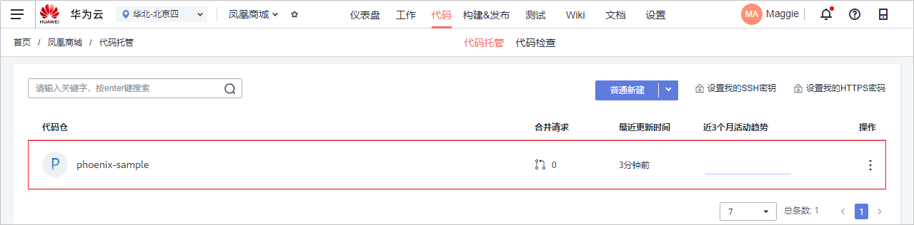

    2.  单击仓库名称进入代码仓库，选择“设置“页签。在左侧导航中单击“仓库管理  \>  保护分支管理“。
    3.  单击“新建保护分支“，参照[表1](#table141962817369)在弹框中完成配置，单击“确定“保存，如[图2](#fig105411916278)所示。

        **表 1**  新建保护分支配置

        <a name="table141962817369"></a>
        <table><thead align="left"><tr id="row341912873618"><th class="cellrowborder" valign="top" width="50%" id="mcps1.2.3.1.1"><p id="p241932843610"><a name="p241932843610"></a><a name="p241932843610"></a>配置项</p>
        </th>
        <th class="cellrowborder" valign="top" width="50%" id="mcps1.2.3.1.2"><p id="p19419162823611"><a name="p19419162823611"></a><a name="p19419162823611"></a>配置建议</p>
        </th>
        </tr>
        </thead>
        <tbody><tr id="row17419328143611"><td class="cellrowborder" valign="top" width="50%" headers="mcps1.2.3.1.1 "><p id="p124193287365"><a name="p124193287365"></a><a name="p124193287365"></a>选择需要保护的分支</p>
        </td>
        <td class="cellrowborder" valign="top" width="50%" headers="mcps1.2.3.1.2 "><p id="p174193285361"><a name="p174193285361"></a><a name="p174193285361"></a>选择<span class="parmvalue" id="parmvalue8347181393713"><a name="parmvalue8347181393713"></a><a name="parmvalue8347181393713"></a>“master”</span>。</p>
        </td>
        </tr>
        <tr id="row18419528143614"><td class="cellrowborder" valign="top" width="50%" headers="mcps1.2.3.1.1 "><p id="p94191328193619"><a name="p94191328193619"></a><a name="p94191328193619"></a>管理者权限</p>
        </td>
        <td class="cellrowborder" valign="top" width="50%" headers="mcps1.2.3.1.2 "><p id="p641910285365"><a name="p641910285365"></a><a name="p641910285365"></a>选择<span class="parmvalue" id="parmvalue620422316375"><a name="parmvalue620422316375"></a><a name="parmvalue620422316375"></a>“能提交，能合并”</span>。</p>
        </td>
        </tr>
        <tr id="row0419828173617"><td class="cellrowborder" valign="top" width="50%" headers="mcps1.2.3.1.1 "><p id="p124191328153612"><a name="p124191328153612"></a><a name="p124191328153612"></a>开发者权限</p>
        </td>
        <td class="cellrowborder" valign="top" width="50%" headers="mcps1.2.3.1.2 "><p id="p841922833614"><a name="p841922833614"></a><a name="p841922833614"></a>选择<span class="parmvalue" id="parmvalue639343633714"><a name="parmvalue639343633714"></a><a name="parmvalue639343633714"></a>“不能提交，不能合并”</span>。</p>
        </td>
        </tr>
        </tbody>
        </table>

        **图 2**  新建保护分支<a name="fig105411916278"></a>  
        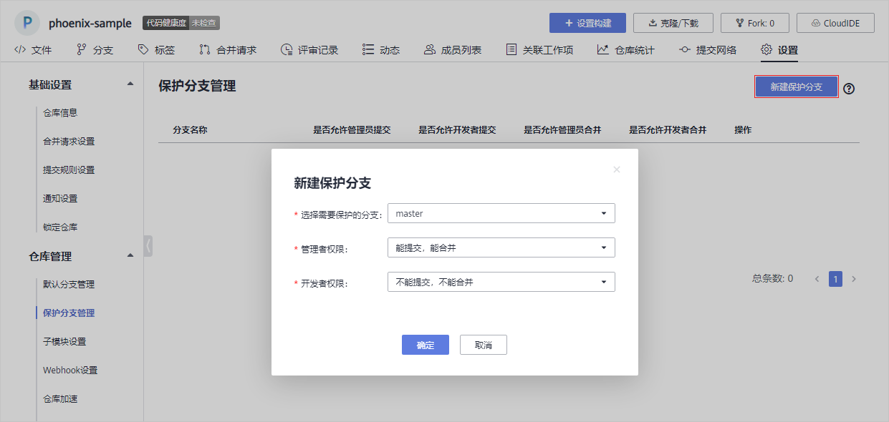

2.  创建功能分支（本文档中由开发者Chris操作）。
    1.  进入“凤凰商城“项目，在代码托管页面中找到仓库“phoenix-sample“。
    2.  单击仓库名称进入代码仓库，选择“分支“页签。
    3.  单击页面右上角“新建分支“，参照输入分支信息，单击“确定“保存，如[图3](#fig47461351359)所示。

        **表 2**  新建分支

        <a name="table1967211501517"></a>
        <table><thead align="left"><tr id="row196721550112"><th class="cellrowborder" valign="top" width="25%" id="mcps1.2.3.1.1"><p id="p7691165117318"><a name="p7691165117318"></a><a name="p7691165117318"></a>配置项</p>
        </th>
        <th class="cellrowborder" valign="top" width="75%" id="mcps1.2.3.1.2"><p id="p14691185110318"><a name="p14691185110318"></a><a name="p14691185110318"></a>配置建议</p>
        </th>
        </tr>
        </thead>
        <tbody><tr id="row116721850316"><td class="cellrowborder" valign="top" width="25%" headers="mcps1.2.3.1.1 "><p id="p6673155012116"><a name="p6673155012116"></a><a name="p6673155012116"></a>分支名称</p>
        </td>
        <td class="cellrowborder" valign="top" width="75%" headers="mcps1.2.3.1.2 "><p id="p16739501110"><a name="p16739501110"></a><a name="p16739501110"></a>输入<span class="parmvalue" id="parmvalue182028281171"><a name="parmvalue182028281171"></a><a name="parmvalue182028281171"></a>“Feature-Store”</span>。</p>
        </td>
        </tr>
        <tr id="row1967316504113"><td class="cellrowborder" valign="top" width="25%" headers="mcps1.2.3.1.1 "><p id="p206731350415"><a name="p206731350415"></a><a name="p206731350415"></a>基于</p>
        </td>
        <td class="cellrowborder" valign="top" width="75%" headers="mcps1.2.3.1.2 "><p id="p46731050414"><a name="p46731050414"></a><a name="p46731050414"></a>选择<span class="parmvalue" id="parmvalue19465195312719"><a name="parmvalue19465195312719"></a><a name="parmvalue19465195312719"></a>“master”</span>。</p>
        </td>
        </tr>
        <tr id="row36733501317"><td class="cellrowborder" valign="top" width="25%" headers="mcps1.2.3.1.1 "><p id="p186734501316"><a name="p186734501316"></a><a name="p186734501316"></a>关联工作项</p>
        </td>
        <td class="cellrowborder" valign="top" width="75%" headers="mcps1.2.3.1.2 "><p id="p20673450411"><a name="p20673450411"></a><a name="p20673450411"></a>选择S<span class="parmvalue" id="parmvalue851111547"><a name="parmvalue851111547"></a><a name="parmvalue851111547"></a>“作为用户应该可以查询所有门店网络”</span>。</p>
        </td>
        </tr>
        </tbody>
        </table>

        **图 3**  新建分支<a name="fig47461351359"></a>  
        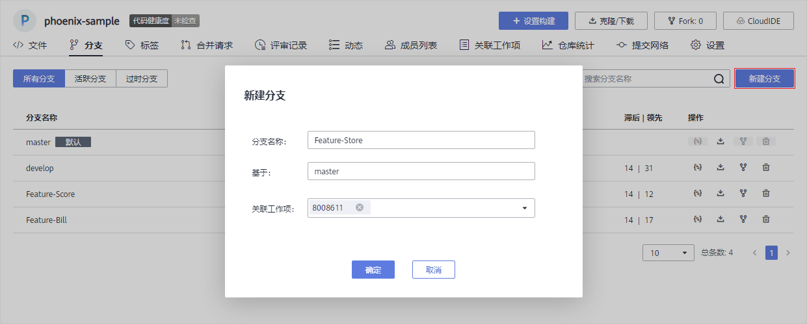


## 使用CloudIDE修改和提交代码<a name="section1333324173518"></a>

在[迭代规划](步骤一-管理项目规划.md#section27857118)时将门店查询功能分解为前端展示与后台管理两个task，本节以Task“前端展示 - 添加门店网络菜单“为例介绍如何使用CloudIDE修改与提交代码。

1.  单击页面上方导航“工作  \>  迭代“，在迭代4中找到Task“前端展示 - 添加门店网络菜单“，将Task的状态修改为“进行中“。
2.  单击页面上方导航“代码  \>  代码托管“，找到仓库“phoenix-sample“。
3.  将代码导入CloudIDE中。

    由于目前CloudIDE只支持“华北-北京一“、“华北-北京四“、“东北-大连“三个区域，因此请根据项目所属的区域进行导入操作。

    -   项目所属区域在“华北-北京一“、“华北-北京四“、“东北-大连“之中。
        1.  单击仓库名称进入代码仓库，单击页面右上角“CloudIDE“，页面跳转至CloudIDE服务，如[图4](#fig43473173396)所示。

            **图 4**  代码仓库<a name="fig43473173396"></a>  
            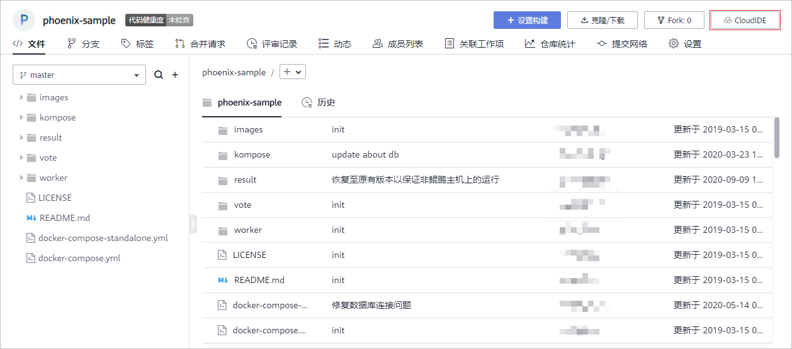

        2.  等待CloudIDE加载完毕（约1\~2分钟），可看到代码仓库已自动导入CloudIDE中。

    -   项目所属区域不在“华北-北京一“、“华北-北京四“、“东北-大连“之中。
        1.  在代码仓库中[设置HTTPS密码](https://support.huaweicloud.com/usermanual-codehub/devcloud_hlp_00083.html#section1)。
        2.  在代码仓库列表中，在仓库URL列获取HTTPS地址。
        3.  登录[CloudIDE](https://devcloud.huaweicloud.com/cloudide/home)，在“免费体验“页签单击“All in One“下的“免费体验“，申请60分钟的免费体验实例，如[图5](#fig54591234123016)所示。

            **图 5**  CloudIDE<a name="fig54591234123016"></a>  
            

        4.  等待CloudIDE加载完毕，[导入工程](https://support.huaweicloud.com/usermanual-cloudide/import_projects.html)，其中Url为代码仓库HTTPS地址，User和Password分别为HTTPS用户名与密码。

4.  选择分支。

    1.  单击页面左下角“master“，页面上方出现下拉列表。
    2.  在下拉列表中选择[使用分支管理代码](#section10541114411568)中创建的分支“Feature-Store“，此时页面左下角显示“Feature-Store“，如[图6](#fig13606167133510)所示。

    **图 6**  选择分支<a name="fig13606167133510"></a>  
    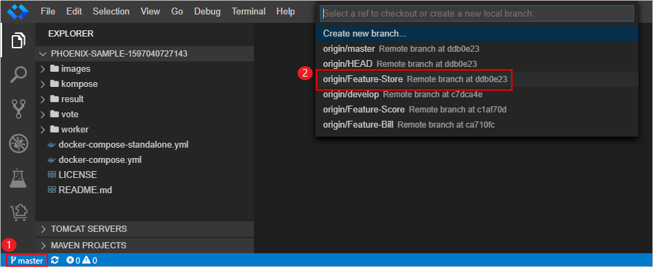

5.  修改代码。
    1.  在左侧导航中找到文件“vote/templates/store-network.html“并打开，根据[需求规划](步骤一-管理项目规划.md#section47834478)添加门店地址，如[图7](#fig134852188363)所示。

        ```
        <ul>
        	<li>北京分店：首都机场1号航站楼出发层靠右直行888米右侧</li>
        	<li>天津分店：经济技术开发区黄海路888号</li>
        	<li>上海分店：静安区大统路888号</li>
        	<li>重庆分店：涪陵区桥南大道电信局西侧</li>
        </ul>
        ```

        **图 7**  添加门店地址<a name="fig134852188363"></a>  
        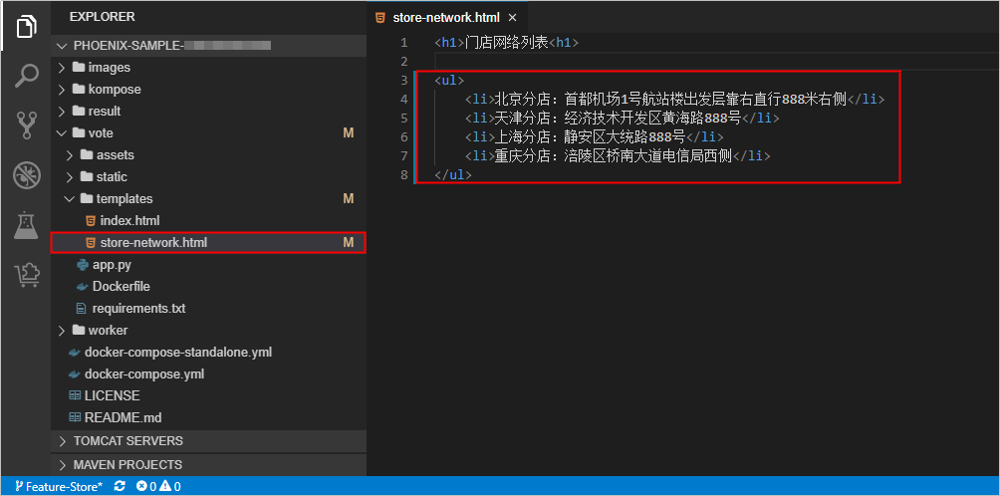

    2.  在左侧导航中找到文件“/vote/templates/index.html“并打开，在179行添加菜单“门店网络“，如[图8](#fig4835513203810)所示。

        ```
        <li class="nav-item"> <a href="store-network" class="nav-link">门店网络</a> </li>
        ```

        **图 8**  添加菜单<a name="fig4835513203810"></a>  
        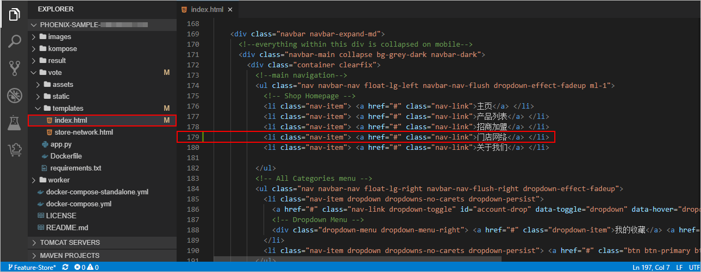

6.  提交修改至代码仓库，如[图10](#fig6939126265)所示。

    1.  单击左侧边栏图标，打开Git功能。
    2.  单击修改文件后方的图标，将修改内容添加进提交内容当中。
    3.  输入提交信息“fix \#8008614 添加门店网络菜单“。

        其中“\#8008614“是本文档中Task“前端展示 - 添加门店网络菜单“的编号（如[图9](#fig18531101020611)所示），实践中请修改为实际Task的编号。

        **图 9**  工作项编号<a name="fig18531101020611"></a>  
        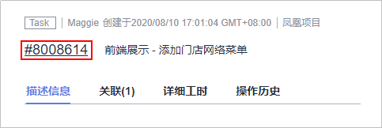

    4.  单击图标提交本次修改。
    5.  单击图标。
    6.  在下拉列表中单击“Push“，推送代码到代码仓库。

    **图 10**  提交修改至代码仓库<a name="fig6939126265"></a>  
    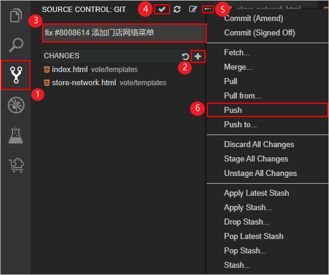

7.  <a name="li249314111015"></a>返回代码仓库，在“分支“页面中找到分支“Feature-Store“，最新提交与CloudIDE中输入的内容相同，如[图11](#fig116851676102)所示。

    **图 11**  分支列表<a name="fig116851676102"></a>  
    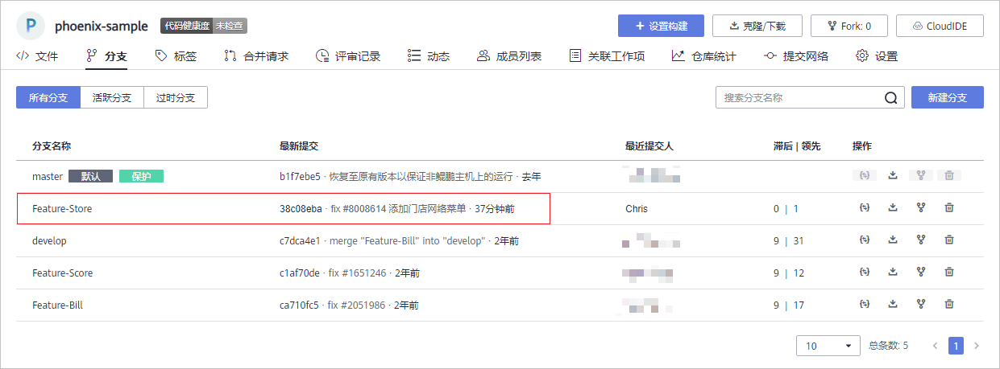

8.  单击页面上方导航“工作  \>  迭代“，在迭代4中找到Task“前端展示 - 添加门店网络菜单“。

    -   单击Task名称，在详情页中可看到状态自动变为“已解决“。
    -   选择“关联“页签，在“代码提交记录“下可看到一条记录，详情与[上一步](#li249314111015)中看到的分支提交记录相同，如[图12](#fig1319416288106)所示。

    **图 12**  代码提交记录<a name="fig1319416288106"></a>  
    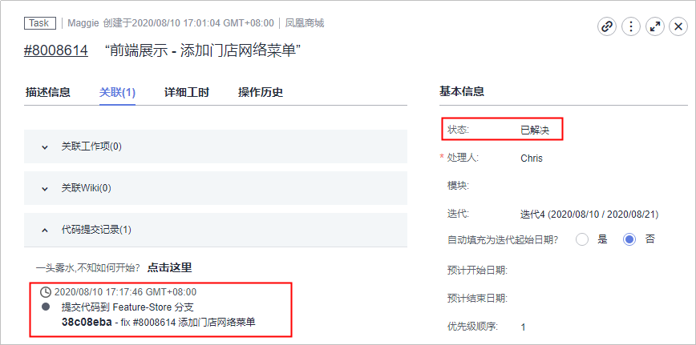


## 检视代码、合并分支<a name="section52684690"></a>

1.  开发人员发起合并请求。

    开发人员Chris完成代码开发，确认无误后，即可发起合并请求，将功能分支合并到master中。

    1.  进入代码仓库，选择“合并请求“页签，单击“新建合并请求“。
    2.  选择从“Feature-Store“到“master“，单击“下一步“。
    3.  参照[表3](#table1712594573810)编辑合并请求详情，如[图13](#fig114761724194813)所示。

        **表 3**  合并请求配置

        <a name="table1712594573810"></a>
        <table><thead align="left"><tr id="row191251945153817"><th class="cellrowborder" valign="top" width="20%" id="mcps1.2.3.1.1"><p id="p61251345173819"><a name="p61251345173819"></a><a name="p61251345173819"></a>配置项</p>
        </th>
        <th class="cellrowborder" valign="top" width="80%" id="mcps1.2.3.1.2"><p id="p1125144516384"><a name="p1125144516384"></a><a name="p1125144516384"></a>配置建议</p>
        </th>
        </tr>
        </thead>
        <tbody><tr id="row3125194573813"><td class="cellrowborder" valign="top" width="20%" headers="mcps1.2.3.1.1 "><p id="p6125114518385"><a name="p6125114518385"></a><a name="p6125114518385"></a>标题</p>
        </td>
        <td class="cellrowborder" valign="top" width="80%" headers="mcps1.2.3.1.2 "><p id="p7125545113810"><a name="p7125545113810"></a><a name="p7125545113810"></a>输入<span class="parmvalue" id="parmvalue0138111713116"><a name="parmvalue0138111713116"></a><a name="parmvalue0138111713116"></a>“添加门店网络列表”</span>。</p>
        </td>
        </tr>
        <tr id="row412511455382"><td class="cellrowborder" valign="top" width="20%" headers="mcps1.2.3.1.1 "><p id="p171251454383"><a name="p171251454383"></a><a name="p171251454383"></a>合并人</p>
        </td>
        <td class="cellrowborder" valign="top" width="80%" headers="mcps1.2.3.1.2 "><p id="p13138183312437"><a name="p13138183312437"></a><a name="p13138183312437"></a>单击<span class="uicontrol" id="uicontrol338395741110"><a name="uicontrol338395741110"></a><a name="uicontrol338395741110"></a>“添加合并人”</span>，在弹框中选择<span class="parmvalue" id="parmvalue154521349121216"><a name="parmvalue154521349121216"></a><a name="parmvalue154521349121216"></a>“Maggie”</span>。</p>
        </td>
        </tr>
        <tr id="row712512456387"><td class="cellrowborder" valign="top" width="20%" headers="mcps1.2.3.1.1 "><p id="p21259451388"><a name="p21259451388"></a><a name="p21259451388"></a>评审人</p>
        </td>
        <td class="cellrowborder" valign="top" width="80%" headers="mcps1.2.3.1.2 "><p id="p1812524523816"><a name="p1812524523816"></a><a name="p1812524523816"></a>单击<span class="uicontrol" id="uicontrol1492193471211"><a name="uicontrol1492193471211"></a><a name="uicontrol1492193471211"></a>“添加评审人”</span>，在弹框中选择<span class="parmvalue" id="parmvalue109641346101211"><a name="parmvalue109641346101211"></a><a name="parmvalue109641346101211"></a>“Maggie”</span>。</p>
        </td>
        </tr>
        </tbody>
        </table>

    4.  单击“确定“完成合并请求的创建。

        **图 13**  新建合并请求<a name="fig114761724194813"></a>  
        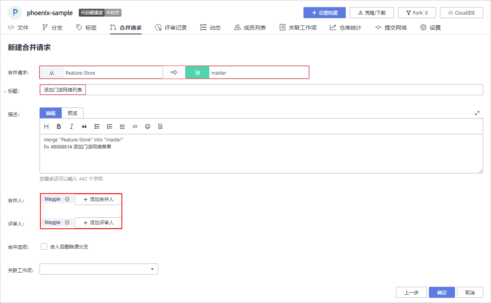

2.  项目经理评审并完成代码合入。

    本文档中，合并请求的评审人与合并人均是项目经理Maggie。因此Maggie可评审合并请求内容，并在评审通过后完成分支合入。

    1.  进入代码仓库后，选择“合并请求“页签，可找到由开发人员Chris创建的合并请求。
    2.  单击该请求，查看合并请求详情。
    3.  通过页面右下角可评分、发布评论或讨论，如[图14](#fig104008209259)所示。详细操作请参考[分支合并评审](https://support.huaweicloud.com/usermanual-codehub/devcloud_hlp_0931.html)。
    4.  单击“合并“，将分支合入“master“。

        **图 14**  合并请求<a name="fig104008209259"></a>  
        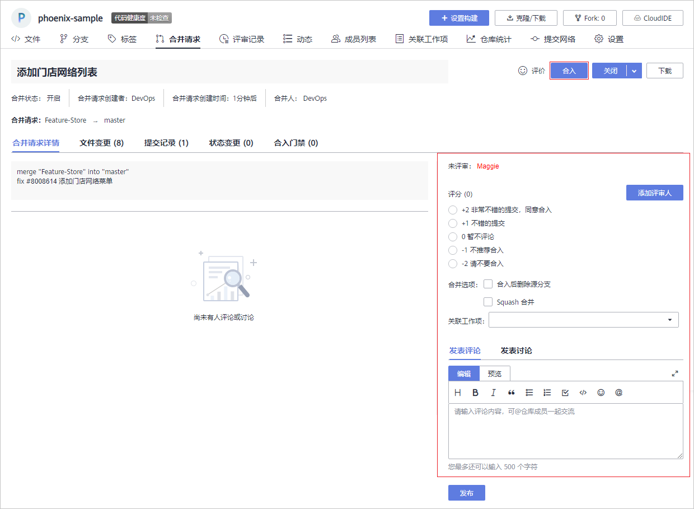


