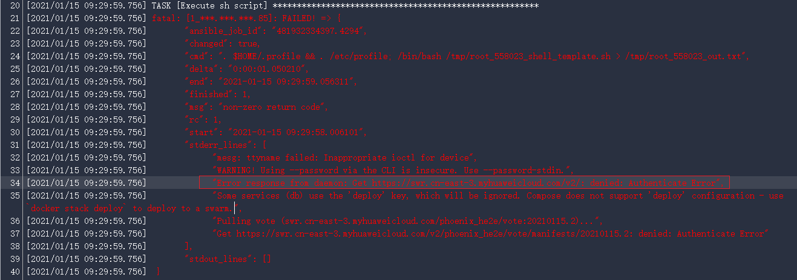
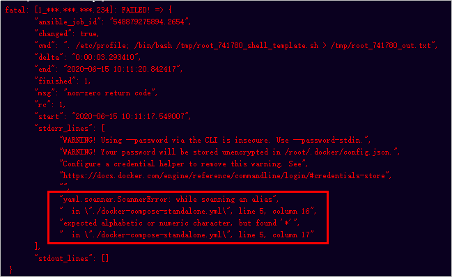

# 部署失败解决方法

部署任务执行失败，会有可能以下几种原因。

## 主机系统原因

-   问题现象：部署主机已添加入方向规则“允许访问5000以及5001端口”，且部署任务执行成功，但无法访问部署网站（即“http://_ip__地址_:5000”与“http://_ip地址_:5001”）。
-   原因分析：本实践项目所使用目标主机的操作系统为Ubuntu 16.04，其它类型主机无法访问部署后的网站。
-   处理方法：重新购买一台操作系统为Ubuntu 16.04的主机（购买方式请参考[购买并配置弹性云服务器](步骤七-部署应用（弹性云服务器篇）.md#section369110705717)），或将当前主机操作系统切换为Ubuntu 16.04（切换操作系统方式请参考[切换操作系统](https://support.huaweicloud.com/usermanual-ecs/zh-cn_topic_0031523135.html)）。

## 参数配置问题

参数设置错误，可能会导致以下几种报错。

问题一：

-   问题现象：部署任务执行失败，报错信息为“docker login failed“、“Get https://XXX denied“，如[图1](#fig197861256123415)所示。

    **图 1**  报错信息  
    

-   原因分析：目标主机重启等情况造成Docker登录指令失效。

问题二：

-   问题现象：部署任务执行失败，报错信息为“expected alphabetic or numeric character, but found '\*'“，如[图2](#fig20406132013376)所示。

    **图 2**  报错信息  
    

-   原因分析：构建任务参数设置不正确，导致部署任务获取不到正确的部署来源数据。

参数错误的处理方法：参照[配置SWR服务](步骤六-构建应用.md#section88081731191012)，重新获取SWR参数，并配置到编译构建任务与部署任务中。

