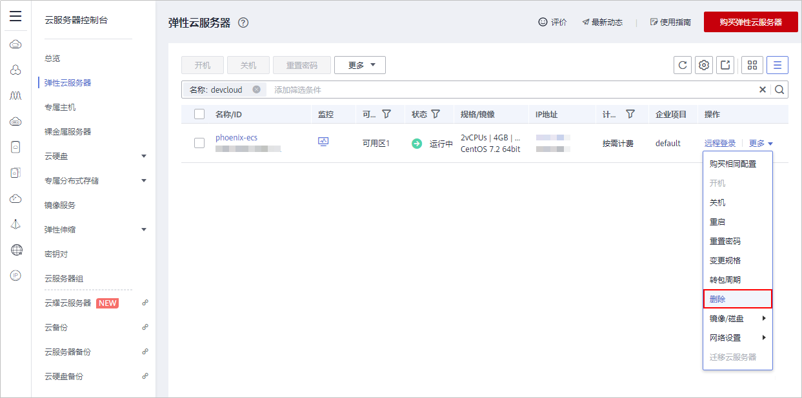

# 释放资源

为了避免不必要的费用产生，完成本样例项目体验后，产品负责人Sarah可根据需要释放以下资源。

> **须知：** 
>资源释放后无法恢复，请谨慎操作。

## 删除项目

项目是使用软件开发平台各服务的基础，删除项目可将该项目中所有数据（包括工作项、文档、代码仓库、软件包、构建/部署任务等）一并删除。

1.  进入项目“设置  \>  通用设置 \> 基本信息“页面。
2.  单击“删除项目“，在弹框中输入项目名称，单击“删除“，如[图1](#fig16291816123810)所示。

    **图 1**  删除项目  
    

## 删除弹性云服务器

购买弹性云服务器时，需配置弹性IP及云硬盘。删除弹性云服务器时，要同时选择将弹性IP及挂载的硬盘删除。

1.  登录[弹性云服务器控制台](https://console.huaweicloud.com/ecm/?region&locale=zh-cn#/ecs/manager/vmList)。
2.  在列表中找到待删除的弹性云服务器，单击“更多“，在下拉列表中选择“删除“，如[图2](#fig6177104343820)所示。

    **图 2**  删除弹性云服务器  
    

3.  在弹框中勾选“释放云服务器绑定的弹性公网IP地址“、“删除云服务器挂载的数据盘“，单击“是“，如[图3](#fig1314111011390)所示。

    **图 3**  确认删除设置  
    

## 删除集群

1.  登录[云容器引擎控制台](https://console.huaweicloud.com/cce2.0/?region=&locale=zh-cn#/app/dashboard)，单击页面左侧导航“资源管理  \>  集群管理“。
2.  在页面中找到待删除的集群，单击“更多“，在下拉列表中选择“删除集群“，如[图4](#fig914018538398)所示。

    **图 4**  删除集群  
    

3.  在弹窗中勾选所有选项，并在最下方文本框中输入“DELETE“，单击“是“，如[图5](#fig17234455193912)所示。

    **图 5**  确认删除设置  
    

