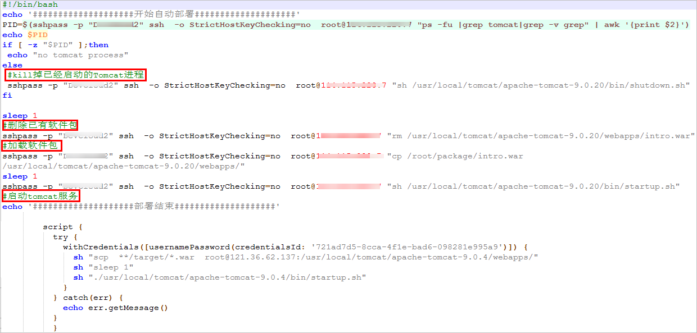
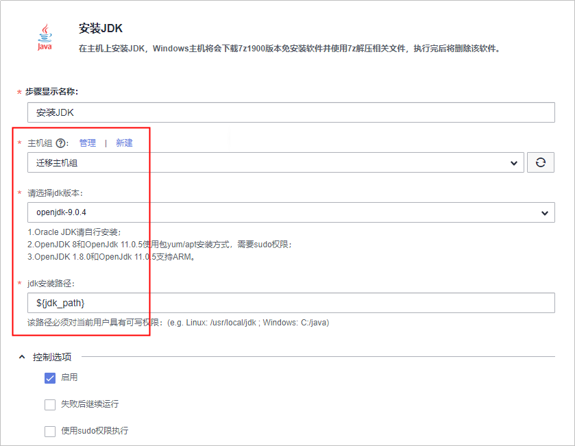
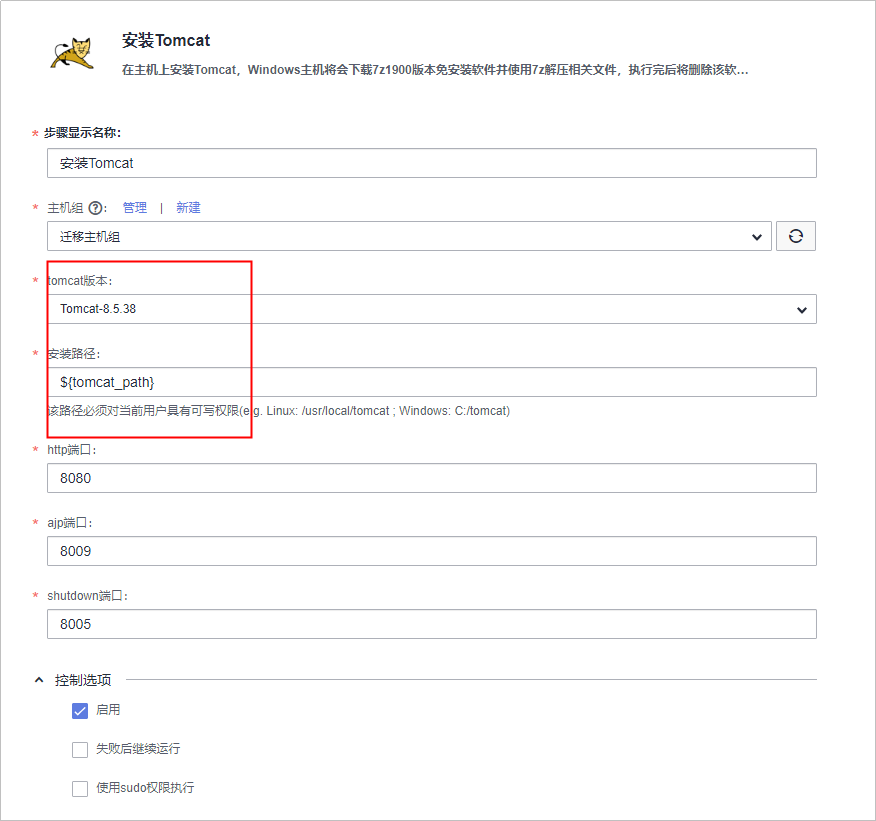
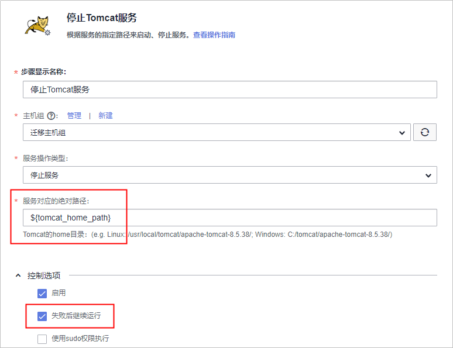
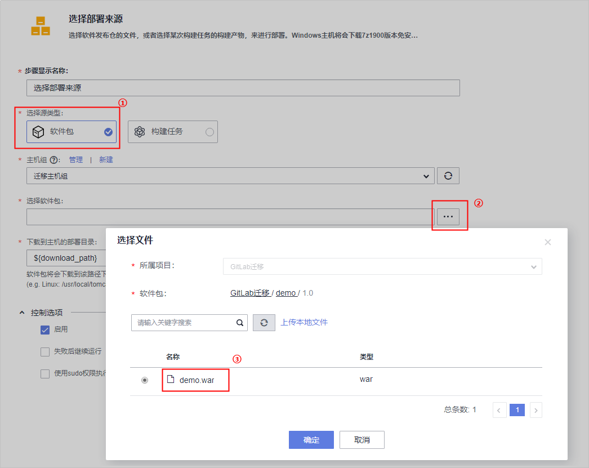

# **CD任务迁移**<a name="devcloud_migration_0012"></a>

CD任务迁移包括以下四个步骤：

-   [步骤一：获取GitLab CD部署主机信息](#section182067617117)

    查看“.gitlab-ci.yml“文件，获取所有部署主机信息。

-   [步骤二：DevCloud主机授信](#section3526911714)

    以主机组的形式将所有主机和DevCloud进行连通。

-   [步骤三：获取GitLab CD任务](#section5417216614)

    通过查看每个项目根目录下的“.gitlab-ci.yml“文件查看原有CD任务。

-   [步骤四：DevCloud CD任务配置](#section3577221013)

    在DevCloud服务中配置构建任务，可视化界面编排CD各个步骤。


## **步骤一：获取GitLab CD部署主机信息**<a name="section182067617117"></a>

通过查看文件“.gitlab-ci.yml“中部署调用的脚本信息（sshpass命令），获取部署所有主机的IP、密码、SSH端口号（为防止网络攻击，很多主机将默认的SSH端口修改成其它端口）。

## **步骤二：DevCloud主机授信**<a name="section3526911714"></a>

1.  进入已经创建好的DevCloud项目中，在“设置  \>  通用设置  \>  主机组管理“页面单击“新建主机组“，输入主机名称，选择操作系统，单击“保存“。
2.  单击“添加主机“，在弹框中根据[步骤一](#section182067617117)获取到的信息输入主机信息，单击“添加“保存。
3.  等待添加，当连通性验证显示“验证成功“时，说明主机成功添加。

    

4.  按照3、4步添加其它主机，确保所有主机连通性验证都已经成功。

## **步骤三：获取GitLab CD任务**<a name="section5417216614"></a>

通过文件“.gitlab-ci.yml“可知，部署任务是通过deploy.sh脚本完成的。

```
stages:
  - deploy

deploy:
  stage: deploy
  script:
  - sh deploy.sh
```

deploy.sh脚本如下图：



## **步骤四：DevCloud CD任务配置**<a name="section3577221013"></a>

本节默认使用全新的部署主机。若使用原有主机，可根据实际情况删除安装JDK、安装Tomcat两个步骤，并将主机中的Tomcat路径配置在任务中。

1.  进入已经创建好的DevCloud项目，在“构建&发布  \>  部署“页面单击“新建任务“，输入任务名称，单击“下一步“。
2.  选择系统模板“Tomcat应用部署模板“，单击“下一步“，系统自动跳转至“部署步骤“页面。
3.  配置步骤“安装JDK“：
    -   **主机组**选择在[步骤二](#section3526911714)中创建的主机组。系统将弹框提示“是否将后续步骤的主机组也修改为XXX（主机组名称）”，选择“确定“。
    -   系统支持多个**jdk版本**，请根据实际情况选择合适的版本。
    -   **jdk安装路径**保持默认参数“$\{jdk\_path\}“，参数默认值为“/usr/local/jdk“。如需更改默认参数，请在“参数设置“页签中更改对应的参数值。

        

4.  配置步骤“安装Tomcat“：
    -   系统支持3个**tomcat版本**，请根据实际情况选择合适的版本。
    -   **安装路径**保持默认参数“$\{jdk\_path\}“，参数默认值为“/usr/local/tomcat“。如需更改默认参数，请在**“参数设置“**页签中更改对应的参数值。

        

5.  配置步骤“停止Tomcat服务“：
    -   **服务对应的绝对路径**保持默认参数“$\{tomcat\_home\_path\}“，参数默认值为“/usr/local/tomcat/apache-tomcat-8.5.38“。如果更改安装Tomcat的版本，请在**“参数设置“**页签中更改对应的参数值。
    -   若第一次启动该任务，并且主机并未启动过Tomcat进程，该步骤是失败的，需要勾选**“失败后继续运行“。**

        

6.  配置步骤“选择部署来源“：，
    -   **选择源类型**为“软件包“，单击**选择软件包**文本框后的，在弹框中选择软件包。
    -   **下载到主机的部署目录**保持默认参数“$\{download\_path\}“，参数默认值为  “/usr/local/tomcat/apache-tomcat-8.5.38/webapps“，如果更改路径，请在**“参数设置“**页签中更改对应的参数值。

        

7.  配置步骤“启动Tomcat服务“：

    **服务对应的绝对路径**与步骤“停止Tomcat服务“相同。

8.  配置步骤“URL健康测试“：
    -   测试路径可从主机组中选择一台主机，其中参数“$\{service\_port\}“可以根据实际访问端口配置。
    -   本步骤用于测试服务状态是否OK，若请求状态码非200或201，将认为服务不可用。


