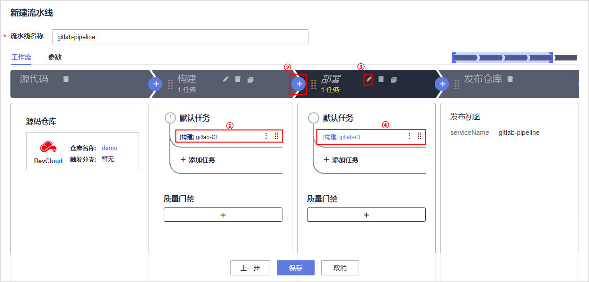

# **CI/CD pipeline迁移**<a name="devcloud_migration_0013"></a>

GitLab CI/CD pipeline是通过合并各个阶段的“.gitlab-ci.yml“脚本进行统一调度的，DevCloud流水线也是通过创建流水线任务，一键自动完成DevOps研发实践。

CI/CD pipeline迁移包括以下两个步骤：

-   [步骤一：获取GitLab pipeline阶段信息](#section7120182413311)
-   [步骤二：创建DevCloud流水线任务](#section16900153043316)

## **步骤一：获取GitLab pipeline阶段信息**<a name="section7120182413311"></a>

查看“.gitlab-ci.yml“文件，了解pipline中的阶段。

```
stages:
  #构建任务阶段
  - build
  #部署任务阶段
  - deploy
```

## **步骤二：创建DevCloud流水线任务**<a name="section16900153043316"></a>

1.  进入已经创建好的DevCloud项目，在“构建&发布  \>  流水线“单击“新建流水线“，输入流水线名称，单击“下一步“。
2.  模板选择“不使用模板，直接创建“。
3.  源码仓库选择在CodeHub中创建的仓库，单击“下一步“。
4.  配置流水线各个阶段及任务，单击“保存“。

    -   单击构建阶段中“添加任务“，在页面右侧滑框中选择任务类型为“构建“，并勾选流水线所需构建任务。
    -   单击添加流水线阶段。
    -   单击编辑阶段名称为“部署“。
    -   单击部署阶段中“添加任务“，在页面右侧滑框中选择任务类型为“部署“，并勾选流水线所需部署任务。

    

5.  进入流水线详情页面，单击“全新执行“，即可触发流水线。

