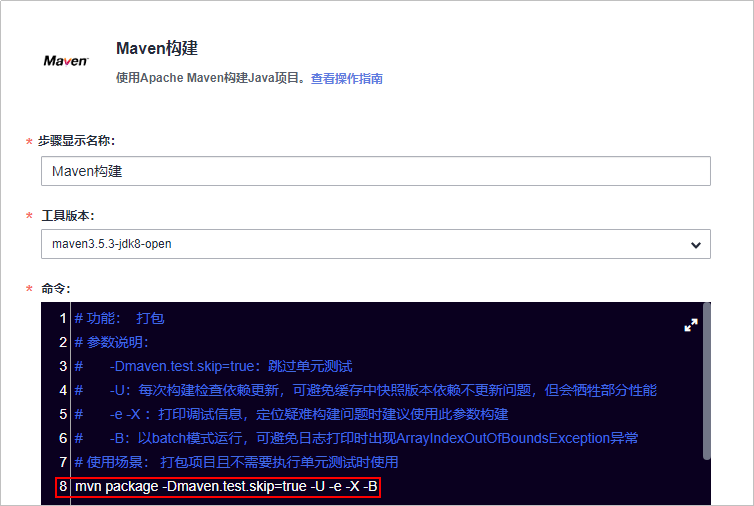
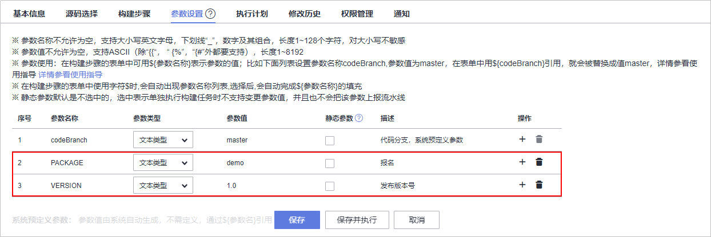
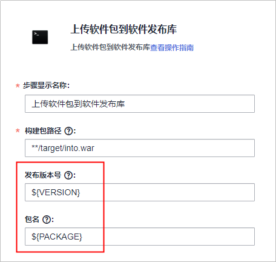
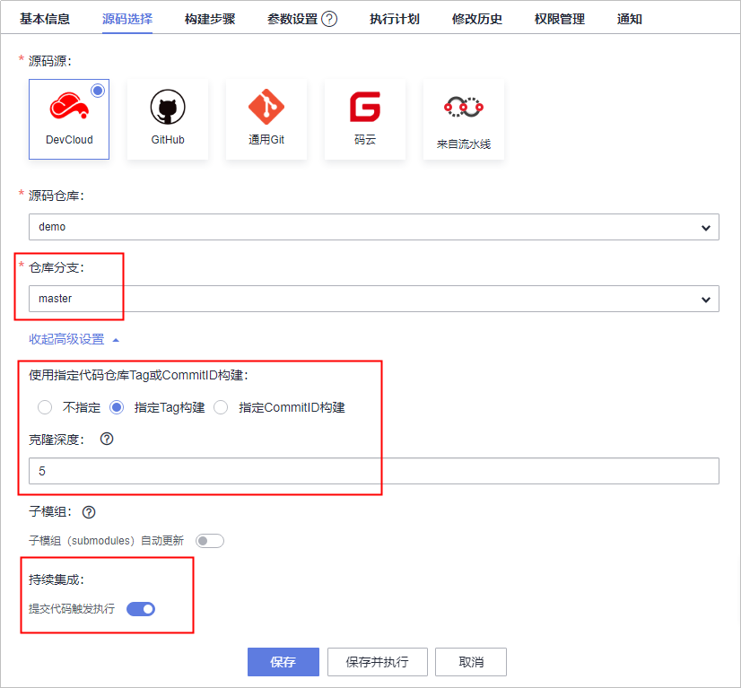
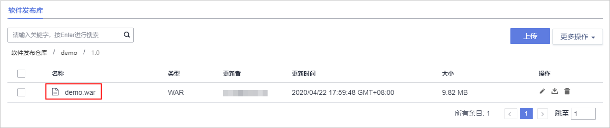

# **CI任务迁移**<a name="devcloud_migration_0011"></a>

CI任务迁移包括以下三个步骤：

-   [步骤一：获取GitLab Runner构建任务信息](#section16522533121315)

    通过查看每个项目根目录下的“.gitlab-ci.yml“文件查看原有CI任务。

-   [步骤二：配置DevCloud构建任务](#section1520819141420)

    在DevCloud服务中配置构建任务，可视化界面编排CI各个步骤。

-   [步骤三：执行DevCloud构建任务](#section1228665031315)

    执行配置完成的构建任务，将软件包归档到软件发布库中。


## **步骤一：获取GitLab Runner构建任务信息**<a name="section16522533121315"></a>

在项目代码仓库中查看“.gitlab-ci.yml“文件，了解构建步骤，以及获取其它任务配置需求。

```
stages:
  - build

build:
  stage: build
  script:
  #执行maven命令，对仓库代码进行构建 
  - /usr/local/maven/apache-maven-3.5.3/bin/mvn  package 
  #通过artifacts将软件包归档到gitLab服务器可供下载或其它任务依赖
  artifacts:
    #可以对任务中变量进行参数化
    name: "$PACKAGE_NAME-$VERSION"
    paths:
      - target/intro.war
    when: on_success
    expire_in: 1 week
  #可以通过commit ID或tag编译指定历史版本
  tags:
  - maven
  #该任务只对master分支进行
  only:
  - master
```

## **步骤二：配置DevCloud构建任务**<a name="section1520819141420"></a>

1.  进入编译构建服务，找到在[CI环境迁移](CI环境迁移.md)中创建的构建任务，单击编辑任务。
2.  选择“构建步骤“页签，编辑步骤“Maven构建“，注意命令框中第8行（即**mvn package**命令行）未被注释。

    

      

    > **说明：**   
    >如果想将生成的软件包放入DevCloud私有依赖库，作为其它构建任务的依赖，构建步骤“Maven构建“的配置方式请参考[通过编译构建任务快速发布私有组件到私有依赖库](https://support.huaweicloud.com/qs-releaseman/cloudrelease_06_1002.html)。  

3.  选择“参数设置“页签添加参数“PACKAGE“和“VERSION“。

    

      

4.  返回“构建步骤“页签，编辑步骤“上传软件包到软件发布库“：发布版本号及包名采用参数形式，通过参数设置归档到软件发布库的软件包名称与版本，供后续DevCloud CD读取使用。

    

      

5.  在“源码选择“页签中：

    -   配置代码分支为“master“，即只针对该分支触发构建任务。
    -   展开“高级设置“，根据需要选择指定代码提交的Tag或者CommitID进行构建，并设置克隆深度（下图表示只能制定最近5次历史提交进行构建）
    -   开启“提交代码触发执行“开关。

    

      


## **步骤三：执行DevCloud构建任务**<a name="section1228665031315"></a>

1.  任务配置完成后，单击“保存并执行“，在弹出的对话框中输入参数信息后单击“确定“，启动构建任务。
2.  构建成功后，单击导航“构建&发布  \>  发布“，进入软件发布库页面查看生成的软件包。

    

      


