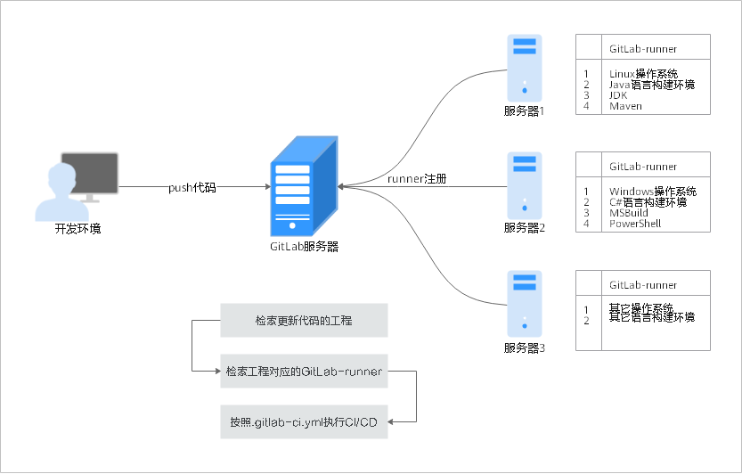
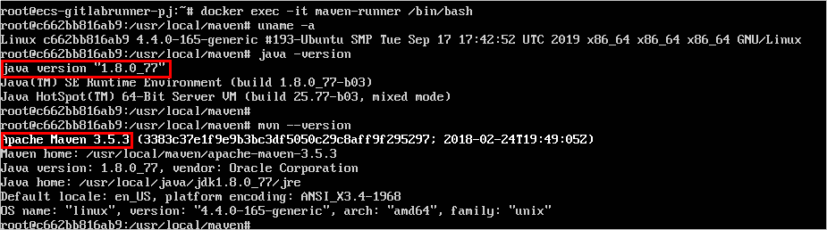
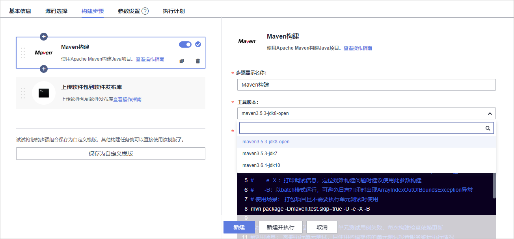

# **CI环境迁移**

## **CI环境介绍**

企业在对项目代码进行构建之前，需要根据项目语言，建立一个可以进行编译构建的Runner环境，这个Runner注册在该项目下，负责从GitLab代码托管中拉取代码，并根据工程文件“.gitlab-ci.yml“中的配置，执行相应的动作。

## **GitLab与DevCloud CI环境对照**

下表中列出了GitLab Runner与DevCloud CI环境的对照。

<table><thead align="left"><tr id="row4485195593518"><th class="cellrowborder" valign="top" width="10%" id="mcps1.1.6.1.1">
<strong id="b13792128363">迁移示例项目</strong>

</th>
<th class="cellrowborder" valign="top" width="10%" id="mcps1.1.6.1.2">
<strong id="b15649551143619">GitLab Runner环境</strong>

</th>
<th class="cellrowborder" valign="top" width="30%" id="mcps1.1.6.1.3">
<strong id="b665375118367">GitLab Runner详细描述</strong>

</th>
<th class="cellrowborder" valign="top" width="20%" id="mcps1.1.6.1.4">
<strong id="b8653951183611">DevCloud构建环境</strong>

</th>
<th class="cellrowborder" valign="top" width="30%" id="mcps1.1.6.1.5">
<strong id="b6654951173612">DevCloud详细描述</strong>

</th>
</tr>
</thead>
<tbody><tr id="row18486195573510"><td class="cellrowborder" rowspan="3" valign="top" width="10%" headers="mcps1.1.6.1.1 ">
Java项目

</td>
<td class="cellrowborder" valign="top" width="10%" headers="mcps1.1.6.1.2 ">
Linux操作系统

</td>
<td class="cellrowborder" rowspan="3" valign="top" width="30%" headers="mcps1.1.6.1.3 ">
GitLab Runner构建环境是项目组自行搭建的，Runner可能运行在一台服务器中，也可能运行在容器中，这是由项目组来决定的。

</td>
<td class="cellrowborder" valign="top" width="20%" headers="mcps1.1.6.1.4 ">
maven3.5.3-jdk8-open

</td>
<td class="cellrowborder" rowspan="3" valign="top" width="30%" headers="mcps1.1.6.1.5 ">
DevCloud的编译构建服务，提供了云端构建环境，无需搭建，提供了22种系统集成环境，包括Maven，Gradle等。

</td>
</tr>
<tr id="row1948645573519"><td class="cellrowborder" valign="top" headers="mcps1.1.6.1.1 ">
JDK

</td>
<td class="cellrowborder" valign="top" headers="mcps1.1.6.1.2 ">
maven3.5.3-jdk7

</td>
</tr>
<tr id="row94861355123512"><td class="cellrowborder" valign="top" headers="mcps1.1.6.1.1 ">
Maven

</td>
<td class="cellrowborder" valign="top" headers="mcps1.1.6.1.2 ">
maven3.6.1-jdk10

</td>
</tr>
</tbody>
</table>

## **CI环境迁移流程**

CI环境迁移包括以下两个步骤：

-   [步骤一：获取GitLab Runner环境](#section96451434131312)

    Runner环境迁移需要首先了解Runner已有的操作系统、软件以及版本信息。

-   [步骤二：创建DevCloud构建任务，完成云构建环境和工具版本选择](#section58678201410)

    在DevCloud服务中创建构建任务，并选择模板和工具版本，即可实时使用匹配的云构建环境。

## **步骤一：获取GitLab Runner环境**

1.  进入GitLab待迁移的工程，在“Settings  \>  CI/CD“下展开Runners项，点击已经注册的Runner查看详细信息。
2.  获取GitLab Runner安装地址，查看操作系统等详细信息。

    

3.  登录GitLab Runner服务器，进入Runner容器实例，在maven安装文件夹中通过命令**java -version**及**mvn --version**查看jdk及maven版本信息。

    本文案例使用的版本为：jdk1.8.0，maven3.5.3。

    

## **步骤二：创建DevCloud构建任务，完成云构建环境和工具版本选择**

1.  进入已经创建好的DevCloud项目中，在“构建&发布  \>  编译构建“页面单击“新建任务“，输入任务名称，单击“下一步“。
2.  源码源选择“DevCloud“，源码仓库选择在CodeHub中创建的仓库，分支选择“master“，单击“下一步“。
3.  构建模板选择“Maven“，单击“确定“，系统将自动跳转至“构建步骤“页面。

    > **说明：** 
    >系统通常会根据工程代码的文件推荐合适的模板。
    >若推荐模板不适用，可在系统模板中选择需要使用的构建模板；或选择“不使用模板，直接创建“，根据需要选择并配置构建步骤。

4.  编辑构建步骤“Maven构建“：根据GitLab Runner中的配置，选择合适的**工具版本**，单击“新建“，完成任务创建。

    

