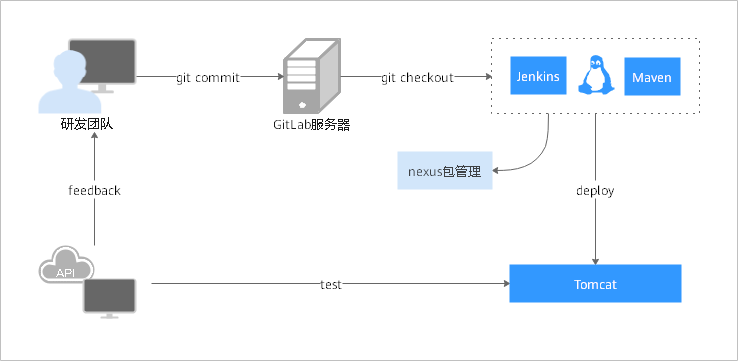
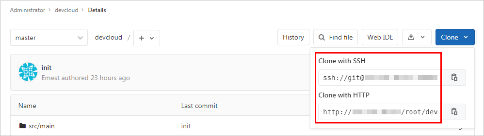
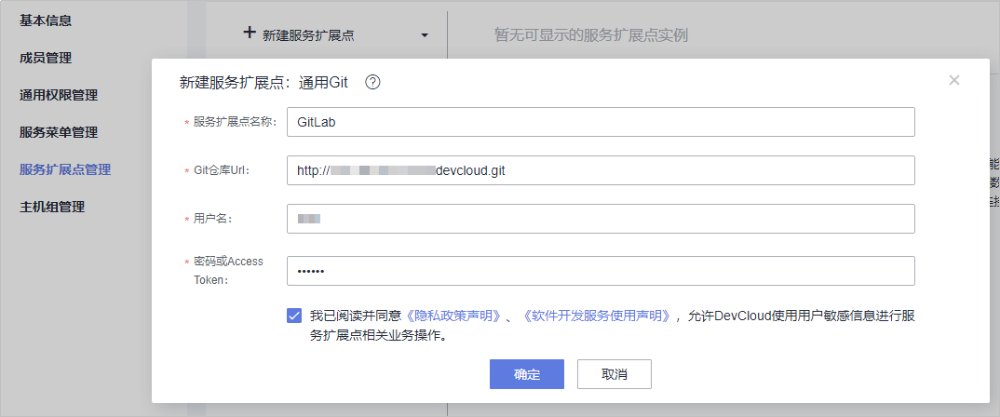
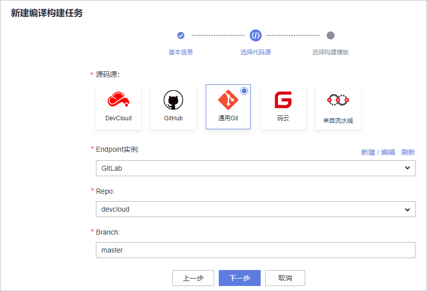
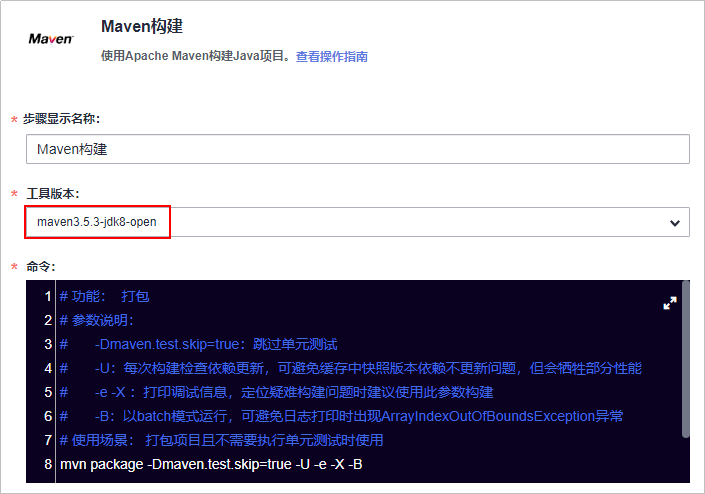
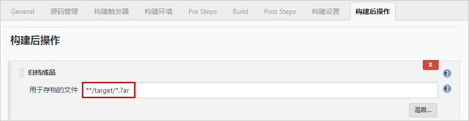
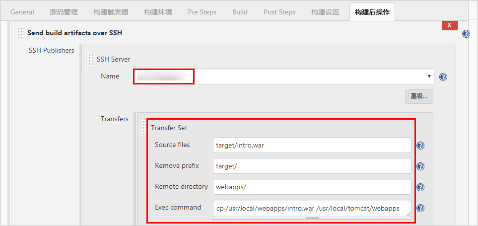

# **GitLab+Maven+Tomcat场景迁移**

本节介绍的迁移场景为：

-   编程语言：Java。
-   源码托管在GitLab私有库中。
-   Jenkins任务使用Maven构建工具。
-   运行在Jenkins服务器的Linux节点。
-   部署目标机需要提前安装Tomcat环境。

本节中各迁移步骤涉及到的服务及功能如下表所示：

<table><thead align="left"><tr id="row3414162920552"><th class="cellrowborder" valign="top" width="33.333333333333336%" id="mcps1.1.4.1.1">
<strong id="b5296123011517">迁移步骤</strong>

</th>
<th class="cellrowborder" valign="top" width="33.29332933293329%" id="mcps1.1.4.1.2">
<strong id="b03001930121514">Jenkins</strong>

</th>
<th class="cellrowborder" valign="top" width="33.373337333733375%" id="mcps1.1.4.1.3">
<strong id="b12303113018155">DevCloud</strong>

</th>
</tr>
</thead>
<tbody><tr id="row1141422910559"><td class="cellrowborder" valign="top" width="33.333333333333336%" headers="mcps1.1.4.1.1 ">
步骤一：源码管理迁移

</td>
<td class="cellrowborder" valign="top" width="33.29332933293329%" headers="mcps1.1.4.1.2 ">
GitLab托管

</td>
<td class="cellrowborder" valign="top" width="33.373337333733375%" headers="mcps1.1.4.1.3 ">
DevCloud代码仓库服务托管

</td>
</tr>
<tr id="row34147291552"><td class="cellrowborder" valign="top" width="33.333333333333336%" headers="mcps1.1.4.1.1 ">
步骤二：Maven构建迁移

</td>
<td class="cellrowborder" valign="top" width="33.29332933293329%" headers="mcps1.1.4.1.2 ">
Jenkins的任务中选择Maven构建步骤

</td>
<td class="cellrowborder" valign="top" width="33.373337333733375%" headers="mcps1.1.4.1.3 ">
DevCloud中创建Maven构建任务

</td>
</tr>
<tr id="row12414529135517"><td class="cellrowborder" valign="top" width="33.333333333333336%" headers="mcps1.1.4.1.1 ">
步骤三：构建包迁移

</td>
<td class="cellrowborder" valign="top" width="33.29332933293329%" headers="mcps1.1.4.1.2 ">
软件包发布到Jenkins服务器

</td>
<td class="cellrowborder" valign="top" width="33.373337333733375%" headers="mcps1.1.4.1.3 ">
软件包发布到软件发布库

</td>
</tr>
<tr id="row16414229115513"><td class="cellrowborder" valign="top" width="33.333333333333336%" headers="mcps1.1.4.1.1 ">
步骤四：Tomcat部署迁移

</td>
<td class="cellrowborder" valign="top" width="33.29332933293329%" headers="mcps1.1.4.1.2 ">
SSH部署

</td>
<td class="cellrowborder" valign="top" width="33.373337333733375%" headers="mcps1.1.4.1.3 ">
通过DevCloud提供的原子步骤组合部署

</td>
</tr>
</tbody>
</table>

## **步骤一：源码管理迁移**

本节采用代码仓库是自建的GitLab代码仓库，如下图所示：

在新进行构建任务迁移前，源码迁移可采取以下两种方式：

-   方式一：GitLab先迁移到DevCloud的CodeHub服务，具体迁移操作请参考[GitLab迁移至DevCloud](GitLab迁移至DevCloud.md)。
-   方式二：通过DevCloud服务接入点迁移。操作方式如下：

    进入DevCloud项目，在“设置  \>  通用设置  \>  服务扩展点管理“页面中单击“新建服务扩展点  \>  通用Git“，在弹出的页面中输入服务扩展点名称、GitLab代码仓库地址、用户名、密码等信息，单击“确定“保存。

    

      

本节后续几个步骤基于第二种源码迁移方式。

## **步骤二：Maven构建迁移**

本节采用的案例中，Jenkins使用的Maven构建环境配置方式、以及案例中使用的版本信息如下：

<table><thead align="left"><tr id="row67981228195517"><th class="cellrowborder" valign="top" width="33.33333333333333%" id="mcps1.1.4.1.1">
<strong id="b1440893115516">构建环境</strong>

</th>
<th class="cellrowborder" valign="top" width="33.33333333333333%" id="mcps1.1.4.1.2">
<strong id="b174091834555">Jenkins配置路径</strong>

</th>
<th class="cellrowborder" valign="top" width="33.33333333333333%" id="mcps1.1.4.1.3">
<strong id="b104261746368">本文案例使用的版本</strong>

</th>
</tr>
</thead>
<tbody><tr id="row7798162805510"><td class="cellrowborder" valign="top" width="33.33333333333333%" headers="mcps1.1.4.1.1 ">
Maven

</td>
<td class="cellrowborder" valign="top" width="33.33333333333333%" headers="mcps1.1.4.1.2 ">
系统管理 &gt; 全局工具配置 &gt; Maven

</td>
<td class="cellrowborder" valign="top" width="33.33333333333333%" headers="mcps1.1.4.1.3 ">
3.5.3

</td>
</tr>
<tr id="row1779882814554"><td class="cellrowborder" valign="top" width="33.33333333333333%" headers="mcps1.1.4.1.1 ">
JDK

</td>
<td class="cellrowborder" valign="top" width="33.33333333333333%" headers="mcps1.1.4.1.2 ">
系统管理 &gt; 全局工具配置 &gt; JDK

</td>
<td class="cellrowborder" valign="top" width="33.33333333333333%" headers="mcps1.1.4.1.3 ">
1.8

</td>
</tr>
</tbody>
</table>

操作步骤如下：

1.  进入DevCloud项目，在“构建&发布  \>  编译构建“页面单击“新建任务“，输入任务名称，单击“下一步“。
2.  源码源选择“通用Git“，Endpoint实例与Repo选择在[步骤一](#section18960143011168)中迁移的仓库，分支选择“master“，单击“下一步“。

    

      

3.  构建模板选择“Maven“，单击“确定“，系统将自动跳转至“构建步骤“页签。
4.  编辑构建步骤“Maven构建“：
    -   根据Jenkins中的构建环境，选择相应**工具版本**。
    -   根据Jenkins待迁移任务“Build“页面“Goals and options“命令行，在**命令**窗口输入相应的构建命令。

        

          

## **步骤三：构建包迁移**

Jenkins默认会将构建包存储到本机。DevCloud提供发布仓库服务，可帮助用户进行构建包版本管理。

1.  进入Jenkins待迁移任务，在“构建后操作“页面查看归档路径。

    

      

2.  返回DevCloud构建任务，编辑构建步骤“上传软件包到软件发布库“，根据Jenkins设置输入**构建包路径**。

    

      

3.  单击“保存并执行“，任务构建成功后，在“构建&发布  \>  发布“页面可搜索到生成的构建包。

## **步骤四：Tomcat部署迁移**

Jenkins部署过程主要包括：设置部署主机、在部署主机上安装Tomcat并启动。

-   **主机组迁移**
    1.  登录Jenkins，在“系统管理  \>  系统配置“页面，查看“SSH remote hosts“板块信息。

        

          

    2.  进入DevCloud项目，在“设置  \>  通用设置  \>  主机组管理“页面单击“新建主机组“，根据页面提示输入必要信息，单击“保存“。
    3.  单击“添加主机“，在弹窗中根据Jenkins设置输入主机信息，单击“添加“保存。

-   **部署任务迁移**

    本节采用的案例中，Jenkins使用的部署环境版本信息如下：

    
    <table><thead align="left"><tr id="row17141455125316"><th class="cellrowborder" valign="top" width="50%" id="mcps1.1.3.1.1">
<strong id="b8565415165412">部署环境</strong>

    </th>
    <th class="cellrowborder" valign="top" width="50%" id="mcps1.1.3.1.2">
<strong id="b1836564734915">本文案例使用的版本</strong>

    </th>
    </tr>
    </thead>
    <tbody><tr id="row121411755155318"><td class="cellrowborder" valign="top" width="50%" headers="mcps1.1.3.1.1 ">
Tomcat

    </td>
    <td class="cellrowborder" valign="top" width="50%" headers="mcps1.1.3.1.2 ">
8.5.38

    </td>
    </tr>
    <tr id="row31412553531"><td class="cellrowborder" valign="top" width="50%" headers="mcps1.1.3.1.1 ">
JDK

    </td>
    <td class="cellrowborder" valign="top" width="50%" headers="mcps1.1.3.1.2 ">
1.8

    </td>
    </tr>
    </tbody>
    </table>

    操作步骤如下：

    1.  进入Jenkins待迁移任务，在“构建后操作“页面查看“Send build artifacts over SSH“版块信息。

        

          

    2.  进入DevCloud项目，在“构建&发布  \>  部署“页面单击“新建任务“，输入任务名称，单击“下一步“。
    3.  部署模板选择“Tomcat应用部署“，单击“下一步“，系统将自动跳转至“部署步骤“页面。
    4.  配置部署步骤：

        -   **安装JDK**：选择前面创建的**主机组**，并根据需要选择在主机上安装的**JDK版本**。
        -   **安装Tomcat**：根据需要选择在主机安装的**Tomcat版本**，并根据实际情况修改**http端口**。
        -   **停止Tomcat服务**：输入Tomcat对应的路径。第一次执行停止Tomcat服务的时候，因Tomcat没启动，会提示失败，因此在这里需要勾选“失败后继续执行“。
        -   **选择部署来源**：选择在[步骤三](#section108249396163)构建生成的构建包，参考Jenkins配置“下载到主机的部署目录“。
        -   **启动Tomcat服务**：http端口与步骤“安装Tomcat“保持一致。

        > **说明：**   
        >若在DevCloud部署任务中使用的主机与Jenkins相同，可不执行安装JDK、Tomcat等步骤。  

