# **GitLab+MsBuild IIS场景迁移**

本节介绍的迁移场景为：

-   编程语言：C\#。
-   源码托管在GitLab私有库中。
-   Jenkins任务使用MSBuild构建工具。
-   运行在Jenkins服务器的Windows节点。
-   部署目标机需要提前安装IIS环境，并提前安装配置好产品运行所需要的MYSQL数据库。在Jenkins服务器中执行Power Shell脚本，实现一键自动部署。

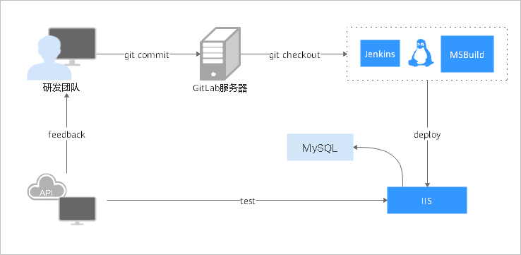

本节中各迁移步骤涉及到的服务及功能如下表所示：

<table><thead align="left"><tr id="row3414162920552"><th class="cellrowborder" valign="top" width="33.333333333333336%" id="mcps1.1.4.1.1">
<strong id="b5296123011517">迁移步骤</strong>

</th>
<th class="cellrowborder" valign="top" width="33.29332933293329%" id="mcps1.1.4.1.2">
<strong id="b03001930121514">Jenkins</strong>

</th>
<th class="cellrowborder" valign="top" width="33.373337333733375%" id="mcps1.1.4.1.3">
<strong id="b12303113018155">DevCloud</strong>

</th>
</tr>
</thead>
<tbody><tr id="row1141422910559"><td class="cellrowborder" valign="top" width="33.333333333333336%" headers="mcps1.1.4.1.1 ">
步骤一：源码管理迁移

</td>
<td class="cellrowborder" valign="top" width="33.29332933293329%" headers="mcps1.1.4.1.2 ">
GitLab托管

</td>
<td class="cellrowborder" valign="top" width="33.373337333733375%" headers="mcps1.1.4.1.3 ">
DevCloud代码仓库服务托管

</td>
</tr>
<tr id="row34147291552"><td class="cellrowborder" valign="top" width="33.333333333333336%" headers="mcps1.1.4.1.1 ">
步骤二：MSBuild构建迁移

</td>
<td class="cellrowborder" valign="top" width="33.29332933293329%" headers="mcps1.1.4.1.2 ">
Jenkins（Windows节点）的任务中选择MSBuild构建步骤

</td>
<td class="cellrowborder" valign="top" width="33.373337333733375%" headers="mcps1.1.4.1.3 ">
DevCloud中创建MSBuild构建任务

</td>
</tr>
<tr id="row12414529135517"><td class="cellrowborder" valign="top" width="33.333333333333336%" headers="mcps1.1.4.1.1 ">
步骤三：授信主机迁移

</td>
<td class="cellrowborder" valign="top" width="33.29332933293329%" headers="mcps1.1.4.1.2 ">
通过Power Shell脚本获取部署主机操作权限

</td>
<td class="cellrowborder" valign="top" width="33.373337333733375%" headers="mcps1.1.4.1.3 ">
DevCloud中主机组授信

</td>
</tr>
<tr id="row16414229115513"><td class="cellrowborder" valign="top" width="33.333333333333336%" headers="mcps1.1.4.1.1 ">
步骤四：IIS部署迁移

</td>
<td class="cellrowborder" valign="top" width="33.29332933293329%" headers="mcps1.1.4.1.2 ">
在部署主机上执行shell命令部署

</td>
<td class="cellrowborder" valign="top" width="33.373337333733375%" headers="mcps1.1.4.1.3 ">
通过DevCloud提供的原子步骤组合部署

</td>
</tr>
</tbody>
</table>

## **步骤一：源码管理迁移**

本节采用代码仓库是自建的GitLab代码仓库，如下图所示：

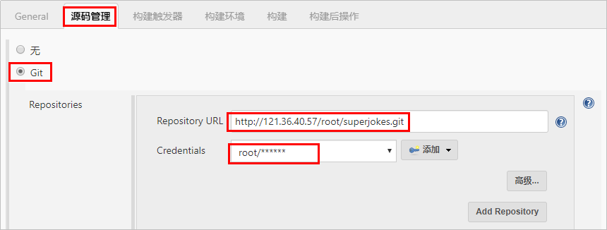

在新进行构建任务迁移前，源码迁移可采取以下两种方式：

方式一：通过华为云DevCloud的提供的导入外部仓库功能，直接进行线上导入。

方式二：先将GitLab上的代码仓库下载到本地，然后通过GitBash命令行上传到华为云DevCloud代码仓库。具体迁移操作请参考[GitLab迁移至DevCloud](GitLab迁移至DevCloud.md)。

## **步骤二：MSBuild构建迁移**

-   **构建任务迁移**

    本节采用的案例中，Jenkins使用的MSbuild构建环境版本信息如下：

    
    <table><thead align="left"><tr id="row67981228195517"><th class="cellrowborder" valign="top" width="33.33333333333333%" id="mcps1.1.4.1.1">
<strong id="b1440893115516">构建环境</strong>

    </th>
    <th class="cellrowborder" valign="top" width="33.33333333333333%" id="mcps1.1.4.1.2">
<strong id="b074716444487">Jenkins配置路径</strong>

    </th>
    <th class="cellrowborder" valign="top" width="33.33333333333333%" id="mcps1.1.4.1.3">
<strong id="b104261746368">本文案例使用的版本</strong>

    </th>
    </tr>
    </thead>
    <tbody><tr id="row7798162805510"><td class="cellrowborder" valign="top" width="33.33333333333333%" headers="mcps1.1.4.1.1 ">
MSBuild

    </td>
    <td class="cellrowborder" valign="top" width="33.33333333333333%" headers="mcps1.1.4.1.2 ">
系统管理 &gt; 全局工具配置 &gt; MSBuild

    </td>
    <td class="cellrowborder" valign="top" width="33.33333333333333%" headers="mcps1.1.4.1.3 ">
VS2015

    </td>
    </tr>
    </tbody>
    </table>

    操作步骤如下：

    1.  进入DevCloud项目，在“构建&发布  \>  编译构建“页面单击“新建任务“，输入任务名称，单击“下一步“。
    2.  源码源选择“DevCloud“，源码仓库选择在[步骤一](#section174124342917)中迁移的仓库，分支选择“master“，单击“下一步“。
    3.  构建模板选择“MSBuild“，单击“确定“，系统将自动跳转至“构建步骤“页面。
    4.  编辑构建步骤“Maven构建“：

        -   根据Jenkins中的构建环境，选择相应的工具版本。
        -   根据Jenkins待迁移任务“构建“页面“执行Windows批处理命令“命令行，在**powershell命令**窗口输入相应的构建命令。

        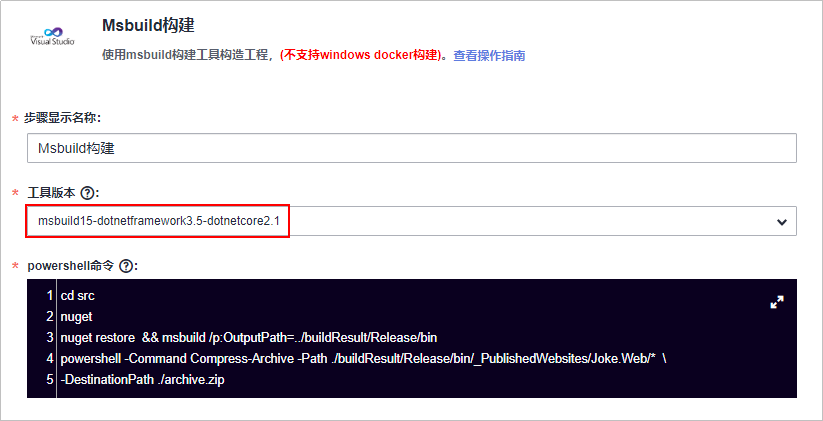

-   **构建包迁移**
    1.  进入Jenkins待迁移任务，在“构建后操作“页面查看归档路径。

        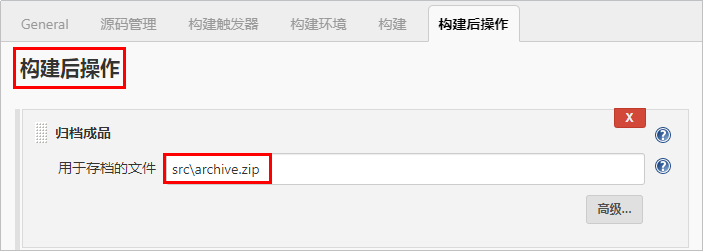

    2.  返回DevCloud构建任务，编辑构建步骤“上传软件包到软件发布库“，根据Jenkins设置输入构建包路径，单击“保存“。

        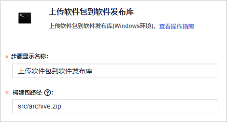

    3.  单击“保存并执行“，任务构建成功后，在“构建&发布  \>  发布“页面可搜索到生成的构建包。

## **步骤三：授信主机迁移**

本节采用的案例中，Jenkins中是在Powershell下，通过主机用户名、密码获取主机session，最终获得的主机操作权限。

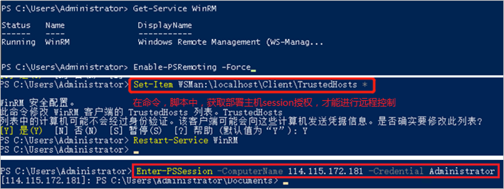

在DevCloud中，部署前的主机组配置操作步骤如下：

1.  参考[主机配置](https://support.huaweicloud.com/usermanual-deployman/deployman_hlp_00025.html#section0)，根据Jenkins任务使用的部署主机操作系统类型完成配置。
2.  进入DevCloud项目，在“设置  \>  通用设置  \>  主机组管理“页面单击“新建主机组“，根据页面提示输入必要信息，单击“保存“。
3.  单击“添加主机“，在弹窗中输入主机信息，单击“添加“保存。

    > **说明：** 
    >部署主机中原有的IIS环境无需更改。

## **步骤四：IIS部署迁移**

本节采用的案例中，Jenkins部署任务是在Powershell下，将构建包解压至IIS服务中，执行web.ps1脚本后重启IIS服务。

Jenkins部署任务设置主要通过脚本实现，本节案例中采用的脚本如下：

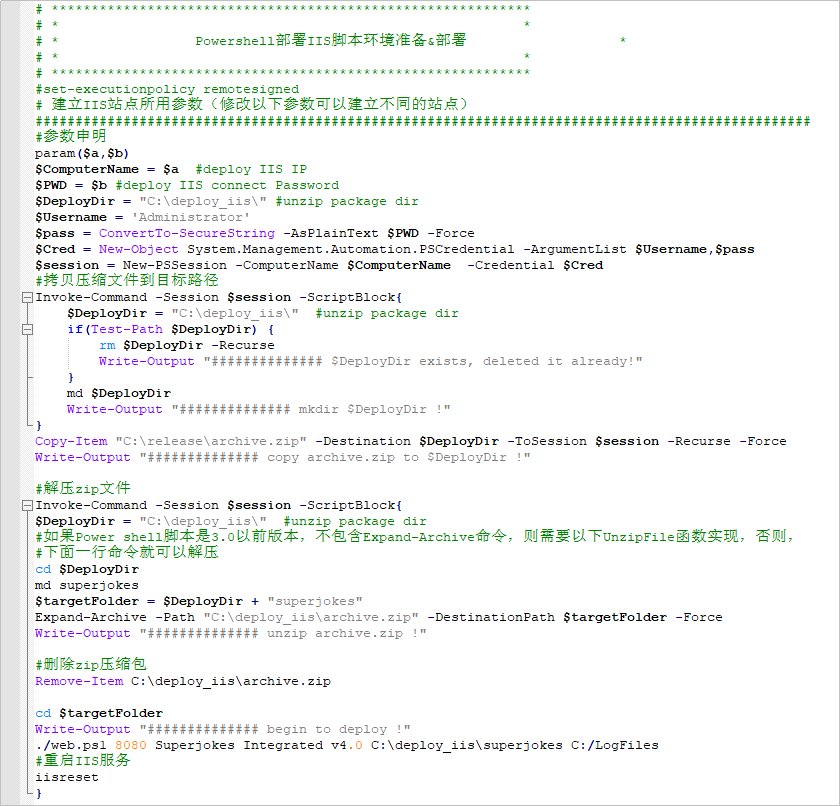

根据Jenkins部署方式，创建DevCloud部署任务如下：

1.  进入DevCloud项目，在“构建&发布  \>  部署“页面单击“新建任务“，输入任务名称，单击“下一步“。
2.  部署模板选择“不使用模板，直接创建“，系统将自动跳转至“部署步骤“页面。
3.  根据上面的脚本文件，添加以下部署步骤并进行配置，单击“保存“。
    -   **选择部署来源**：
        -   选择在[步骤三](#section172445617919)的主机组**。**
        -   源类型勾选构建任务，并选择在[步骤二](#section133731745997)创建的构建任务。
        -   根据脚本的配置输入下载到主机的部署目录。

            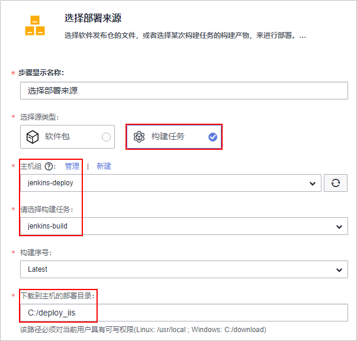

    -   **解压文件**：参考脚本中的配置，输入压缩文件路径与解压目录。

        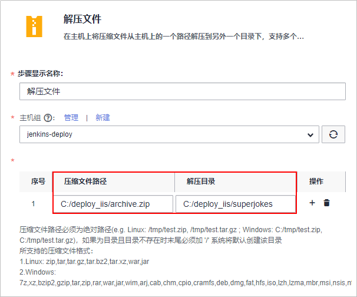

    -   **删除文件**：删除路径与步骤“解压文件“中的“压缩文件路径“一致。
    -   **配置文件修改**：参考下图编辑配置文件的绝对路径。

        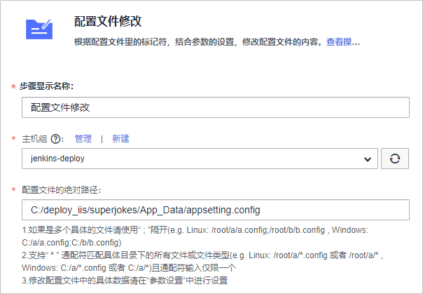

    -   **执行PowerShell脚本**：参考脚本中的配置，配置PowerShell脚本路径与脚本执行参数。

        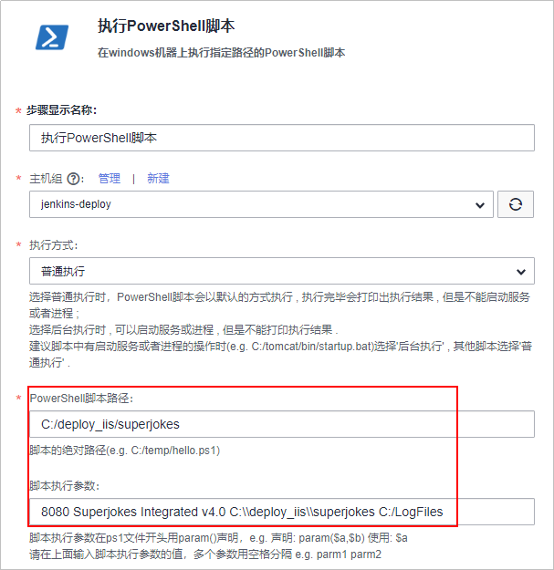

    -   **执行PowerShell命令**：参考脚本中的配置，在PowerShell命令窗口中输入相应的命令。

        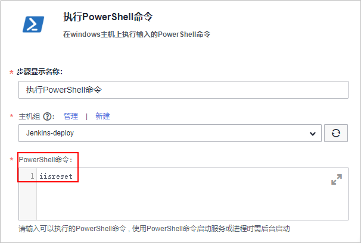

