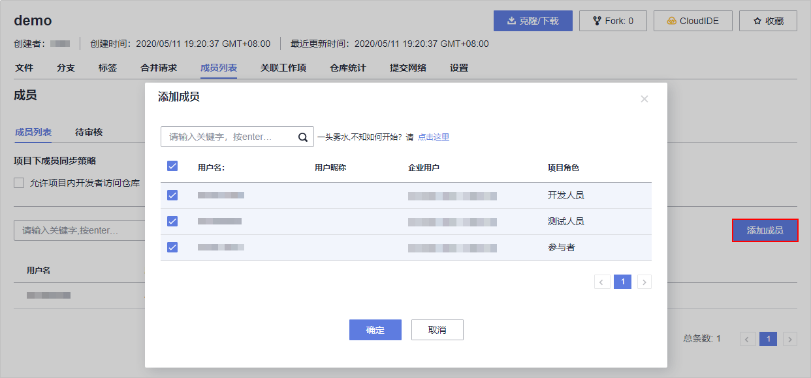
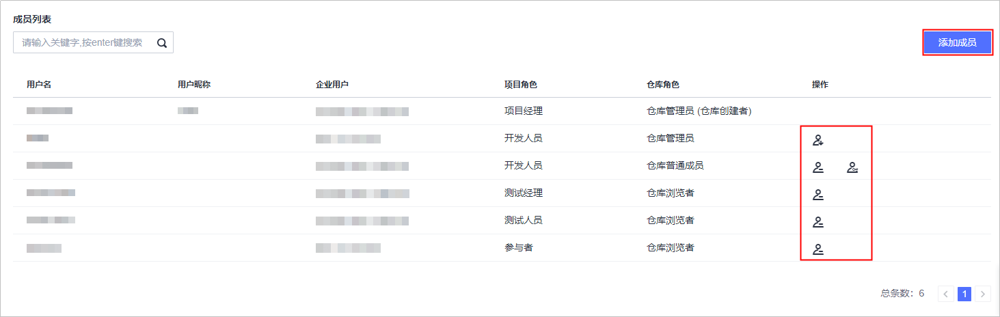

# **项目成员迁移**<a name="devcloud_migration_0002"></a>

## **迁移流程**<a name="section154856581710"></a>

项目成员迁移包括以下四个步骤：

-   [步骤一：获取GitLab群组信息](#section963518481815)

    从GitLab中导出已有的群组信息，此步骤提供了界面以及接口两种方式，帮助您获取已有GitLab群组信息。

-   [步骤二：创建项目](#section3511530113416)

    在DevCloud中创建用于成员管理的项目，并添加项目成员。

-   [步骤三：为项目成员分配角色](#section1521517353269)

    参照GitLab中的角色，在DevCloud中为成员设置相应的角色。

-   [步骤四：创建代码仓库](#section9872141515348)

    创建用于存放代码的空白仓库，并添加仓库成员。


## **步骤一：获取GitLab群组信息**<a name="section963518481815"></a>

-   **方法一：手动导出群组信息**

    登录GitLab，在“Groups“页面单击待迁移的群组，进入“Members“页面中查看群组所有成员的信息。

    

    > **说明：** 
    >页面中暂未提供导出信息功能，需要手动对照GitLab的群组信息，录入到DevCloud。


-   **方法二：通过API接口导出群组信息**

    1.  登录GitLab服务器，获取群组Owner用户的Private Token和id。

        例如，通过以下命令行，可在GitLab服务器中获取名为“xiaoyu”用户的id。

        ```
        gitlab-rails dbconsole
        \l
        \c gitlabhq production
        select id from users where name = 'xiaoyu'
        ```

    2.  通过curl命令导出群组信息压缩包，解压后可查看详细信息。

        ```
        curl --request POST --header "PRIVATE-TOKEN: <your_access_token>" /groups/:id/export
        ```

    更多操作指导，请参考GitLab官方参考链接[https://docs.gitlab.com/ee/api/group\_import\_export.html](https://docs.gitlab.com/ee/api/group_import_export.html)。


## **步骤二：创建项目**<a name="section3511530113416"></a>

DevCloud以项目为单位进行管理，需要先在DevCloud创建项目，才能往项目中迁移代码。

一个项目可以创建多个Git代码仓库，代码仓库安全级别较高，项目成员需要二次授权才能访问。

1.  使用华为云帐号登录[DevCloud](https://devcloud.cn-north-4.huaweicloud.com/home)。
2.  在页面左上角根据您业务所在区域就近选择区域，可减少网络时延，提高访问速度；不同区域之间互不相通。

    例如您当前在北京，区域可以就近选择“华北-北京四“。

    

3.  单击页面右上角“新建项目“，创建新的项目。

    DevCloud支持Scrum和看板两种项目类型，建议选择看板项目。

4.  项目创建成功后，会直接跳转到“成员管理“界面中添加成员。

    1.  如果“本企业用户“下已有需要添加的用户，直接勾选帐号添加。
    2.  如果还没有成员，则单击右上角“创建用户“跳转到统一身份认证服务IAM中，根据GitLab导出的用户进行创建。创建方法请参见[创建IAM用户](https://support.huaweicloud.com/usermanual-iam/iam_02_0001.html)。

    

    > **说明：** 
    >-   当项目中的成员数量小于等于5人时，不收取费用；当超过5人后，需要购买套餐才可以继续使用，套餐详情请参见[产品价格详情](https://www.huaweicloud.com/pricing.html?tab=detail#/devcloud)。
    >-   新帐号创建看板项目成功后，会看到弹框提示输入真实姓名，需完成此设置后才能添加项目成员。


## **步骤三：为项目成员分配角色**<a name="section1521517353269"></a>

DevCloud支持多种角色，同一个项目中的成员，根据项目角色的不同，拥有不同的操作权限。您可以根据自己的实际情况为项目成员设置角色。

GitLab中包含五种角色，分别为Owner、Master、Developer、Reporter、Guest。而DevCloud中项目成员包含七种角色，分别为：项目创建者、项目经理、测试经理、开发人员、测试人员、参与者、浏览者（不同权限角色的权限请参见[项目管理-角色与操作](https://support.huaweicloud.com/usermanual-projectman/projetcman_ug_3001.html)）。DevCloud角色分类比GitLab存在差异，无法完全对应。建议参照下表为DevCloud项目成员设置角色，角色设置方法请参见[项目管理-设置项目角色](https://support.huaweicloud.com/usermanual-projectman/devcloud_hlp_00026.html#section8)。若DevCloud提供的默认角色不符合您的需求，您可以通过“更多  \>  权限配置“添加角色。

<a name="table1751128145514"></a>
<table><thead align="left"><tr id="row18511428175513"><th class="cellrowborder" valign="top" width="50%" id="mcps1.1.3.1.1"><p id="p115132813555"><a name="p115132813555"></a><a name="p115132813555"></a>GitLab角色</p>
</th>
<th class="cellrowborder" valign="top" width="50%" id="mcps1.1.3.1.2"><p id="p35272855517"><a name="p35272855517"></a><a name="p35272855517"></a>DevCloud角色</p>
</th>
</tr>
</thead>
<tbody><tr id="row183181929123"><td class="cellrowborder" valign="top" width="50%" headers="mcps1.1.3.1.1 "><p id="p1731942918210"><a name="p1731942918210"></a><a name="p1731942918210"></a>Owner</p>
</td>
<td class="cellrowborder" valign="top" width="50%" headers="mcps1.1.3.1.2 "><p id="p133191229924"><a name="p133191229924"></a><a name="p133191229924"></a>项目创建者</p>
</td>
</tr>
<tr id="row18521328185518"><td class="cellrowborder" valign="top" width="50%" headers="mcps1.1.3.1.1 "><p id="p35242825515"><a name="p35242825515"></a><a name="p35242825515"></a>Master</p>
</td>
<td class="cellrowborder" valign="top" width="50%" headers="mcps1.1.3.1.2 "><p id="p1452628195517"><a name="p1452628195517"></a><a name="p1452628195517"></a>项目经理</p>
</td>
</tr>
<tr id="row95222812558"><td class="cellrowborder" valign="top" width="50%" headers="mcps1.1.3.1.1 "><p id="p752728165511"><a name="p752728165511"></a><a name="p752728165511"></a>Developer</p>
</td>
<td class="cellrowborder" valign="top" width="50%" headers="mcps1.1.3.1.2 "><p id="p13521928185517"><a name="p13521928185517"></a><a name="p13521928185517"></a>开发人员</p>
</td>
</tr>
<tr id="row16525287554"><td class="cellrowborder" valign="top" width="50%" headers="mcps1.1.3.1.1 "><p id="p165217289555"><a name="p165217289555"></a><a name="p165217289555"></a>Reporter</p>
</td>
<td class="cellrowborder" valign="top" width="50%" headers="mcps1.1.3.1.2 "><p id="p1352182895516"><a name="p1352182895516"></a><a name="p1352182895516"></a>测试经理/测试人员</p>
</td>
</tr>
<tr id="row131519395566"><td class="cellrowborder" valign="top" width="50%" headers="mcps1.1.3.1.1 "><p id="p163151393565"><a name="p163151393565"></a><a name="p163151393565"></a>Guest</p>
</td>
<td class="cellrowborder" valign="top" width="50%" headers="mcps1.1.3.1.2 "><p id="p10316339135620"><a name="p10316339135620"></a><a name="p10316339135620"></a>参与者/浏览者</p>
</td>
</tr>
</tbody>
</table>

## **步骤四：创建代码仓库**<a name="section9872141515348"></a>

完成项目创建后，请为项目创建代码仓库，用于存放代码。

1.  进入项目，单击页面上方导航“代码  \>  代码托管“，进入代码托管服务。
2.  单击右上角“普通新建“按钮，输入代码仓库名称单击“确定“保存。
3.  单击仓库名称进入代码仓库，选择“成员列表“页签，。

    单击“添加成员“，根据GitLab中的设置勾选仓库成员，单击“确定“保存。

    

4.  设置仓库角色：

    为了保障代码安全，代码托管服务有更进一步的成员管理。代码托管提供三种角色：仓库管理员 、仓库普通成员、仓库浏览者。

    项目成员加入代码仓库时，项目角色与仓库角色的映射关系、以及三种仓库角色的操作权限请参考[代码托管-基础角色权限](https://support.huaweicloud.com/usermanual-codehub/codehub_hlp_0005.html#section0)。

    单击可以将仓库普通成员升级为仓库管理员，单击可以将仓库管理员降级为仓库普通成员，单击可以删除仓库成员。

    


