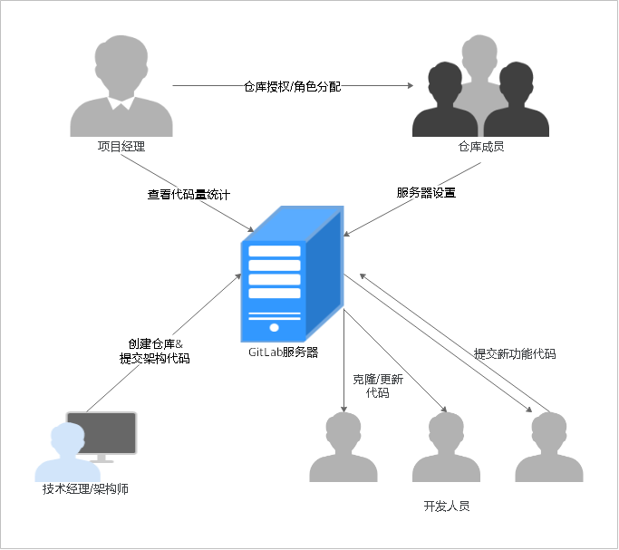

# **GitLab迁移概览**

本文主要介绍由GitLab向[软件开发平台DevCloud](https://www.huaweicloud.com/devcloud/)迁移的方案建议与操作指导。

GitLab是一个基于Git的、开源的、Web端代码管理工具。企业在公网或内网搭建GitLab服务器，研发团队成员使用Git终端工具与服务器进行交互操作。

迁移的目标代码托管平台DevCloud[代码托管服务](https://www.huaweicloud.com/product/codehub.html)（下文统称为CodeHub ）。CodeHub是基于Git的在线代码托管服务，是具备安全管控、成员/权限管理、分支保护/合并、在线编辑、统计服务等功能的云端代码仓库。使用代码托管服务，可以解决软件开发者在跨地域协同、多分支并发、代码版本管理、安全性等方面遇到的问题。

下表中列出了GitLab与DevCloud研发管理功能对照。

<table><thead align="left"><tr id="row3842143454"><th class="cellrowborder" colspan="2" valign="top" id="mcps1.1.6.1.1">
<strong id="b1429702318345">GitLab常见功能点</strong>

</th>
<th class="cellrowborder" valign="top" id="mcps1.1.6.1.2">
<strong id="b3313182312340">DevCloud对应功能点</strong>

</th>
<th class="cellrowborder" valign="top" id="mcps1.1.6.1.3">
<strong id="b163341223183416">能否迁移</strong>

</th>
<th class="cellrowborder" valign="top" id="mcps1.1.6.1.4">
<strong id="b6335102313341">DevCloud详细描述</strong>

</th>
</tr>
</thead>
<tbody><tr id="row208415146451"><td class="cellrowborder" rowspan="3" valign="top" width="10%" headers="mcps1.1.6.1.1 ">
项目管理

</td>
<td class="cellrowborder" valign="top" width="15%" headers="mcps1.1.6.1.1 ">
群组

</td>
<td class="cellrowborder" valign="top" width="15%" headers="mcps1.1.6.1.2 ">
项目

</td>
<td class="cellrowborder" valign="top" width="10%" headers="mcps1.1.6.1.3 ">
√

</td>
<td class="cellrowborder" valign="top" width="50%" headers="mcps1.1.6.1.4 ">
项目是DevCloud管理的基本单位，一个项目可以包含多个代码仓库。

</td>
</tr>
<tr id="row1784161410451"><td class="cellrowborder" valign="top" headers="mcps1.1.6.1.1 ">
子群组

</td>
<td class="cellrowborder" valign="top" headers="mcps1.1.6.1.1 ">
不涉及

</td>
<td class="cellrowborder" valign="top" headers="mcps1.1.6.1.2 ">
×

</td>
<td class="cellrowborder" valign="top" headers="mcps1.1.6.1.3 ">
无。

</td>
</tr>
<tr id="row1184111416456"><td class="cellrowborder" valign="top" headers="mcps1.1.6.1.1 ">
项目仓库

</td>
<td class="cellrowborder" valign="top" headers="mcps1.1.6.1.1 ">
代码仓库

</td>
<td class="cellrowborder" valign="top" headers="mcps1.1.6.1.2 ">
√

</td>
<td class="cellrowborder" valign="top" headers="mcps1.1.6.1.3 ">
可以为DevCloud新建项目创建多个代码仓库。

</td>
</tr>
<tr id="row148471454512"><td class="cellrowborder" rowspan="2" valign="top" width="10%" headers="mcps1.1.6.1.1 ">
角色管理

</td>
<td class="cellrowborder" valign="top" width="15%" headers="mcps1.1.6.1.1 ">
群组成员

</td>
<td class="cellrowborder" valign="top" width="15%" headers="mcps1.1.6.1.2 ">
项目成员

</td>
<td class="cellrowborder" valign="top" width="10%" headers="mcps1.1.6.1.3 ">
√

</td>
<td class="cellrowborder" valign="top" width="50%" headers="mcps1.1.6.1.4 ">
DevCloud项目成员默认分为七种角色，也可以根据项目需求自定义角色。

</td>
</tr>
<tr id="row178414147456"><td class="cellrowborder" valign="top" headers="mcps1.1.6.1.1 ">
项目成员

</td>
<td class="cellrowborder" valign="top" headers="mcps1.1.6.1.1 ">
仓库成员

</td>
<td class="cellrowborder" valign="top" headers="mcps1.1.6.1.2 ">
√

</td>
<td class="cellrowborder" valign="top" headers="mcps1.1.6.1.3 ">
DevCloud仓库成员分为三种，与项目成员角色进行对应。

</td>
</tr>
</tbody>
</table>

## **GitLab研发场景介绍**

企业在开展一个新项目时，一般由技术经理/架构师先完成项目架构，包括在GitLab服务器中新建仓库、设置成员角色，并上传架构代码到服务器，然后由研发人员拉取架构代码，在此基础上进行功能开发。

## **迁移场景介绍**

企业准备迁移时可能处于三种研发阶段：

-   新项目开始 ：此场景无存量代码，不涉及已有代码库迁移，是在DevCloud中新建项目以及仓库，进行各种研发操作，推荐阅读[项目成员迁移](GitLab迁移-项目成员迁移.md)和[代码分支迁移](代码分支迁移.md)。
-   项目研发过程中：此场景中有部分代码，不但包括已有代码迁移，也包括对分支的操作，推荐阅读[项目成员迁移](GitLab迁移-项目成员迁移.md)、[已有代码迁移](GitLab迁移-已有代码迁移.md)、[代码分支迁移](代码分支迁移.md)。
-   项目完成后：此场景有完整的代码，只是将DevCloud平台作为归档代码的迁移备份，推荐阅读[项目成员迁移](GitLab迁移-项目成员迁移.md)和[已有代码迁移](GitLab迁移-已有代码迁移.md)。

## **迁移前准备**

-   **帐号申请**：使用软件开发平台DevCloud前，请确保您已拥有已实名认证的华为云帐号；若您还没有华为云帐号，请先注册，并完成实名认证。
-   **Git客户端安装**：DevCloud代码托管服务支持与常用的Git终端工具交互，如Git Bash、TortoiseGit、EGit，Sourcetree等，您选择一个熟悉的工具安装即可。

