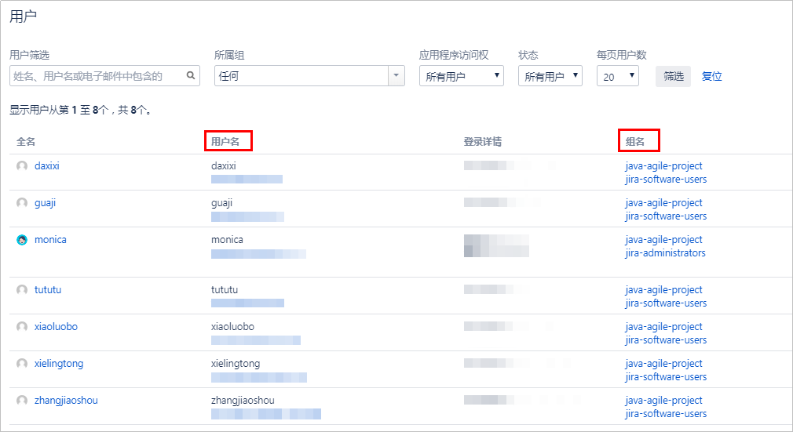
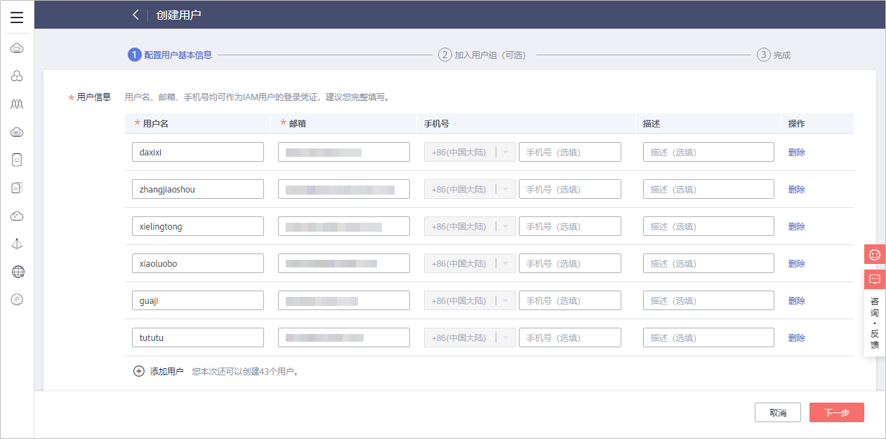
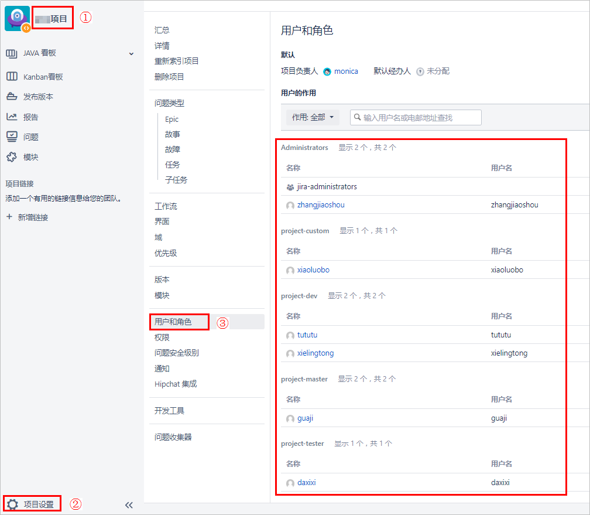
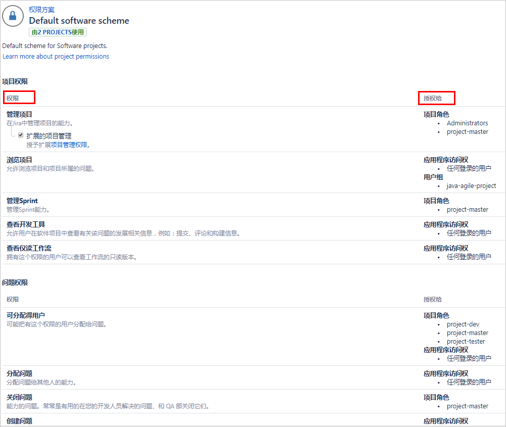
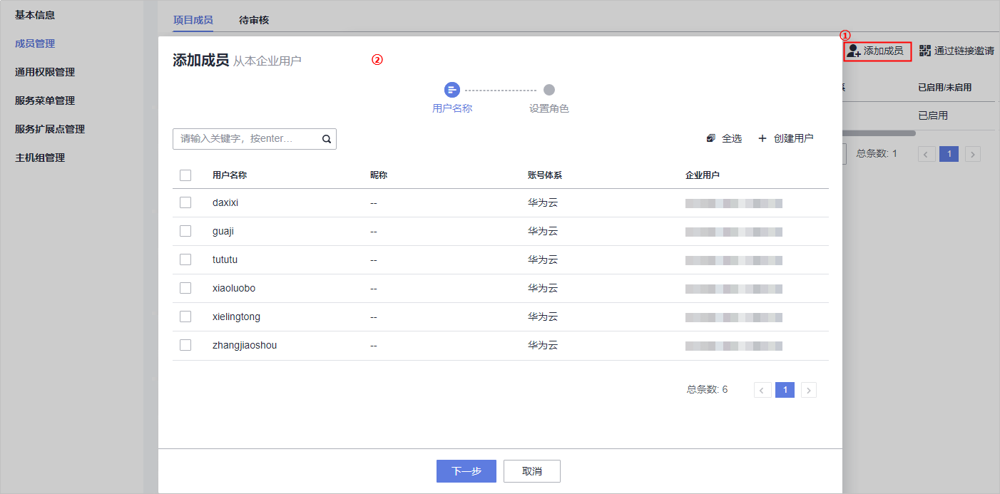
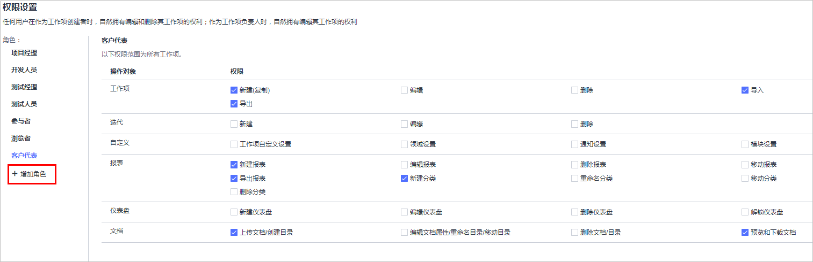

# **项目成员迁移**

项目成员迁移包括以下五个步骤：

-   [步骤一：获取JIRA用户信息](#section673204463416)
-   [步骤二：创建DevCloud平台用户](#section3424105011342)
-   [步骤三：获取JIRA项目成员/角色](#section135851954143413)
-   [步骤四：创建DevCloud项目](#section886460183511)
-   [步骤五：为DevCloud项目成员设置角色](#section1456011611358)

## **步骤一：获取JIRA用户信息**

使用管理员账号登录JIRA平台，在“管理  \>  用户管理“页面中获取用户信息。

## **步骤二：创建DevCloud平台用户**

1.  使用租户账号登录[DevCloud](https://devcloud.cn-north-4.huaweicloud.com/home)，单击右上角个人头像，在下拉菜单中选择“子账号管理“，进入统一身份认证服务。
2.  单击右上角“创建用户“，依次填入用户个人信息，根据页面提示创建该租户账号下的IAM子账号。

    

      

## **步骤三：获取JIRA项目成员/角色**

1.  获取项目成员：

    登录JIRA平台，进入准备迁移的项目，单击左下角“项目设置“，在“用户和角色“页面中获取项目成员/角色。

    

      

2.  获取项目角色拥有的权限：

    使用管理员账号登录JIRA平台，进入“问题  \>  权限方案“也面，查看项目对应的权限方案，方案中详细描述了各种角色拥有的操作权限。

    

      

## **步骤四：创建DevCloud项目**

DevCloud以项目为单位进行管理，新建项目分为两种类型：**Scrum项目**、**看板项目**。

由于Scrum项目类型提供了更为丰富的项目设置功能，因此建议JIRA平台中的**Scrum开发方法**、**Kanban开发方法**等都迁移至DevCloud的Scrum项目类型。

1.  使用华为云账号登录[DevCloud](https://devcloud.cn-north-4.huaweicloud.com/home)。
2.  在面左上角根据您业务所在区域就近选择区域，可减少网络时延，提高访问速度；不同区域之间互不相通。

    例如您当前在北京，区域可以就近选择“华北-北京四“。

    

      

3.  单击“新建项目“，创建新的Scrum项目。

    项目创建成功后，系统将跳转至“Backlog“页面。

4.  在“设置  \>  通用设置  \>  成员管理“页面中，单击“添加成员“，在下拉列表中选择“从本企业用户“。

    在弹框中勾选需要添加的成员，按照页面提示完成项目成员的添加。

    

      

    > **说明：**   
    >当项目中的成员数量小于等于5人时，不收取费用；当超过5人后，需要购买套餐才可以继续使用，套餐请参见[产品价格详情](https://www.huaweicloud.com/pricing.html?tab=detail#/devcloud)。  

## **步骤五：为DevCloud项目成员设置角色**

JIRA中包含了多种角色：Administrators、project-master、project-custom、project-dev、project-tester，这些角色除Administrators外都是使用者自定义的。

DevCloud中的默认项目角色包括：项目创建者、项目经理、测试经理、开发人员、测试人员、参与者、浏览者（不同权限角色的权限请参见[角色与操作](https://support.huaweicloud.com/usermanual-projectman/projetcman_ug_3001.html)）。

由于JIRA平台角色是自定义的，因此在两个平台进行角色迁移时，需要根据各角色拥有的权限进行匹配。当DevCloud默认角色无法满足JIRA角色需要，可以在“设置  \>  项目设置  \>  权限设置“页面新增角色，并按照JIRA中角色权限勾选对应的操作权限。

完成角色设置后，返回“设置  \>  通用设置  \>  成员管理“页面，参考[设置项目角色](https://support.huaweicloud.com/usermanual-projectman/devcloud_hlp_00026.html#section8)为每个项目成员设置角色。

  

