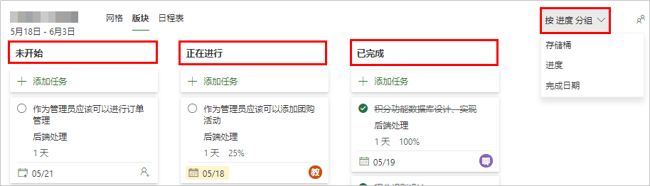
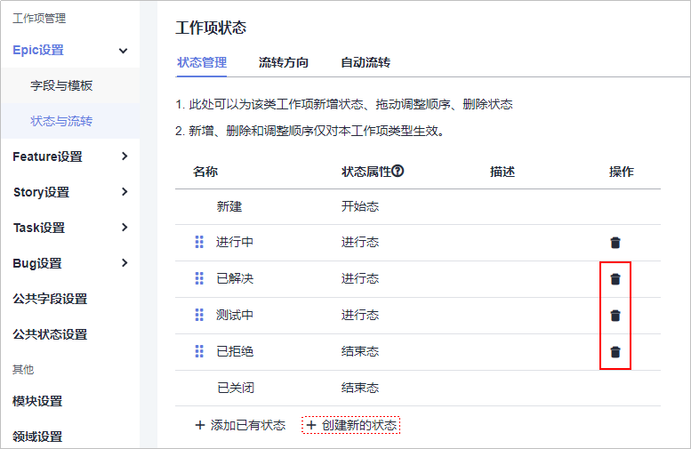
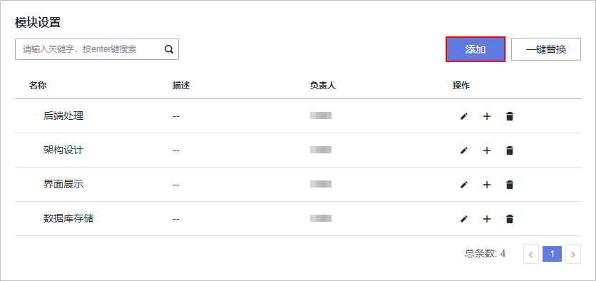

# **工作项迁移**

## **工作项类型映射**

MSP平台没有将工作项分为不同的类型，只是划分成多级的父子结构（通常最深为四级）。

DevCloud的Scrum项目类型中采用的是标准的Scrum开发框架，工作项层级划分为Epic\>Feature\>Story\>Task&Bug。

<table><thead align="left"><tr id="row12468629191111"><th class="cellrowborder" valign="top" width="20%" id="mcps1.1.3.1.1">
<strong id="b68610358112">工作项类型</strong>

</th>
<th class="cellrowborder" valign="top" width="80%" id="mcps1.1.3.1.2">
<strong id="b1775493921118">类型说明</strong>

</th>
</tr>
</thead>
<tbody><tr id="row94681329161115"><td class="cellrowborder" valign="top" width="20%" headers="mcps1.1.3.1.1 ">
Epic

</td>
<td class="cellrowborder" valign="top" width="80%" headers="mcps1.1.3.1.2 ">
描述了旨在帮助最终用户解决商业与技术问题的一系列活动（activities）或者一个工作流（workflow）。对于规模和复杂性非常大的产品，可以拆分成多个Epic。Epic较大，一般无法或者不容易估算工作量。

</td>
</tr>
<tr id="row19468102961111"><td class="cellrowborder" valign="top" width="20%" headers="mcps1.1.3.1.1 ">
Feature

</td>
<td class="cellrowborder" valign="top" width="80%" headers="mcps1.1.3.1.2 ">
产品功能，代表产品的某个特性，可以做什么，可以提供什么服务。

</td>
</tr>
<tr id="row144682029121120"><td class="cellrowborder" valign="top" width="20%" headers="mcps1.1.3.1.1 ">
Story

</td>
<td class="cellrowborder" valign="top" width="80%" headers="mcps1.1.3.1.2 ">
User Story的缩写，是从用户角度对产品需求的详细描述，更小粒度的功能。在项目开始初期，将Epic细化成带有优先级的Story列表，称为Product Backlog。

</td>
</tr>
<tr id="row34681029131119"><td class="cellrowborder" valign="top" width="20%" headers="mcps1.1.3.1.1 ">
Task

</td>
<td class="cellrowborder" valign="top" width="80%" headers="mcps1.1.3.1.2 ">
将一个Story划分成更小的单元，便于每天跟踪工作进度。

</td>
</tr>
<tr id="row346816294115"><td class="cellrowborder" valign="top" width="20%" headers="mcps1.1.3.1.1 ">
Bug

</td>
<td class="cellrowborder" valign="top" width="80%" headers="mcps1.1.3.1.2 ">
产品缺陷，既可以是Story的子工作项，便于追溯；也可以不属于某一个功能，独立存在。

</td>
</tr>
</tbody>
</table>

MSP与DevCloud中工作项类型的映射关系如下表所示：

<table><thead align="left"><tr id="row59918221919"><th class="cellrowborder" valign="top" width="50%" id="mcps1.1.3.1.1">
<strong id="b1358183018193">MSP工作项类型</strong>

</th>
<th class="cellrowborder" valign="top" width="50%" id="mcps1.1.3.1.2">
<strong id="b113701330111916">DevCloud工作项类型</strong>

</th>
</tr>
</thead>
<tbody><tr id="row2994241916"><td class="cellrowborder" valign="top" width="50%" headers="mcps1.1.3.1.1 ">
1级（大纲编号1）

</td>
<td class="cellrowborder" valign="top" width="50%" headers="mcps1.1.3.1.2 ">
Epic

</td>
</tr>
<tr id="row169912161920"><td class="cellrowborder" valign="top" width="50%" headers="mcps1.1.3.1.1 ">
2级（大纲编号1.1）

</td>
<td class="cellrowborder" valign="top" width="50%" headers="mcps1.1.3.1.2 ">
Feature

</td>
</tr>
<tr id="row14996213198"><td class="cellrowborder" valign="top" width="50%" headers="mcps1.1.3.1.1 ">
3级（大纲编号1.1.1）

</td>
<td class="cellrowborder" valign="top" width="50%" headers="mcps1.1.3.1.2 ">
Story

</td>
</tr>
<tr id="row19919211918"><td class="cellrowborder" valign="top" width="50%" headers="mcps1.1.3.1.1 ">
4级（大纲编号1.1.1.1）

</td>
<td class="cellrowborder" valign="top" width="50%" headers="mcps1.1.3.1.2 ">
Task&amp;Bug

</td>
</tr>
</tbody>
</table>

> **说明：**   
>上表为MSP为四级父子工作项时的对应关系。  
>当MSP父子深度小于四级时，本文建议从Task&Bug向上映射。例如：MSP为三级父子关系时，不需要与Epic进行映射。  

## **工作流迁移**

MSP和DevCloud平台中不同类型的工作项可以有拥有属于自己的工作流，包括工作项状态和状态流转规则。两个平台都有默认的工作流并支持自定义。

1.  **获取MSP工作流**

    进入MSP平台中待迁移的项目，单击页面上方导航栏“版块“，在页面右上角下拉列表中选择“按进度分组“，即可获取工作流。

    

      

2.  **创建DevCloud工作流**
    1.  进入DevCloud项目，在“设置  \>  项目设置  \>  Epic设置  \>  状态与流转  \>  状态管理“页面中，根据MSP状态流设置工作项状态。

        本文案例中保留新建、进行中、已关闭三种状态，分别对应MSP中的未开始、正在进行、已完成，其余状态均删除。

        若需要添加状态，请单击“创建新的状态“。

        

          

    2.  按照相同的方法，设置Feature、Story、Task、Bug的状态。
    3.  进入“流转方向“页面，按照需要勾选各状态之间的流转方向。

        例如：不可以对已经关闭的工作项重新置成新建，则不勾选从**关闭**向**新建**流转的复选框。

        

          

## **模块迁移**

1.  **获取MSP存储桶**

    进入MSP平台中待迁移的项目，单击页面上方导航栏“版块“，在页面右上角下拉列表中选择“按存储分组“，即可获取存储桶。

    

      

2.  **创建DevCloud模块**

    进入DevCloud项目，在“设置  \>  项目设置  \>  模块设置“页面，单击页面右上角“添加“，根据MSP存储桶设置添加模块及负责人。

    

      

## **工作项内容迁移**

1.  **导出MSP工作项**

    MSP仅支持Online产品的导出功能，单击MSP首页下方的“转到Project Online“，在Project Online中导出工作项。

    导出操作详情请参见[将Project Online项目导出到Microsoft Excel](https://support.office.com/zh-cn/article/%e5%b0%86-project-online-%e9%a1%b9%e7%9b%ae%e5%af%bc%e5%87%ba%e5%88%b0-microsoft-excel-f338cc8e-cebd-4344-9d9f-73a8cbf0561b?ui=zh-CN&rs=zh-CN&ad=CN)。

2.  **导出DevCloud工作项模板**
    1.  进入DevCloud已创建的项目，在“工作  \>  工作项“页面中，单击右上角在下拉列表中单击“导入“。
    2.  在弹框中单击“下载模板“。

        

          

3.  **填充DevCloud工作项模板**

    将MSP的字段信息拷贝至DevCloud模板对应列中，本文建议对应关系如下：

    
    <table><thead align="left"><tr id="row16686184616164"><th class="cellrowborder" valign="top" width="50%" id="mcps1.1.3.1.1">
<strong id="b18732917191717">MSP字段</strong>

    </th>
    <th class="cellrowborder" valign="top" width="50%" id="mcps1.1.3.1.2">
<strong id="b1274321761711">DevCloud字段</strong>

    </th>
    </tr>
    </thead>
    <tbody><tr id="row568612468166"><td class="cellrowborder" valign="top" width="50%" headers="mcps1.1.3.1.1 ">
分配对象

    </td>
    <td class="cellrowborder" valign="top" width="50%" headers="mcps1.1.3.1.2 ">
处理人

    </td>
    </tr>
    <tr id="row5686646101613"><td class="cellrowborder" valign="top" width="50%" headers="mcps1.1.3.1.1 ">
开始日期

    </td>
    <td class="cellrowborder" valign="top" width="50%" headers="mcps1.1.3.1.2 ">
预计开始日期

    </td>
    </tr>
    <tr id="row13686174617163"><td class="cellrowborder" valign="top" width="50%" headers="mcps1.1.3.1.1 ">
完成

    </td>
    <td class="cellrowborder" valign="top" width="50%" headers="mcps1.1.3.1.2 ">
预计结束日期

    </td>
    </tr>
    <tr id="row168674601616"><td class="cellrowborder" valign="top" width="50%" headers="mcps1.1.3.1.1 ">
所耗时间

    </td>
    <td class="cellrowborder" valign="top" width="50%" headers="mcps1.1.3.1.2 ">
预计工时

    </td>
    </tr>
    <tr id="row1168664611160"><td class="cellrowborder" valign="top" width="50%" headers="mcps1.1.3.1.1 ">
完成工作量

    </td>
    <td class="cellrowborder" valign="top" width="50%" headers="mcps1.1.3.1.2 ">
实际工时

    </td>
    </tr>
    <tr id="row19686114661612"><td class="cellrowborder" valign="top" width="50%" headers="mcps1.1.3.1.1 ">
完成百分比（0%、其它、100%）

    </td>
    <td class="cellrowborder" valign="top" width="50%" headers="mcps1.1.3.1.2 ">
状态（新建、进行中、已关闭）

    </td>
    </tr>
    <tr id="row16686164661615"><td class="cellrowborder" valign="top" width="50%" headers="mcps1.1.3.1.1 ">
存储桶

    </td>
    <td class="cellrowborder" valign="top" width="50%" headers="mcps1.1.3.1.2 ">
模块

    </td>
    </tr>
    </tbody>
    </table>

    此外，根据MSP表格中的“依据&后续任务“，可在DevCloud模板中的“优先级“列中，将依据项设置为高优先级，后续任务设置为中或者低优先级。

4.  **导入DevCloud工作项**
    1.  回工作项页面，单击“更多操作  \>  导入“，选择编辑好的EXCEL文件，单击“导入“。
    2.  关联工作项
        -   父子关系关联：在DevCloud平台中，找到子工作项，编辑“父工作项“字段，根据MSP中记录的父子关系，选择相应的父工作项。
        -   依赖关系关联：在DevCloud平台中，根据MSP中记录的“依据&后续任务“关系，在工作项详情页中添加相应的关联工作项。

  

