# **SVN+Gradle+Docker场景迁移**

本节介绍的迁移场景如下：

-   编程语言：Java。
-   源码托管在SVN私有库中。
-   Jenkins任务使用Maven构建工具。
-   运行在Jenkins服务器的Linux节点。
-   部署目标机需要提前安装Docker环境。
-   镜像管理使用搭建的HarBor仓库。

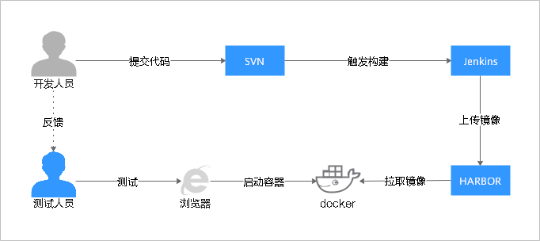

本节中各迁移步骤涉及到的服务及功能如下表所示：

<table><thead align="left"><tr id="row3414162920552"><th class="cellrowborder" valign="top" width="33.333333333333336%" id="mcps1.1.4.1.1">
<strong id="b5296123011517">迁移步骤</strong>

</th>
<th class="cellrowborder" valign="top" width="33.29332933293329%" id="mcps1.1.4.1.2">
<strong id="b03001930121514">Jenkins</strong>

</th>
<th class="cellrowborder" valign="top" width="33.373337333733375%" id="mcps1.1.4.1.3">
<strong id="b12303113018155">DevCloud</strong>

</th>
</tr>
</thead>
<tbody><tr id="row1141422910559"><td class="cellrowborder" valign="top" width="33.333333333333336%" headers="mcps1.1.4.1.1 ">
步骤一：源码管理迁移

</td>
<td class="cellrowborder" valign="top" width="33.29332933293329%" headers="mcps1.1.4.1.2 ">
SVN托管

</td>
<td class="cellrowborder" valign="top" width="33.373337333733375%" headers="mcps1.1.4.1.3 ">
DevCloud代码仓库服务托管

</td>
</tr>
<tr id="row34147291552"><td class="cellrowborder" valign="top" width="33.333333333333336%" headers="mcps1.1.4.1.1 ">
步骤二：镜像仓迁移

</td>
<td class="cellrowborder" valign="top" width="33.29332933293329%" headers="mcps1.1.4.1.2 ">
自建HarBor镜像仓

</td>
<td class="cellrowborder" valign="top" width="33.373337333733375%" headers="mcps1.1.4.1.3 ">
华为云容器镜像服务

</td>
</tr>
<tr id="row12414529135517"><td class="cellrowborder" valign="top" width="33.333333333333336%" headers="mcps1.1.4.1.1 ">
步骤三：Gradle构建迁移

</td>
<td class="cellrowborder" valign="top" width="33.29332933293329%" headers="mcps1.1.4.1.2 ">
Jenkins的任务中选择Gradle构建步骤

</td>
<td class="cellrowborder" valign="top" width="33.373337333733375%" headers="mcps1.1.4.1.3 ">
DevCloud中创建Gradle构建任务

</td>
</tr>
<tr id="row16414229115513"><td class="cellrowborder" valign="top" width="33.333333333333336%" headers="mcps1.1.4.1.1 ">
步骤四：构建镜像迁移

</td>
<td class="cellrowborder" valign="top" width="33.29332933293329%" headers="mcps1.1.4.1.2 ">
通过PostSteps执行shell命令构建镜像，并上传HarBor镜像仓

</td>
<td class="cellrowborder" valign="top" width="33.373337333733375%" headers="mcps1.1.4.1.3 ">
DevCloud中制作镜像并推送到镜像仓库

</td>
</tr>
<tr id="row1349521918546"><td class="cellrowborder" valign="top" width="33.333333333333336%" headers="mcps1.1.4.1.1 ">
步骤五：容器部署迁移

</td>
<td class="cellrowborder" valign="top" width="33.29332933293329%" headers="mcps1.1.4.1.2 ">
在授信主机上执行shell命令部署

</td>
<td class="cellrowborder" valign="top" width="33.373337333733375%" headers="mcps1.1.4.1.3 ">
通过DevCloud提供的原子步骤组合部署

</td>
</tr>
</tbody>
</table>

## **步骤一：源码管理迁移**

本节采用代码仓库是自建的GitLab代码仓库，如下图所示：

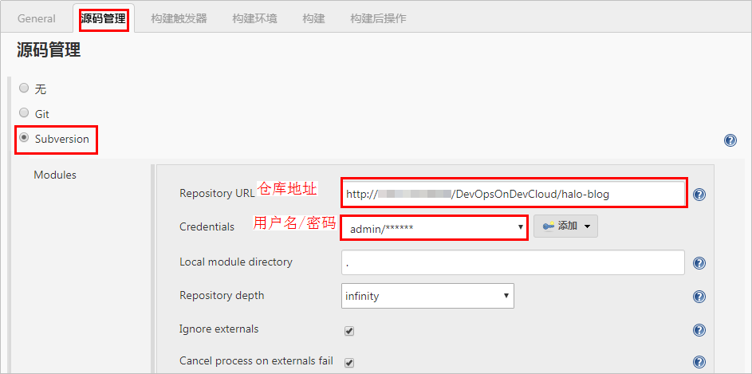

在新进行构建任务迁移前，源码迁移可采取以下两种方式：

-   方式一：通过华为云DevCloud的提供的导入外部仓库功能，直接进行线上导入。
-   方式二：先将SVN上的代码仓库下载到本地，然后通过GitBash命令行上传到华为云DevCloud代码仓库。

两种源码迁移方式的详细操作步骤，请参考[SVN迁移至DevCloud](SVN迁移至DevCloud.md)。

## **步骤二：镜像仓迁移**

进入DevCloud项目，在“设置  \>  通用设置  \>  服务扩展点管理“页面中单击“新建服务扩展点  \>  Docker repository“，在弹出的页面中输入服务扩展点名称、HarBor镜像仓地址、用户名、密码等信息，单击“确定“保存。

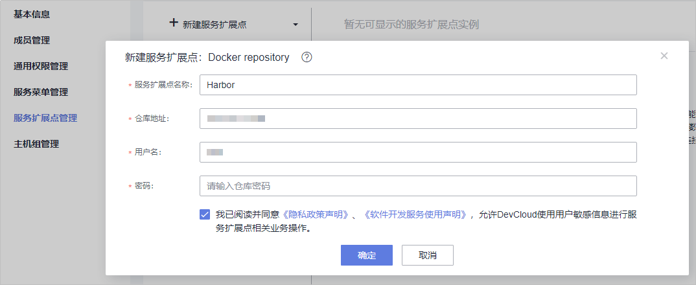

> **说明：** 
>相较于HarBor镜像仓，华为云容器镜像服务（下文统称为SWR）具有操作简单、即开即用等特点，您可已根据实际场景需要，选择是否进行SWR迁移。如需对SWR了解更多，请参考[SWR帮助中心](https://support.huaweicloud.com/swr/index.html)。
>若进行SWR迁移，上图中请填写对应SWR镜像仓信息。

## **步骤三：Gradle构建迁移**

-   **构建任务迁移**

    本节采用的案例中，Jenkins使用的Gradle构建环境版本信息如下：

    
    <table><thead align="left"><tr id="row67981228195517"><th class="cellrowborder" valign="top" width="33.33333333333333%" id="mcps1.1.4.1.1">
<strong id="b1440893115516">构建环境</strong>

    </th>
    <th class="cellrowborder" valign="top" width="33.33333333333333%" id="mcps1.1.4.1.2">
<strong id="b174091834555">Jenkins配置路径</strong>

    </th>
    <th class="cellrowborder" valign="top" width="33.33333333333333%" id="mcps1.1.4.1.3">
<strong id="b104261746368">本文案例使用的版本</strong>

    </th>
    </tr>
    </thead>
    <tbody><tr id="row7798162805510"><td class="cellrowborder" valign="top" width="33.33333333333333%" headers="mcps1.1.4.1.1 ">
Gradle

    </td>
    <td class="cellrowborder" valign="top" width="33.33333333333333%" headers="mcps1.1.4.1.2 ">
系统管理 &gt; 全局工具配置 &gt; Gradle

    </td>
    <td class="cellrowborder" valign="top" width="33.33333333333333%" headers="mcps1.1.4.1.3 ">
Gradle Wrapper

    </td>
    </tr>
    <tr id="row1779882814554"><td class="cellrowborder" valign="top" width="33.33333333333333%" headers="mcps1.1.4.1.1 ">
JDK

    </td>
    <td class="cellrowborder" valign="top" width="33.33333333333333%" headers="mcps1.1.4.1.2 ">
系统管理 &gt; 全局工具配置 &gt; JDK

    </td>
    <td class="cellrowborder" valign="top" width="33.33333333333333%" headers="mcps1.1.4.1.3 ">
1.8

    </td>
    </tr>
    </tbody>
    </table>

    操作步骤如下：

    1.  进入DevCloud项目，在“构建&发布  \>  编译构建“页面单击“新建任务“，输入任务名称，单击“下一步“。
    2.  源码源选择“DevCloud“，源码仓库选择在[步骤一](#section13411821515)中迁移的仓库，分支选择“master“，单击“下一步“。
    3.  构建模板选择“Gradle“，单击“确定“，系统将自动跳转至“构建步骤“页面。
    4.  编辑构建步骤“Gradle构建“：

        -   根据Jenkins中的构建环境，选择相应的**Gradle**与**JDK版本**。
        -   根据Jenkins待迁移任务“构建“页面的“Use Gradle Wrapper  \>  Tasks“s命令，在**命令**窗口输入相应的构建命令。

        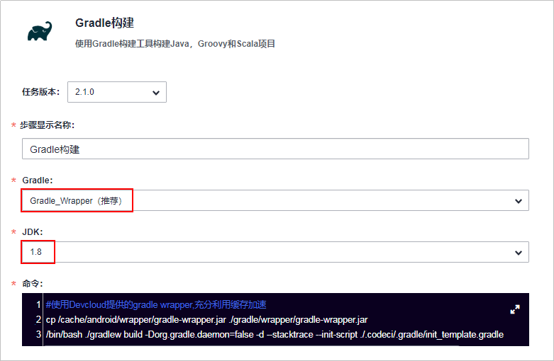

-   **构建包迁移**
    1.  进入Jenkins待迁移任务，在“构建后操作“页面查看归档路径。

        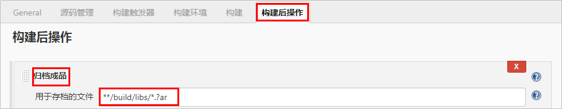

    2.  返回DevCloud构建任务，编辑构建步骤“上传软件包到软件发布库“，根据Jenkins设置输入**构建包路径**。

        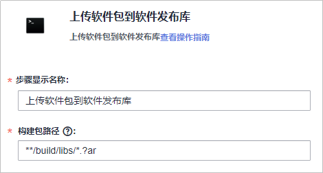

    3.  单击，添加步骤“上传软件包到软件发布库“，**构建包路径**输入“Dockerfile“，单击“保存“。

## **步骤四：构建镜像迁移**

本节采用的案例中，Jenkins使用的Docker构建环境版本信息如下：

<table><thead align="left"><tr id="row1995026659"><th class="cellrowborder" valign="top" width="50%" id="mcps1.1.3.1.1">
<strong id="b19950156255">构建环境</strong>

</th>
<th class="cellrowborder" valign="top" width="50%" id="mcps1.1.3.1.2">
<strong id="b1995016458">本文案例使用的版本</strong>

</th>
</tr>
</thead>
<tbody><tr id="row11950861252"><td class="cellrowborder" valign="top" width="50%" headers="mcps1.1.3.1.1 ">
Docker

</td>
<td class="cellrowborder" valign="top" width="50%" headers="mcps1.1.3.1.2 ">
19.03.8

</td>
</tr>
</tbody>
</table>

-   **主机组迁移**

    本节使用的案例中，采用部署任务进行构建镜像的迁移，创建部署任务前需要配置主机。

    1.  登录Jenkins，在“系统管理  \>  系统配置“页面，查看“SSH remote hosts“板块信息。

        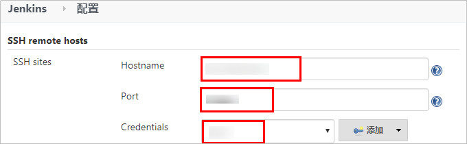

    2.  进入DevCloud项目，在“设置  \>  通用设置  \>  主机组管理“页面单击“新建主机组“，根据页面提示输入必要信息，单击“保存“。
    3.  单击“添加主机“，在弹窗中根据Jenkins设置输入主机信息，单击“添加“保存。

-   **构建任务迁移**
    1.  进入Jenkins待迁移任务，在“构建“页面，查看“执行shell“板块中的命令窗口。

        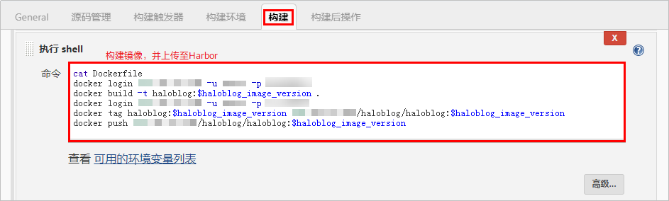

    2.  在“General“页面查看参数设置。

        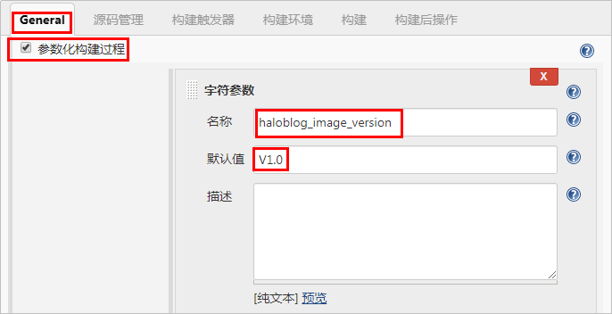

    3.  进入DevCloud项目，在“构建&发布  \>  部署“页面单击“新建任务“，输入任务名称，单击“下一步“。
    4.  部署模板选择“Docker应用部署（Linux）“，单击“下一步“，系统将自动跳转至“部署步骤“页面。
    5.  选择“参数设置“页签，根据Jenkins配置添加参数。

        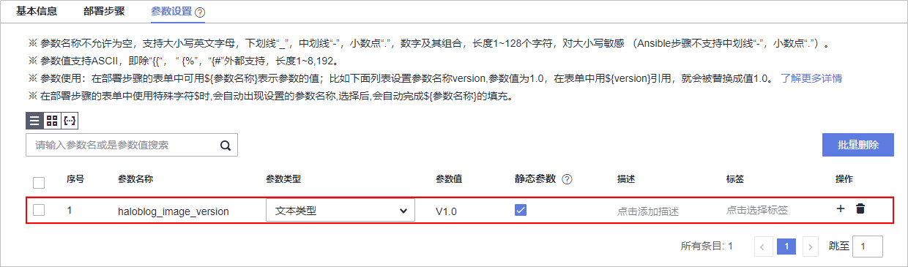

    6.  选择“部署步骤“页签：
        -   **安装Docker**：选择前面创建的主机组，并根据需要选择在主机上安装的Docker版本。
        -   **登录Docker镜像仓**：镜像仓选择[步骤二](#section125491615351)中迁移的HarBor镜像仓接入点。
        -   **选择部署来源（含Dockerfile文件）**：选择源类型为“构建任务“，并选择[步骤三](#section2795134119514)中迁移的构建任务，填写下载到主机的部署目录。
        -   **构建镜像**：Dockerfile文件路径输入步骤“选择部署来源（含Dockerfile文件）“中的下载目录，并根据Jenkins命令行输入执行参数。

            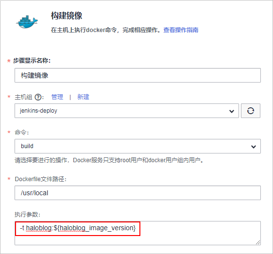

        -   **镜像打标签**：参考Jenkins配置输入执行参数。

            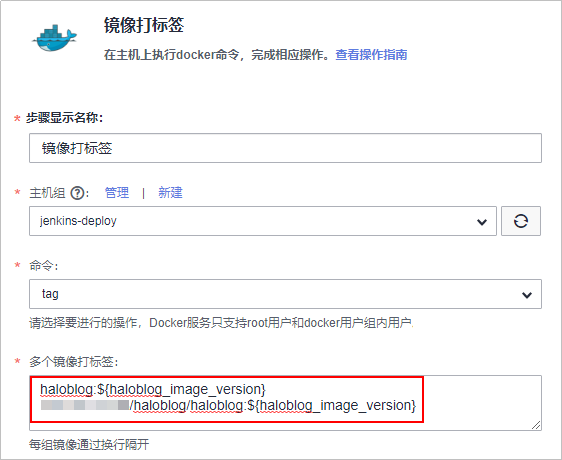

        -   **镜像上传到镜像仓**：参考Jenkins配置输入执行配置。

            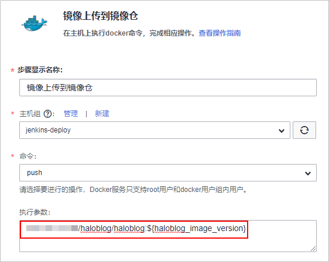

            > **说明：** 
            >部署步骤“镜像打标签“及“镜像上传到镜像仓“中所参考的Habor推送镜像配置如下：
            >

## **步骤五：容器部署迁移**

1.  进入Jenkins待迁移任务，在“构建“页面查看“Execute shell script on remote host using ssh“版块中的命令行。

    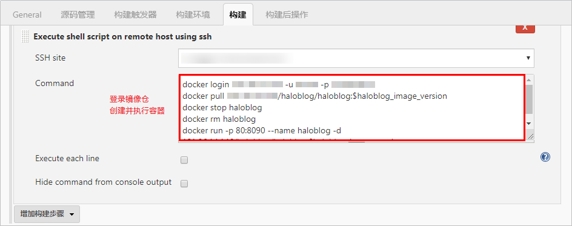

2.  根据Jenkins配置，设置部署任务步骤。
    -   在步骤“镜像上传到镜像仓“后添加步骤“执行Docker命令“：
        -   修改**步骤显示名称**为“停止容器“，**命令**选择“stop“。
        -   第一次执行的时候此步骤时，并未创建容器，所以此步骤会执行失败，因此需勾选“失败后继续运行“。

    -   再一次添加步骤“执行Docker命令“：
        -   修改**步骤显示名称**为“删除容器“，**命令**选择“rm“。
        -   第一次执行的时候此步骤时，并未创建容器，所以此步骤会执行失败，因此需勾选“失败后继续运行“。

    -   编辑“步骤创建并启动容器“：参考Jenkins配置输入执行参数。

        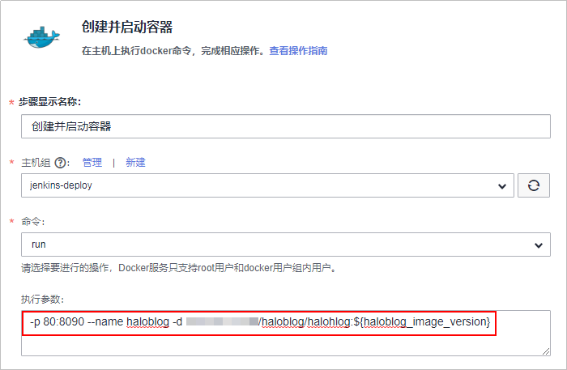

