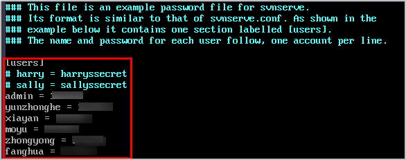
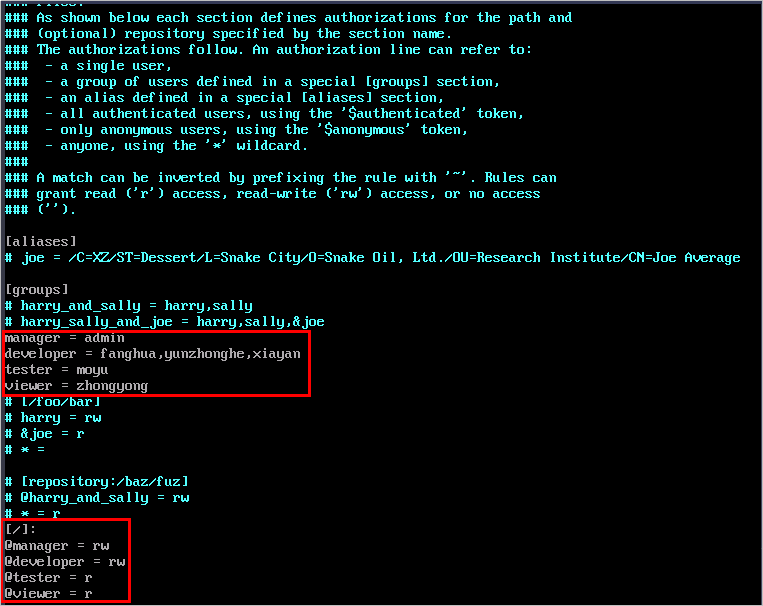
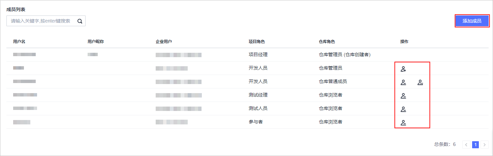

# **项目成员迁移**

## **迁移流程**

项目成员迁移包括以下四个步骤：

-   [步骤一：获取SVN角色信息](#section15423192204911)

    从SVN中导出已有的用户信息。

-   [步骤二：创建项目](#section149687147492)

    在DevCloud中创建用于成员管理的项目，并添加项目成员。

-   [步骤三：为项目成员分配角色](#section388293011259)

    参照SVN中的角色，在DevCloud中为成员设置相应的角色。

-   [步骤四：创建代码仓库](#section480644834912)

    创建用于存放代码的空白仓库，并添加仓库成员。

## **步骤一：获取SVN角色信息**

1.  进入SVN服务器相应配置目录（本文为“/var/svnrepos/DevOpsOnDevCloud/conf“），查看passwd文件，获取相应用户名、密码等信息。

    

      

2.  进入SVN服务器相应配置目录（本文为“/var/svnrepos/DevOpsOnDevCloud/conf“），查看authz文件，获取该SVN服务器下相应用户组权限设置信息。

    

      

## **步骤二：创建项目**

1.  使用华为云账号登录[DevCloud](https://devcloud.cn-north-4.huaweicloud.com/home)。
2.  在页面左上角根据您业务所在区域就近选择区域，可减少网络时延，提高访问速度；不同区域之间互不相通。

    例如您当前在北京，区域可以就近选择“华北-北京四“。

    

      

3.  单击页面右上角“新建项目“，创建新的项目。DevCloud支持Scrum和看板两种项目类型，建议选择看板项目。
4.  项目创建成功后，会直接跳转到“成员管理“界面中添加成员。

    -   如果“本企业用户“下已有需要添加的用户，直接勾选账号添加即可。
    -   如果还没有成员，则单击右上角“创建用户“跳转到统一身份认证服务IAM中，根据GitLab导出的用户进行创建。创建方法请参见[创建IAM用户](https://support.huaweicloud.com/usermanual-iam/iam_02_0001.html)。

    

      

    也可以后续通过“设置  \>  通用设置  \>  成员管理“页面添加成员。

    

      

    > **说明：**   
    >-   当项目中的成员数量小于等于5人时，不收取费用；当超过5人后，需要购买套餐才可以继续使用，套餐请参见[产品价格详情](https://www.huaweicloud.com/pricing.html?tab=detail#/devcloud)。  
    >-   新账号创建看板项目成功后，会看到弹框提示输入真实姓名，需完成此设置后才能添加项目成员。  

## **步骤三：为项目成员分配角色**

DevCloud中每添加一个成员，都需为其配置一个项目角色，每个项目角色对应不同的代码仓库权限，从而实现基于角色的隔离权限。

SVN中通过设置User、Group来做权限管理，User对应DevCloud的项目成员，Group对应DevCloud的项目角色，根据角色权限，建议角色对应关系如下表所示。DevCloud中角色设置方法请参见[设置项目角色](https://support.huaweicloud.com/usermanual-projectman/devcloud_hlp_00026.html#section8)。

<table><thead align="left"><tr id="row22779120369"><th class="cellrowborder" valign="top" width="33.33333333333333%" id="mcps1.1.4.1.1">
<strong id="b203146206">SVN角色</strong>

</th>
<th class="cellrowborder" valign="top" width="33.33333333333333%" id="mcps1.1.4.1.2">
<strong id="b115841201">DevCloud项目角色</strong>

</th>
<th class="cellrowborder" valign="top" width="33.33333333333333%" id="mcps1.1.4.1.3">
<strong id="b731042201">DevCloud代码仓库角色</strong>

</th>
</tr>
</thead>
<tbody><tr id="row15278181214363"><td class="cellrowborder" valign="top" width="33.33333333333333%" headers="mcps1.1.4.1.1 ">
SVN仓库管理员

</td>
<td class="cellrowborder" valign="top" width="33.33333333333333%" headers="mcps1.1.4.1.2 ">
项目创建者/项目经理

</td>
<td class="cellrowborder" valign="top" width="33.33333333333333%" headers="mcps1.1.4.1.3 ">
仓库管理员

</td>
</tr>
<tr id="row638252503613"><td class="cellrowborder" valign="top" width="33.33333333333333%" headers="mcps1.1.4.1.1 ">
读写权限人员

</td>
<td class="cellrowborder" valign="top" width="33.33333333333333%" headers="mcps1.1.4.1.2 ">
开发人员

</td>
<td class="cellrowborder" valign="top" width="33.33333333333333%" headers="mcps1.1.4.1.3 ">
仓库普通成员

</td>
</tr>
<tr id="row18278121223612"><td class="cellrowborder" valign="top" width="33.33333333333333%" headers="mcps1.1.4.1.1 ">
只读权限人员

</td>
<td class="cellrowborder" valign="top" width="33.33333333333333%" headers="mcps1.1.4.1.2 ">
测试经理、测试人员、浏览者、参与者

</td>
<td class="cellrowborder" valign="top" width="33.33333333333333%" headers="mcps1.1.4.1.3 ">
仓库浏览者

</td>
</tr>
</tbody>
</table>

## **步骤四：创建代码仓库**

完成项目创建后，请为项目创建代码仓库，用于存放代码。

1.  进入项目，单击页面上方导航“代码  \>  代码托管“，进入代码托管服务。
2.  单击右上角“普通新建“按钮，输入代码仓库名称单击“确定“保存。
3.  单击仓库名称进入代码仓库，选择“成员列表“页签，。

    单击“添加成员“，根据SVN中的设置勾选仓库成员，单击“确定“保存。

    

      

4.  设置仓库角色：

    项目成员加入代码仓库时，项目角色与仓库角色的映射关系、以及三种仓库角色的操作权限请参考[代码托管-基础角色权限](https://support.huaweicloud.com/usermanual-codehub/codehub_hlp_0005.html#section0)。

    单击可以将仓库普通成员升级为仓库管理员，单击可以将仓库管理员降级为仓库普通成员，单击可以删除仓库成员。

    

  

