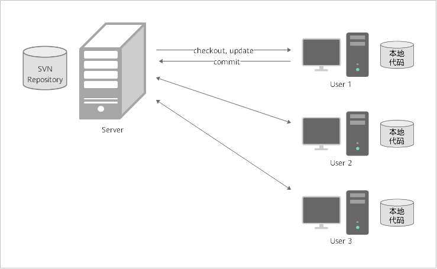

# **SVN迁移概览**

本文主要介绍由Subversion（下文统称为SVN）向[软件开发平台DevCloud](https://www.huaweicloud.com/devcloud/)迁移的方案建议与操作指导。

SVN是集中式的版本控制系统，存在一个中央版本库，所有研发人员本地开发使用的代码都是来自这个版本库，在中央版本库中可建立多个项目，研发人员通过TortoiseSVN与中央版本库进行互通，实现版本控制功能。

## **迁移场景介绍**

企业准备迁移时可能处于三种研发阶段：

-   新项目开始-无存量代码 ：此场景不涉及已有代码库迁移，是在DevCloud中新建项目以及仓库，进行各种研发操作，推荐阅读[项目成员迁移](SVN迁移-项目成员迁移.md)和[研发模式迁移](研发模式迁移.md)。
-   项目研发过程中-部分代码：此场景不但包括已有代码迁移，也包括对分支操作，推荐阅读全文。
-   项目完成后-完整代码：此场景只是将DevCloud平台作为归档代码的迁移备份，推荐阅读[项目成员迁移](SVN迁移-项目成员迁移.md)和[已有代码迁移](SVN迁移-已有代码迁移.md)。

## **迁移前准备**

-   **帐号申请**：使用软件开发平台DevCloud前，请确保您已拥有已实名认证的华为云帐号；若您还没有华为云帐号，请先进行注册，并完成实名认证。
-   **Git客户端安装**：DevCloud代码托管服务支持与常用的Git终端工具交互，如Git Bash、TortoiseGit、EGit，Sourcetree等，您选择一个熟悉的工具安装即可。

