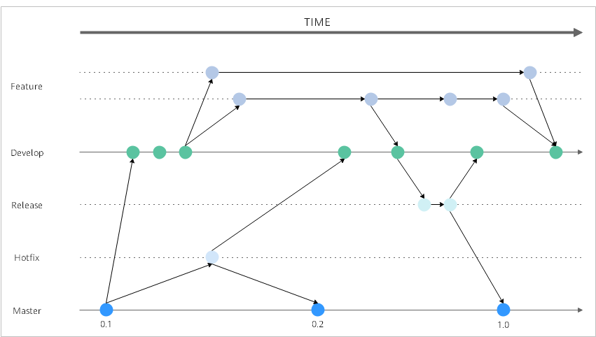
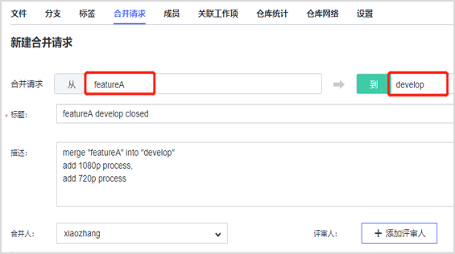
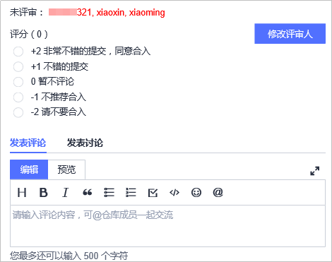
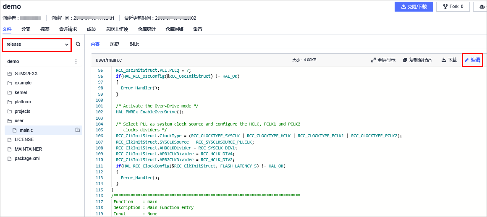

# **代码分支迁移**<a name="devcloud_migration_0004"></a>

## **分支策略介绍**<a name="section137701852155710"></a>

在大中型企业，并不会简单的只使用master分支开发和测试，会通过约定好的分支策略进行日常研发和版本发布。DevCloud使用GitFlow作为基础工作模式，本文基于GitFlow工作流进行迁移。



-   Master ：对应的是生产环境 ，分支中包含的是可以部署到生产环境中的代码，只可以merge，不允许commit。
-   Hotfix：补丁分支，生产环境发现新Bug时创建的临时分支，问题验证后，合并到Master和Develop分支。
-   Release：对应的是集成测试环境 ，发布分支，发布新版本时，基于Develop分支创建，发布完成后，合并到Master和Develop分支。
-   Develop：对应的是开发环境 ，主开发分支，用来集成测试最新合入的开发成果，包含要发布到下一个Release的代码。
-   Feature：特性分支，每个特性一个分支，用于开发人员提交代码并进行自测。当开发完成，合并回Develop分支进入下一个Release。

## **GitLab与DevCloud分支功能对照**<a name="section0233153711585"></a>

<a name="table98331417452"></a>
<table><thead align="left"><tr id="row3842143454"><th class="cellrowborder" colspan="2" valign="top" id="mcps1.1.6.1.1"><p id="p178416146455"><a name="p178416146455"></a><a name="p178416146455"></a><strong id="b37563451839"><a name="b37563451839"></a><a name="b37563451839"></a>GitLab常见功能点</strong></p>
</th>
<th class="cellrowborder" valign="top" id="mcps1.1.6.1.2"><p id="p18843144453"><a name="p18843144453"></a><a name="p18843144453"></a><strong id="b877254519317"><a name="b877254519317"></a><a name="b877254519317"></a>DevCloud对应功能点</strong></p>
</th>
<th class="cellrowborder" valign="top" id="mcps1.1.6.1.3"><p id="p38461494511"><a name="p38461494511"></a><a name="p38461494511"></a><strong id="b579012451533"><a name="b579012451533"></a><a name="b579012451533"></a>能否迁移</strong></p>
</th>
<th class="cellrowborder" valign="top" id="mcps1.1.6.1.4"><p id="p28417144451"><a name="p28417144451"></a><a name="p28417144451"></a><strong id="b579154520319"><a name="b579154520319"></a><a name="b579154520319"></a>DevCloud详细描述</strong></p>
</th>
</tr>
</thead>
<tbody><tr id="row68771848124215"><td class="cellrowborder" colspan="2" valign="top" headers="mcps1.1.6.1.1 "><p id="p79321443134317"><a name="p79321443134317"></a><a name="p79321443134317"></a>仓库密钥/密码配置</p>
</td>
<td class="cellrowborder" valign="top" headers="mcps1.1.6.1.2 "><p id="p1995018249447"><a name="p1995018249447"></a><a name="p1995018249447"></a>仓库密钥/密码配置</p>
</td>
<td class="cellrowborder" valign="top" headers="mcps1.1.6.1.3 "><p id="p148783487427"><a name="p148783487427"></a><a name="p148783487427"></a>√</p>
</td>
<td class="cellrowborder" valign="top" headers="mcps1.1.6.1.4 "><p id="p128788488423"><a name="p128788488423"></a><a name="p128788488423"></a>SSH/HTTPS传输方式需要<a href="https://support.huaweicloud.com/usermanual-codehub/devcloud_hlp_00083.html" target="_blank" rel="noopener noreferrer">配置密钥/密码</a>，作为与代码托管服务端交互的凭证。</p>
</td>
</tr>
<tr id="row214275814019"><td class="cellrowborder" colspan="2" valign="top" headers="mcps1.1.6.1.1 "><p id="p27548318114"><a name="p27548318114"></a><a name="p27548318114"></a>分支保护</p>
</td>
<td class="cellrowborder" valign="top" headers="mcps1.1.6.1.2 "><p id="p2142165817018"><a name="p2142165817018"></a><a name="p2142165817018"></a>分支保护/提交规则设置</p>
</td>
<td class="cellrowborder" valign="top" headers="mcps1.1.6.1.3 "><p id="p111426581801"><a name="p111426581801"></a><a name="p111426581801"></a>√</p>
</td>
<td class="cellrowborder" valign="top" headers="mcps1.1.6.1.4 "><p id="p111428581105"><a name="p111428581105"></a><a name="p111428581105"></a>DevCloud分支保护可以为每一个分支创建不同的提交、合并策略，并在提交规则设置中，可以勾选更为精细的提交限制。</p>
</td>
</tr>
<tr id="row16662716112314"><td class="cellrowborder" rowspan="5" valign="top" width="10%" headers="mcps1.1.6.1.1 "><p id="p13840142457"><a name="p13840142457"></a><a name="p13840142457"></a>研发操作</p>
</td>
<td class="cellrowborder" valign="top" width="15%" headers="mcps1.1.6.1.1 "><p id="p62261912141417"><a name="p62261912141417"></a><a name="p62261912141417"></a>分支拉取</p>
</td>
<td class="cellrowborder" valign="top" width="15%" headers="mcps1.1.6.1.2 "><p id="p192251712131420"><a name="p192251712131420"></a><a name="p192251712131420"></a>新建分支</p>
</td>
<td class="cellrowborder" valign="top" width="10%" headers="mcps1.1.6.1.3 "><p id="p42242012111414"><a name="p42242012111414"></a><a name="p42242012111414"></a>√</p>
</td>
<td class="cellrowborder" valign="top" width="50%" headers="mcps1.1.6.1.4 "><p id="p9203131214140"><a name="p9203131214140"></a><a name="p9203131214140"></a>DevCloud支持基于已有分支名、标签、SHA新建分支。</p>
</td>
</tr>
<tr id="row39452114145"><td class="cellrowborder" valign="top" headers="mcps1.1.6.1.1 "><p id="p719041811411"><a name="p719041811411"></a><a name="p719041811411"></a>clone/pull/push</p>
</td>
<td class="cellrowborder" valign="top" headers="mcps1.1.6.1.1 "><p id="p819017186148"><a name="p819017186148"></a><a name="p819017186148"></a>clone/pull/push</p>
</td>
<td class="cellrowborder" valign="top" headers="mcps1.1.6.1.2 "><p id="p1119061851410"><a name="p1119061851410"></a><a name="p1119061851410"></a>√</p>
</td>
<td class="cellrowborder" valign="top" headers="mcps1.1.6.1.3 "><p id="p1319081851410"><a name="p1319081851410"></a><a name="p1319081851410"></a>GitLab和DevCloud都不限制客户的Git终端使用习惯，Git bash和TortoiseGit等均可使用，本文截图都使用的是Git bash。</p>
</td>
</tr>
<tr id="row208415146451"><td class="cellrowborder" valign="top" headers="mcps1.1.6.1.1 "><p id="p9859144944617"><a name="p9859144944617"></a><a name="p9859144944617"></a>Merge Request</p>
</td>
<td class="cellrowborder" valign="top" headers="mcps1.1.6.1.1 "><p id="p38441424513"><a name="p38441424513"></a><a name="p38441424513"></a>合并请求</p>
</td>
<td class="cellrowborder" valign="top" headers="mcps1.1.6.1.2 "><p id="p7841214114518"><a name="p7841214114518"></a><a name="p7841214114518"></a>√</p>
</td>
<td class="cellrowborder" valign="top" headers="mcps1.1.6.1.3 "><p id="p10327120237"><a name="p10327120237"></a><a name="p10327120237"></a>DevCloud中的合并请求，包括发起合并请求、讨论新增的文件更改以及最后合入操作，保证合入目标分支的代码得到充分检验。</p>
</td>
</tr>
<tr id="row1784161410451"><td class="cellrowborder" valign="top" headers="mcps1.1.6.1.1 "><p id="p14859174914460"><a name="p14859174914460"></a><a name="p14859174914460"></a>分支网络</p>
</td>
<td class="cellrowborder" valign="top" headers="mcps1.1.6.1.1 "><p id="p88421474520"><a name="p88421474520"></a><a name="p88421474520"></a>仓库网络</p>
</td>
<td class="cellrowborder" valign="top" headers="mcps1.1.6.1.2 "><p id="p188491418458"><a name="p188491418458"></a><a name="p188491418458"></a>√</p>
</td>
<td class="cellrowborder" valign="top" headers="mcps1.1.6.1.3 "><p id="p108481454513"><a name="p108481454513"></a><a name="p108481454513"></a>DevCloud可以在仓库网络中切换分支，查看分支提交轨迹和分支间拓扑网络。</p>
</td>
</tr>
<tr id="row10188841145817"><td class="cellrowborder" valign="top" headers="mcps1.1.6.1.1 "><p id="p8722171910227"><a name="p8722171910227"></a><a name="p8722171910227"></a>版本发布打标签</p>
</td>
<td class="cellrowborder" valign="top" headers="mcps1.1.6.1.1 "><p id="p51671038142215"><a name="p51671038142215"></a><a name="p51671038142215"></a>版本发布打标签</p>
</td>
<td class="cellrowborder" valign="top" headers="mcps1.1.6.1.2 "><p id="p5188194195816"><a name="p5188194195816"></a><a name="p5188194195816"></a>√</p>
</td>
<td class="cellrowborder" valign="top" headers="mcps1.1.6.1.3 "><p id="p1918810413583"><a name="p1918810413583"></a><a name="p1918810413583"></a>在发布软件版本的时候，DevCloud可以直接在平台界面给仓库打上标签。</p>
</td>
</tr>
<tr id="row136241222171516"><td class="cellrowborder" colspan="2" valign="top" headers="mcps1.1.6.1.1 "><p id="p184962918151"><a name="p184962918151"></a><a name="p184962918151"></a>仓库统计</p>
</td>
<td class="cellrowborder" valign="top" headers="mcps1.1.6.1.2 "><p id="p1062552201513"><a name="p1062552201513"></a><a name="p1062552201513"></a>仓库统计</p>
</td>
<td class="cellrowborder" valign="top" headers="mcps1.1.6.1.3 "><p id="p6625422101516"><a name="p6625422101516"></a><a name="p6625422101516"></a>√</p>
</td>
<td class="cellrowborder" valign="top" headers="mcps1.1.6.1.4 "><p id="p17625162221512"><a name="p17625162221512"></a><a name="p17625162221512"></a>无。</p>
</td>
</tr>
</tbody>
</table>

## **拉取分支**<a name="section145001138753"></a>

开发人员进行新功能开发时，需要从develop分支上拉取一个新分支进行开发及调试：

1.  在代码托管服务页面，单击仓库名称进入代码仓库。选择“分支“页签，单击“新建分支“。在弹框中选择基于“master“，输入最新分支名“develop“，单击“确定“保存，完成基于master拉取新分支“develop“。

    

      

2.  采用同样的方法，基于develop分支拉取新分支“featureA“。
3.  在本地使用Git客户端，输入以下命令，基于云端featueA分支创建本地featureA分支。

    ```
    git check out -b featureA remotes/origin/featureA
    ```


## **设置分支保护**<a name="section4641091548"></a>

在GitFlow工作流中，为了保证生产环境对应分支的稳定性，通常希望可以将其“保护”起来，从而保证该分支的安全，可以阻止管理者以外的人推送代码，阻止任何人强行推送代码，如果想改变该分支，可以通过发起“合并请求”的方式，合入目标分支。

DevCloud代码托管服务提供了以下三种权限：

-   能提交，能合并
-   不能提交，能合并
-   不能提交，不能合并

由于master分支为生产分支，需要最严格的代码合入把控，推荐对master分支的管理者权限设置为“能提交，能合并“，开发者权限设置为“不能提交，不能合并“。其余分支也根据风险等级进行保护设置。

在代码托管服务页面，单击仓库名称进入代码仓库。选择“设置  \>  仓库管理“页签，单击“新建保护分支“。在弹框中选择需要保护的分支、管理者权限、开发者权限，单击“确定“保存。


## **研发操作**<a name="section13608733294"></a>

-   **架构开发**

    技术经理/架构师获取云端仓库地址，将本地完成的架构代码提交到DevCloud服务器后，在demo代码仓库的“历史”中查看提交记录。

    在本地Git Bash终端的具体操作如下：

    ```
    git clone -仓库地址
    git add .
    git commit -m "project framework"
    git push 
    ```

-   **新功能开发**

    开发人员基于本地featureA分支进行开发，并完成自测，向develop分支发起合并请求，新功能合入develop分支，进行功能集成测试。

    1.  开发人员在本地进行代码开发后，提交到云端代码仓库featureA分支。
    2.  当新功能自测完成后，在“合并请求“页面，单击“新建合并请求“，选择分支源和目标，发起合并请求，选择**合并人**以及**评审人**。

        代码托管服务为分支合并建立了可配置的审核规则，当一个项目组人员较多时，可以是设置多个**评审人**来共同检视一段代码，以确保代码的正确性。

        

          

    3.  合并请求的相关评审人分别进行打分，评论等操作。

        

          

    4.  如果审核通过，则可将代码合入develop。分支合并成功后，在“提交网络“页面可查看分支合并轨迹。

-   **版本发布**

    develop分支功能验证成功后，拉取release分支进行发布验证，发布成功后，合入master主分支，打标签记录发布版本。

    1.  在“仓库分支“页面，基于develop分支拉取新分支“release“。
    2.  使用release分支进行相应的发布测试，发现问题后，可以进入要修改的文件，单击“编辑“，直接线上修改提交。

        

          

    3.  release分支全部测试完成后，通过合并请求合入master分支。
    4.  在“标签“页面，单击“新建标签“，在弹窗中输入版本号，在master分支上打标签，记录版本发布。

        

          


## **仓库统计**<a name="section1388163851610"></a>

DevCloud也提供了代码统计功能，从代码提交趋势，成员提交次数，以及语言占比等维度对代码仓库进行统计分析。关于仓库统计的操作方法请参见[仓库统计](https://support.huaweicloud.com/usermanual-codehub/devcloud_hlp_00074.html)。

  

