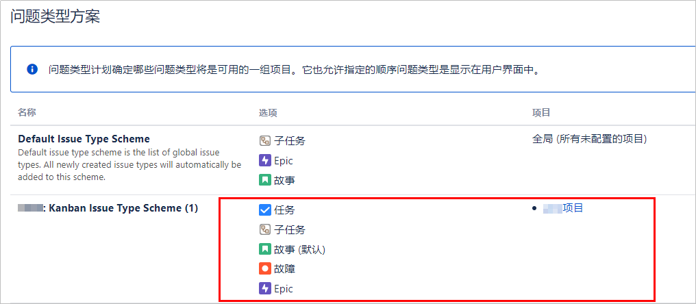
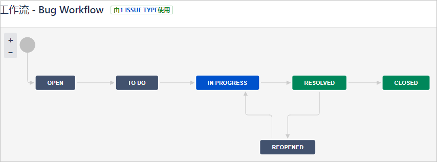
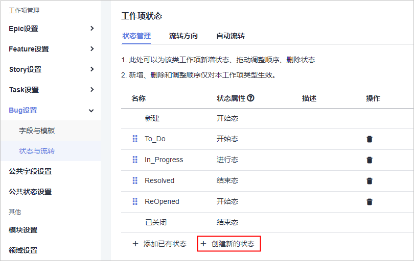
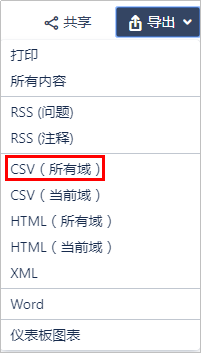
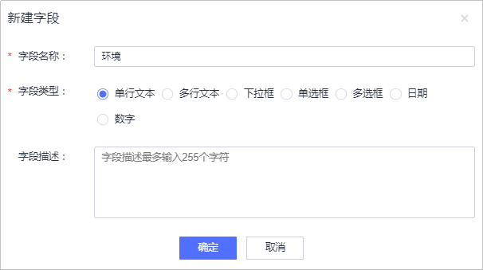

# **工作项迁移**

## **问题类型迁移**

JIRA平台和DevCloud平台都将工作项分为不同的类型，用于区分不同大小的产品需求或缺陷。

-   **JIRA问题类型**

    JIRA可以用于跟踪许多不同类型的问题，也可以自定义问题类型，本文迁移的项目采用的是JIRA默认的问题类型：JIRA**普通问题类型**是指可以直接创建的问题类型，包括Epic、故事、任务、故障；**子任务类型**不能单独创建，需要在普通问题类型中创建。

    JIRA问题类型查看方式如下：

    -   使用管理员账号登录JIRA平台，在“问题  \>  问题类型方案“页面中查看项目采用的所有问题类型方案。
    -   普通用户账号进入待迁移的项目，单击页面左下角“项目设置“，在“问题类型“页面获取对应信息。

    

      

-   **DevCloud工作项类型**

    DevCloud的Scrum项目类型中采用的是标准的Scrum开发框架，工作项层级划分为Epic\>Feature\>Story\>Task&Bug。

    
    <table><thead align="left"><tr id="row12916153320456"><th class="cellrowborder" valign="top" width="20%" id="mcps1.1.3.1.1">
<strong id="b13198204134511">工作项类型</strong>

    </th>
    <th class="cellrowborder" valign="top" width="80%" id="mcps1.1.3.1.2">
<strong id="b193283034611">类型说明</strong>

    </th>
    </tr>
    </thead>
    <tbody><tr id="row109166337455"><td class="cellrowborder" valign="top" width="20%" headers="mcps1.1.3.1.1 ">
Epic

    </td>
    <td class="cellrowborder" valign="top" width="80%" headers="mcps1.1.3.1.2 ">
描述了旨在帮助最终用户解决商业与技术问题的一系列活动（activities）或者一个工作流（workflow）。对于规模和复杂性非常大的产品，可以拆分成多个Epic。Epic较大，一般无法或者不容易估算工作量。

    </td>
    </tr>
    <tr id="row1091723394510"><td class="cellrowborder" valign="top" width="20%" headers="mcps1.1.3.1.1 ">
Feature

    </td>
    <td class="cellrowborder" valign="top" width="80%" headers="mcps1.1.3.1.2 ">
产品功能，代表产品的某个特性，可以做什么，可以提供什么服务。

    </td>
    </tr>
    <tr id="row991717333455"><td class="cellrowborder" valign="top" width="20%" headers="mcps1.1.3.1.1 ">
Story

    </td>
    <td class="cellrowborder" valign="top" width="80%" headers="mcps1.1.3.1.2 ">
User Story的缩写，是从用户角度对产品需求的详细描述，更小粒度的功能。在项目开始初期，将Epic细化成带有优先级的Story列表，称为Product Backlog。

    </td>
    </tr>
    <tr id="row491743320458"><td class="cellrowborder" valign="top" width="20%" headers="mcps1.1.3.1.1 ">
Task

    </td>
    <td class="cellrowborder" valign="top" width="80%" headers="mcps1.1.3.1.2 ">
将一个Story划分成更小的单元，便于每天跟踪工作进度。

    </td>
    </tr>
    <tr id="row1491793344518"><td class="cellrowborder" valign="top" width="20%" headers="mcps1.1.3.1.1 ">
Bug

    </td>
    <td class="cellrowborder" valign="top" width="80%" headers="mcps1.1.3.1.2 ">
产品缺陷，既可以是Story的子工作项，便于追溯。也可以不属于某一个功能，独立存在。

    </td>
    </tr>
    </tbody>
    </table>

-   **JIRA问题类型与DevCloud工作项类型的映射**

    
    <table><thead align="left"><tr id="row126921737174918"><th class="cellrowborder" valign="top" width="50%" id="mcps1.1.3.1.1">
<strong id="b4692143724911">JIRA问题类型</strong>

    </th>
    <th class="cellrowborder" valign="top" width="50%" id="mcps1.1.3.1.2">
<strong id="b18692203713494">对应DevCloud问题类型</strong>

    </th>
    </tr>
    </thead>
    <tbody><tr id="row17692637174916"><td class="cellrowborder" valign="top" width="50%" headers="mcps1.1.3.1.1 ">
Epic

    </td>
    <td class="cellrowborder" valign="top" width="50%" headers="mcps1.1.3.1.2 ">
Epic

    </td>
    </tr>
    <tr id="row669217371490"><td class="cellrowborder" valign="top" width="50%" headers="mcps1.1.3.1.1 ">
Epic子任务

    </td>
    <td class="cellrowborder" valign="top" width="50%" headers="mcps1.1.3.1.2 ">
Feature

    </td>
    </tr>
    <tr id="row66925374498"><td class="cellrowborder" valign="top" width="50%" headers="mcps1.1.3.1.1 ">
故事

    </td>
    <td class="cellrowborder" valign="top" width="50%" headers="mcps1.1.3.1.2 ">
Story

    </td>
    </tr>
    <tr id="row46921637134916"><td class="cellrowborder" valign="top" width="50%" headers="mcps1.1.3.1.1 ">
故事的子任务

    </td>
    <td class="cellrowborder" valign="top" width="50%" headers="mcps1.1.3.1.2 ">
Task

    </td>
    </tr>
    <tr id="row6692143714490"><td class="cellrowborder" valign="top" width="50%" headers="mcps1.1.3.1.1 ">
任务

    </td>
    <td class="cellrowborder" valign="top" width="50%" headers="mcps1.1.3.1.2 ">
Task

    </td>
    </tr>
    <tr id="row18692037134920"><td class="cellrowborder" valign="top" width="50%" headers="mcps1.1.3.1.1 ">
故障

    </td>
    <td class="cellrowborder" valign="top" width="50%" headers="mcps1.1.3.1.2 ">
Bug

    </td>
    </tr>
    </tbody>
    </table>

## **工作流迁移**

JIRA平台和DevCloud平台中，不同类型的工作项可以有拥有属于自己的工作流，包括工作项状态和状态流转规则。

1.  **获取JIRA工作流**

    普通用户账号进入待迁移的项目，单击页面左下角“项目设置“，在“工作流“页面可单击不同问题类型过去相应的工作流。

    例如，下图是一个**Bug Workflow**，定义了**故障**问题类型工作流的状态和状态流转。

    

      

2.  **创建DevCloud工作流**
    1.  进入DevCloud已创建的项目，在“设置  \>  项目设置  \>  Bug设置  \>  状态流转  \>  状态管理“中，按照JIRA中故障的状态创建Bug类型工作项的状态。
    2.  在“流转方向“页签中按照JIRA中故障的状态流转方向设置Bug类型工作项的状态流转方向。

        

          

## **模块迁移**

1.  **获取JIRA模块**

    普通用户账号进入待迁移的项目，单击页面左侧“模块“，获取模块相关信息。

    

      

2.  **创建DevCloud模块**

    进入DevCloud已创建的项目，在“设置  \>  项目设置  \>  模块设置“页面单击角“添加“，根据JIRA中的模块设置添加新模块和负责人。

    

      

## **工作项内容迁移**

1.  **导出JIRA工作项**

    1.  登录JIRA平台进入待迁移的项目，单击右上角**““**“显示所有问题和筛选器“**““**进入“筛选器“界面。
    2.  在“导出“下拉框中选择“CSV（所有域）“。

        

          

    > **说明：**   
    >若导出的CSV文件内容显示乱码，请参考以下步骤解决。  
    >1.  用记事本打开CSV文件，选择另存为，编码格式由UTF-8更改为ANSI格式，保存。  
    >2.  新建一个EXCEL空文件，在目录中选择“数据  \>  自文本“，选择刚更改完成编码格式的CSV文件，分隔符号设置（与保存时的分隔符相同）。  

2.  **导出DevCloud工作项模板**

    进入DevCloud已创建的项目，在“工作  \>  Backlog“中，单击页面右上角“更多操作  \>  导入“，在弹框中单击“下载模板“。

    

      

3.  **填充DevCloud工作项模板**
    1.  自定义DevCloud工作项字段

        对比JIRA工作项列表与DevCloud工作项模板，当DevCloud工作项（如**Bug**问题类型）的字段不满足JIRA原有需求时，需要在DevCloud中添加缺少的字段。

        在“设置  \>  项目设置  \>  Bug设置  \>  字段与模板“页面，单击右上角“编辑模板“，在新界面单击右上角“新建字段“，根据JIRA工作项字段进行添加。

        新增字段后，在下载的模板中手动添加相应的字段列。

        

          

    2.  定义工作项字段取值域

        JIRA和DevCloud中相同的字段（如**优先级**字段）可能取值阈不同。JIRA平台**优先级**字段的取值域是Highest、High、Medium、Low、Lowest；DevCloud平台**优先级**字段的取值域为高、中、低。

        -   方法1：取值归类匹配：Highest/High-\>高，Medium-\>中，Lowest/Low-\>低。
        -   方法2：增加新字段，如命名为**优先权限**（由于DevCloud中的“优先级”字段无法删除，所以取别名代替），并添加Highest，High，Medium，Low，Lowest取值域

    3.  内容迁移：将JIRA的字段信息拷贝至DevCloud模板对应列中。

4.  **导入DevCloud工作项**
    1.  返回Backlog页面，单击“更多操作  \>  导入“，选择需要导入的EXCEL文件，单击“导入“。
    2.  关联工作项。

        JIRA平台中通过**问题ID**和**父级ID**字段记录了父子关系。

        在DevCloud平台中，找到子工作项，编辑“父工作项“字段，根据JIRA中记录的父子关系，选择相应的父工作项。

  

