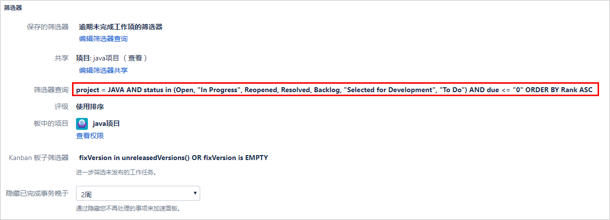
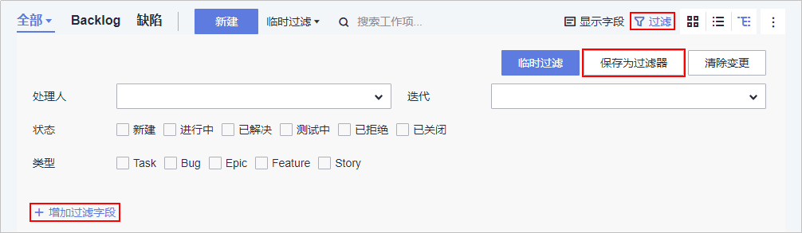
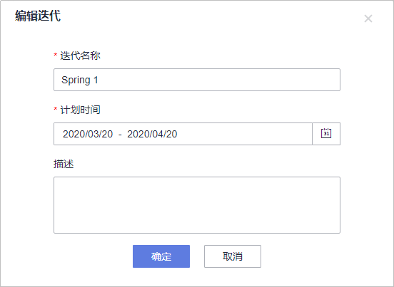
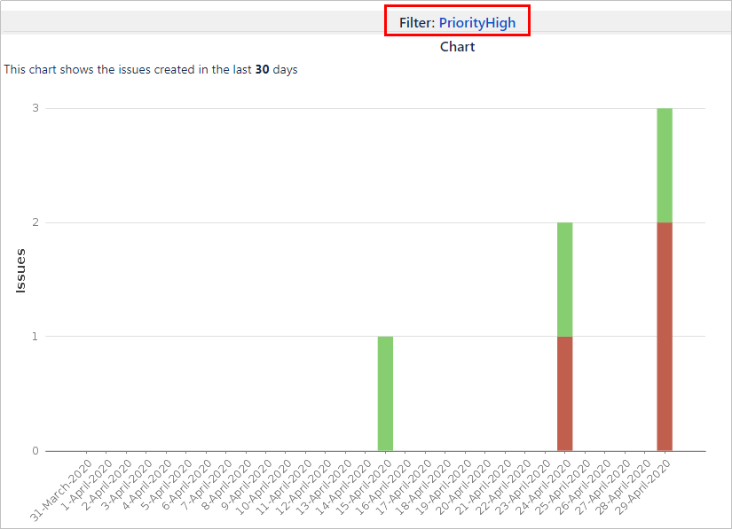
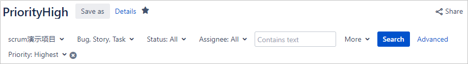
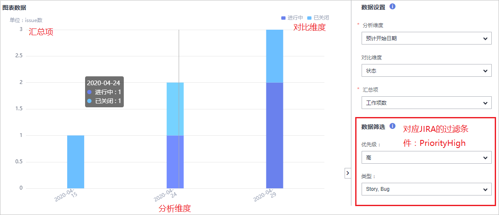

# **敏捷管理迁移**

## **筛选器迁移**

1.  **获取JIRA筛选器信息**

    登录JIRA平台，进入待迁移面板界面，在右上角“面板“下拉菜单中选择“配置“进入配置界面，查看**筛选器**等信息。

    

      

2.  **配置DevCloud过滤器**

    进入DevCloud已创建的项目，在“工作  \>  工作项“页面单击“过滤“，根据JIRA配置勾选相应的筛选条件，单击右上角“保存为过滤器“。

    若页面中显示的字段不满足需要，可单击“增加过滤字段“，在弹框中根据需要选择字段。

    

      

## **迭代迁移**

1.  **获取JIRA迭代信息**

    登录JIRA平台，进入待迁移的Scrum面板Backlog界面，获取Sprint信息。

    

      

2.  **创建DevCloud迭代**

    进入DevCloud已创建的项目，在“工作  \>  迭代“页面中，根据JIRA迭代信息配置迭代名称及计划时间。

    

      

## **报表迁移**

JIRA提供了多维度的度量指标报表，便于展示项目过程中的进度和风险。同样，DevCloud也提供了充分的报表统计功能。除了包括以概览信息为主的仪表盘和管理者看板，也为干具体活的团队Leader、项目经理，测试经理，交付经理，还提供了**自定义报表**功能，根据自己的需要，可以创建对自己有用的报表。

1.  **在JIRA中查看要迁移的报表**

    登录JIRA平台，在“报告“页面中查看需要迁移的报表。以下图为例：

    

      

    其中，过滤项PriorityHigh的详细条件如下：

    

      

2.  **为DevCloud默认仪表盘添加报表**
    1.  进入DevCloud已创建的项目，在“仪表盘“页面单击右上角“设计布局“。
    2.  单击右上角“添加卡片“，在弹出页面中单击“新建“，选择“自定义报表“
    3.  按照JIRA中的过滤条件与统计维度设置数据筛选条件，刷新页面后就能得到相同的统计结果。

        

          

  

