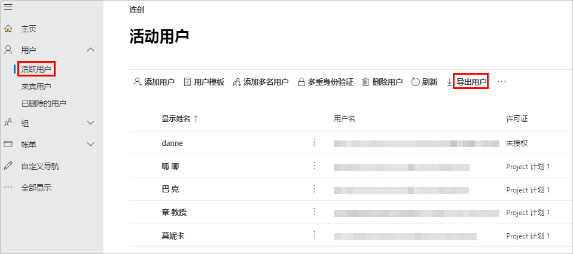
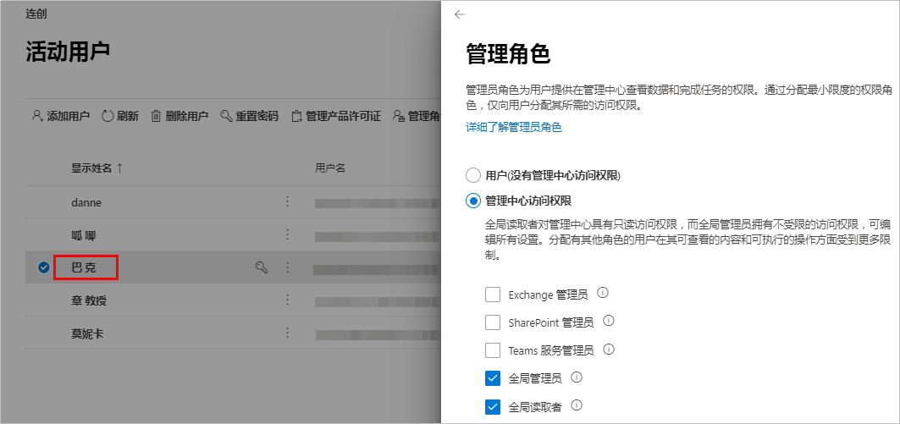
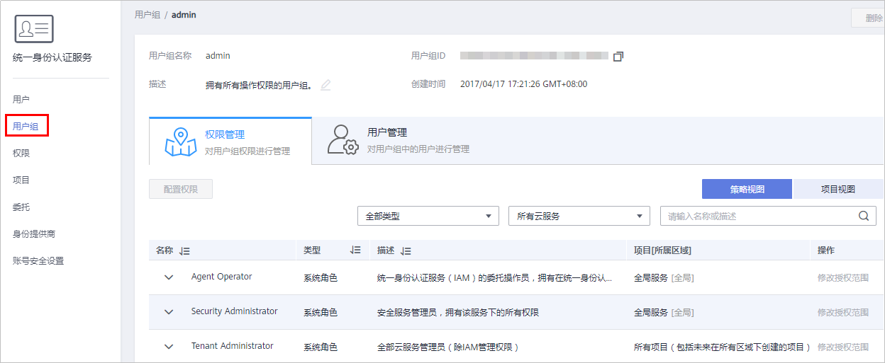
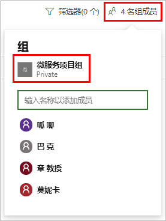
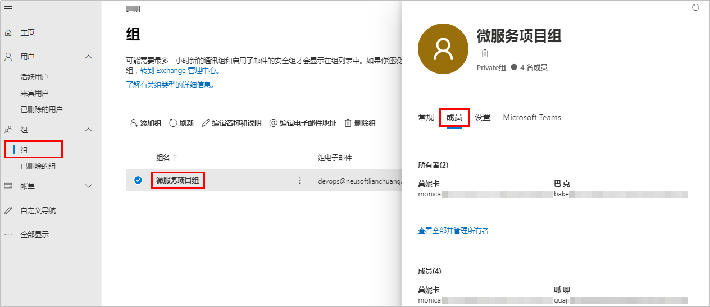
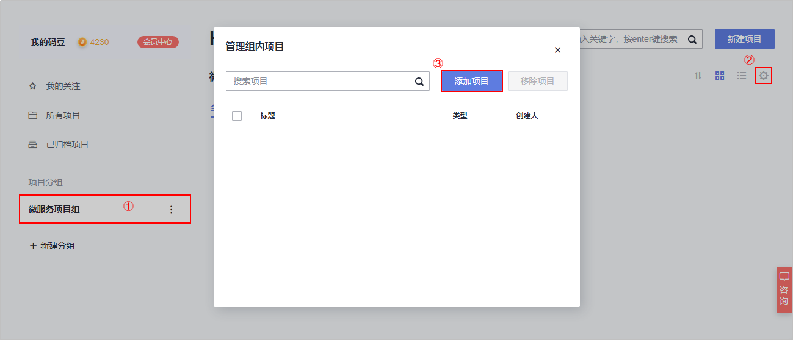
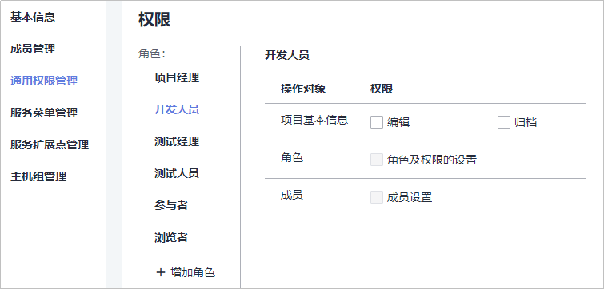
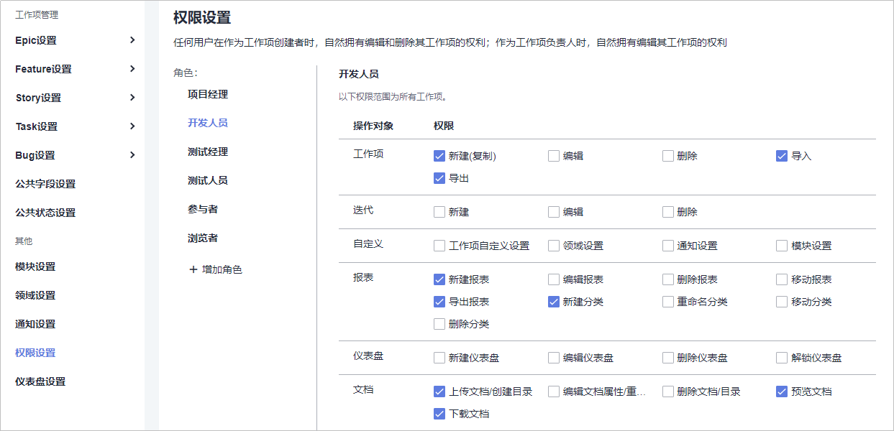

# **用户管理迁移**

项目成员迁移需要先从MSP中导出已有的用户/组信息，加入到DevCloud项目中并重新划分成员角色，从而将已有成员迁移至DevCloud。

操作流程包括以下五步：

-   [步骤1：获取Microsoft Office 365用户信息](#section745115311570)
-   [步骤2：创建华为云DevCloud平台用户](#section17985155665013)
-   [步骤3：获取MSP组项目/成员](#section4152411325)
-   [步骤4：创建DevCloud项目](#section3229171815532)
-   [步骤5：为DevCloud项目成员设置角色](#section89771375598)

## **步骤1：获取Microsoft Office 365用户信息**

1.  登录Microsoft Office 365平台，在“管理中心  \>  用户  \>  活跃用户“页面中，单击“导出用户“，一份包含所有用户信息的csv文件将自动下载到本地。

    活跃用户中包含了本企业用户和邀请的来宾用户，来宾用户详情可以在“用户  \>  来宾用户“页面中查看。

    

2.  在列表中单击想要查看的用户的“显示姓名“，在右侧弹出页面单击“管理角色“，查看用户的权限。

    

    > **说明：** 
    >该角色管理属于Microsoft Office 365平台范畴。
    >由于Microsoft Office 365平台与华为云平台提供的产品不同，角色管理涉及的权限也不相同。
    >本文只介绍如何操作，具体的角色对应可以根据平台产品的使用情况自行迁移对应。

## **步骤2：创建华为云DevCloud平台用户**

1.  使用租户帐号登录[DevCloud](https://devcloud.cn-north-4.huaweicloud.com/home)，单击右上角个人头像，在下拉菜单中选择“子账号管理“，进入统一身份认证服务。

    单击右上角“创建用户“，依次填入用户个人信息（除来宾用户外），根据页面提示创建该租户帐号下的IAM子帐号。

    

2.  为IAM用户设置华为云平台权限。

    管理员可以创建用户组，并给用户组授予策略或角色，然后将用户加入用户组，使得用户组中的用户获得相应的权限。

    IAM预置了各服务的常用权限，例如管理员权限、只读权限，管理员可以直接使用这些系统权限给用户组授权。授权后，用户就可以基于权限对云服务进行操作。如需查看所有云服务的系统权限，请参见[系统权限](https://support.huaweicloud.com/usermanual-permissions/iam_01_0001.html)。

    

## **步骤3：获取MSP组项目/成员**

1.  登录Microsoft Office 365平台，在MSP主页面找到待迁移项目，单击项目名称进入项目主页。
2.  单击页面右上角“x名组成员“，在弹出的菜单中查看项目所属的组以及组成员。

    

3.  返回Microsoft Office 365平台主页，在“管理中心  \>  组“页面中，单击组名。
4.  在页面右侧弹出框中，点击**成员**页面，获取组成员角色。

    在Microsoft Office 365组中有两种用户角色：所有者和成员。 默认情况下，会为创建新团队的用户授予所有者状态。

    

## **步骤4：创建DevCloud项目**

DevCloud以项目为单位进行管理，新建项目分为两种类型：**Scrum项目**、**看板项目**。本文采用Scrum类型。

1.  使用华为云帐号登录[DevCloud](https://devcloud.cn-north-4.huaweicloud.com/home)。
2.  在面左上角根据您业务所在区域就近选择区域，可减少网络时延，提高访问速度；不同区域之间互不相通。

    例如您当前在北京，区域可以就近选择“华北-北京四“。

    

3.  单击“新建项目“，创建新的Scrum项目。

    项目创建成功后，系统将跳转至“Backlog“页面。

4.  在“设置  \>  通用设置  \>  成员管理“页面中，单击“添加成员“，在下拉列表中选择“从本企业用户“。

    在弹框中勾选需要添加的成员，按照页面提示完成项目成员的添加。

    

5.  返回DevCloud首页，单击页面左侧“新建分组“，根据MSP平台中的分组设置，创建项目分组。
6.  单击分组名称进入分组详情页面，单击页面右上角，在弹窗中将已创建的项目加入分组中。

    

## **步骤5：为DevCloud项目成员设置角色**

1.  **MSP与DevCloud项目角色对应**

    MSP中包含了两类角色：所有者和成员，在成员角色中又分为普通成员和从其他企业邀请的来宾。

    DevCloud中的项目成员支持多种角色，分别为：项目创建者、项目经理、测试经理、开发人员、测试人员、参与者、浏览者（不同权限角色的权限请参见[角色与操作](https://support.huaweicloud.com/usermanual-projectman/projetcman_ug_3001.html)）。

    由于MSP角色只有两类，权限划分不多，因此，在两个平台进行角色迁移时，如果项目需要，可以在DevCloud中进行角色切分，并为不同角色设置权限。

    本文推荐的角色迁移对应关系如下表，DevCloud中角色设置方法请参见[设置项目角色](https://support.huaweicloud.com/usermanual-projectman/devcloud_hlp_00026.html#section8)。

    
    <table><thead align="left"><tr id="row161588344820"><th class="cellrowborder" valign="top" width="50%" id="mcps1.1.3.1.1">
<strong id="b148544487812">MSP角色</strong>

    </th>
    <th class="cellrowborder" valign="top" width="50%" id="mcps1.1.3.1.2">
<strong id="b1754020020915">DevCloud对应角色</strong>

    </th>
    </tr>
    </thead>
    <tbody><tr id="row815814341581"><td class="cellrowborder" valign="top" width="50%" headers="mcps1.1.3.1.1 ">
所有者

    </td>
    <td class="cellrowborder" valign="top" width="50%" headers="mcps1.1.3.1.2 ">
项目创建者/项目经理/测试经理

    </td>
    </tr>
    <tr id="row61581334289"><td class="cellrowborder" valign="top" width="50%" headers="mcps1.1.3.1.1 ">
普通成员

    </td>
    <td class="cellrowborder" valign="top" width="50%" headers="mcps1.1.3.1.2 ">
开发人员/测试人员

    </td>
    </tr>
    <tr id="row11158183413814"><td class="cellrowborder" valign="top" width="50%" headers="mcps1.1.3.1.1 ">
来宾

    </td>
    <td class="cellrowborder" valign="top" width="50%" headers="mcps1.1.3.1.2 ">
参与者/浏览者

    </td>
    </tr>
    </tbody>
    </table>

2.  **设置角色通用权限**

    单击项目名称进入项目中，在“设置  \>  通用设置  \>  通用权限管理“页面中，可以对不同角色的通用权限进行选择。

    其中，项目经理和测试经理拥有所有通用权限且不可变更，浏览者不具有任何通用权限且不可变更。

    

3.  **设置角色项目权限**

    在“设置  \>  项目设置  \>  权限设置“页面中，可以对不同角色的项目操作权限进行选择。

    其中，项目经理和测试经理拥有所有项目操作权限且不可变更，浏览者不具有任何项目操作权限且不可变更。

    

