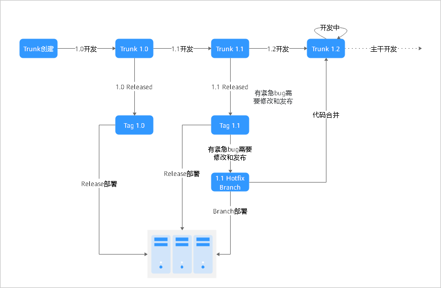
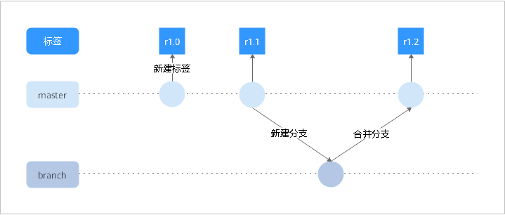

# **研发模式迁移**

## **SVN版本控制和发布流程**

本文中，案例KotlinGallery采用的是SVN中主流的主干式研发场景，如下图所示：

**SVN研发模式过程说明：**

1.  项目开始时，创建Trunk，开始版本1.0开发，所有小组成员都往Trunk中提交代码。
2.  当1.0开发完成后，创建一个标签：Tag1.0。
3.  Tag1.0测试完成后，部署到服务器。
4.  开发小组开始新版本1.1开发，继续提交代码到Trunk中。
5.  版本1.1开发完成，创建Tag1.1，测试完后部署到服务器。
6.  开发小组开始新版本1.2开发，继续提交代码到Trunk中。
7.  版本1.1运行中发现bug，需要紧急修复 -\> 从Tag1.1中创建1.1hotfix Branch。
8.  Bug修复代码提交到1.1Hotfix Branch，测试通过后，部署到服务器。
9.  提交到1.1Hotfix Branch的代码合并到Trunk中。

## **SVN-\>DevCloud研发模式迁移**

在DevCloud中创建仓库时，master是默认的主分支，相当于SVN中的trunk，要实现SVN中的主干研发模式，只需通过新建分支、分支合并、新建标签三个Git功能即可实现。

-   **新建分支**：分支是用来将特性开发并行独立出来的工具。使用分支意味着把工作从开发主线上分离开来，以免影响开发主线。代码托管新建分支的场景及操作方法，请参考帮助中心[新建分支](https://support.huaweicloud.com/usermanual-codehub/devcloud_hlp_0832.html)。
-   **分支合并**：使用其他分支进行开发后，需要将它们合并到主分支（默认master为主分支）上。代码托管合并分支的场景及操作方法，请参考帮助中心[分支合并](https://support.huaweicloud.com/usermanual-codehub/devcloud_hlp_0835.html)。
-   **新建标签**：Git标签通常用来标记发布里程碑（如v1.0），可以给历史中的某一个提交打上标签，以示重要。代码托管新建标签的场景及操作方法，请参考帮助中心[新建标签](https://support.huaweicloud.com/usermanual-codehub/devcloud_hlp_0833.html)。

  

